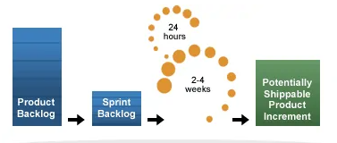

_Các lý thuyết cơ bản về triết lý Agile và phương pháp thực hiện - Scrum_

## Mục lục

[1. Cơ bản về Agile](#cơ-bản-về-agile)

- [1.1. 4 Tuyên ngôn chủ chốt](#4-tuyên-ngôn-chủ-chốt)

- [1.2. 12 nguyên tắc làm việc](#12-nguyên-tắc-làm-việc)

- [1.3 Agile estimation](#agile-estimation)

[Tài liệu tham khảo](#tài-liệu-tham-khảo)

[2. Scrum](#scrum)

[2.1 Ba yếu tố cốt lõi của Scrum](#ba-yếu-tố-cốt-lõi-của-scrum)

[2.2 Các khái niệm cơ bản trong Scrum](#các-khái-niệm-cơ-bản-trong-scrum)

- [2.2.1. Scrum team](#1-scrum-team)
- [2.2.2. Sprint](#2-sprint)
- [2.2.3. Sprint Planning](#3-sprint-planning)
- [2.2.4. Daily Sprint](#4-daily-sprint)
- [2.2.5. Sprint Review](#5-sprint-review)
- [2.2.6. Sprint Restrospective](#6-sprint-restrospective)

[2.3 Artifacts Scrum (các công cụ)](#artifacts-scrum-các-công-cụ)

[2.4 Quy trình vận hành](#quy-trình-vận-hành)

[Tài liệu tham khảo về Scrum](#tài-liệu-tham-khảo-về-scrum)

[3. Kanban cơ bản](#kanban)

## Cơ bản về Agile

- một triết lý hay một khung tư duy để nhanh chóng phản hồi với sự thay đổi từ đó đạt được thành công nhất định trong môi trường công việc liên tục thay đổi
- mục tiêu: đưa sản phẩm tới tay người tiêu dùng càng nhanh càng tốt nhưng vẫn đáp ứng yêu cầu mà người tiêu dùng đề ra. Giúp ta làm việc chủ động hơn với 4 tuyên ngôn chủ chốt. 12 nguyên tắc làm việc

<http://agilemanifesto.org/>

### 4 Tuyên ngôn chủ chốt

_Hay giá trị mà phương pháp Agile mang lại_

- `Một`: Đề cao cá nhân và sự tương tác của các cá nhân. Hiểu đơn giản là khi có 1 team có cùng một mục tiêu, thay vì đề ra người lãnh đạo chính, giao việc cho các thành viên còn lại một cách máy móc thì các cá nhân trong nhóm sẽ tự chủ động trao đổi, tìm ra hướng đi tốt nhất cho từng cá nhân mà vẫn đảm bảo mục tiêu chung được hoàn thành nhanh và chính xác.

- `Hai`: kết quả được tạo ra chạy tốt hơn là tài liệu được viết ra. Hiểu đơn giản là khi team cùng tạo ra 1 phần mềm và mỗi người đảm nhiệm 1 chức năng. Thay vì mỗi người tập chung hơn vào việc viết tài liệu hướng dẫn vận hành chức năng mà mình đảm nhận thì hãy đầu tư thời gian hơn vào việc trao đổi giữa các cá nhân trong team giúp cho phần mềm chạy ổn định sớm nhất và các chức năng không bị sung đột.

- `Ba`: Cộng tác với khách hàng hơn là đàm phán trên hợp đồng giấy tờ. Hiểu đơn giản là dù có hợp đồng giấy mực chữ ký đầy đủ thì sẽ có những lúc các yêu cầu của khách hàng buộc phải thay đổi, hay thậm chí chính người viết ứng dụng phải thay đổi. Thay vì cứ bám sát và làm theo hợp đồng một cách máy móc thì hãy trao đổi, tham vấn, đưa khách hàng vào cùng làm và cùng làm với khách hàng để sản phẩm được tốt ưu nhất có thể.

- `Bốn`: Hãy chấp nhận sự thay đổi có thể xảy ra liên tục trong quá trình phát triển.

### 12 nguyên tắc làm việc

1. đáp ứng nhu cầu của khách hàng qua việc chuyển giao sản phẩm hoạt động tốt nhanh chóng và liên tục
2. chấp nhận thay đổi về yêu cầu, kể cả ở giai đoạn cuối của quy trình
3. chuyển giao sản phẩm thường xuyên, trong thời gian ngắn, càng ngắn càng được ưu tiên
4. đội ngũ phát triển và đội ngũ kinh doanh phải làm việc cùng nhau
5. xây dựng dự án với những cá nhân có động lực. Tạo ra môi trường và hỗ trợ họ nếu cần, và đặt niềm tin vào họ để hoàn thành công việc được giao.
6. trực tiếp nói chuyện là cách truyền đạt thông tin hiệu quả nhất
7. sản phẩm hoạt động được là thước đo chính cho tiến độ của dự án
8. phát triển bền vững và duy trì sự phát triển
9. chú ý đến chất lượng kĩ thuật và thiết kế
10. đề cao sự đơn giản, giảm thiểu tối đa những thứ không liên quan đến công việc
11. các sản phẩm và thiết kế tốt nhất được tạo nên từ các nhóm tự tổ chức
12. đều đặn tự đánh giá nhóm để gia tăng sự hiệu quả của nhóm

### Agile estimation

- kỹ thuật để dự đoán số thời gian và công sức cần thiết trong việc phát triển sản phẩm

- một số phương pháp agile estimation:

    Planning poker:
    - chọn một hạng mục từ product backlog
    - các thành viên sẽ đưa ra số điểm dựa trên độ khó của hạng mục đối với thành viên đó
    - số điểm của mỗi thành viên chọn sẽ được công bố và nếu có sự bất đồng thì quy trình sẽ được lặp lại cho đến có sự thống nhất về số điểm của hạng mục

    T-shirt sizing: các thành viên sẽ gán số size tương ứng với độ phức tạp của mỗi user story

## Tài liệu tham khảo

<https://youtu.be/80PevHArDu8>

## Scrum

- Là một framework Agile được sử dụng phổ biết để phát triển sản phẩm, đặc biệt là các sản phẩm phần mềm. Trong Scrum, các sự án thực hiện theo các Sprint lặp đi lặp lại. Mỗi Sprint thường kéo dài từ 2-4 tuần.

### Ba yếu tố cốt lõi của Scrum

- Tính minh bạch (transparency): các thành viên trong từng bộ phận cần phải biết được toàn bộ các thông tin về sản phẩm, yêu cầu khách hàng, tiến độ công việc,...Để có thể dễ dàng trao đổi với nhau rồi đưa ra các quyết định tốt nhất cho công việc.

- Tính thanh tra, kiểm tra (inspection): phải có sự thanh tra, kiểm tra thường xuyên trong quá trình hoạt động để đảm bảo tiến độ và tầm soát các điểm bất thường, tuy nhiên không nên quá dày đặc để tránh ảnh hưởng hiệu suất. Nếu quá trình thanh kiểm tra được thực hiện bởi người có kinh nghiệm và đúng thời điểm thì sẽ cả thiện công việc rất nhiều khi có thể nắm bắt, dự đoán trước được những điểm bất thường trong quá trình hoạt động để né tránh hay khắc phục.

- Tính thích nghi (adaptation): từ việc minh bạch trong thông tin, đến việc có kế hoạch thanh kiểm tra nhất định khiến Scrum có tính linh hoạt cao, dễ dàng thay đổi mang lại khả năng thành công cho dự án.

### Các khái niệm cơ bản trong Scrum

#### 1. Scrum team

_Gồm 3 thành phần chính_

- `Product Owner`: Nhiệm vụ của Product Owner là đảm bảo việc quản lý những công việc còn tồn đọng [Product backlog](#product_backlog) của việc phát triển sản phẩm phần mềm. Product Owner phải liên tục cập nhật thông tin cho các thành viên trong team để họ hiểu về yêu cầu hay các tính năng cần có của sản phẩm ngay cả khi họ không trực tiếp phát triển tính năng đó. Và product owner là một người duy nhất để thông tin được nhất quán và đảm bảo sự tin tưởng.

- `Development Team`: là những lập trình viên sẽ tham gia vào việc phát triển từng tính năng cụ thể. Các lập trình viên này có thể sẽ có kỹ năng khác nhau và sẽ giỏi về những kỹ năng nhất định. Tuy nhiên khi sử dụng Scrum thì tất cả các thành viên của Development Team yêu cầu phải có khả năng làm việc thay thế vị trí của nhau và không ai chỉ chịu trách nhiệm phát triển một (hoặc một số) tính năng nhất định. Cả nhóm phải chịu trách nhiệm cho kết quả được tạo ra của nhóm. Đây là thành phần nhỏ nhất trong 1 nhóm Scrum.

- `Scrum Master`: sẽ chịu trách nhiệm cho việc lên kế hoạch để phân công công việc, dẫn dắt nhóm đi theo đúng định hướng hoạt động của Scrum, sắp xếp thứ tự ưu tiên giải quyết những công việc tồn đọng tring Backlog, tổ chức các buổi họp với Product Owner để theo dõi tình hình và nắm thông tin cần thiết. Hỗ trợ nhóm Scrum loại bỏ các trở ngại để hoàn thành mục tiêu đã đặt ra.

#### 2. Sprint

Sprint là mộ phân đoạn lặp đi lặp lại trong quy trình phát triển phần mềm, có khung thời gian thường là 1 tháng (từ 1 – 4 tuần) mà theo đó sản phẩm sẽ được release phiên bản mới. Khi một Sprint kết thúc thì Scrum Master cần phải chuyển trạng thái của nó sang Done.

Khi bắt đầu một Sprint thì Scrum Master cần đưa ra mục tiêu của Sprint đó và mục tiêu này không được phép thay đổi cho tới khi Sprint hoàn thành.

Tuy nhiên Product Owner vẫn có quyền huỷ một Sprint trước thời hạn kết thúc của nó. Mặc dù để làm điều này thì Product Owner cần sự đồng thuận của Development Team cũng như Scrum Master.

Sau khi một Sprint kết thúc thì các bên sẽ dựa trên kết quả của Sprint đó để lên kế hoạch cho Sprint tiếp theo.

#### 3. Sprint Planning

Đây là bước đầu tiên cần phải thực hiện trước khi một Sprint bắt đầu. Development team họp với Product Owner để lên kế hoạch cho một sprint. Những công việc nào cần phải được hoàn thành trong Sprint này và làm sao để có thể hoàn thành những công việc này.

Sau khi thống nhất được số lượng công việc, thời gian hoàn thành thì chúng ta có thể bắt đầu Sprint. Trong khi thực hiện một Sprint chúng ta sẽ phải có những buổi họp được gọi là Daily Sprint hay Daily Meeting.

#### 4. Daily Sprint

Các buổi họp Daily Sprint thường kéo dài khoản 15 phút, trong buổi họp này tất cả các thành viên sẽ lần lượt báo cáo lại:

- Những gì họ đã làm được ngày hôm qua
- Những gì họ cần làm ngày hôm nay
- Những khó khăn mà họ gặp phải

Mỗi buổi họp này sẽ giúp việc dự kiến được kế hoạch đưa ra trong Sprint đang làm sẽ tiến triển ra sao và liệu có cần phải cập nhật lại bản kế hoạch đã đưa ra hay không. Tất nhiên cần nhớ rằng việc thay đổi kế hoạch này không bao gồm thay đổi mục tiêu đã đưa ra của Sprint.

Ví dụ bạn có thể tăng thêm thời gian để hoàn thành một chức năng và qua đó khiến Sprint phải kéo dài hơn dự kiến. Tuy nhiên mục tiêu của Sprint là cho phát hành một phiên bản mới cần được giữ nguyên.

#### 5. Sprint Review

Là công việc được thực hiện bởi nhóm phát triển và product owner ở cuối mỗi Sprint nhằm đánh giá lại kết quả thực hiện được. Từ lúc Sprint hoàn thành và qua đó đưa ra những chỉnh sửa, thay đổi cần thiết ở Sprint sau.

#### 6. Sprint Restrospective

Dưới sự trợ giúp của Scrum master, team phát triển sẽ tổng kết những kiến nghị và đánh giá từ bước Sprint Review ở trên để đưa ra những cải tiến nhằm nâng cao hiệu quả làm việc cũng như sản phẩm.

### Artifacts Scrum (các công cụ)

- Product backlog:
Đây là danh sách ưu tiên các tính năng (feature) hoặc đầu ra khác của dự án. Có thể hiểu như là danh sách yêu cầu (requirement) của dự án.

Product Owner chịu trách nhiệm sắp xếp độ ưu tiên cho từng hạng mục (Product Backlog Item) trong Product Backlog dựa trên các giá trị do Product Owner định nghĩa (thường là giá trị thương mại – business value).

- Sprint backlog:
Đây là bản kế hoạch cho một Sprint; là kết quả của buổi họp lập kế hoạch (Sprint Planning).

Với sự kết hợp của Product Owner và Development team, nhóm sẽ phân tích các yêu cầu theo độ ưu tiên từ cao xuống thấp để hiện thực hóa các hạng mục trong Product Backlog dưới dạng danh sách công việc (TODO list).

- Burndown Chart:
Đây là biểu đồ hiển thị xu hướng của dự án dựa trên lượng thời gian cần thiết còn lại để hoàn tất công việc.

Burndown Chart có thể được dùng để theo dõi tiến độ của Sprint (được gọi là Sprint Burndown Chart) hoặc của cả dự án (Project Burndown Chart).

Biểu đồ burndown không phải là một thành tố tiêu chuẩn của Scrum theo định nghĩa mới, nhưng vẫn được sử dụng rộng rãi do tính hữu ích của nó.

### Quy trình vận hành

- Product Owner tạo ra Product Backlog chứa các yêu cầu của dự án với các hạng mục được sắp theo thứ tự ưu tiên.

- Đội sản xuất sẽ thực hiện việc hiện thực hóa dần các yêu cầu của Product Owner với sự lặp đi lặp lại các giai đoạn nước rút từ 1 đến 4 tuần làm việc (gọi là Sprint). Đầu vào là các hạng mục trong Product Backlog, đầu ra là các gói phần mềm hoàn chỉnh có thể chuyển giao được (Potentially Shippable Product Increment).

- Trước khi cả nhóm cùng đua nước rút trong Sprint, đội sản xuất cùng họp với Product Owner để lập kế hoạch cho từng Sprint. Kết quả của buổi lập kế hoạch (theo cách làm của Scrum) là Sprint Backlog chứa các công việc cần làm trong suốt một Sprint.

- Trong suốt quá trình phát triển, nhóm sẽ phải cập nhật Sprint Backlog và thực hiện công việc họp hằng ngày (Daily Scrum) để chia sẻ tiến độ công việc cũng như các vướng mắc trong quá trình làm việc cùng nhau. Nhóm được trao quyền để tự quản lí và tổ chức lấy công việc của mình để hoàn thành công việc trong Sprint.

- Khi kết thúc Sprint, nhóm tạo ra các gói phần mềm có chức năng hoàn chỉnh, sẵn sàng chuyển giao (shippable) cho khác hàng. Buổi họp Sơ kết Sprint (Sprint Review) ở cuối Sprint sẽ giúp khách hàng thấy được nhóm đã có thể chuyển giao những gì, còn những gì phải làm hoặc còn gì phải thay đổi hay cải tiến.

- Sau khi kết thúc việc đánh giá Sprint, Scrum Master và nhóm cùng tổ chức họp Cải tiến Sprint (Sprint Retrospective) để tìm kiếm các cải tiến trước khi Sprint tiếp theo bắt đầu, điều này sẽ giúp nhóm liên tục học hỏi và trưởng thành qua từng Sprint.

- Các Sprint sẽ được lặp đi lặp lại cho tới khi nào các hạng mục trong Product Backlog đều được hoàn tất hoặc khi Product Owner quyết định có thể dừng dự án căn cứ tình hình thực tế.

## Kanban

Kanbanize là một phần mềm quản lý dự án Agile kết hợp các tính năng kiểu Kanban và tự động hóa kinh doanh vào một không gian làm việc ảo. Được xây dựng dựa trên quy mô chung, bạn có thể sử dụng công cụ linh hoạt này cho các dự án phát triển phần mềm, chương trình, quản lý tác vụ và quản lý danh mục đầu tư của mình.

Công cụ Kanban này là giải pháp phù hợp cho các nhóm Agile và các công ty đang tìm cách ưu tiên công việc tốt hơn, quản lý nhiều dự án và làm cho quy trình làm việc của họ hiệu quả hơn.

Trong hệ thống, các thành viên trong nhóm có thể cấu trúc và hình dung công việc hàng ngày của họ. Họ có thể lập kế hoạch cho các sáng kiến ​​của nhóm Scrum và các dự án cấp cao, chia nhỏ chúng thành các nhiệm vụ có thể quản lý, trực quan hóa các yếu tố phụ thuộc và tạo nhiều quy trình làm việc cho các nhóm chức năng chéo.

## Tài liệu tham khảo về Scrum

<https://www.scrum.org/learning-series/what-is-scrum>

<https://itviec.com/blog/agile-la-gi-scrum-la-gi/>

date accessed: 23/05/2023
