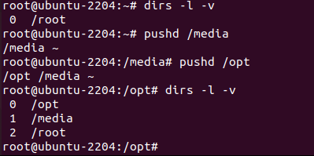

# Cấu trúc cây thư mục trong Linux


1. `/` - Root
   Đúng với tên gọi của mình: nút gốc (root) đây là nơi bắt đầu của tất cả các file và thư mục. Chỉ có root user mới có quyền ghi trong thư mục này. Chú ý rằng `/root` là thư mục home của root user chứ không phải là `/`.

2. `/bin` - Chương trình của người dùng
   Thư mục này chứa các chương trình thực thi. Các chương trình chung của Linux được sử dụng bởi tất cả người dùng được lưu ở đây. Ví dụ như: `ps`, `ls`, `ping`...

3. `/sbin` - Chương trình hệ thống
   Cũng giống như `/bin`, `/sbin` cũng chứa các chương trình thực thi, nhưng chúng là những chương trình của admin, dành cho việc bảo trì hệ thống. Ví dụ như: `reboot`, `fdisk`, `iptables`...

4. `/etc` - Các file cấu hình
   Thư mục này chứa các file cấu hình của các chương trình, đồng thời nó còn chứa các shell script dùng để khởi động hoặc tắt các chương trình khác. Ví dụ: `/etc/resolv.conf`, `/etc/logrotate.conf`

5. `/dev` - Các file thiết bị
   Các phân vùng ổ cứng, thiết bị ngoại vi như USB, ổ đĩa cắm ngoài, hay bất cứ thiết bị nào gắn kèm vào hệ thống đều được lưu ở đây. Ví dụ: `/dev/sdb1` là tên của USB bạn vừa cắm vào máy, để mở được USB này bạn cần sử dụng lệnh mount với quyền root: `# mount /dev/sdb1 /tmp`

6. `/tmp` - Các file tạm
   Thư mục này chứa các file tạm thời được tạo bởi hệ thống và các người dùng. Các file lưu trong thư mục này sẽ bị xóa khi hệ thống khởi động lại.

7. `/proc` - Thông tin về các tiến trình
   Thông tin về các tiến trình đang chạy sẽ được lưu trong `/proc` dưới dạng một hệ thống file thư mục mô phỏng. Ví dụ thư mục con `/proc/{pid}` chứa các thông tin về tiến trình có ID là pid (pid ~ process ID). Ngoài ra đây cũng là nơi lưu thông tin về các tài nguyên đang sử dụng của hệ thống như: /proc/version, /proc/uptime...

8. `/var` - File về biến của chương trình
   Thông tin về các biến của hệ thống được lưu trong thư mục này. Như thông tin về log file: /var/log, các gói và cơ sở dữ liệu /var/lib...

9. `/usr` - Chương trình của người dùng
   Chứa các thư viện, file thực thi, tài liệu hướng dẫn và mã nguồn cho chương trình chạy ở level 2 của hệ thống. Trong đó:

   - `/usr/bin` chứa các file thực thi của người dùng như: `at`, `awk`, `cc`, `less`... Nếu bạn không tìm thấy chúng trong /bin hãy tìm trong `/usr/bin`
   - `/usr/sbin` chứa các file thực thi của hệ thống dưới quyền của admin như: `atd`, `cron`, `sshd`... Nếu bạn không tìm thấy chúng trong /sbin thì hãy tìm trong thư mục này.
   - `/usr/lib` chứa các thư viện cho các chương trình trong `/usr/bin` và `/usr/sbin`
   - `/usr/local` chứa các chương trình của người dùng được cài từ mã nguồn. Ví dụ như bạn cài apache từ mã nguồn, nó sẽ được lưu dưới `/usr/local/apache2`

10. `/home` - Thư mục người dùng
   Thư mục này chứa tất cả các file cá nhân của từng người dùng. Ví dụ: `/home/john`, `/home/marie`

11. `/boot` - Các file khởi động
   Tất cả các file yêu cầu khi khởi động như `initrd`, `vmlinux`, `grub` được lưu tại đây. Ví dụ `vmlinuz-2.6.32-24-generic`

12. `/lib` - Thư viện hệ thống
   Chứa các thư viện hỗ trợ cho các file thực thi trong `/bin` và `/sbin`. Các thư viện này thường có tên bắt đầu bằng ld* hoặc lib*.so.*. Ví dụ như ld-2.11.1.so hay libncurses.so.5.7

13. `/opt` - Các ứng dụng phụ tùy chọn
   Tên thư mục này nghĩa là optional (tùy chọn), nó chứa các ứng dụng thêm vào từ các nhà cung cấp độc lập khác. Các ứng dụng này có thể được cài ở `/opt` hoặc một thư mục con của `/opt`

14. `/mnt` - Thư mục để mount
   Đây là thư mục tạm để mount các file hệ thống. Ví dụ như `# mount /dev/sda2 /mnt`

15. `/media` - Các thiết bị gắn có thể gỡ bỏ
   Thư mục tạm này chứa các thiết bị như CD-ROM `/media/cdrom`, floppy /media/floppy hay các phân vùng đĩa cứng /media/Data (hiểu như là ổ D:/Data trong Windows)

16. `/srv` - Dữ liệu của các dịch vụ khác
   Chứa dữ liệu liên quan đến các dịch vụ máy chủ như `/srv/svs`, chứa các dữ liệu liên quan đến CVS.

## Các lệnh dòng lệnh tương tác với thư mục trong Linux

Dưới đây là một số lệnh dòng lệnh phổ biến được sử dụng để tương tác với thư mục trong hệ điều hành Linux.

Hầu hết các lệnh trong Linux đều có thể xem được hướng dẫn với câu lệnh: `man`

ví dụ: man ls

Hoặc <câu lệnh> --help. Ví dụ: ls --help

Ta sẽ nhận được 1 hoặc nhiều trang giới thiệu cũng như hướng dẫn sử dụng của câu lệnh `ls`

## 1. Lệnh `cd`

Lệnh `cd` được sử dụng để di chuyển đến một thư mục khác.

**Cú pháp:** cd [đường_dẫn_thư_mục]

**Ví dụ:** cd /home/user/Documents

- Thay đổi từ thư mục hiện tại sang /usr/local.

```sh
tips@chiasefree:~$ cd /usr/local
---------lenh se hien thi nhu ben duoi -----------
tips@chiasefree:/usr/local$
```

- Thay đổi từ thư mục hiện tại sang  /usr/local/lib bằng cách sử dụng đường dẫn tuyệt đối.

```sh
tips@chiasefree:/usr/local$ cd /usr/local/lib
---------lenh se hien thi nhu ben duoi -----------
tips@chiasefree:/usr/local/lib$
```

- Thay đổi từ thư mục làm việc hiện tại sang /usr/local/lib bằng đường dẫn tương đối.

```sh
tips@chiasefree:/usr/local$ cd lib
tips@chiasefree:/usr/local/lib$
```

>đường dẫn tương đối chỉ hoạt động khi nơi cần đến được chứa trong nơi ta đang đứng. Như trên ví dụ, thì thư mục `lib` nằm bên trong thư mục `/usr/local`

- Di chuyển về lại thư mục trước đó.

```sh
tips@chiasefree:~$ cd /usr/local/lib
tips@chiasefree:/usr/local/lib$ cd - 
/root
tips@chiasefree:~$
```

- Di chuyển về thư mục cha, nơi chứa thư mục ta đang đứng

```sh
tips@chiasefree:/usr/local/lib$ cd .. 
tips@chiasefree:/usr/local$
```

- Di chuyển về thư mục cha của thư mục cha

```sh
tips@chiasefree:/usr/local/lib$ cd ../.. 
tips@chiasefree:/usr/$
```

- Di chuyển về thư mục gốc của người dùng, bất kể đang đứng ở đâu

```sh
tips@chiasefree:/usr/local/lib$ cd
tips@chiasefree:~$
```

   hoặc

```sh
tips@chiasefree:/usr/local/lib$ cd --
tips@chiasefree:~$
```

- Trong trường hợp bạn không nhớ đầy đủ tên thư mục, hãy sử dụng phím `tab` để tìm gợi ý

```sh
tips@chiasefree:~$ cd /usr/l
lib/     lib32/   lib64/   libexec/ libx32/  local/
```

Sau khi nhấn tab ta sẽ có 1 loạt các gợi ý.

- Trong trường hợp thư mục cha có chứa rất nhiều thư mục con, nếu đang đứng trong một thư mục con nào đó, ta có thể linh động di chuyển sang thư mục con khác bằng cách

```sh
tips@chiasefree:/usr/local/$ cd ../lib32
tips@chiasefree:/usr/local/lib32$
```

- Nếu các mục bạn muốn thay đổi có khoảng trắng trong tên của nó, bạn nên sử dụng dấu nháy '' hoặc sử dụng các dấu gạch chéo ngược (\):

```sh
cd 'Dir name with space'
hoặc
cd Dir\ name\ with\ space
```

## 2. Lệnh `ls`

Trong các câu lệnh trong Linux, đây chắc hẳn là lệnh đầu tiên mà phần lớn người dùng Linux gặp. Lệnh này có nhiệm vụ liệt kê các file và folder có ở trong directory được chỉ định. Theo mặc định, ls sẽ tìm ở trong directory hiện tại. Bên cạnh đó, còn có nhiều option khác có thể được sử dụng với lệnh ls. Trong đó phổ biến có:

- Liệt kê các file và folder trong directory hiện tại:

```sh
ls
```

output tương tự:

```sh
# ls
0001.pcap        Desktop    Downloads         index.html   install.log.syslog  Pictures  Templates
anaconda-ks.cfg  Documents  fbcmd_update.php  install.log  Music               Public    Videos
```

- Liệt kê các file và folder trong directory hiện tại, cùng option -l để hiển thị chi tiết hơn

   Ở đây, ls -l (-l là ký tự không phải là một) hiển thị tệp hoặc thư mục, kích thước, ngày, thời gian đã sửa đổi, tên tệp hoặc tên thư mục và chủ sở hữu (owner) tệp file và đó là sự cho phép (permission).

```sh
ls -l
```

output có thể tương tự

```sh
# ls -l
total 176
-rw-r--r--. 1 root root   683 Aug 19 09:59 0001.pcap
-rw-------. 1 root root  1586 Jul 31 02:17 anaconda-ks.cfg
drwxr-xr-x. 2 root root  4096 Jul 31 02:48 Desktop
drwxr-xr-x. 2 root root  4096 Jul 31 02:48 Documents
drwxr-xr-x. 4 root root  4096 Aug 16 02:55 Downloads
-rw-r--r--. 1 root root 21262 Aug 12 12:42 fbcmd_update.php
-rw-r--r--. 1 root root 46701 Jul 31 09:58 index.html
-rw-r--r--. 1 root root 48867 Jul 31 02:17 install.log
-rw-r--r--. 1 root root 11439 Jul 31 02:13 install.log.syslog
drwxr-xr-x. 2 root root  4096 Jul 31 02:48 Music
drwxr-xr-x. 2 root root  4096 Jul 31 02:48 Pictures
drwxr-xr-x. 2 root root  4096 Jul 31 02:48 Public
drwxr-xr-x. 2 root root  4096 Jul 31 02:48 Templates
drwxr-xr-x. 2 root root  4096 Jul 31 02:48 Videos
```

- Option -h (human) để hiển thị kích thước các file thân thiện hơn với con người:

```sh
ls -lh
```

output có thể:

```sh
# ls -lh
total 176K
-rw-r--r--. 1 root root  683 Aug 19 09:59 0001.pcap
-rw-------. 1 root root 1.6K Jul 31 02:17 anaconda-ks.cfg
drwxr-xr-x. 2 root root 4.0K Jul 31 02:48 Desktop
drwxr-xr-x. 2 root root 4.0K Jul 31 02:48 Documents
drwxr-xr-x. 4 root root 4.0K Aug 16 02:55 Downloads
-rw-r--r--. 1 root root  21K Aug 12 12:42 fbcmd_update.php
-rw-r--r--. 1 root root  46K Jul 31 09:58 index.html
-rw-r--r--. 1 root root  48K Jul 31 02:17 install.log
-rw-r--r--. 1 root root  12K Jul 31 02:13 install.log.syslog
drwxr-xr-x. 2 root root 4.0K Jul 31 02:48 Music
drwxr-xr-x. 2 root root 4.0K Jul 31 02:48 Pictures
drwxr-xr-x. 2 root root 4.0K Jul 31 02:48 Public
drwxr-xr-x. 2 root root 4.0K Jul 31 02:48 Templates
drwxr-xr-x. 2 root root 4.0K Jul 31 02:48 Videos
```

- Liệt kê cả các file bị ẩn bằng option -a (all files), Thường thì các file sẽ có tên bắt đầu bằng dấu `.`:

```sh
ls -a
```

output có thể:

```sh
# ls -a
.                .bashrc  Documents         .gconfd          install.log         .nautilus     .pulse-cookie
..               .cache   Downloads         .gnome2          install.log.syslog  .netstat.swp  .recently-used.xbel
0001.pcap        .config  .elinks           .gnome2_private  .kde                .opera        .spice-vdagent
anaconda-ks.cfg  .cshrc   .esd_auth         .gtk-bookmarks   .libreoffice        Pictures      .tcshrc
.bash_history    .dbus    .fbcmd            .gvfs            .local              .pki          Templates
.bash_logout     Desktop  fbcmd_update.php  .ICEauthority    .mozilla            Public        Videos
.bash_profile    .digrc   .gconf            index.html       Music               .pulse        .wireshark
```

- Liệt kê và phân biệt các Tệp hay Thư Mục với thư mục có Ký tự ‘/’  ở cuối

```sh
# ls -F
0001.pcap        Desktop/    Downloads/        index.html   install.log.syslog  Pictures/  Templates/
anaconda-ks.cfg  Documents/  fbcmd_update.php  install.log  Music/              Public/    Videos/
```

- Liệt kê các tập tin theo thứ tự ngược, thường là ngược theo bảng chữ cái

```sh
# ls -r
Videos     Public    Music               install.log  fbcmd_update.php  Documents  anaconda-ks.cfg
Templates  Pictures  install.log.syslog  index.html   Downloads         Desktop    0001.pcap
```

- Danh sách đệ quy danh mục con

   `ls -R` sẽ liệt kê các cây thư mục liệt kê rất dài. Xem một ví dụ của đầu ra của lệnh.

```sh
# ls -R
total 1384
-rw-------. 1 root     root      33408 Aug  8 17:25 anaconda.log
-rw-------. 1 root     root      30508 Aug  8 17:25 anaconda.program.log
./httpd:
total 132
-rw-r--r--  1 root root     0 Aug 19 03:14 access_log
-rw-r--r--. 1 root root 61916 Aug 10 17:55 access_log-20120812
./lighttpd:
total 68
-rw-r--r--  1 lighttpd lighttpd  7858 Aug 21 15:26 access.log
-rw-r--r--. 1 lighttpd lighttpd 37531 Aug 17 18:21 access.log-20120819
./nginx:
total 12
-rw-r--r--. 1 root root    0 Aug 12 03:17 access.log
-rw-r--r--. 1 root root  390 Aug 12 03:17 access.log-20120812.gz
```

- Với sự kết hợp của `-ltr` sẽ cho thấy tập tin sửa đổi mới nhất hoặc ngày thư mục như trước.

```sh
# ls -ltr
total 176
-rw-r--r--. 1 root root 11439 Jul 31 02:13 install.log.syslog
-rw-r--r--. 1 root root 48867 Jul 31 02:17 install.log
-rw-------. 1 root root  1586 Jul 31 02:17 anaconda-ks.cfg
drwxr-xr-x. 2 root root  4096 Jul 31 02:48 Desktop
drwxr-xr-x. 2 root root  4096 Jul 31 02:48 Videos
drwxr-xr-x. 2 root root  4096 Jul 31 02:48 Templates
drwxr-xr-x. 2 root root  4096 Jul 31 02:48 Public
drwxr-xr-x. 2 root root  4096 Jul 31 02:48 Pictures
drwxr-xr-x. 2 root root  4096 Jul 31 02:48 Music
drwxr-xr-x. 2 root root  4096 Jul 31 02:48 Documents
-rw-r--r--. 1 root root 46701 Jul 31 09:58 index.html
-rw-r--r--. 1 root root 21262 Aug 12 12:42 fbcmd_update.php
drwxr-xr-x. 4 root root  4096 Aug 16 02:55 Downloads
-rw-r--r--. 1 root root   683 Aug 19 09:59 0001.pcap
```

- Với kết hợp của `-lS` hiển thị kích thước tập tin theo thứ tự, sẽ hiển thị kích thước lớn đầu tiên.

```sh
# ls -lS
total 176
-rw-r--r--. 1 root root 48867 Jul 31 02:17 install.log
-rw-r--r--. 1 root root 46701 Jul 31 09:58 index.html
-rw-r--r--. 1 root root 21262 Aug 12 12:42 fbcmd_update.php
-rw-r--r--. 1 root root 11439 Jul 31 02:13 install.log.syslog
drwxr-xr-x. 2 root root  4096 Jul 31 02:48 Desktop
drwxr-xr-x. 2 root root  4096 Jul 31 02:48 Documents
drwxr-xr-x. 4 root root  4096 Aug 16 02:55 Downloads
drwxr-xr-x. 2 root root  4096 Jul 31 02:48 Music
drwxr-xr-x. 2 root root  4096 Jul 31 02:48 Pictures
drwxr-xr-x. 2 root root  4096 Jul 31 02:48 Public
drwxr-xr-x. 2 root root  4096 Jul 31 02:48 Templates
drwxr-xr-x. 2 root root  4096 Jul 31 02:48 Videos
-rw-------. 1 root root  1586 Jul 31 02:17 anaconda-ks.cfg
-rw-r--r--. 1 root root   683 Aug 19 09:59 0001.pcap
```

- Hiển thị số Inode của File hoặc Directory

   Chúng ta có thể thấy một số số được in trước tên file/thư mục. Với `-i` là tùy chọn danh sách tập tin/thư mục với số inode. Với inode là số dịnh danh riêng của tệp tin/thư mục, để hệ thống làm việc.

```sh
# ls -i
20112 0001.pcap        23610 Documents         23793 index.html          23611 Music     23597 Templates
23564 anaconda-ks.cfg  23595 Downloads            22 install.log         23612 Pictures  23613 Videos
23594 Desktop          23585 fbcmd_update.php     35 install.log.syslog  23601 Public
```

- Liệt kê Thông tin thư mục

   Với lệnh ls -l  danh sách các tập tin theo thư mục /tmp. Trong đó với -ld là thông số hiển thị thông tin của thư mục /tmp.


```sh
# ls -l /tmp
total 408
drwx------. 2 narad narad   4096 Aug  2 02:00 CRX_75DAF8CB7768
-r--------. 1 root  root  384683 Aug  4 12:28 htop-1.0.1.tar.gz
drwx------. 2 root  root    4096 Aug  4 11:20 keyring-6Mfjnk
drwx------. 2 root  root    4096 Aug 16 01:33 keyring-pioZJr
drwx------. 2 gdm   gdm     4096 Aug 21 11:26 orbit-gdm
drwx------. 2 root  root    4096 Aug 19 08:41 pulse-gl6o4ZdxQVrX
drwx------. 2 narad narad   4096 Aug  4 08:16 pulse-UDH76ExwUVoU
drwx------. 2 gdm   gdm     4096 Aug 21 11:26 pulse-wJtcweUCtvhn
-rw-------. 1 root  root     300 Aug 16 03:34 yum_save_tx-2012-08-16-03-34LJTAa1.yumtx

# ls -ld /tmp/
drwxrwxrwt. 13 root root 4096 Aug 21 12:48 /tmp/
```

- Hiển thị UID và GID của Tệp

```sh
# ls -n
total 36
drwxr-xr-x. 2 500 500 4096 Aug  2 01:52 Downloads
drwxr-xr-x. 2 500 500 4096 Aug  2 01:52 Music
drwxr-xr-x. 2 500 500 4096 Aug  2 01:52 Pictures
-rw-rw-r--. 1 500 500   12 Aug 21 13:06 tmp.txt
drwxr-xr-x. 2 500 500 4096 Aug  2 01:52 Videos
```

- Lệnh ls và nó là bí danh

   Sử dụng `alias` để gán bí danh cho câu lệnh `ls`

```sh
alias ls="ls -l"
```

Sau đó ta có thể sử dụng lệnh `ls` với option `-l`

   Lưu ý: Chúng ta có thể thấy số bí danh có sẵn trong hệ thống của bạn với lệnh bí danh dưới đây và cũng có thể là unalias như  ví dụ thể hiện dưới đây .

   ```sh
   # alias
   alias cp='cp -i'
   alias l.='ls -d .* --color=auto'
   alias ll='ls -l --color=auto'
   alias ls='ls --color=auto'
   alias mv='mv -i'
   alias rm='rm -i'
   alias which='alias | /usr/bin/which --tty-only --read-alias --show-dot --show-tilde'
   ```

   Để loại bỏ 1 bí danh nào đó: `unalias <tên_bí danh>`

   ```sh
   unalias ls
   ```

   Lệnh ls lúc này sẽ trở về thành mặc định

- Hiện phiên bản lệnh ls

```sh
# ls --version
ls (GNU coreutils) 8.4
Copyright (C) 2010 Free Software Foundation, Inc.
License GPLv3+: GNU GPL version 3 or later <http://gnu.org/licenses/gpl.html>.
This is free software: you are free to change and redistribute it.
There is NO WARRANTY, to the extent permitted by law.
Written by Richard M. Stallman and David MacKenzie.
```

- Hiện trang trợ giúp

```sh
# ls --help
Usage: ls [OPTION]... [FILE]...
```

>Lưu y: trang trợ giúp có thể sẽ rất dài


## 3. Lệnh `mkdir`

Lệnh `mkdir` được sử dụng để tạo mới một thư mục.

Ví dụ 1:
– Tạo 1 thư mục “cuongquach_dir” ngay tại thư mục hiện hành (cwd).

```sh
# mkdir cuongquach_dir
# ls
cuongquach_dir
```

– Tạo 1 thư mục “cuongquach_dir” tại thư mục /root/ .

```sh
# mkdir /root/cuongquach_dir/
# ls /root/
cuongquach_dir
```

- Tạo nhiều thư mục cùng lúc với cú pháp lệnh:

```sh
mkdir <path_name_1> <path_name_2> <path_name_3>
```

Ví dụ 2:
– Tạo 3 thư mục “cuongquach_dir_1“, “cuongquach_dir_2“, “cuongquach_dir_3” ngay tại thư mục hiện hành (cwd).

```sh
# mkdir cuongquach_dir_1 cuongquach_dir_2 cuongquach_dir_3
# ll
total 20K
4.0K drwxr-xr-x 5 root root 4.0K Sep 3 08:14 .
4.0K dr-xr-x---. 16 root root 4.0K Sep 3 08:09 ..
4.0K drwxr-xr-x 2 root root 4.0K Sep 3 08:14 cuongquach_dir_1
4.0K drwxr-xr-x 2 root root 4.0K Sep 3 08:14 cuongquach_dir_2
4.0K drwxr-xr-x 2 root root 4.0K Sep 3 08:14 cuongquach_dir_3
```

 Tạo 3 thư mục “cuongquach_dir_1“, “cuongquach_dir_2“, “cuongquach_dir_3” ngay tại thư mục root.

 ```sh
 # mkdir /root/cuongquach_dir_1 /root/cuongquach_dir_2 /root/cuongquach_dir_3
 # ll /root/
 total 20K
 4.0K drwxr-xr-x 5 root root 4.0K Sep 3 08:14 .
 4.0K dr-xr-x---. 16 root root 4.0K Sep 3 08:09 ..
 4.0K drwxr-xr-x 2 root root 4.0K Sep 3 08:14 cuongquach_dir_1
 4.0K drwxr-xr-x 2 root root 4.0K Sep 3 08:14 cuongquach_dir_2
 4.0K drwxr-xr-x 2 root root 4.0K Sep 3 08:14 cuongquach_dir_3
 ```

 Bạn cũng có thể thực hiện mẹo sau để tạo nhiều thư mục cùng lúc tại thư mục root.

 ```sh
 # mkdir /root/{cuongquach_dir_1,cuongquach_dir_2,cuongquach_dir_3}
 ```

- Tạo thư mục kèm cấp thư mục cha

   Để tạo một thư mục kèm theo thư mục cấp cha của nó phải được tạo ra ngay cả khi cấp thư mục cha chưa tồn tại. Thì bạn hãy dùng option “-p“. Giả sử, thư mục “/root/cuongquach_parent/” chưa được tạo mới, nhưng giờ mình có nhu cầu tạo thư mục con của nó “/root/cuongquach_parent/cuongquach_dir” thì muốn tạo cả cấp thư mục cha và con luôn.

   Cú pháp lệnh

   ```sh
   mkdir -p <path_name>
   ```

Ví dụ 3:
– Nếu bạn cố tạo với cú pháp ví dụ 1, thì bạn sẽ gặp lỗi sau do cấp thư mục /root/ hoặc /root/cuongquach_parent/ chưa tồn tại.

```sh
# mkdir /root/cuongquach_parent/cuongquach_dir
mkdir: cannot create directory `/root/cuongquach_parent/cuongquach_dir': No such file or directory
```

– Giờ ta dùng option “-p” và “-v” để xem cách lệnh mkdir xử lý. Bạn sẽ thấy đầu tiên nó tạo thư mục cấp cha của “cuongquach_dir” nếu nó chưa tồn tại. Sau đó sẽ tạo thư mục con “cuongquach_dir” kế đến.

```sh
# mkdir -p -v /root/cuongquach_parent/cuongquach_dir
mkdir: created directory `/root/cuongquach_parent'
mkdir: created directory `/root/cuongquach_parent/cuongquach_dir'
```

– Ta dùng lệnh TREE trong Linux để xem thông tin các thư mục và file thuộc thư mục /root/ theo dạng cây.

```sh
# tree /root/
/root/
└── cuongquach_parent
    └── cuongquach_dir
```

- Tạo thư mục với phân quyền cụ thể

   với option “-m“. Option này chấp nhận format và giá trị permission (775,…). Nếu bạn dùng option “-m” mà không đi kèm giá trị phân quyền thì thư mục sẽ được tạo ra theo giá trị umask mặc định.

Cú pháp lệnh:

```sh
mkdir -m <permission_value> <path_name>
```

Ví dụ 4:

```sh
# mkdir -m 440 cuongquach_dir
# ls -l
total 4
dr--r----- 2 root root 4096 Sep 3 08:30 cuongquach_dir
```

- Hiển thị quá trình tạo thư mục
Với option “-v” của lệnh MKDIR sẽ buộc lệnh phải in ra output thông tin như khởi tạo thư mục thành công hay không ? khởi tạo thất bại? thư mục đã tồn tại.

Cú pháp lệnh

```sh
mkdir -v <path_name>
```

Ví dụ 5:

– Khởi tạo thư mục thành công, không lỗi.

```sh
# mkdir -v /root/{cuongquach_dir_1,cuongquach_dir_2,cuongquach_dir_3}
mkdir: created directory `/root/cuongquach_dir_1'
mkdir: created directory `/root/cuongquach_dir_2'
mkdir: created directory `/root/cuongquach_dir_3'
```

– Khởi tạo thư mục thất bại, do các thư mục này đã tồn tại.

```sh
# mkdir -v /root/{cuongquach_dir_1,cuongquach_dir_2,cuongquach_dir_3}
mkdir: cannot create directory `/root/cuongquach_dir_1': File exists
mkdir: cannot create directory `/root/cuongquach_dir_2': File exists
mkdir: cannot create directory `/root/cuongquach_dir_3': File exists
```

- Để xem chi tiết hơn về lệnh có thể tham khảo:

```sh
man mkdir

hoặc

mkdir --help
```

<https://linux.die.net/man/1/mkdir>

## 4. Lệnh `rm`

Lệnh `rm` được sử dụng để xóa tệp hoặc thư mục.

Nếu bạn không có quyền ghi trên thư mục mẹ, bạn sẽ gặp lỗi “Permission denied”.

Nếu tệp không được bảo vệ ghi, tệp sẽ bị xóa mà không cần thông báo. Khi thành công, lệnh không tạo ra bất kỳ đầu ra nào và trả về số không. Thường thì người tạo ra tệp và xoá tệp sẽ gặp trường hợp này

Khi xóa các tệp được bảo vệ ghi, lệnh sẽ nhắc bạn xác nhận, như được hiển thị bên dưới:

```sh
rm: remove write-protected regular empty file 'filename'?
```

Nhập y và nhấn Enter để xóa tệp. Thường thì người không tạo ra tệp nhưng có quyền thao tác với tệp sẽ gặp trường hợp này.


Tùy chọn `-f` nói rm không bao giờ nhắc nhở người dùng và bỏ qua các file không thông báo.

```sh
rm -f filename
```

Nếu bạn muốn nhận thông tin về những gì đang bị xóa, hãy sử dụng tùy chọn -v (verbose):

```sh
rm -v filename
removed 'filename'
```

- Xóa nhiều tệp

`rm` cho phép ta xoá nhiều tệp cùng lúc, với các tệp được phân cách với nhau bởi dấu cách.

```sh
rm filename1 filename2 filename3
```

- Xoá nhiều tệp với cùng định dạng, với tuỳ chọn `*`

ví dụ: lệnh sau sẽ xoá tất cả các tệp có định dạng .png

```sh
rm *.png
```

- Lệnh `rm` cũng hỗ trợ xoá các thư mục

Để xoá các thư mục rỗng hãy sử dụng `-d`

```sh
rm -d <dirname or dir link>
```

Để xoá cả các thư mục con bên trong thư mục hãy sử dụng `-r`

```sh
rm -r <dirname or dir link>
```

- Để nhận cảnh báo cho hành động xoá, hãy sử dụng `-i`
- Bắt buộc xoá mà không đưa ra cảnh báo, sử dụng `-f`


## 5. Lệnh `mv`

Lệnh `mv` được sử dụng để di chuyển hoặc đổi tên tệp hoặc thư mục.

**Cú pháp:** mv [đường_dẫn_nguồn] [đường_dẫn_đích]

**Ví dụ:** mv file.txt /home/user/Documents

- Câu lệnh trên sẽ di chuyển `file.txt` sang thư mục `/home/user/Documents`

- Để di chuyển nhiều tệp, hãy liệt kê các tệp và cách nhau bởi dấu cách.

- Nếu các tệp có cùng 1 định dạng có thể sử dụng

```sh
mv *.txt /home/user/Documents
```

- Để hiển thị chi tiết quá trình, sử dụng `-v`

```sh
mv *.txt /home/user/Documents
```

output tương tự

```sh
ubuntu@ubuntu-2204:~/baiTapShell$ mv -v *.sh ../Desktop/
renamed 'bai1Fibonaci.sh' -> '../Desktop/bai1Fibonaci.sh'
renamed 'DinhHongPhuc_bkt.sh' -> '../Desktop/DinhHongPhuc_bkt.sh'
renamed 'ham.sh' -> '../Desktop/ham.sh'
renamed 'hello.sh' -> '../Desktop/hello.sh'
renamed 'ispositive.sh' -> '../Desktop/ispositive.sh'
renamed 'math.sh' -> '../Desktop/math.sh'
renamed 'paratest.sh' -> '../Desktop/paratest.sh'
renamed 'read.sh' -> '../Desktop/read.sh'
renamed 'select.sh' -> '../Desktop/select.sh'
renamed 'showfile.sh' -> '../Desktop/showfile.sh'
renamed 'sodoixung.sh' -> '../Desktop/sodoixung.sh'
renamed 'songuyento.sh' -> '../Desktop/songuyento.sh'
renamed 'varTest.sh' -> '../Desktop/varTest.sh'
renamed 'vongFor.sh' -> '../Desktop/vongFor.sh'
renamed 'vongwhile.sh' -> '../Desktop/vongwhile.sh'
```

- Một lưu ý quan trọng khi sử dụng lệnh `mv` là trừ khi bạn chỉ định, `mv` sẽ tự động ghi đè lên bất kỳ tệp nào trong thư mục đích mà tên với tệp nguồn.

Bạn có thể tránh tình cờ ghi đè bằng chế độ tương tác (interactive mode), sử dụng tùy chọn `-i`

`mv` sẽ yêu cầu bạn xác nhận việc di chuyển trong trường hợp có tệp bị trùng tên trong thư mục đích.

Đồng ý ghi đè tệp thì nhập `y` không đồng ý thì nhập `n`

```sh
mv -vi *.sh ../baiTapShell/
mv: overwrite '../baiTapShell/read.sh'? y
renamed 'read.sh' -> '../baiTapShell/read.sh'
```

- Hoặc sử dụng `-n`, các đối tượng bị trùng tên sẽ được giữ lại

- Tuỳ chọn `-u` sẽ di chuyển và ghi đè các dữ liệu mới hơn vào các đối tượng cũ hơn.

- Bỏ qua các thông báo ghi đè ghi có sự trùng lặp hãy sử dụng `-f`

- Một tùy chọn khác để tránh trường hợp file trùng tên là tùy chọn sao lưu (backup option). Nếu bạn sử dụng –backup = numberered, mv sẽ thêm ~1~ vào tên tệp nguồn. Sau đó, tệp đã di chuyển sẽ bị ẩn khỏi chế độ xem bình thường (normal view) trừ khi bạn tiết lộ các tệp ẩn, ví dụ như với lệnh ls -a.

## 6. Lệnh `cp`

Lệnh `cp` được sử dụng để sao chép tệp hoặc thư mục.

**Cú pháp:** cp [đường_dẫn_nguồn] [đường_dẫn_đích]

**Ví dụ:** cp file.txt file2.txt

- Copy nhiều file cùng lúc vào thư mục

   – Tạo nhiều file text rỗng.

   ```sh
   # touch ./{A,B,C}.txt
   # touch ./{D,E}.exe
   # ll
   total 8.0K
   4.0K drwxr-xr-x 2 root root 4.0K Oct 15 17:50 .
   4.0K drwxr-xr-x. 15 root root 4.0K Oct 15 17:49 ..
   0 -rw-r--r-- 1 root root 0 Oct 15 17:50 A.txt
   0 -rw-r--r-- 1 root root 0 Oct 15 17:50 B.txt
   0 -rw-r--r-- 1 root root 0 Oct 15 17:50 C.txt
   0 -rw-r--r-- 1 root root 0 Oct 15 17:50 D.exe
   0 -rw-r--r-- 1 root root 0 Oct 15 17:50 E.exe
   ```

   – Tạo một thư mục rỗng trên Linux rồi copy file vào thư mục rỗng để test .

   ```sh
   # mkdir -p ./lab/
   # cp A.txt B.txt C.txt D.exe E.exe ./lab/
   ```

- Sử dụng option ‘-v’ hiển thị quá trình copy

   Với option ‘-v‘ bạn sẽ có thêm được sự lựa chọn hiển thị quá trình copy file hoặc thư mục.

   ```sh
   # cp -v A.txt B.txt C.txt D.txt E.txt lab/
   `A.txt' -> `lab/A.txt'
   `B.txt' -> `lab/B.txt'
   `C.txt' -> `lab/C.txt'
   `D.txt' -> `lab/D.txt'
   `E.txt' -> `lab/E.txt'
   ```

- Copy file từ một nguồn khác sang 1 nguồn đích khác

   ```sh
   # cp /usr/report/hr_team/report.xlsx /home/sale_team/
   ```

- Copy file nhưng giữ toàn bộ thuộc tính file

   Bạn sẽ sử dụng option `-p` để giữ lại các thuộc tính thông tin của file được copy.

   ```sh
   # cp -p ./*.txt ./lab/
   ```

   Các thuộc tính được giữ lại gồm :

   . Access time
   . Modification date
   . User ID
   . Group ID
   . File flags
   . File mode
   . Access Control Lists


- Copy thư mục trên Linux

   Bạn sẽ sử dụng option `-r` hoặc `-a` để thực hiện copy thư mục trên Linux.

   ```sh
   # cp -av Devops/ /home/john/
   `Devops/Files/file.a' -> `/home/john/Devops/Files/file.a'
   `Devops/Files/file.b' -> `/home/john/Devops/Files/file.b'
   `Devops/Report/file.a' -> `/home/john/Devops/Report/file.a'
   `Devops/Report/file.b' -> `/home/john/Devops/Report/file.b'
   `Devops/Report/sa_team' -> `/home/john/Devops/Report/sa_team'
   `Devops/file.a' -> `/home/john/Devops/file.a'
   `Devops/file.b' -> `/home/john/Devops/file.b'
   `Devops/latestreport/file.a' -> `/home/john/Devops/latestreport/file.a'
   `Devops/latestreport/file.b' -> `/home/john/Devops/latestreport/file.b'
   `Devops/latestreport/sales_team' -> `/home/john/Devops/latestreport/sales_team'
   ```

   Trong đó:

   -r : copy folder và file đệ quy , tức copy toàn bộ thư mục hoặc file cấp con của thư mục được copy.
   -a : bao gồm option ‘-r‘ và thực hiện việc duy trì các thuộc tính của file hoặc thư mục như file mode, ownership, timestamps,…

- Tuỳ chọn `-i` sẽ đẩy ra thông báo yêu cầu xác nhận thực hiện việc ghi đè.

- Giả sử thư mục đích của bạn đã có file name cùng tên file name bạn đang muốn copy. Thì bạn có thể sử dụng option `-n` để ép buộc lệnh copy `cp` không được ghi đè nếu file nguồn và file đích cùng tên. Khi bạn sử dụng option `-n`, thì sẽ không có hiện prompt xác nhận copy mà là ép lệnh luôn. Sẽ không thực hiện hành động ghi đè dữ liệu cho các đối tượng bị trùng tên.

   ```sh
   # cp -n A.txt ./lab/
   ```

- Bạn sử dụng option `-f` (force) để ép buộc lệnh cp copy file ghi đè lên file đang tồn tại ở thư mục đích nếu nó cùng tên file nguồn copy mà không cần xác nhận.

   ```sh
   # cp -f A.txt /tmp/
   ```

## 7. Lệnh `tree`

- `tree`: chạy lệnh tree mà không có bất kỳ đối số nào, lệnh tree sẽ hiển thị tất cả nội dung của thư mục làm việc hiện hành ở định dạng cây. => lệnh tree trả về tổng số file và/hoặc thư mục được liệt kê


- `tree /etc/`: liệt kê các file của thư mục cụ thể ở định dạng cây, chẳng hạn như /etc
- `tree -a /etc/`: Theo mặc định, lệnh tree sẽ không liệt kê các file ẩn. Nếu bạn muốn liệt kê các file ẩn, hãy sử dụng tham số -a
- `tree -C /etc/`: xem cấu trúc thư mục ở định dạng màu
  
  
- `tree -d /etc/`: tất cả các lệnh trên đều liệt kê các thư mục con và file. Bạn cũng có thể chỉ liệt kê các thư mục sử dụng tham số `-d`

## 8. dirs-pushd-popd

Trong trường hợp ta cần sử dụng nhiều thư mục và cần di chuyển qua lại giữa chúng. Thì việc gom chúng lại thành 1 danh sách sẽ là cách tối ưu và nhanh gọn nhất.

Để xem danh sách một cách đầy đủ thì:

```sh
dirs -l -v
```

Ban đầu sẽ không có bất kỳ danh sách nào. Ta sử dụng lệnh `pushd` để thêm vào danh sách. Lệnh sẽ thêm theo thứ tự cái nào thêm vào trước sẽ ở phía sau.

Ví dụ:

```sh
pushd /media
pushd /opt
```

ta sẽ nhận được danh sách

```sh
dirs -l -v
```



Đã có danh sách, để di chuyển giữa các thư mục một cách nhanh chóng ta sử dụng:

```sh
pushd +<số thứ tự của vị trí cần đến>
```

ví dụ:

```sh
pushd +2
```

Ta sẽ được di chuyển về lại thư mục `/root`, đồng thời thư mục này cũng sẽ được chuyển lên đứng đầu danh sách.

Để chỉnh sửa danh sách, ta có câu lệnh `popd`. Câu lệnh cũng sẽ xoá từ đầu danh sách, và hỗ trợ xoá theo vị trí mong muốn.

## Tài liệu tham khảo

<https://vi.joecomp.com/pushd-popd-commands-linux>

<https://vietnix.vn/cac-cau-lenh-trong-linux/>

Date accessed: 24/05/2023
