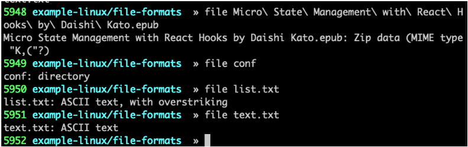
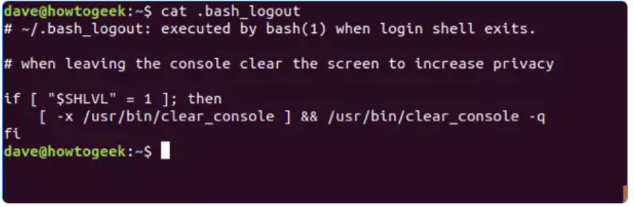
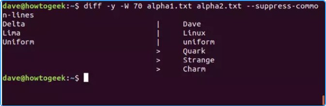
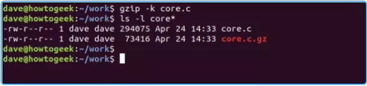
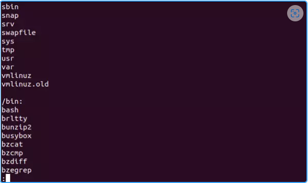
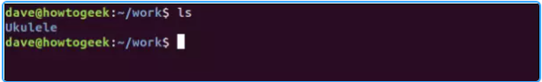
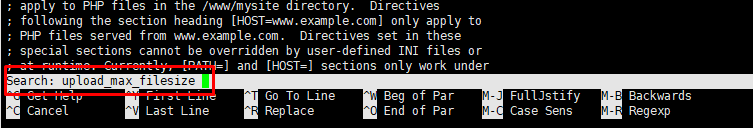
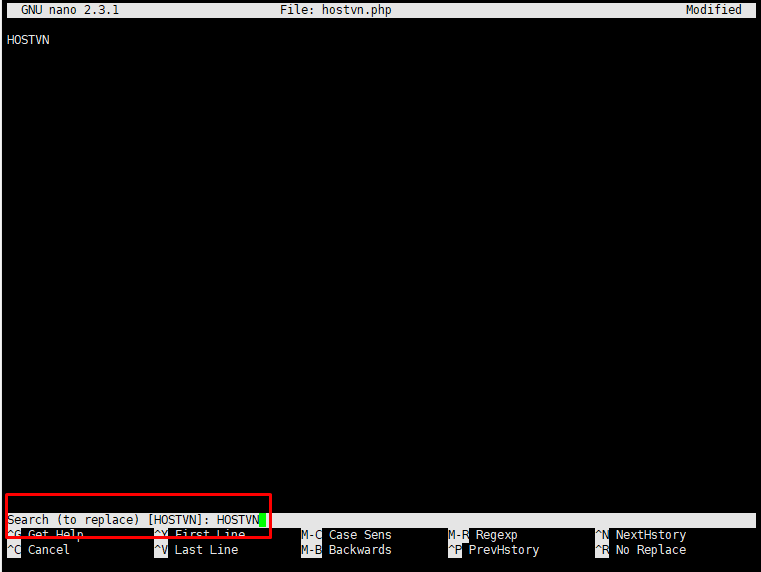
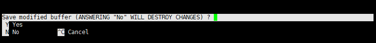

_Thao tác cơ bản với tệp tin. Các lệnh này đa phần mặc định có trên hầu hết các bản phân phối linux._

_Để xem chi tiết nhất có thể hãy sử dụng: man <câu_lệnh>. Ví dụ man cat_

## Mục lục

[Lệnh "file"](#lệnh-file)

[Cat](#cat)

[Diff](#diff)

[Find](#find)

[Grep](#grep)

[Gzip](#gzip)

[Lệnh "wc"](#lệnh-wc)

[Head](#head)

[Less](#less)

[Man](#man)

[Tail](#tail)

[Tar](#tar)

[Vi/Vim](#vivim)

[Tài liệu tham khảo](#tài-liệu-tham-khảo)

[Nano](#nano)


## Lệnh "file"

Với một tập tin, việc xem định dạng của tập tin đó trước tiên có thể giúp chúng ta bước đầu xác định đó có phải là cái mình muốn tìm hay không.

Có nhiều loại định dạng như text, code, database, …

Lệnh file giúp xem kiểu định dạng của file



Trong ví dụ trên là một số kiểu định dạng khác nhau của file: zip, directory, ASCII text.

Những tập tin có kết quả trả về từ câu lệnh “file” có chứa “text” thì bạn có thể sử dụng những câu lệnh tiếp sau đây để xem chúng.

## Cat

Lệnh cat (viết tắt của concatenate) sẽ liệt kê nội dung của file vào trong terminal window. Việc này sẽ nhanh hơn nhiều so với việc mở các file ở trong editor. Và dĩ nhiên, sẽ không xảy ra khả năng làm thay đổi nội dung của các file đó.

Để đọc nội dung của file .bash_log_out, nhập lệnh sau khi directory hiện tại là home directory:

```sh
cat .bash_logout
```



Đối với những file dài hơn số dòng ở trong terminal, các text sẽ hiện ra rất nhanh. Do đó, ta có thể pipe các output từ cat thông qua less để dễ kiểm soát hơn.

Bằng lệnh less, ta có thể cuộn lên hoặc xuống các file thông qua các phím mũi tên lên xuống, hoặc PgUp – PgDn, Home – End. Cuối cùng, nhập q để thoát khỏi less.

```sh
cat .bashrc | less
```


- Có thể xem nhiều file cùng lúc, với các file cách nhau bởi dấu cách.

- Tạo 1 file mới với cat

  ```sh
  # cat >test2
  ```

  Chờ đầu vào từ người dùng, nhập văn bản mong muốn và nhấn CTRL + D (giữ phím Ctrl và nhập d) để thoát. Văn bản sẽ được viết trong file test2. Bạn có thể xem nội dung của file bằng lệnh cat sau.

  ```sh
  # cat test2
  hello everyone, how do you do?
  ```

- Trong trường hợp file có rất nhiều dòng, hãy sử dụng lệnh cat kết hợp với less để có thể xem nội dung với sự kết hợp của các phím mũi tên điều hướng.

  ```sh
  cat test2 | less
  ```

- Hiển thị số dòng trong file

  Với tùy chọn -n, bạn có thể thấy số dòng của file song.txt trong terminal đầu ra:

  ```sh
  # cat -n song.txt
  1 "Heal The World"
  2 There's A Place In
  3 Your Heart
  4 And I Know That It Is Love
  5 And This Place Could
  6 Be Much
  7 Brighter Than Tomorrow
  8 And If You Really Try
  9 You'll Find There's No Need
  10 To Cry
  11 In This Place You'll Feel
  12 There's No Hurt Or Sorrow
  ```

- Hiển thị điểm cuối của dòng và khoảng cách giữa các dòng trong file. Với tuỳ chọn `-E` và các điểm này sẽ được đánh dấu bằng dấu `$`

  ```sh
  # cat -E test
  hello everyone, how do you do?$
  $
  Hey, am fine.$
  How's your training going on?$
  $
  ```

- Hiển thị các dòng được phân tách bằng tab trong file với tuỳ chọn `-T`. Các khoảng tab sẽ được biểu diễn bởi ký tự `^I`

  ```sh
  # cat -T test
  hello ^Ieveryone, how do you do?
  Hey, ^Iam fine.
  ^I^IHow's your training ^Igoing on?
  Let's do ^Isome practice in Linux.
  ```

- Chuyển nội dung từ file này sang file khác. Hãy lưu ý vì nội dung của file sau có thể sẽ bị ghi đè bởi nội dung của file trước.

  ```sh
  cat test > test1
  ```

- Nối nội dung, hay hiểu đơn giản là nội dung của file trước sẽ được ghi tiếp tục vào file sau

  ```sh
  cat test >> test1
  ```

  VD:

  ```sh
  ubuntu@ubuntu-2204:~/baiTapShell$ cat  >test
  abc
  ubuntu@ubuntu-2204:~/baiTapShell$ cat >test2
  def
  ubuntu@ubuntu-2204:~/baiTapShell$ cat test >> test2
  ubuntu@ubuntu-2204:~/baiTapShell$ cat test2
  def
  abc
  ubuntu@ubuntu-2204:~/baiTapShell$
  ```
  
- Muốn chuyển nội dung, hay nối nhiều file vào 1 file thì chỉ cần liệt kê các file ra và cách nhau bởi dấu cách

  vd:

  ```sh
  ubuntu@ubuntu-2204:~/baiTapShell$ cat > test1
  def
  ubuntu@ubuntu-2204:~/baiTapShell$ cat > test3
  hahah
  ubuntu@ubuntu-2204:~/baiTapShell$ cat test test1 test2 >> test3
  ubuntu@ubuntu-2204:~/baiTapShell$ cat test3
  hahah
  abc
  def
  abc
  ubuntu@ubuntu-2204:~/baiTapShell$
  ```

- Sắp xếp nội dung của nhiều file trong một file duy nhất

  vd:

  ```sh
  ubuntu@ubuntu-2204:~/baiTapShell$ cat test test1 test2 test3 | sort > test4
  ubuntu@ubuntu-2204:~/baiTapShell$ cat test4
  abc
  abc
  abc
  abc
  def
  def
  hahah
  ubuntu@ubuntu-2204:~/baiTapShell$
  ```

  Nội dung trong các file sẽ được sắp xếp theo thứ tự đã khai báo và ghi vào trong file mới.

- Hiện các file với số dòng, sử dụng `-n`

## diff

Lệnh diff so sánh hai text file và chỉ ra những điểm khác biệt. Có khá nhiều option khác nhau để tùy chỉnh hiển thị theo yêu cầu.

- Cơ bản để so sánh 2 file với nhau:

  vd:

  ```sh
  ubuntu@ubuntu-2204:~/baiTapShell$ cat > test
  abc
  ubuntu@ubuntu-2204:~/baiTapShell$ cat > test1
  def
  ubuntu@ubuntu-2204:~/baiTapShell$ diff test test1
  1c1
  < abc
  ---
  > def
  ubuntu@ubuntu-2204:~/baiTapShell$
  ```

  Ta có thể thấy dòng `1c1`, nó có 1 số ý nghĩa như sau:

    + 1: số dòng ở file thứ nhất, nếu có dạng 1,10 thì nghĩa là từ dòng số 1 đến dòng số 10
    + c: Nội dung cần được thay đổi
    + 1: số dòng ở file thứ hai, số dòng được đếm từ 0

    >Tức là ở file thứ nhất và file thứ 2 cần thay đổi dòng 1 để trúng khớp hoàn toàn với nhau. Ngoài chữ `c` thì còn 1 số ký tự khác như:

    + d: cần xoá
    + a: cần bổ xung
    + dấu < nghĩa là file đầu tiên
    + dấu > nghĩa là file thứ 2, và các ký tự theo sao là thứ cần được thêm, sửa, xoá

- Nếu chỉ muốn xem 2 file có giống nhau không thì sử dụng `-s`, khác nhau hay không thì sử dụng `-q`. Nếu không trả về kết quả gì thì ngược lại với mục đích sử dụng của các tuỳ chọn

  vd:

  ```sh
  ubuntu@ubuntu-2204:~/baiTapShell$ diff hello.sh hello.sh -s
  Files hello.sh and hello.sh are identical
  ubuntu@ubuntu-2204:~/baiTapShell$ diff hello.sh hello.sh -q
  ubuntu@ubuntu-2204:~/baiTapShell$
  ```


- Option -y (side by side) hiển thị sự khác nhau giữa các dòng cạnh nhau. -w (width) cho phép điều chỉnh số dòng tối đa. Giả sử ta có hai file tên là alpha1.txt và alpha2.txt. Lệnh --suppress-common-lines ngăn diff liệt kê những dòng giống nhau, giúp ta chỉ tập trung vào những điểm khác biệt.

  ```sh
  diff -y -W 70 alpha1.txt alpha2.txt --suppress-common-lines
  ```

  

  Trong đó:

  - `|`: Dòng thay đổi ở trong file thứ hai.

  - `<`: Dòng bị xóa trong file thứ hai.

  - `>`: Dòng thêm vào trong file thứ hai và file thứ nhất không có

## find

- Cấu trúc lệnh:

```sh
find <nơi cần tìm kiếm> <các tuỳ chon> <ký tự gợi ý để tìm kiếm>
```

Ta có thể dùng lệnh find để tìm các file có tồn tại, nhưng không thể nhớ vị trí của chúng. Trước hết, ta cần cho lệnh find biết nên bắt đầu tìm kiếm từ đâu, cũng như file cần tìm kiếm. Trong ví dụ này, . là folder hiện tại, còn option -name ra lệnh cho find tìm kiếm các file có tên khớp với mẫu tìm kiếm.

Bên cạnh đó, ta cũng có thể sử dụng các wildcard. Trong đó, `*` là bất kỳ chuỗi ký tự nào, còn `?` là bất kỳ kí tự đơn lẻ nào đó. Ví dụ này sử dụng `*one*` cho mọi file có chứa chuỗi kí tự “one“. Có thể là những từ như bones, stones,…

```sh
find . -name *one*
```


Có thể thấy ở đây, lệnh find trả về một danh sách những kết quả khớp. Trong đó có một directory gọi là Ramones. Ta có thể ra lệnh cho find thu hẹp kết quả tìm kiếm thành file, bằng option -type và tham số f (file):

```sh
find . -type f -name *ones*
```

Nếu không muốn kết quả bị case-sensitive, dùng option -iname (insensitive name):

```sh
find . -iname *wild*
```

- Tìm kiếm file với phần mở rộng.

```sh
# find /home -name  *.php

Kết quả:
/home/vinahost.php
/home/admin/login.php
```

Lệnh trên sẽ tìm trong thư mục /home những file có tên bất kỳ, miễn nó có phần mở rộng là .php

- Tìm kiếm file ẩn

```sh
# find / -type f -name ".*"
```

- Tìm kiếm file có owner là vinahost

```sh
# find /home -user vinahost
```

Lệnh trên sẽ tìm kiếm tất cả những file trong thư mục /home có owner là vinahost

- Tìm kiếm file có group là vinahost

```sh
# find /home -group vinahost
```

Lệnh trên sẽ tìm kiếm tất cả những file trong thư mục home có group là vinahost

- Tìm kiếm file được phân quyền 777, trong thư mục đang hiện hành

```sh
# find . -type f -perm 777
```

- Tìm file chỉ có quyền read trên toàn hệ thống

```sh
# find / -perm /u=r
```

- Tìm kiếm file rỗng

```sh
# find /tmp -type f -empty
```

>f viết tắt cho file

- Tìm kiếm file được chỉnh sửa trong vòng 50 ngày

```sh
# find / -mtime 50
```

- Tìm kiếm file được chỉnh sửa trong vòng 50 - 100 ngày

```sh
# find / -mtime +50 –mtime -100
```

- Tìm kiếm file vừa được tạo ra trong vòng 1 giờ

```sh
# find / -cmin -60
```

- Tìm kiếm file có dung lượng 50M

```sh
# find / -size 50M
```

- Tìm kiếm file có dung lượng lớn hơn 50M nhỏ hơn 100M

```sh
# find / -size +50M -size -100M
```

- Tìm thư mục có tên vinahost

```sh
# find / -type d -name vinahost
```

>d viết tắt cho directory

- Tìm kiếm trên nhiều thư mục

```sh
# find /opt /usr /var -name vinahost.txt -type f
```

Lệnh trên sẽ tìm kiếm trên các thư mục /opt /usr  /var  tập tin vinahost.txt


**Tìm kiếm nâng cao, kết hợp với lệnh khác (rm, exec, cp, grep,..)
**

- Tìm và xoá file có dung lượng trên 100M

```sh
# find / -size +100M -exec rm -rf {} \;
```

- Tìm và chmod 644 file có phần mở rộng là .html

```sh
# find /usr/local -name "*.html" -type f -exec chmod 644 {} \; 
```

- Tìm file có phần mở rộng là .mp3 và copy file đó đến thư mục /tmp/MusicFiles

```sh
# find . -type f -name "*.mp3" -exec cp {} /tmp/MusicFiles \;
```

- Tìm file có chứa nội dụng vinahost

```sh
# find /home -type f -exec grep -l 'vinahost' {} \;
```

- Tìm file theo tên hoặc phần mở rộng hoặc kích thước (-o = OR)

```sh
# find / \( -name '*.txt' -o -name 'doc*' -o -size +5M \)
```

Lệnh trên sẽ tìm những file có phần mở rộng là .txt hoặc những file có tên bắt đầu bằng doc hoặc những file có kích thước lớn hơn 5M.

## grep

grep tìm kiếm các dòng có chứa một mẫu tìm kiếm nào đó. Lệnh grep còn có thể được dùng để tìm nội dung của các file.

cấu trúc cơ bản:


>mặc định các ký tự tìm được sẽ được tô màu đỏ

Trong ví dụ dưới đây, grep dùng để tìm chữ “train” ở trong mọi text file của directory hiện tại.

```sh
grep train *.txt
```

Output của lệnh sẽ liệt kê ra tên của file và hiển thị những dòng khớp. Các text khớp đều được highlight.


>Lưu ý: Lệnh grep phân biệt chữ hoa chữ thường. Đảm bảo sử dụng đúng trường hợp khi chạy các lệnh grep.

- Tìm kiếm không phân biệt hoa thường

  vd:

  ```sh
  grep -i "chuoi" ten_file
  ```

  output có thể

  ```sh
  ubuntu@ubuntu-2204:~/baiTapShell$ grep -i "sum" bai1Fibonaci.sh
  sum=0
  sum2=0
          sum2=1
          sum2=2
    c2=$sum
    (( sum = $c1 + $c2 ))
    for j in $sum
      ((sum2=$j+$j))
    #return $sum2
  echo " \n $sum2"
  ubuntu@ubuntu-2204:~/baiTapShell$
  ```


- Tìm kiếm theo biểu thức

  vd:

  ```sh
  grep "biểu thức" ten_file
  ```

  Biểu thứ có thể là [A-z]: tìm theo bảng chữ cái, hay [^text]: tìm theo chuỗi ký tự

  output có thể:

  

- Tìm chính xác với grep -w

  Nếu bạn tìm kiếm theo những lệnh trên thì kết qủa trả về sẽ chưa hẳn theo đúng mong muốn của bạn. Kết qủa thường sẽ thừa so với yêu cầu bởi vì grep sẽ tìm theo cả chuỗi con, ví dụ tìm no thì not, nothing cũng có chứa chuỗi no nên cũng sẽ trả về kết qủa. Do đó, nếu bạn muốn tìm chính xác từ mong muốn thì có thể dùng lựa chọn -w.

  vd:

  ```sh
  ubuntu@ubuntu-2204:~/baiTapShell$ ggrep -w "if" bai1Fibonaci.sh
  if ( $n -eq 1)
  ubuntu@ubuntu-2204:~/baiTapShell$
  ```

- Hiển thị thêm dòng trước, sau, xung quanh dòng chứa kết quả

  Có những trường hợp bạn phải thao tác với file rất lớn, nên có thể lựa chọn tìm kiếm mà có hiển thị ra các dòng trước, sau hoặc xung quanh dòng kết qủa sẽ có thể hữu ích.

  $ grep -<A, B hoặc C> <n> "chuoi" demo_file
  -- A : là after
  -- B : là before
  -- C : là xung quanh
  -- n : là số tự nhiên chỉ định xem hiển thị trước, sau hay xung quang bao nhiêu dòng

  vd:

  ```sh
  grep -B 3 -iw "chuoi" demo_file
  ```

  Tức là hiển thị trước kết qủa thêm nội dung của 3 dòng nữa. Không phân biệt hoa thường và tìm chính xác

- Tìm tất cả các file ở tất cả các thư mục con

  Đôi khi bạn không biết file ở đâu trong thư mục rất nhiều file, không nhớ tên file là gì hoặc đơn gỉan là muốn tìm kiếm với từ khóa xem nó có trong nhưng file nào trong thư mục hiện hành. Lúc đó, lựa chọn -r sẽ hữu ích. Nếu khai báo lựa chọn này thì nó sẽ tìm đến tận cùng các thư mục con, tất cả các file có trog chúng.

  vd: tìm trong tất cả các file trong thư mục hiện hành

  ```sh
  grep -r "chuoi" *
  ```

  Có thể áp dụng với dấu nhắc `*` ví dụ như:

  - `Bai*`: tìm kiếm toàn bộ các file có chứa từ bai và không quan tâm đến các ký tự phía sau từ bài

  - `*bai`: ngược lại với ý trên, không quan tâm đến các ký tự trước từ bai, nhưng thường sử dụng cách này để tìm theo định dạng file sẽ tốt hơn.

- Tìm kiếm ngược

  Tức là tìm kiếm các dòng không chứ ký tự mà ta đặt ra với lựa chọn `-v`

  vd:

  ```sh
  ubuntu@ubuntu-2204:~/baiTapShell$ grep -v "if" bai1Fibonaci.sh
  #!/bin/bash
  n=$1
  j=0
  c1=0
  c2=1
  sum=0
  sum2=0
          sum2=1
          sum2=2
          fi

  for i in `seq 3 $n`
  do
    c1=$c2
    c2=$sum
    (( sum = $c1 + $c2 ))
    echo -e "$c2"
    for j in $sum
    do
      ((sum2=$j+$j))
    done
    #return $sum2
  done
  echo " \n $sum2"
  ubuntu@ubuntu-2204:~/baiTapShell$
  ```

  >các dòng không chứa từ `if` sẽ được liệt kê

- Đếm số kết quả với lựa chọn `-c`

  ví dụ:

  ```sh
  ubuntu@ubuntu-2204:~/baiTapShell$ grep -c -w "if" bai1Fibonaci.sh
  1
  ubuntu@ubuntu-2204:~/baiTapShell$ grep -w "if" bai1Fibonaci.sh
  if ( $n -eq 1)
  ubuntu@ubuntu-2204:~/baiTapShell$
  ```

- Chỉ hiển thị tên file, áp dụng khi ta có từ cần tìm và cần biết nó nằm trong file nào. Với tuỳ chọn `-l`

  vd:

  ```sh
  ubuntu@ubuntu-2204:~/baiTapShell$ grep -l "if" *
  bai1Fibonaci.sh
  DinhHongPhuc_bkt.sh
  ispositive.sh
  showfile.sh
  sodoixung.sh
  songuyento.sh
  ubuntu@ubuntu-2204:~/baiTapShell$
  ```

- Hiển thị số thứ tự của dòng chứa ký tự cần tìm . Với tuỳ chọn `-n`

  vd:

  ```sh
  ubuntu@ubuntu-2204:~/baiTapShell$ grep -n "if" bai1Fibonaci.sh
  8:if ( $n -eq 1)
  10:elif ($n -eq 2)
  ubuntu@ubuntu-2204:~/baiTapShell$ grep -n -c "if" bai1Fibonaci.sh
  2
  ubuntu@ubuntu-2204:~/baiTapShell$
  ```

- Hoàn toàn có thể sử dụng lệnh grep với các lệnh khác

vd: ps ux | grep tomcat

- Tạo thành một bộ lọc mà hiện ra id tiến trình của service tomcat.


## gzip

- Lệnh gzip có nhiệm vụ nén/giải nén các file. Theo mặc định, nó sẽ xóa file gốc và chỉ để lại phiên bản đã được nén. Để giữ cả hai bản, dùng option `-k` (keep).

  ```sh
  gzip -k core.c
  ```

  

- Một cách khác để giữ file gốc là sử dụng tùy chọn `-c`, yêu cầu gzip chuyển hướng đầu ra là một file mới .gz.

  ```sh
  gzip -c filename > filename.gz
  ```

  - Để xem thông tin chi tiết quá trình xử lý thì hãy sử dụng tùy chọn `-v`.

  ```sh
  gzip -v filename
  ```

  Kết quả như sau:

  ```sh
  filename: 7.5% -- replaced with filename.gz
  ```

- Nén nhiều file với lệnh gzip trong Linux

  Ví dụ: Nén 3 file dưới đây thành 3 file nén gzip mới.

  ```sh
  gzip file1 file2 file3
  ```

  Lệnh này sẽ tạo ra 3 file file1.gz, file2.gz và file3.gz. Đồng thời nó cũng xóa luôn 3 file gốc.

  Nếu bạn muốn nén tất cả các file trong một thư mục thì sử dụng tùy chọn `-r` nhé.

  ```sh
  gzip -r directory
  ```

  gzip sẽ sử dụng thuật toán duyệt đệ quy để tìm tất cả các file và tạo file nén cho chúng.

- Thay đổi mức nén của lệnh gzip

  Gzip cho phép bạn chọn mức nén đối trong khoảng từ 1 đến 9.

  -1 (–fast) là tốc độ nén nhanh nhất và tỉ lệ nén dung lượng tối thiểu nhất.
  -9 (-best-) là tốc độ nén chậm nhất và tỉ lệ nén dung lượng tốt nhất.
  Mặc định thì mức nén là -6.
  Ví dụ dưới đây mình chọn mức nén là 9.

  ```sh
  gzip -9 filename
  ```

  >Lưu ý rằng khi bạn chạy thuật toán nén gzip thì CPU hoạt động rất cao, vì vậy nếu chạy trên VPS yếu thì nguy cơ CPU quá tải là điều có thể xảy ra.

- Dùng gzip để giải nén file trong Linux

  Sau khi sử dụng gzip để nén file thì bạn hoàn toàn có thể sử dụng nó để giải nén, bởi chúng hiểu thuật tuán của nhau.

  Để giải nén thì ta sử dụng tùy chọn `-d`.

  ```sh
  gzip -d filename.gz
  ```

  Khi bạn giải nén thì file nén sau khi được giải sẽ bị xóa mất. Nếu bạn muốn giữ lại file đó thì thêm tùy chọn `-k` nhé.

  ```sh
  gzip -dk filename.gz
  ```

  Đối với nhiều file cần giải nén thì các tên file cách nhau bởi dấu cách. Giải nén tất cả các file nằm trong 1 thư hiện hành thì sử dụng tuỳ chọn `-r`. Cũng tương tự như lúc ta muốn nén file.

- Xem nội dung của file nén gzip
Sau khi nén file xong nếu bạn muốn xem thông tin của file đó thì hãy sử dụng tùy chọn `-l`.

```sh
gzip -l filename
```

Kết quả sẽ bao gồm tên file không nén, kích thước được nén, kích thước không được nén, tỷ lệ nén:

```sh
compressed uncompressed ratio uncompressed_name
130 107 7.5% filename
```

Để xem thêm thông tin thì hãy sử dụng tùy chọn `-v`.

```sh
gzip -lv filename
```

- Còn rất nhiều các tuỳ chọn khác hãy sử dụng tuỳ chọn --help để xem chi tiết

## Lệnh "wc"

Lệnh wc giúp hiển thị các thông tin thống kê của nội dung file, như số dòng, số từ, số ký tự


Các options
Lệnh “wc” có những lựa chọn như:

-c: hiển thị số bytes

-m: hiển thị số ký tự

-l: hiển thị số dòng

-w: hiển thị số từ

## head

Lệnh head đưa ra một danh sách 10 dòng đầu tiên của file. Nếu muốn xem thêm hoặc xem ít hơn, dùng option -n (number). Trong ví dụ này, head được dùng với mặc định là 10 dòng. Sau đó là 5 dòng:

```sh
head -core.c
head -n 5 core.c
```


các tuỳ chọn cơ bản như:

- `-c`: in ra số ký tự đầu tiên trong file
- `-n`: in ra số dòng đầu tiên của file
- `-v`: in ra cả tên file
- `--help`: in ra hướng dẫn của lệnh head

Và với tail thì công dụng ngược lại so với head

## less

Lệnh less cho phép xem các file mà không cần mở editor. Bằng lệnh less, ta có thể cuộn trước hoặc sau trong file bằng cách phím mũi tên lên xuống, PgUP – PgDn hoặc Home – End. Nhấn Q để có thể quit khỏi lệnh less.

Trước hết, cung cấp cho lệnh một tên như sau:

```sh
less core.c
```


Bên cạnh đó, ta cũng có thể pipe output từ các lệnh khác vào trong less. Để xem output từ ls cho danh sách toàn bộ hard drive, nhập lệnh sau:

```sh
ls -R / | less
```



Dùng dấu `/` để tìm về phía trước của file, và ngược lại với kí tự `?`.

Một số tuỳ chọn cho lệnh less:

- `-n`: hiển thị số dòng
- `-x`: mặc định khi thoát khỏi trình less thì nội dung cũng mất, sử dụng tuỳ chọn này để nội dung vẫn hiện trên màn hình, đứng tại chúng nơi ta muốn xem.
- `+f`: tương tự với `tail -f`, hiển thị cho ta liên tục các thay đổi của file

|Điều khiển|Hoạt động|
| :---: | --- |
|Down arrow, Enter, e, Hoặc j|Tiến lên một dòng|
|Up arrow, y hoặc k | Lùi lại một dòng.|
|Space bar hoặc f |Di chuyển về phía trước một trang.|
|b |Di chuyển Lùi lại một trang.|
|/pattern | Tìm kiếm các mẫu phù hợp.|
|?pattern|Tìm kiếm ngược lại các mẫu phù hợp.
|n|Lặp lại tìm kiếm trước đó.
|N|Lặp lại tìm kiếm trước đó theo hướng ngược lại.
|g|Chuyển đến dòng đầu tiên trong tệp.
|Ng|Chuyển đến dòng thứ N trong tệp.
|G|Chuyển đến dòng cuối cùng trong tệp.
|p|Đi đến đầu của fthe ile.
|Np|Chuyển đến N phần trăm vào tệp.
|h|Hiển thị trợ giúp.
|q|Thoát less.|

## man

Như đã đề cập ở trên, lệnh man hiển thị một “man page” (trang manual) cho một lệnh ở dạng less. Các man page này chính là user manual cho lệnh đó. Vì man sử dụng lệnh less để hiển thị các trang, nên ta cũng có thể dùng khả năng tìm kiếm của lệnh less.

Lấy ví dụ, để xem man page cho chown, dùng lệnh sau:

```sh
man chown
```

Dùng các phím mũi tên lên xuống, PgUp – PgDn để cuộn lên xuống trong tài liệu. Và cuối cùng , nhấn q (quit) để thoát hoặc h (help) để được trợ giúp.

## tail

Lệnh tail cung cấp danh sách 10 dòng cuối cùng của một file. Nếu muốn xem nhiều hoặc ít hơn, dùng option -n. Trong ví dụ này, chúng ta sử dụng lệnh tail với giá trị mặc định là 10 dòng, sau đó là 5 dòng:

```sh
tail core.c
tail -n 5 core.c
```


- `-c`: in ra số ký tự cuối cùng trong file
- `-n`: in ra số dòng cuối của file
- `-v`: in ra cả tên file
- `-f`: đây là điều đặc biệt của tail, nó hỗ trợ theo dõi liên tục sự thay đổi của 1 file dựa vào việc thay đổi các dòng cuối cùng của file.
- `--help`: in ra hướng dẫn của lệnh tail

## tar

Lệnh tar cho phép tạo một file lưu trữ (còn gọi là tarball) chứa nhiều file khác. Việc này đặc biệt hữu ích khi phân phối tập hợp các file. Bên cạnh đó, ta cũng có thể dùng tar để giải nén cả file. Hoặc là sử dụng tar để nén các file lưu trữ.

Để tạo một file lưu trữ (archive), trước hết cần cung cấp cho lệnh tar các file cần có ở trong file lưu trữ, và tên của file lưu trữ đó.

Trong ví dụ dưới đây, ta sẽ lưu trữ tất cả các file trong directory Ukulele (chính là directory hiện tại):



Sử dụng các option -c (create) và -v (verbose) cho lệnh. Trong đó, verbose cung cấp một số feedback trực quan bằng cách liệt kê các file vào trong terminal khi nó được thêm vào trong archive. Option -f (filename) để đặt tên cho archive đó, ví dụ như songs.tar.

```sh
tar -cvf songs.tar Ukulele/
```


Tiếp đến, có hai cách để tar có thể nén các archive. Đầu tiên là dùng option -z (gzip) để nén các archive sau khi nó được tạo. Ta có thể thêm hậu tố “.gz” cho archive này, để người dùng khác khi giải nén các file có thể biết nên truyền lệnh nào vào tar để truy xuất file chính xác.

```sh
tar -cvzf songs.tar.gz Ukulele/
```


Các file sau đó cũng sẽ được liệt kê vào trong terminal khi chúng được thêm vào archive. Tuy nhiên, quá trình tạo archive sẽ lâu hơn một chút vì có thêm thao tác nén.

Để tạo một archive file được nén bằng thuật toán nén cao cấp hơn, kích thước archive nhỏ hơn, hãy dùng option -j (bzip2). Tất nhiên, quá trình tạo file sẽ lâu hơn so với gzip:

```sh
tar -cvjf songs.tar.bz2 Ukulele/
```


Đối với việc lưu trữ một lượng lớn các file, ta có thể lựa chọn giữa -z (nén vừa phải, tốc độ tốt) hoặc -j (nén tốt hơn, nhưng chậm hơn).

Có thể thấy ở dưới đây, file .tar có dung lượng lớn nhất, còn tar.gz thì nhỏ hơn, tar.bz2 hiển nhiên có dung lượng thấp nhất.


Tiếp theo, để giải nén các archive file, hãy sử dụng option -x (extract). Ngoài ra ta cũng có thể sử dụng các option -v và -f như ở trên. Dùng ls để xác nhận loại archive để giải nén các file:

```sh
ls
tar -xvf songs.tar
```


Các file cũng sẽ được thêm vào terminal khi giải nén.

Để có thể giải nén các file từ một archive tar.gz, dùng option -z (gzip):

```sh
tar -xvzf songs.tar.gz
```


Và cuối cùng, dùng option -j để giải nén tar.bz2:

```sh
tar -xvjf songs.tar.bz2
```


## vi/vim

– Các Editor ở giao diện dòng lệnh thông dụng sử dụng trong môi trường linux: VI,
VIM, NANO, Emacs.

– GEDIT chương trình hiểu chỉnh văn bảng ở giao diện đồ họa

– Chương trình VI chỉ có 2 màu trắng và đen. Chương trình VIM thì hỗ trợ nhiều
màu sắc hơn.

– VI có 2 mode hoạt động cơ bản: là “Command”, “Insert” mode

– Thao tác cơ bản trên chương trình VI

+ Mặc định khi mới mở file thì sẽ ở command mode.

+ Dùng phím “I” hoặc “A” hoặc “O” để chuyển từ Command mode —> Insert
mode
+ Dùng phím “ESC” để thoát Insert mode —> Command mode
+ Để hiện thị vị trí nhập lệnh sử dụng phím “Shift cộng dấu :”


– Một số câu lệnh thường được sử dụng Command mode
- save file and quit: `wq` hoac `x!`
- Thoát ra và không lưu lại: `q!`
- Xóa một hàng : `dd`
- Xóa một từ : `dw`
- Muốn copy một hàng : `yy`
- Dán : `p`
- Thay thế 1 loạt các từ hoặc ký tự: %s/<ký tự/từ cần thay thế>/<ký tự/từ sẽ được thay thế vào>. Ví dụ cần thay thế từ no thành yes: %s/no/yes
- Tìm một chữ nào đó: `?User` hoac `/User`
- `n`( không viết hoa) —> lùi lại
- `N` ( Viết hoa) —> tiếp theo
- Hiển thị số dòng : `set number` hoặc `set nu!`
- Muốn chuyển đến dòng thứ 100: sau khi gõ lệnh `set number`, gõ số 100
- Bấm phim `u` ==> undo
- Xóa đi dòng thứ 50, vào command mode, nhập vào `50d`
- Xóa từ dòng thứ 1 —> dòng thứ 10, vào command mode, nhập vào
`1,10d`
- Chuyen 1 loat dong thanh comment: [dong_bat_dau],[dong_ket_thuc]s/^/#
- Bỏ chú thích hàng loạt khi chú thích ở đầu dòng: 
  - Đặt con trỏ của bạn vào ký tự `#` đầu tiên , nhấn `Ctrl+V` (hoặc Ctrl+Q cho gVim) và đi xuống cho đến ký tự `#` cuối cùng và nhấn `x`, sẽ xóa tất cả các ký tự # theo chiều dọc.


## Tài liệu tham khảo

[xoa-het-noi-dung-file-text-bang-vi-vim: %d](https://cuongquach.com/xoa-het-noi-dung-file-text-bang-vi-vim.html)

<https://vietnix.vn/cac-cau-lenh-trong-linux/>

<https://kipalog.com/posts/Gioi-thieu-ve-CLI-va-cac-cau-lenh-lam-viec-voi-file-trong-Linux-a76b98ff-8cbb-4530-b40c-5d8e61f4bf01>

<https://beautyoncode.com/?s=linux>

## Nano

- Là trình soạn thảo chỉnh sửa văn bản khá là phổ biến. KHÔNG giống như vi/vim, cần phải cài đặt thêm để sử dụng.

  Cài đặt Nano trên Ubuntu:

  ```sh
  sudo apt install nano -y
  ```

  Cài đặt Nano trên CentOS:

  ```sh
  sudo yum install epel-release nano -y
  ```

- Mở hay tạo mới:

  ```sh
  nano <tên-file>
  ```

  Nhận được kết quả như sau:

  

  Tất cả các lệnh được bắt đầu bằng ký tự `^` hoặc `M`. Biểu tượng dấu mũ `^` đại diện cho phím `Ctrl`. Chữ `M` đại diện cho phím `Alt`. Ví dụ: các lệnh `^J` có nghĩa là nhấn các phím Ctrl và J cùng một lúc. Bạn có thể xem danh sách tất cả các lệnh bằng cách nhập Ctrl + g.

- Chỉnh sửa tập tin

  Để di chuyển con trỏ đến một dòng và số ký tự cụ thể, hãy sử dụng lệnh Ctrl + Shitf + _ .Lúc này Menu ở phía dưới màn hình sẽ thay đổi. Nhập số dòng muốn di chuyển tới và nhấn Enter

  

- Tìm kiếm và thay thế

  Để tìm kiếm văn bản, nhấn `Ctrl + w`, nhập cụm từ tìm kiếm và nhấn Enter. Con trỏ sẽ di chuyển đến từ mà bạn tìm kiếm. Để di đến vị trí tiếp theo, nhấn `Alt + w`.

  

  Nếu bạn muốn tìm kiếm và thay thế, hãy nhấn Ctrl + . Nhập cụm từ tìm kiếm và nhấn Enter.

  

  Sau đó hãy nhập cụm từ cần thay thế và nhấn Enter một lần nữa

  

  Trình chỉnh sửa sẽ tô đậm từ bạn muốn thay thế và hỏi bạn có muốn thay thế nó hay không. Sau khi nhấn Y nếu muốn thay thế nano sẽ tiến hành thay thế từ mà bạn chọn.

- Lưu file và thoát khỏi Nano

  Để lưu các thay đổi bạn đã thực hiện vào tệp, nhấn Ctrl + o. Nếu tập tin không tồn tại, nó sẽ được tạo khi bạn lưu nó.

  Để thoát nano, nhấn Ctrl + x. Nếu có những thay đổi chưa được lưu, bạn sẽ được hỏi liệu bạn có muốn lưu các thay đổi đó không.

  

  >Lưu ý: Để lưu tệp, bạn phải có quyền ghi vào tệp. Nếu bạn đang tạo một tệp mới, bạn cần có quyền ghi vào thư mục nơi tệp được tạo.


Tham khảo tại:

<https://www.nano-editor.org/docs.php>

<https://blog.hostvn.net/chia-se/huong-dan-su-dung-nano-tren-linux.html>

Date accessed: 24/05/2023

