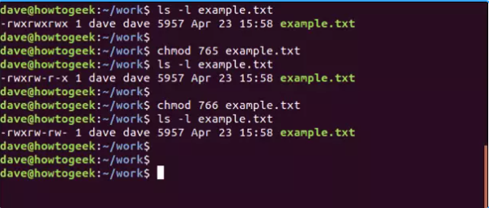
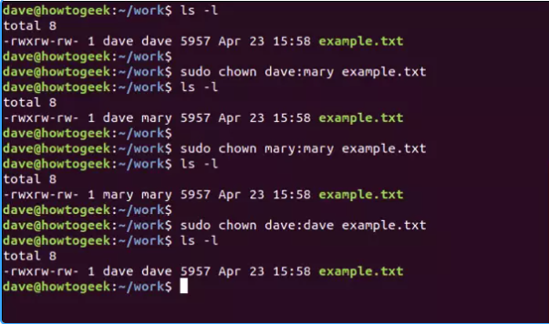
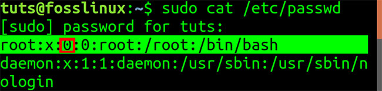
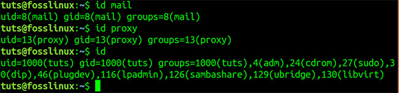
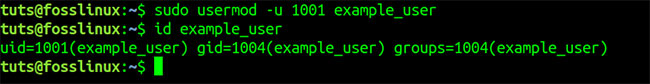

**Trong Linux mỗi một tập tin hay thư mục sẽ được cấp các quyền đọc, ghi, thực thi cho từng user khác nhau. Điều này giúp tăng cường bảo mật và tạo nên sức mạnh cho các hệ thống linux.**


## Các khái niệm

1. Ownership
2. Permissons

## Ownership

**Mỗi file hay thư mục trên Linux đều được gán bởi 3 loại chủ sở hữu là user, group, other**

### User

- Theo như mặc định trên Linux thì người tạo ra file hay thư mục nào đó thì sẽ trở thành chủ sở hữu của chính nó, giống như việc một người A tạo ra một vậy B thì mặc định người A sẽ là chủ sở hữu của vật B đó.

### Group

- Một nhóm có thể chứa nhiều người dùng cùng một lúc. Tất cả người dùng trong một nhóm sẽ có cùng quyền truy cập vào file hay thư mục đó. Giả sử có một tài liệu học tập cho một lớp học mà bạn không muốn cho lớp khác biết, chỉ muốn chia sẻ trong lớp. Thay vì bạn cấp quyền cho từng người trong lớp thì bạn có thể gom tất những người trong lớp thành một nhóm người dùng và bạn gán quyền cho một nhóm người dùng đó để chỉ có những người trong nhóm đó mới có quyền truy cập vào tài liệu.

### Other

- Other là bất kỳ người dùng nào không thuộc vào 2 đối tượng phía trên. Xét lại ví dụ trên, bạn không phải là thuộc nhóm lớp được truy cập vào tài liệu và bạn cũng không phải là người sở hữu tài liệu đó thì bạn được xét là other.
Bài toán đặt ra là làm sao để Linux phân biệt giữa ba loại người dùng này để người dùng A không ảnh hưởng đến một số file hay thư mục chứa thông tin hay dữ liệu của một người dùng B. Và đây chính là lúc permissions(quyền) được sử dụng để kiểm soát hình vi của người dùng.

## Permissions

Mỗi một file hay thư mục trong Linux đều có 3 quyền đọc, ghi, thực thi được xác định cho 3 chủ sở hữu ở trên.

- Đọc: Nếu là một file thì quyền này cho phép bạn mở file đó lên và đọc. Nếu là một thư mục thì nó cho phép bạn liệt kê danh sách file hay thư mục trong thư mục đó.

- Ghi: Quyền ghi cho phép bạn sửa đổi nội dung của file. Nếu là thư mục thì nó cho phép bạn có thể thêm, xóa và đổi tên các file trong thư mục đó.

- Thực thi: Với Windows bạn có thể chạy với một file có đuôi ".exe" một cách dễ dàng. Khác so với Windows, trong Linux bạn không thể chạy khi nó không được cấp quyền thực thi. Còn đối với thư mục thì bạn không thể truy cập(cd) nếu bạn không có quyền thực thi nó.

Tổng quát:


Với phần khoanh đỏ là phần permissions. Cấu trúc của phần permissions sẽ được chia ra thành từng phần như sau: đầu tiên là file type, sau đó sẽ đến đến quyền của từng owner trong hệ thống.

Nếu kí tự đầu tiên là:

– : Tệp tin thông thường
d : Thư mục
l : Liên kết
c : Special file
s : Socket
p : Named pipe
b : Thiết bị

Phần còn lại của chuỗi là ba tập hợp của ba kí tự. Tính từ bên trái, tập hợp đầu tiên biểu diễn quyền truy cập của owner, tập hợp thứ hai là quyền truy cập của group, và cuối cùng là others. Trong mỗi tập hợp, kí tự r có nghĩa là read (đọc), w là write (viết), và x là execute (thực thi).

Nếu kí tự r, w hoặc x có mặt, quyền truy cập file sẽ được cấp. Còn nếu đó là kí tự `-`, thì quyền truy cập sẽ không được cấp.

Có một cách để sử dụng chmod là dùng để cấp quyền truy cập theo ý muốn đến owner, group hoặc others, dưới dạng các số có ba chữ số. Số ngoài cùng bên trái biểu diễn owner. Tiếp đến lần lượt là group và others. Dưới đây là các chữ số có thể được sử dụng:

0: Không được cấp quyền
1: Quyền thực thi (x)
2: Quyền viết (w)
3: Viết và thực thi
4: Chỉ đọc (r)
5: Đọc, thực thi
6: Đọc, viết
7: Đọc, thực thi và viết

Ví dụ chi tiết: sử dụng lệnh `ls -la` để nhận được kết quả tương tự hình sau


## Phân quyền: chmod

Lệnh chmod sẽ đặt các flag file permission (quyền truy cập file) lên một file hoặc folder. Flag đó sẽ định nghĩa những người có thể đọc, viết hoặc thực thi file. Khi liệt kê file với option -l (long format), ta sẽ thấy một chuỗi các kí tự có dạng như sau:

`-rwx rwx rwx`

Hãy xét ví dụ với file example.txt, với cả ba tập hợp kí tự đều là rwx. Do đó, ai cũng có quyền đọc, viết và thực thi file.

Để đặt quyền truy cập thành đọc, viết và thực thi dưới dạng số (7) cho owner; đọc và viết (6) cho group; đọc, thực thi (5) cho others, hãy dùng số 765 với lệnh chmod:

```sh
chmod -R 765 example.txt
```



Hoặc đặt quyền đọc, ghi, thực thi cho owner; đọc và ghi cho group và others, dùng lệnh chmod với 766:

```sh
chmod 766 example.txt
```

Ví dụ cho việc phần quyền bằng số:

Permissions -number về cơ bản sẽ có 3 chữ số một số với ý nghĩa số thứ nhất là quyền của user, số thứ 2 là quyền của group, số thứ 3 là quyền của other. Ý nghĩa của từng chữ số ở đây:
| Số | Ký hiệu | Ý nghĩa                |
|:---:|:--------:|------------------------|
| 0   | ---     | Không có quyền          |
| 1   | --x     | Thực thi                |
| 2   | -w-     | Ghi                    |
| 3   | -wx     | Thực thi + Ghi         |
| 4   | r--     | Đọc                    |
| 5   | r-x     | Đọc + Thực thi         |
| 6   | rw-     | Đọc + Ghi             |
| 7   | rwx     | Đọc + Ghi + Thực thi  |

- Giả sử bạn cần phân quyền cho một file có tên là **file1** quyền rwxrw-r--. Nó có nghĩa là user có tất cả quyền đọc, ghi, thực thi. Group có quyền đọc và ghi và other thì chỉ có quyền đọc. Để làm điều này ta cần tính quyền cho từng chủ sở hữu.

> user: r + w +x = 4 + 2 + 1 = 7
> group: r + w = 4 + 2 = 6
> other: r = 4 = 4

Vậy quyền của cả file sẽ là 764, sau đó sử dụng lệnh sau để phân quyền:

```sh
chmod 764 file1
```

Ví dụ cho việc phân quyền bằng chữ:

```sh
chmod u=rwx,g=rw,o=r (filename)
```

| Ký hiệu | Ý nghĩa |
|:-------:|:--------:|
| u       | user    |
| g       | group   |
| o       | other   |
| a       | tất cả  |
| + (mặc định) | thêm quyền|
| - | Xoá quyền |
| = | Đặt chính xác |

## chown

Lệnh chown (change owner) cho phép thay đổi owner và group owner của một file. Liệt kê file example.txt bằng `ls -l`, ta sẽ thấy dave dave ở trong phần mô tả của file. Chữ đầu tiên để chỉ tên owner của file, trong trường hợp này chính là dave. Mỗi user đều có một group mặc định được tạo khi ta tạo user. Kí tự thứ hai cũng là dave, tức là owner của group đó. Đồng thời, dave cũng là người dùng duy nhất của group, tức là file này không được chia sẻ với bất kỳ group user nào.

Ta có thể dùng lệnh chown để thay đổi cả owner lẫn group của một file. Ta cần cung cấp tên của owner và group, cách nhau bởi dấu : . Sau đó, sử dụng lệnh sudo để thực hiện. Để đặt dave là owner của file, mary là group owner, hãy sử dụng lệnh sau:

```sh
sudo chown dave:mary example.txt
```




Bây giờ, để đổi owner lẫn group owner thành mary, dùng lệnh như dưới đây:

```sh
sudo chown mary:mary example.txt
```

Ngược lại, để đổi về lại dave:

```sh
sudo chown dave:dave example.txt
```


### UID trong Linux là gì?

UID là tên viết tắt của User Identifier, trong khi GID là tên viết tắt của Group Identifier. Trong bài viết cụ thể này, ta sẽ tập trung vào User Identifier (UID). Vì cách quản lý và vị trí của chúng trong file cấu hình là tương tự nhau.

UID là số nhận dạng duy nhất được gán cho mọi người dùng có trong hệ thống Linux. Vai trò chính của UID là xác định người dùng với Linux kernel.

Nó được sử dụng để quản lý tài nguyên mà người dùng có quyền truy cập trong hệ thống. Đó là một trong những lý do để sử dụng UID duy nhất cho mọi người dùng có sẵn. Mặt khác, nếu có hai người dùng được liệt kê với cùng một UID, thì cả hai đều có thể có quyền truy cập vào tài nguyên dành cho người kia.

### Tìm UID được lưu trữ ở đâu?

Bạn có thể tìm thấy UID trong file `/etc/passwd`, đây cũng là file lưu trữ tất cả người dùng đã đăng ký trong hệ thống. Để xem nội dung file `/etc/passwd`, hãy chạy lệnh cat trên file, như hiển thị bên dưới trên Terminal.


File `/etc/passwd` chứa tất cả các thuộc tính cần thiết hoặc thông tin cơ bản về mọi người dùng trong hệ thống. Dữ liệu được hiển thị trong 7 cột, như được liệt kê dưới đây. Các trường này được phân tách bằng dấu hai chấm (:). File này cũng chứa các tài khoản và nhóm do hệ thống xác định cần thiết để cài đặt, chạy và cập nhật hệ thống thích hợp.

- Cột 1 - Tên
- Cột 2 - Mật khẩu - Nếu người dùng đã đặt mật khẩu trên trường này, thì nó được chỉ định bằng chữ cái (x).
- Cột 3 - UID (User ID)
- Cột 4 - GID (Group ID)
- Cột 5 - Gecos - Chứa thông tin chung về người dùng và có thể để trống.
- Cột 6 - Thư mục Home
- Cột 7 - Shell - Đường dẫn đến shell mặc định cho người dùng.

### Xác định UID

Từ hình ảnh trên, người dùng đầu tiên được liệt kê trên file là root. Root có toàn quyền kiểm soát mọi khía cạnh của hệ thống. Người dùng root được gán UID Zero (O) và GID (0). Theo sau là các tài khoản và nhóm do hệ thống xác định.



Một điều nữa cần lưu ý là UID = 0 và GID = 0 là những gì cung cấp cho người dùng root tất cả các quyền hạn trong hệ thống. Nếu muốn chứng minh điều đó, hãy đổi tên root thành một thứ gì đó khác như example_User và tạo người dùng root mới với UID và GID mới.

Ngoài ra, các tài khoản và nhóm do hệ thống xác định theo người dùng root có UID 1,2,3,4, v.v... Đó là bởi vì hầu hết các hệ thống Linux dành 500 UID đầu tiên cho người dùng hệ thống. Những người dùng khác thêm bằng lệnh useradd được gán UID từ 500 trở đi. Trong các hệ thống Ubuntu và Fedora, một người dùng mới, hay thậm chí một người dùng được tạo trong quá trình cài đặt, được cấp UID từ 1000 trở lên.

Bạn có thể thấy điều này trong hình ảnh bên dưới, nơi có 2 người dùng Fosslinux_admin và Tuts.


Người dùng tuts đã được tạo trong quá trình cài đặt và gán UID 1000. Người dùng còn lại, fosslinux, đã được thêm vào sau đó và cấp UID 1001.

### Cách tìm UID của người dùng, nhóm hoặc tài khoản

Bài viết đã thảo luận về cách có thể tìm thấy một UID thông qua việc hiển thị nội dung của file /etc/passwd. Có một cách nhanh chóng và dễ dàng hơn bằng cách sử dụng lệnh id.

Ví dụ, để tìm UID của người dùng Fosslinux_admin và Tuts, hãy thực thi lệnh bên dưới. Bạn có thể được yêu cầu nhập mật khẩu root.

```sh
id fosslinux_admin
id tuts
```

Bạn cũng có thể chạy lệnh id trên các nhóm khác. Bằng cách thực thi một mình lệnh id trong Terminal, nó sẽ hiển thị UID của người dùng đã đăng nhập hiện tại.



### Cách thay đổi UID

Giả sử bạn đang quản lý một hệ thống có nhiều người dùng. Nếu một người dùng rời khỏi công ty, có lẽ bạn sẽ cần gán cho người dùng mới UID của nhân viên đã nghỉ việc.

Trước tiên, hãy tạo một người dùng tạm thời cho ví dụ này. Bài viết sẽ sử dụng lệnh useradd. Bạn sẽ cần phải có quyền root.

```sh
useradd example_user
```

Bằng cách chạy lệnh id trên user example_user, bạn có thể thấy rằng người dùng mới này có UID 1003.


Bây giờ, hãy xóa người dùng Fosslinux_admin có UID = 1001 và gán nó cho người dùng mới. Bài viết sẽ sử dụng lệnh userdel để loại bỏ người dùng.

```sh
usermod -u 1001 exmple_user
```

Bằng cách chạy lệnh id trên người dùng, ví dụ, _user, ta thấy rằng người dùng hiện có UID = 1001.



Bây giờ, khi gán UID của người dùng cũ cho người dùng mới, bạn sẽ cần đồng bộ những file này với tất cả các file khác thuộc về người dùng cũ. Bạn có thể làm điều này bằng cách thực thi lệnh dưới đây.

```sh
find / -user [UID_of_old_user] -exec chown -h [new_user] {} \;
e.g
sudo find / -user 1001 -exec chown -h user_2 {} \;
```

### Tạo người dùng mới với UID cụ thể

Ngoài ra, bạn có thể tạo người dùng mới bằng lệnh useradd và gán cho người dùng một UID cụ thể. Xem cú pháp dưới đây.

```sh
sudo useradd -u 1111 user_2
```


Bằng cách chạy lệnh id trên user_2, ta thấy rằng UID của người dùng = 1111.


Tham khảo tại:

<https://quantrimang.com/cong-nghe/uid-trong-linux-172393>

## Các quyền đặc biệt Setuid/Setgid

`setuid` (thiết đặt ID của người dùng thực thi) và `setgid` (thiết đặt ID của nhóm thực thi) là một quyền đặc biệt cho user access level có một chắc năng duy nhất. Một file với SUID luôn được thực thi với user sở hữu files đó, không quan tâm tới user nào đang thực thi câu lệnh. Nếu chủ sở hữu file không có quyền execute, bạn có thể dùng một chữ S in hoa ở đây
Để thấy rõ hơn vấn đề này, hãy nhìn vào câu lệnh /usr/bin/passwd. Câu lệnh này, mặc định có quyền SUID được gán

```sh
[cloudzone@server ~]$ ls -l /usr/bin/passwd
-rwsr-xr-x. 1 root root 33544 Dec 13 2019 /usr/bin/passwd
```

`setgid` cũng tương tự, nhưng là dành cho 1 thư mục, tất cả cách file trong thư mục đều có thể được chạy bởi bất kỳ người nào.


`setuid` và `setgid` là cần thiết cho các tác vụ yêu cầu đặc quyền cao hơn so với các người dùng thông thường hiện có, chẳng hạn như thay đổi mật khẩu đăng nhập của họ. Tuy nhiên, một số tác vụ yêu cầu đặc quyền nâng cao có thể không rõ ràng - chẳng hạn như lệnh ping, lệnh này phải gửi và lắng nghe các gói điều khiển trên một giao diện mạng.

Các cờ `setuid` và `setgid` có ý nghĩa hoàn toàn khác nhau tùy thuộc vào việc chúng được đặt trên một tệp hay một thư mục.

Các quyền `setuid`/`setguid` được sử dụng để thông báo cho hệ thống chạy một tệp thực thi với tư cách là chủ sở hữu với quyền của chủ sở hữu.

Khi các cờ thuộc tính `setuid` hoặc `setgid` được thiết đặt trên một file thực thi, thì bất kỳ người dùng nào cũng có thể thực thi tập tin với các đặc quyền của chủ sở hữu (thường là root) hoặc nhóm của tập tin đó, tùy thuộc vào các cờ được đặt. Điều này cho phép nhà thiết kế hệ thống cho phép các chương trình đáng tin cậy được thực thi các tệp tin mà người dùng thông thường sẽ không được phép thực thi. Điều này không phải lúc nào cũng rõ ràng. Ví dụ, lệnh ping có thể cần quyền truy cập vào các đặc quyền mạng mà người dùng bình thường không thể truy cập; do đó nó có thể được gán cờ setuid để đảm bảo rằng người dùng cần ping một hệ thống khác có thể làm như vậy, ngay cả khi tài khoản của họ không có đặc quyền cần thiết để gửi gói.

### Thiết đặt setuid và setgid

Các bit `setuid` và `setgid` thường được thiết lập với lệnh chmod bằng cách thiết lập chữ số bát phân bậc cao (4 cho setuid hoặc 2 cho setgid). Chẳng hạn lệnh "chmod 6711 file" sẽ:

- thiết đặt cả bit `setuid` và `setgid` (4 + 2 = 6),
- đặt quyền đọc/ghi/thực thi cho chủ sở hữu - tương ứng với số 7 (4+2+1=7)
- và quyền thực thi cho nhóm - tương ứng với số 1 thứ nhất (0+0+1=1)
- và các người dùng khác - tương ứng với số 1 thứ hai (0+0+1=1).

Khi người dùng không phải là chủ sở hữu muốn thực thi tệp, tiến trình sẽ chạy với quyền của người dùng và nhóm sở hữu tệp đó. Ví dụ, nếu tập tin được sở hữu bởi người sử dụng root trong nhóm wheel, nó sẽ chạy như dưới quyền root:wheel bất kể là ai thực thi nó.

Lệnh chmod cũng hỗ trợ các đối số kiểu ký tự (biểu tượng) dễ dàng sử dụng hơn để thiết lập các bit `setuid` và `setgid` này.

Chúng ta có thể gán bit `setuid`/`setgid` bằng cách xác định rõ ràng các quyền. Ký tự cho bit `setuid`/`setguid` là `s`.

Chẳng hạn có thể sử dụng  "chmod ug + s" thay cho việc thiết đặt bằng dạng chữ số như phía trên.

Hay ví dụ khác, ta thiết lập bit `setuid`/`setguid` trên file2.sh bằng cách thực hiện lệnh:

```sh
chmod g + s file2.sh
```

Mặc dù tính năng setuid rất hữu ích trong nhiều trường hợp, tuy nhiên việc sử dụng không đúng cách có thể gây ra các nguy cơ bảo mật nếu thuộc tính setuid được gán cho các chương trình thực thi không được thiết kế cẩn thận. Do các vấn đề bảo mật tiềm ẩn, nhiều hệ điều hành bỏ qua thuộc tính `setuid` khi áp dụng cho các tập lệnh thực thi shell.

Sự hiện diện của các tập thực thi `setuid` giải thích tại sao lời gọi hệ thống chroot không sử dụng được cho những người dùng không phải root trên Unix.

Hãy cẩn thận với việc sử dụng bit setuid/setgid trong các quyền. Nếu gán quyền không chính xác cho một tệp thuộc sở hữu của root bằng bộ bit setuid/setgid, thì hệ thống có thể bị phơi ra một loạt điểm yếu có thể cho phép kẻ tấn công xâm nhập dễ dàng.

### other + t (sticky)

Quyền hạn đặc biệt cuối cùng có thể hơi rối một chút. Quyền hạn này không ảnh hưởng tới các files riêng lẻ. Nhưng ở cấp độ thư mục, nó ngăn chặn việc xoá files. Chỉ có người sở hữu (và root) của file này có thể xoá file/và thư mục. Một ví dụ ở thư mục /tmp

```sh
[tcarrigan@server article_submissions]$ ls -ld /tmp/
drwxrwxrwt. 15 root root 4096 Sep 22 15:28 /tmp/
```

Tham khảo tại:

<https://cloudzone.vn/phan-quyen-tren-linux-suid-va-sgid/>

## Umask

- Trong hệ điều hành Linux, `umask` (viết tắt từ "user file creation mask") là một cơ chế kiểm soát quyền truy cập.
- Umask quản lý các quyền truy cập mặc định của các tệp tin và thư mục mới được tạo ra. Bằng cách thay đổi umask, bạn có thể kiểm soát quyền truy cập của các tệp tin và thư mục mà hệ thống tạo ra.
- Theo mặc định, trên các hệ thống Linux, quyền tạo mặc định 666 dành cho tệp, quyền này cấp quyền đọc và ghi cho người dùng, nhóm và những người khác và 777 cho các thư mục, có nghĩa là quyền đọc, ghi và thực thi đối với người dùng, nhóm và những người khác. Linux không cho phép tạo tệp với quyền thực thi.
  
**Cú pháp**:

```sh
umask [mode]
```

*Trong đó, `mode` là một chuỗi 3 chữ số (hoặc 4 chữ số nếu sử dụng biểu diễn octal).*


- Trong Linux, khi một file hay một thư mục được tạo ra thì các quyền hạn truy cập đối với chúng là (read, write, execute) cho các chủ thể (owner, group, other) sẽ được xác định dựa trên hai giá trị là quyền truy nhập cơ sở (base permission) và mặt nạ (mask).

- Base Permission là giá trị được thiết lập sẵn từ trước, và ta không thể thay đổi được
  
  - đối với file thông thường giá trị base perm là 666 (rw-rw-rw-)

  - đối với thư mục (file đặc biệt) giá trị base perm là 777 (rwxrwxrwx)

- Giá trị Mask sẽ “che đi” một số bit trong Base Permission để tạo ra quyền truy cập chính thức cho file. Quyền cho file hay thư mục ban đầu sẽ được tính bằng công thức:

```sh
permit = base permit - umask
```

### Giá trị mask được thiết lập như thế nào

- Trên hầu hết các bản phân phối Linux, giá trị umask toàn hệ thống mặc định được đặt trong tệp `pam_umask.so` hoặc `/etc/profile`

- Ban đầu, nếu bạn chưa thay đổi giá trị cho umask thì:

- Giá trị mask mặc định cho user thông thường là 0002
=> Với mask này thì quyền hạn truy cập mặc định cho thư mục là 775 và file là 664

- Giá trị mask mặc định cho user root là 0022
=> Với mask này thì quyền hạn truy cập mặc định cho thư mục là 755 và file là 644

- Cơ chế làm việc của umask khiến chúng ta không thể tạo ra các file với quyền execute mặc định. Vì Base permission của file luôn là 666, tức các bit ứng với quyền execute đều bằng 0, nên bất kể giá trị mask bằng bao nhiêu thì quyền truy nhập chính thức của file đều không có execute.

Tham khảo tại:

<https://kipalog.com/posts/SUID-trong-linux>

<https://medium.com/@15520767/m%E1%BB%99t-ch%C3%BAt-v%E1%BB%81-setuid-2bfc5afb90ac>

<https://kipalog.com/tags/Linux>

<https://hocdevops.com/commands/lenh-umask-trong-linux/#:~:text=L%E1%BB%87nh%20Umask%20trong%20Linux%201%20Quy%E1%BB%81n%20c%E1%BB%A7a%20Linux,tr%E1%BB%8B%20umask%20...%204%20Ph%E1%BA%A7n%20k%E1%BA%BFt%20lu%E1%BA%ADn%20>

