## Tiến trình

Tiến trình (processes) được hiểu đơn giản là một chương trình đang chạy trong trong hệ điều hành. Một tiến trình có thể phân thành một hay nhiều tiến trình con khác.

## Phân loại tiến trình

### Init process

Init process là tiến trình đầu tiên được khởi động sau khi bạn lựa chọn hệ điều hành trong boot loader. Trong cây tiến trình, init process là tiến trình cha của các tiến trình khác. Init process có đặc điểm sau:
• PID = 1
• Không thể kill init process

### Parents process – Child process

- Trong hệ điều hành linux các tiến trình được phân thành parents process và child process. Một tiến trình khi thực hiện lệnh fork() để tạo ra một tiến trình mới thì đưọc gọi là parents process. Tiến trình mới tạo được gọi là child process.

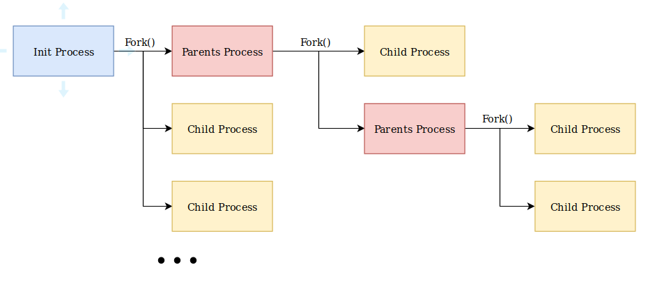

### Các trạng thái của tiến trình

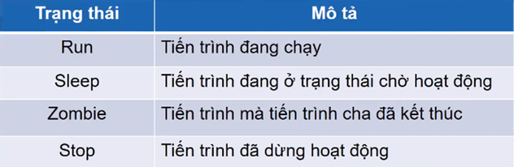

**Note**: Một parents process có thể có nhiều child process nhưng một child process chỉ có một parents process. Khi quan sát thông tin của một tiến trình, ngoài PID (Processes ID) ta cần để ý tới PPID (Parent Processes ID). Nó sẽ cho ta thông tin về parents process của tiến trình đó:

```sh
ps -ef | less
```

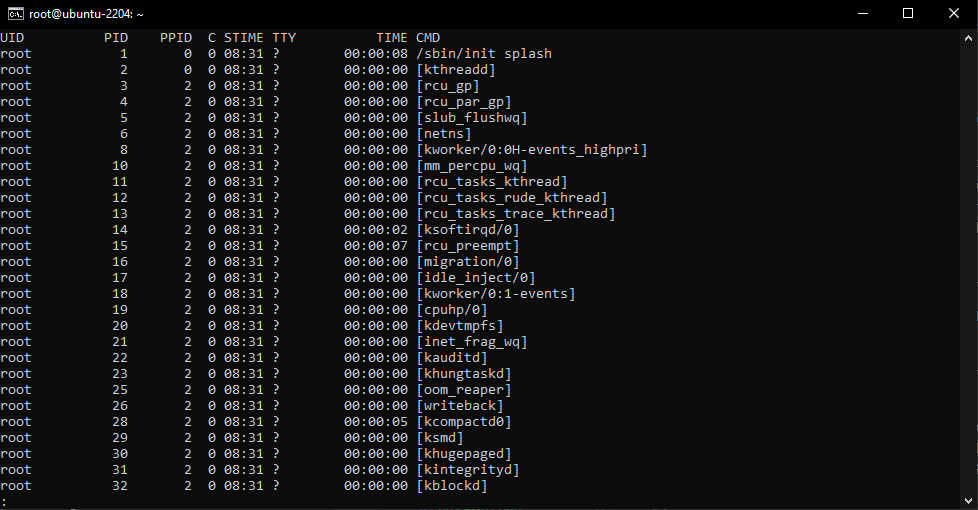

## ps: là từ viết tắt của Process Status hay là Process trong Linux

Trong đó:

- PID – là id của tiến trình
- TTY – là loại terminal của người dùng
- TIME – thời gian CPU chạy theo giờ và phút
- CMD – tên lệnh khởi chạy tiến trình.

**Lưu ý**: Khi chạy lệnh ps đôi khi bạn thấy thông tin TIME trả về là 00:00:00, điều đó có nghĩa là ở thời điểm hiện tại bên trong không có thời gian CPU nào được tích lũy, do bash làm tiến trình mẹ cho các tiến trình khác được thực thi và nó không sử dụng bất kỳ thời gian nào của CPU.

- Lệnh ps trong Linux có thể được sử dụng với tùy chọn -u để hiển thị thêm thông tin về các quy trình.

    ```sh
    ps -u
    ```

    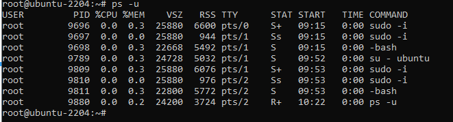

    Bây giờ cùng với PID, TTY, TIME, COMMAND, chúng ta có một số thông tin khác về các quy trình, chẳng hạn như USER,% CPU,% MEM.

  - %CPU đại diện cho sức mạnh tính toán mà quá trình đang sử dụng.
  - %MEM đại diện cho số lượng bộ nhớ mà quá trình đang sử dụng.
  - STAT đại diện cho trạng thái quá trình.
    Định dạng hiển thị này được gọi là kiểu BSD.

- Hiển thị các quy trình do người dùng hiện tại sở hữu

    ```sh
    ps -x
    ```

    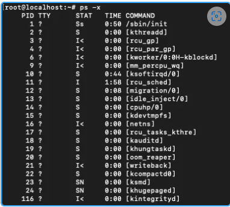

    Đây là những quy trình do người dùng sở hữu (trong trường hợp này là root). Những quy trình này không cần thiết phải chạy. Có một cách để liệt kê các quy trình cho người dùng và nhóm khác, chúng tôi sẽ đề cập cách này ở phần sau của bài viết.


- Sử dụng kết hợp `-ux`

    ps-ux là sự kết hợp hai lệnh bạn có thể đoán. Nó hiển thị thêm thông tin về các quy trình do người dùng sở hữu.

    ```sh
    ps -ux
    ```

    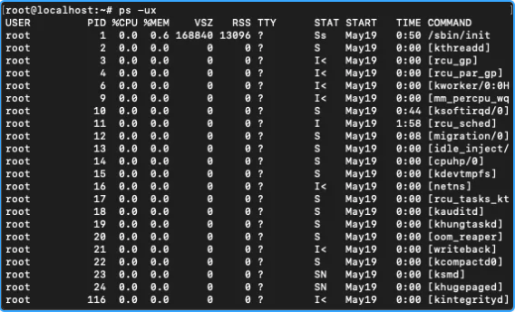

    Trên thực tế, -u flag hầu như luôn được kết hợp với một số flag khác để có thêm các thông tin.

- Liệt kê tất cả cách tiến trình của hệ thống

    ```sh
    ps -a
    ```

    hoặc

    ```sh
    ps -e
    ```

    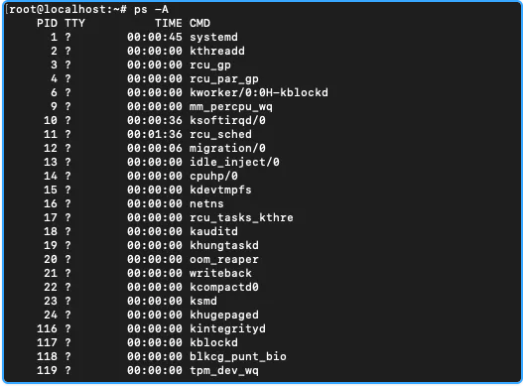

    Để in process tree dùng lệnh sau:

    ```sh
    ps -eH 
    ```

    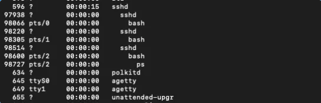

    hoặc

    ```sh
    ps -e --forest
    ```

    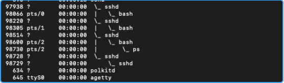

    ps -eH hiển thị các quy trình theo hệ thống phân cấp của chúng. Trong khi ps-e –forest hiển thị quy trình ở định dạng ASCII in chúng ra theo dạng cây.


- Trong Linux, một thread là một phiên bản của chương trình đang được thực thi. Một quy trình có thể có nhiều thread

    Sử dụng lệnh ps trong Linux bạn cũng có thể liệt kê các thread. với tuỳ chọn `-H`

    ```sh
    ps -H
    ```

    Lệnh này sẽ hiển thị các thread như thể chúng là các quy trình.

    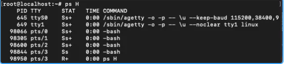

    ```sh
    ps -m
    ```

    Hiển thị các thread sau các quy trình.

    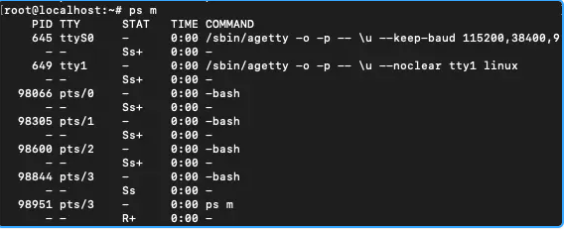

    ```sh
    ps -T
    ```

    Hiển thị các thread với SPID của chúng, là thread id và có thể giống như PID trong trường hợp chỉ có một thread.

- Full format listing và extra full format listing

    ```sh
    ps -f
    ```

    Lệnh này sẽ liệt kê thông tin về các quy trình theo cách liệt kê định dạng đầy đủ. Danh sách các định dạng đầy đủ hiển thị UID, PPID, C và STIME cùng với TIME, CMD và PID.

    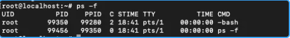

    ```sh
    ps -F
    ```

    Lệnh này liệt kê thông tin về các quy trình theo cách liệt kê định dạng đầy đủ hơn. Chúng ta có thể so sánh kết quả trước đó và xem thông tin bổ sung mà extra full format listing đang cung cấp.

    Như bạn có thể thấy rằng chúng chúng ta hiện đang nhận được PPID và PID.

    - RSS là mức sử dụng bộ nhớ thực.
    - SIZE là mức sử dụng bộ nhớ ảo.
    - TIME là thời gian bắt đầu của quá trình.

    Lệnh này có thể được kết hợp với -e và được sử dụng như lệnh ps -eF để nhận thông tin định dạng đầy đủ về tất cả các quy trình. Rất dễ để bị nhầm lẫn ps -f và ps -F với cùng một lệnh.

- Bạn có thể hiển thị quy trình tương ứng với một PID cụ thể bằng cách sử dụng

    ```sh
    ps -fp [pid]
    ```

    Điều này sẽ hiển thị các quy trình với thông tin và định dạng đầy đủ. Bạn cũng có thể sử dụng ps -Fp [pid] để hiển thị các quy trình có thêm thông tin định dạng đầy đủ.

    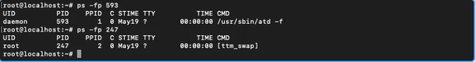

    Bạn có thể nhận được nhiều quy trình bằng cách đề cập đến nhiều PID được phân tách bằng dấu phẩy.

    ```sh
    ps -fp [pid1],[pid2],[pid3]
    ```

- Quá trình xác định dựa trên PID gốc (PPID). Bạn có thể hiển thị các quy trình tương ứng với một PPD cụ thể bằng cách sử dụng:

    ```sh
    ps -f --ppid [ppid]
    ```

    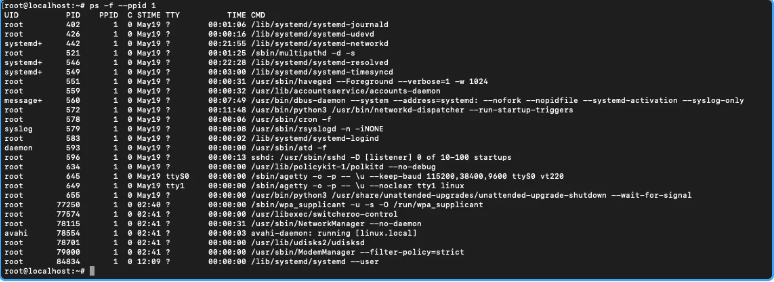

    Điều này hiển thị tất cả các quy trình với ID cha là 1.

- Các quá trình có thể được chọn dựa trên tên lệnh:

    ```sh
    ps -C [cmd name]
    ```

    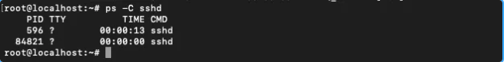

    Để hiển thị tất cả các quy trình cho một người dùng cụ thể:

    ```sh
    ps -U [user_name]
    ```

    cho một nhóm cụ thể

    ```sh
    ps -G [group_name] 
    ```

## top

là đơn giản và phổ biến nhất để hiển thị tất cả những process chiếm nhiều tài nguyên máy tính nhất. Khi thực hiện command:

```sh
top
```

trong terminal, chúng ta sẽ thấy cửa sổ tương tự như sau:

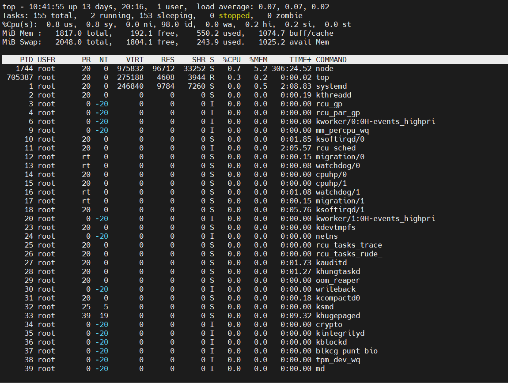

_Thông tin trên được hiển thị khi bạn chạy lệnh top trong Linux:_

- Theo mặc định lệnh top sẽ chiếm toàn hình và luôn chạy cho tới khi nhất `ctrl+c` để tắt. Để top luôn chạy mà vẫn sử dụng được màn hình thì `ctrl+z`, để quay lại màn hình lệnh top thì gõ `fg`

**Dòng 1**

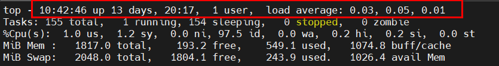

lần lượt từ trái qua phải, cách nhau bởi dấu phẩy

- Thời gian hiện tại của hệ thống Thời gian uptime
- Số lượng người dùng
- Trung bình tải: hiển thị thời gian load hệ thống trong 1 phút, 5 phút và 15 phút cuối.

>Trung bình tải ở đây mỗi hệ thống sẽ mỗi khác. Nếu Server/VPS của bạn có 2 Cpu(s) thì trung bình tải chỉ nên là dưới 2. Nếu con số này cao hơn số CPU của bạn thì hệ thống đang quá tải, số lượng công việc xử lý vượt qua mức CPU có thể xử lý hiện tại.

**Dòng 2**

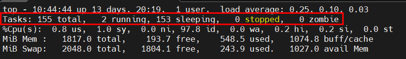

- Tổng số tác vụ có trên máy chủ
- Số lượng tác vụ đang chạy
- Số lượng tác vụ trong trạng thái “ngủ”
- Số lượng tác vụ đã dừng
- Số lượng tác vụ zombie (tiến trình không tồn tại hoặc bị hỏng)

**Dòng 3**

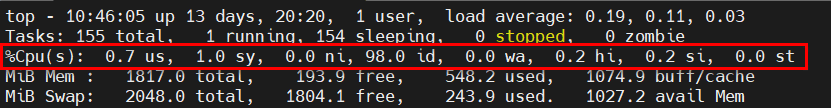

- %us (user cpu time): phần trăm do tiến trình của người dùng (non root) sử dụng
- %sy (system cpu time): phần trăm do tiến trình của hệ thống (root) sử dụng
- %ni (user nice cpu time): phần trăm do các tiến trình có mức độ ưu tiên thấp sử dụng
- %id (idle cpu time): phần trăm CPU đang rảnh
- %wa (io wait cpu time): phần trăm CPU để đợi trong khi các tiến trình I/O đang xử lý
- %hi (hardware irq): phần trăm để xử lý gián đoạn phần cứng
- %si (software irq): phần trăm để xử lý gián đoạn phần mềm
- %st (steal time): phần trăm do máy ảo sử dụng

**Dòng 4**

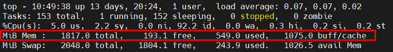

- ổng bộ nhớ hệ thống(đơn vị Kib)
- Bộ nhớ trống
- Bộ nhớ đã sử dụng
- Bộ nhớ đệm buffer cache

**Dòng 5**

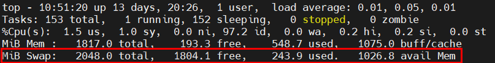

- Tổng swap có sẵn(đơn vị Kib)
- Tổng swap còn trống
- Tổng swap đã sử dụng
- Bộ nhớ khả dụng
- Swap là RAM ảo, được sử dụng khi bộ nhớ vật lý (RAM) bị đầy. Luôn luôn bật Swap để khi hệ thống đầy ram vật lý sẽ không bị treo.

**Bảng chính**

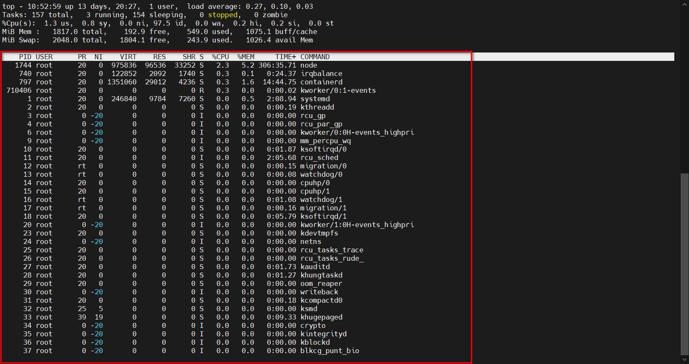

- ID tiến trình
- Người dùng(Mình có ẩn bớt một số user chứ mặc định không có trống)
- Mức độ ưu tiên
- Mức độ nice (gọi một tập lệnh shell với mức độ ưu tiên cụ thể)
- Bộ nhớ ảo được sử dụng bởi tiến trình
- Bộ nhớ “thường trú” mà một tiến trình sử dụng (tức là tiến trình luôn ở trong bộ nhớ và không thể chuyển ra thiết bị lưu trữ khác)
- Bộ nhớ có thể chia sẻ
- CPU được sử dụng bởi tiến trình theo tỷ lệ phần trăm của 1 cpu.
- Bộ nhớ được sử dụng bởi tiến trình theo tỷ lệ phần trăm
- Thời gian tiến trình đã được chạy
- Lệnh

**Một vài tuỳ chọn của top**

- `-h` – Hiển thị phiên bản hiện tại
- `-c` – Tham số này chuyển đổi trạng thái cột lệnh từ hiển thị lệnh sang hiển thị tên chương trình và ngược lại
- `-d` – Chỉ định thời gian trễ khi refresh màn hình
- `-o` – Sắp xếp theo trường được đặt tên
- `-p` – Chỉ hiển thị các tiến trình với ID được chỉ định
- `-u` – Chỉ hiển thị những tiến trình của người dùng được chỉ định
- `-i` – Không hiển thị các idle task

| Phím | Chức năng |
|:----:|----------|
| h hoặc ? | Hiện cửa sổ help với các câu lệnh hữu dụng                  |
| space | Cập nhật bảng process ngay lập tức thay vì phải chờ vài giây |
| f | Thêm trường mới để hiển thị layout hoặc xóa những field nhất định vì vậy bạn sẽ không thấy nó hiển thị |
| q | Thoát ứng dụng top hoặc mở thêm cửa sổ mới của ứng dụng top (ví dụ: sau khi dùng feature f) |
| l | Bật/tắt thông tin trung bình tải và thời gian uptime |
| m | Bật/tắt thông tin bộ nhớ |
| P (Shift + p) | Sắp xếp process bằng CPU usage |
| s | Đổi đột trễ giữa các lần refresh (bạn sẽ được hỏi bao nhiêu giây) |


- Với command top, bạn có thể dùng các tùy chọn sau, ví dụ:
  
| Tùy chọn | Chức năng|
|:----------:|------------|
| -d delay | Xác định độ trễ (thời gian giữa các lần cập nhật)                    |
| -n number | Refresh trang bao nhiêu lần, sau đó thoát                            |
| -p pid   | Chỉ hiển thị và giám sát process với đúng process ID được chọn      |
| -q       | Refresh mà không có delay                                           |


Xem chi tiết hơn về lệnh top thì: `man top` hoặc `top --help`. Có 1 trình cải tiến, thêm giao diện và màu mè hơn top, đó là htop, trình này yêu cầu cài đặt thêm như 1 ứng dụng.

Tham khảo tại:

<https://tenten.vn/help/huong-dan-giai-thich-lenh-top-trong-linux/#:~:text=Gi%E1%BB%AF%20l%E1%BB%87nh%20top%20lu%C3%B4n%20ch%E1%BA%A1y,l%E1%BA%A1i%20foreground%2C%20h%C3%A3y%20nh%E1%BA%ADp%20fg.>

## lệnh Kill

- kill: gửi tín hiệu tới 1 tiến trình theo pid
- kill -9 vs kill -15:

| Tùy chọn | Chức năng |
|:--------:|---|
| -9       | Kết thúc tiến trình ngay lập tức (SIGKILL).                                               |
| -15      | Gửi tín hiệu kết thúc tới tiến trình (SIGTERM). Tiến trình có thể thực hiện các công việc dọn dẹp trước khi kết thúc. |

Cú pháp:

```sh
kill <-9 hoặc -15> <pid>
```

vd: kill -9 9814

Ngay lập tức đóng tiến trình có id là 9814

## lệnh Nice

- Một câu lệnh hữu dụng khác để quản lý process là **NICE**. Cơ bản, nó cho bạn ưu tiên process nào quan trọng trong trường hợp bạn chạy nhiều. Bằng cách này, máy tính sẽ biết process nào quan trong hơn và sẽ chạy chúng trước.
- Process với độ ưu tiên thấp hơn sẽ chỉ chạy khi nó được yêu cầu (nếu CPU power hết mức sử dụng) Command này có thể cho gia trị từ -20 đến 19. Giá trị càng thấp, thì độ ưu tiên càng cao. Mặc định tất cả process là 0. Cấu trúc của lệnh sẽ như sau:

- Xem độ ưu tiên hiện tại của một tiến trình

```sh
ps -al
```

Ta sẽ có output tương tự như sau:

```sh
F S   UID     PID    PPID  C PRI  NI ADDR SZ WCHAN  TTY          TIME CMD
0 S  1000    1459    1452  0  80   0 - 58639 do_pol tty2     00:00:00 gnome-session-b
4 S     0    9696    2753  0  80   0 -  6470 do_pol pts/0    00:00:01 sudo
4 S     0    9698    9697  0  80   0 -  5667 do_wai pts/1    00:00:00 bash
4 S     0    9789    9698  0  80   0 -  6182 do_wai pts/1    00:00:00 su
4 S  1000    9790    9789  0  80   0 -  5652 do_wai pts/1    00:00:00 bash
4 S     0    9809    9790  0  80   0 -  6470 do_pol pts/1    00:00:01 sudo
4 S     0    9811    9810  0  80   0 -  5700 do_wai pts/2    00:00:00 bash
4 R     0    9966    9811  0  80   0 -  6050 -      pts/2    00:00:00 ps
0 S     0    9967    9811  0  80   0 -  5071 pipe_r pts/2    00:00:00 less

```

nice number của tiến trình ở cột `NI`


_Khi không có đối số cho tuỳ chọn `-n` thì mặc định lấy giá trị 10._

- Chạy lệnh gzip với độ ưu tiên cao hơn (-10):

```sh
nice -n -10 gzip file.txt
```

- Chạy lệnh ffmpeg với độ ưu tiên thấp hơn (5):

```sh
nice -n 5 ffmpeg -i input.mp4 output.avi
```

- Thay đổi độ ưu tiên của tiến trình với renice có PID là 5678 thành độ ưu tiên -15:

```sh
renice -n -15 -p 5678
```

Hiện trợ giúp của lệnh:

```sh
nice --help
```

Tham khảo tại:

<https://www.ibm.com/docs/en/aix/7.2?topic=n-nice-command>
