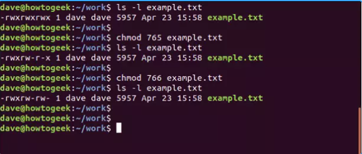
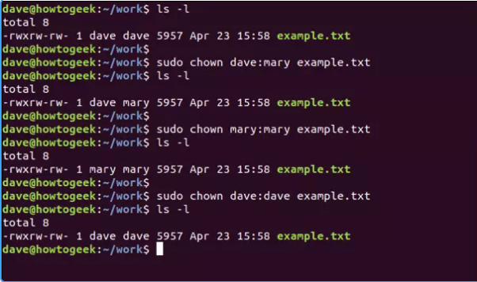
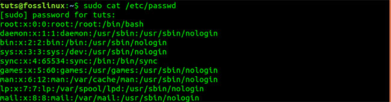
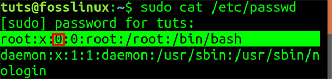
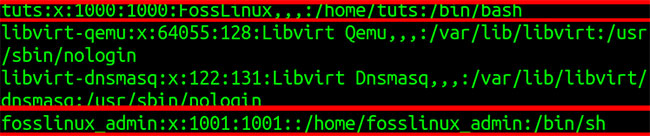
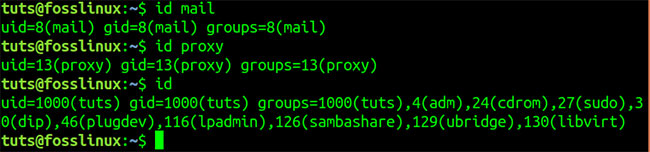
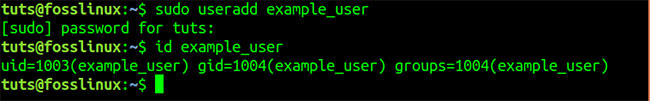
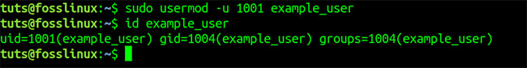
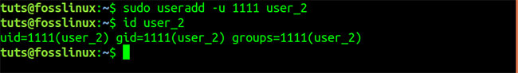

## Nội dung chính

- các kiểu người dùng
- Phân nhóm
- Phân quyền

## Có 3 kiểu tài khoản trên một hệ thống Linux:

1. Tài khoản gốc (Root account): Nó còn được gọi là superuser và sẽ có sự điều khiển tuyệt đối tới hệ thống. Một superuser có thể chạy bất cứ lệnh nào mà không bị hạn chế. Người sử dụng này có thể được ví như người quản lý hệ thống.
2. Các tài khoản hệ thống: Các tài khoản hệ thống được cần cho các hoạt động riêng trong hệ thống như tài khoản mail và các tài khoản sshd. Những tài khoản này thường được cần cho một số chức năng riêng trên hệ thống của bạn, và bất cứ sự chỉnh sửa nào tới chúng có thể ảnh hưởng bất lợi tới hệ thống.
3. Các tài khoản người dùng cá nhân: Các tài khoản này cung cấp sự truy cập mang tính tương tác tới hệ thống với người dùng và nhóm sử dụng và thường bị giới hạn truy cập vào những file và thư mục có tính chất quan trọng.

## Quản lý người và nhóm sử dụng trong Linux

## Có 4 file chính quản lý người sử dụng

1. /etc/passwd: Giữ tài khoản người dùng và thông tin mật khẩu. File này giữ các thông tin quan trọng về các tài khoản trên hệ thống Unix.
2. /etc/shadow: Giữ mật khẩu được biên thành mật mã của tài khoản tương ứng. Không phải tất cả các hệ thống đều hỗ trợ file này.
3. /etc/group: File này giữ thông tin nhóm cho mỗi tài khoản.
4. /etc/gshadow: File này giữ các thông tin tài khoản nhóm bảo mật.

**Note**: *Chúng ta có thể kiểm tra tất cả các file trên với lệnh cat, sửa với lệnh vi.*

| Lệnh     | Miêu tả                                    |
|----------|--------------------------------------------|
| useradd  | Thêm các tài khoản cá nhân tới hệ thống.     |
| usermod  | Chỉnh sửa các thuộc tính của tài khoản cá nhân. |
| userdel  | Xóa các tài khoản cá nhân từ hệ thống.       |
| groupadd | Thêm các tài khoản nhóm tới hệ thống.        |
| groupmod | Chỉnh sửa các thuộc tính của tài khoản nhóm. |
| groupdel | Dỡ bỏ các tài khoản nhóm khỏi hệ thống.      |

## Tạo một nhóm trong Linux

- Chung ta sẽ cần tạo các nhóm trước khi tạo bất kỳ một tài khoản nào, nếu không thì phải sử dụng các nhóm đang tồn tại trên hệ thống. Bạn sẽ có tất cả các nhóm được liệt kê trong tệp /etc/groups.

- Tất cả các nhóm mặc định sẽ là các nhóm tài khoản cụ thể trên hệ thống và nó không được đề nghị để sử dụng chúng cho các tài khoản thông thường. Vì thế, dưới đây là cú pháp để tạo một nhóm tài khoản mới.

```sh
groupadd [-g gid [-o]] [-r] [-f] groupname
```

Bảng dưới liệt kê chi tiết các tham số:
| Tùy chọn   | Miêu tả                                                   |
|------------|-----------------------------------------------------------|
| -g GID     | Giá trị số của ID nhóm.                                    |
| -o         | Tùy chọn này cho phép để thêm nhóm với GID không duy nhất.  |
| -r         | Dấu hiệu này chỉ thị sự thêm nhóm tới tài khoản hệ thống.  |
| -f         | Tùy chọn này khiến cho nó chỉ thoát ra với trạng thái thành công nếu nhóm đã xác định đã tồn tại. Với –g, nếu GID đã tồn tại, thì GID khác (duy nhất) được chọn. |
| groupname  | Tên nhóm thực sự được tạo.                                 |

- Nếu không xác định bất cứ tham số nào thì hệ thống sẽ sử dụng các giá trị mặc định. Ví dụ sau sẽ tạo một nhóm developers với các giá trị mặc định, mà được chấp thuận bởi hầu hết các nhà quản lý.

```sh
groupadd developers
```

## Chỉnh sửa một nhóm trong Linux

- Để chỉnh sửa một nhóm, sử dụng cú pháp lệnh groupmod

```sh
groupmod -n new_modified_group_name old_group_name
```

- Để thay đổi tên nhóm developers_2 thành deverloper, bạn gõ như sau:

```sh
groupmod -n developer developer_2
```

- Dưới đây là cách thay đổi GID thành 545:

```sh
groupmod -g 545 developer
```

## Xóa một nhóm trong Linux

- Để xóa một nhóm đang tồn tại, tất cả thứ bạn cần làm là lệnh groupdel và tên nhóm đó. Để xóa nhóm developer, lệnh là:

```sh
groupdel developer
```

**Note**:Lệnh này chỉ gỡ bỏ nhóm, không phải bất kỳ file nào liên quan tới nhóm. Các file là vẫn có thể truy cập được bởi người sở hữu của nó.

## Tạo một tài khoản cá nhân trong Linux

- Dưới đây là cú pháp để tạo một tài khoản cá nhân:

```sh
useradd -d homedir -g groupname -m -s shell -u userid accountname
```

Bảng dưới liệt kê chi tiết các tham số:
| Tùy chọn       | Miêu tả                                                                  |
|----------------|--------------------------------------------------------------------------|
| -d homedir     | Xác định thư mục chính cho tài khoản.                                     |
| -g groupname   | Xác định một tài khoản nhóm cho tài khoản cá nhân này.                     |
| -m             | Tạo thư mục chính nếu nó không tồn tại.                                   |
| -s shell       | Xác định shell mặc định cho tài khoản cá nhân này.                         |
| -u userid      | Bạn có thể xác định ID cá nhân cho tài khoản này.                          |
| accountname    | Tên tài khoản cá nhân thực sự được tạo ra.                                 |

- Nếu bạn không xác định bất kỳ tham số nào thì hệ thống sẽ sử dụng các giá trị mặc định. Lệnh useradd chỉnh sửa các tệp /etc/passwd, /etc/shadow, /etc/group và tạo một thư mục chính.

*Ví dụ*:  

```sh
useradd -d /home/mcmohd -g developers  mcmohd
```

**Note**: *Trước khi thông báo lệnh trên, bảo đảm rằng đã có nhóm developers được tạo bằng lệnh groupadd.*

- Khi một tài khoản cá nhân được tạo, bạn có thể thiết lập mật khẩu cho nó bằng cách sử dụng lệnh passwd như sau

```sh
Changing password for user mcmohd20.
New LINUX password:
Retype new LINUX password:
passwd: all authentication tokens updated successfully.
```

**Note**: *Khi bạn gõ passwd accountname, nó cung cấp cho bạn tùy chọn để thay đổi mật khẩu được cung cấp nếu bạn là superuser, nếu không thì bạn chỉ có thể thay đổi mật khẩu sử dụng lệnh tương tự nhưng không xác định tên tài khoản của bạn.*

## Chỉnh sửa một tài khoản

- Lệnh usermod cho bạn khả năng để tạo các thay đổi tới một tài khoản cá nhân đang tồn tại từ dòng lệnh. Nó sử dụng các đối số như lệnh useradd, cộng với đối số -l, cho phép thay đổi tên tài khoản.
- Điều kiện tiên quyết là bạn có quyền truy cập vào tài khoản người dùng với quyền sudo (và tên người dùng phải được thay đổi).

Giả sử bạn cần đổi tên tài khoản testaccount (đã có trên hệ thống) thành hung.

```sh
sudo usermod -l hung testaccount
```

- Tại thời điểm này, tên người dùng đã thay đổi. Tuy nhiên, thư mục chính được liên kết với tên người dùng vẫn là testaccount. Để thay đổi điều đó, hãy nhập lệnh:

```sh
sudo usermod -d /home/hung -m hung
```

- Cuối cùng, tên nhóm của tài khoản người dùng phải được thay đổi từ testaccount thành hung. Để làm điều này, hãy nhập lệnh:

```sh
sudo groupmod -n hung testaccount
```

## Xóa một tài khoản trong Unix/Linux

- Lệnh userdel có thể được sử dụng để xóa một tài khoản cá nhân đang tồn tại. Lệnh này là rất nguy hiểm nếu không được sử dụng với sự cẩn trọng.
- Chỉ có một đối số hoặc một tùy chọn có sẵn cho lệnh: .r, để gỡ bỏ thư mục chính và mail của tài khoản.

- Ví dụ, để gỡ bỏ tài khoản hung, bạn cần thông báo lệnh sau:

```sh
userdel -r hung
```

- Nếu bạn muốn giữ thư mục chính cho các mục sau, bạn không sử dụng tùy chọn -r.
- Ngoài ra, có thể dùng lệnh deluser để xóa một tài khoản trong Linux.

Sự khác biệt giữa userdel và deluser là:

- userdel: Lệnh userdel được sử dụng để xóa tài khoản người dùng từ hệ thống. Khi sử dụng lệnh này, bạn cần chỉ định tên tài khoản người dùng cần xóa. Lệnh userdel sẽ xóa tài khoản người dùng khỏi hệ thống và xóa các thông tin người dùng từ các tệp tin hệ thống như /etc/passwd, /etc/shadow và /etc/group. Tuy nhiên, lệnh này không tự động xóa thư mục chính (home directory) của người dùng.

- deluser: Lệnh deluser cũng được sử dụng để xóa tài khoản người dùng từ hệ thống. Tuy nhiên, deluser được thiết kế để có một số tùy chọn bổ sung và thực hiện một số công việc liên quan đến việc xóa tài khoản người dùng. Ví dụ, có thể sử dụng deluser để tự động xóa thư mục chính của người dùng (-remove-home), xóa tất cả các tệp tin và thư mục con trong thư mục chính (-remove-all-files), hoặc xóa người dùng khỏi các nhóm mà người dùng đang tham gia (-remove-groups). deluser cũng có khả năng xóa người dùng từ các tệp tin hệ thống tương tự như userdel.

## Phân quyền: chmod

Lệnh chmod sẽ đặt các flag file permission (quyền truy cập file) lên một file hoặc folder. Flag đó sẽ định nghĩa những người có thể đọc, viết hoặc thực thi file. Khi liệt kê file với option -l (long format), ta sẽ thấy một chuỗi các kí tự có dạng như sau:

-rwx rwx rwx

Nếu kí tự đầu tiên là:

– : Tệp tin thông thường
d : Thư mục
l : Liên kết
c : Special file
s : Socket
p : Named pipe
b : Thiết bị

Phần còn lại của chuỗi là ba tập hợp của ba kí tự. Tính từ bên trái, tập hợp đầu tiên biểu diễn quyền truy cập của owner, tập hợp thứ hai là quyền truy cập của group, và cuối cùng là others. Trong mỗi tập hợp, kí tự r có nghĩa là read (đọc), w là write (viết), và x là execute (thực thi).

Nếu kí tự r, w hoặc x có mặt, quyền truy cập file sẽ được cấp. Còn nếu đó là kí tự `-`, thì quyền truy cập sẽ không được cấp.

Có một cách để sử dụng chmod là dùng để cấp quyền truy cập theo ý muốn đến owner, group hoặc others, dưới dạng các số có ba chữ số. Số ngoài cùng bên trái biểu diễn owner. Tiếp đến lần lượt là group và others. Dưới đây là các chữ số có thể được sử dụng:

0: Không được cấp quyền
1: Quyền thực thi (x)
2: Quyền viết (w)
3: Viết và thực thi
4: Chỉ đọc (r)
5: Đọc, thực thi
6: Đọc, viết
7: Đọc, thực thi và viết
Hãy xét ví dụ với file example.txt, với cả ba tập hợp kí tự đều là rwx. Do đó, ai cũng có quyền đọc, viết và thực thi file.

Để đặt quyền truy cập thành đọc, viết và thực thi dưới dạng số (7) cho owner; đọc và viết (6) cho group; đọc, thực thi (5) cho others, hãy dùng số 765 với lệnh chmod:

```sh
chmod -R 765 example.txt
```



Hoặc đặt quyền đọc, ghi, thực thi cho owner; đọc và ghi cho group và others, dùng lệnh chmod với 766:

```sh
chmod 766 example.txt
```

## chown

Lệnh chown (change owner) cho phép thay đổi owner và group owner của một file. Liệt kê file example.txt bằng ls -l, ta sẽ thấy dave dave ở trong phần mô tả của file. Chữ đầu tiên để chỉ tên owner của file, trong trường hợp này chính là dave. Mỗi user đều có một group mặc định được tạo khi ta tạo user. Kí tự thứ hai cũng là dave, tức là owner của group đó. Đồng thời, dave cũng là người dùng duy nhất của group, tức là file này không được chia sẻ với bất kỳ group user nào.

Ta có thể dùng lệnh chown để thay đổi cả owner lẫn group của một file. Ta cần cung cấp tên của owner và group, cách nhau bởi dấu : . Sau đó, sử dụng lệnh sudo để thực hiện. Để đặt dave là owner của file, mary là group owner, hãy sử dụng lệnh sau:

```sh
sudo chown dave:mary example.txt
```




Bây giờ, để đổi owner lẫn group owner thành mary, dùng lệnh như dưới đây:

```sh
sudo chown mary:mary example.txt
```

Ngược lại, để đổi về lại dave:

```sh
sudo chown dave:dave example.txt
```

## setuid - getuid

### UID trong Linux là gì?

UID là tên viết tắt của User Identifier, trong khi GID là tên viết tắt của Group Identifier. Trong bài viết cụ thể này, ta sẽ tập trung vào User Identifier (UID). Vì cách quản lý và vị trí của chúng trong file cấu hình là tương tự nhau.

UID là số nhận dạng duy nhất được gán cho mọi người dùng có trong hệ thống Linux. Vai trò chính của UID là xác định người dùng với Linux kernel.

Nó được sử dụng để quản lý tài nguyên mà người dùng có quyền truy cập trong hệ thống. Đó là một trong những lý do để sử dụng UID duy nhất cho mọi người dùng có sẵn. Mặt khác, nếu có hai người dùng được liệt kê với cùng một UID, thì cả hai đều có thể có quyền truy cập vào tài nguyên dành cho người kia.

### Tìm UID được lưu trữ ở đâu?

Bạn có thể tìm thấy UID trong file `/etc/passwd`, đây cũng là file lưu trữ tất cả người dùng đã đăng ký trong hệ thống. Để xem nội dung file `/etc/passwd`, hãy chạy lệnh cat trên file, như hiển thị bên dưới trên Terminal.



File `/etc/passwd` chứa tất cả các thuộc tính cần thiết hoặc thông tin cơ bản về mọi người dùng trong hệ thống. Dữ liệu được hiển thị trong 7 cột, như được liệt kê dưới đây. Các trường này được phân tách bằng dấu hai chấm (:). File này cũng chứa các tài khoản và nhóm do hệ thống xác định cần thiết để cài đặt, chạy và cập nhật hệ thống thích hợp.

- Cột 1 - Tên
- Cột 2 - Mật khẩu - Nếu người dùng đã đặt mật khẩu trên trường này, thì nó được chỉ định bằng chữ cái (x).
- Cột 3 - UID (User ID)
- Cột 4 - GID (Group ID)
- Cột 5 - Gecos - Chứa thông tin chung về người dùng và có thể để trống.
- Cột 6 - Thư mục Home
- Cột 7 - Shell - Đường dẫn đến shell mặc định cho người dùng.

### Xác định UID

Từ hình ảnh trên, người dùng đầu tiên được liệt kê trên file là root. Root có toàn quyền kiểm soát mọi khía cạnh của hệ thống. Người dùng root được gán UID Zero (O) và GID (0). Theo sau là các tài khoản và nhóm do hệ thống xác định.



Một điều nữa cần lưu ý là UID = 0 và GID = 0 là những gì cung cấp cho người dùng root tất cả các quyền hạn trong hệ thống. Nếu muốn chứng minh điều đó, hãy đổi tên root thành một thứ gì đó khác như example_User và tạo người dùng root mới với UID và GID mới.

Ngoài ra, các tài khoản và nhóm do hệ thống xác định theo người dùng root có UID 1,2,3,4, v.v... Đó là bởi vì hầu hết các hệ thống Linux dành 500 UID đầu tiên cho người dùng hệ thống. Những người dùng khác thêm bằng lệnh useradd được gán UID từ 500 trở đi. Trong các hệ thống Ubuntu và Fedora, một người dùng mới, hay thậm chí một người dùng được tạo trong quá trình cài đặt, được cấp UID từ 1000 trở lên.

Bạn có thể thấy điều này trong hình ảnh bên dưới, nơi có 2 người dùng Fosslinux_admin và Tuts.



Người dùng tuts đã được tạo trong quá trình cài đặt và gán UID 1000. Người dùng còn lại, fosslinux, đã được thêm vào sau đó và cấp UID 1001.

### Cách tìm UID của người dùng, nhóm hoặc tài khoản

Bài viết đã thảo luận về cách có thể tìm thấy một UID thông qua việc hiển thị nội dung của file /etc/passwd. Có một cách nhanh chóng và dễ dàng hơn bằng cách sử dụng lệnh id.

Ví dụ, để tìm UID của người dùng Fosslinux_admin và Tuts, hãy thực thi lệnh bên dưới. Bạn có thể được yêu cầu nhập mật khẩu root.

```sh
id fosslinux_admin
id tuts
```

Bạn cũng có thể chạy lệnh id trên các nhóm khác. Bằng cách thực thi một mình lệnh id trong Terminal, nó sẽ hiển thị UID của người dùng đã đăng nhập hiện tại.



### Cách thay đổi UID

Giả sử bạn đang quản lý một hệ thống có nhiều người dùng. Nếu một người dùng rời khỏi công ty, có lẽ bạn sẽ cần gán cho người dùng mới UID của nhân viên đã nghỉ việc.

Trước tiên, hãy tạo một người dùng tạm thời cho ví dụ này. Bài viết sẽ sử dụng lệnh useradd. Bạn sẽ cần phải có quyền root.

```sh
useradd example_user
```

Bằng cách chạy lệnh id trên user example_user, bạn có thể thấy rằng người dùng mới này có UID 1003.



Bây giờ, hãy xóa người dùng Fosslinux_admin có UID = 1001 và gán nó cho người dùng mới. Bài viết sẽ sử dụng lệnh userdel để loại bỏ người dùng.

```sh
usermod -u 1001 exmple_user
```

Bằng cách chạy lệnh id trên người dùng, ví dụ, _user, ta thấy rằng người dùng hiện có UID = 1001.



Bây giờ, khi gán UID của người dùng cũ cho người dùng mới, bạn sẽ cần đồng bộ những file này với tất cả các file khác thuộc về người dùng cũ. Bạn có thể làm điều này bằng cách thực thi lệnh dưới đây.

```sh
find / -user [UID_of_old_user] -exec chown -h [new_user] {} \;
e.g
sudo find / -user 1001 -exec chown -h user_2 {} \;
```

### Tạo người dùng mới với UID cụ thể

Ngoài ra, bạn có thể tạo người dùng mới bằng lệnh useradd và gán cho người dùng một UID cụ thể. Xem cú pháp dưới đây.

```sh
sudo useradd -u 1111 user_2
```



Bằng cách chạy lệnh id trên user_2, ta thấy rằng UID của người dùng = 1111.


Tham khảo tại:

<https://quantrimang.com/cong-nghe/uid-trong-linux-172393>

### SETUID

SETUID là gì?
setuid (SET User ID upon execution), là một loại đặc quyền file (file permission) đặc biệt, có thể cho phép user tạm có quyền thực thi file bằng chính quyền của người sở hữu (owner) để thay đổi hành vi của file thực thi đó. Hay nói một cách đơn giản hơn: “Thông thường một file trong linux khi chạy thì sẽ được kế thừa các quyền từ user đang log in. SETUID sẽ cấp quyền “tạm thời” cho user khác chạy file theo quyền của user đã tạo ra file (owner). Nói một cách khác, user chạy sẽ có UID và GID của người tạo ra file, khi chạy 1 file hay command.” (Được tham khảo từ SUID trong linux của LinhPT).

SUID: Nếu được đặt, sẽ thay thế “x” trong quyền chủ sở hữu thành “s”, nếu chủ sở hữu có quyền thực thi, còn nếu không thì thành “S”. Ví dụ:
-rws — — cả quyền thực thi và SUID được đặt.
-r-S — — SUID được đặt, nhưng quyền thực thi thì không.

SGID: Nếu được đặt, sẽ thay thế “x” trong nhóm thành “s”, nếu nhóm có quyền thực thi, còn nếu không thì thành “S”. Ví dụ:
-rwxrws — nhóm có quyền thực thi và bít SGID được đặt.
-rwxr-S — SGID được đặt, nhưng nhóm này không được thực thi.

Sticky: Nếu được đặt, sẽ thay thế “x” trong others thành “t”, nếu others có quyền thực thi, còn nếu không thì thành “T”. Ví dụ:
-rwxrwxrwt others có quyền thực thi và bít sticky được đặt
-rwxrwxr-T sticky được đặt, nhưng quyền thực thi cho others thì không.

**Một vài ví dụ về SUID
passwd command**

Khi thay đổi password chúng ta dùng passwd command, là utility được tạo bởi root. Command passwd sẽ cố để thay đổi một số file như /etc/passwd hay là /etc/shadow. Những file đó cũng là những file được tạo bởi root và chỉ được nhìn bởi root, tuy nhiên vì passwd đã được set SUID nên bạn có thể thực hiện câu lệnh mà không cần sudo.

- ping command
Với ping command, khi chạy ping thì ping phải tạo socket files và mở port để gửi, nhận IP packet. User thông thường không có quyển mở file socket cũng như port. Do ping đã được set SUID nên bất kì user nào cũng có thể làm được thao tác này.

- Setup SUID
Có thể dùng symbolic hoặc number để set SUID

```sh
chmod u+s file1.txt
chmod 4750 file1.txt
```

Sau khi set SUID

```sh
-rwsr--r-- 1 xyz xyzgroup 148 Dec 22 03:46 file1.txt
```

Tham khảo tại:

<https://kipalog.com/posts/SUID-trong-linux>

<https://medium.com/@15520767/m%E1%BB%99t-ch%C3%BAt-v%E1%BB%81-setuid-2bfc5afb90ac>

<https://kipalog.com/tags/Linux>
