_Thao tác cơ bản với tệp tin_

_Để xem chi tiết nhất có thể hãy sử dụng: man <câu_lệnh>. Ví dụ man cat_

## Mục lục

[Lệnh "file"](#lệnh-file)

[Cat](#cat)

[Diff](#diff)

[Find](#find)

[Grep](#grep)

[Gzip](#gzip)

[Lệnh "wc"](#lệnh-wc)

[Head](#head)

[Less](#less)

[Man](#man)

[Tail](#tail)

[Tar](#tar)

[Vi/Vim](#vivim)

[Tài liệu tham khảo](#tài-liệu-tham-khảo)

[Nano](#nano)


## Lệnh "file"

Với một tập tin, việc xem định dạng của tập tin đó trước tiên có thể giúp chúng ta bước đầu xác định đó có phải là cái mình muốn tìm hay không.

Có nhiều loại định dạng như text, code, database, …

Lệnh file giúp xem kiểu định dạng của file

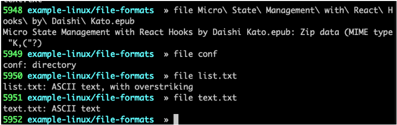

Trong ví dụ trên là một số kiểu định dạng khác nhau của file: zip, directory, ASCII text.

Những tập tin có kết quả trả về từ câu lệnh “file” có chứa “text” thì bạn có thể sử dụng những câu lệnh tiếp sau đây để xem chúng.

## Cat

Lệnh cat (viết tắt của concatenate) sẽ liệt kê nội dung của file vào trong terminal window. Việc này sẽ nhanh hơn nhiều so với việc mở các file ở trong editor. Và dĩ nhiên, sẽ không xảy ra khả năng làm thay đổi nội dung của các file đó.

Để đọc nội dung của file .bash_log_out, nhập lệnh sau khi directory hiện tại là home directory:

```sh
cat .bash_logout
```

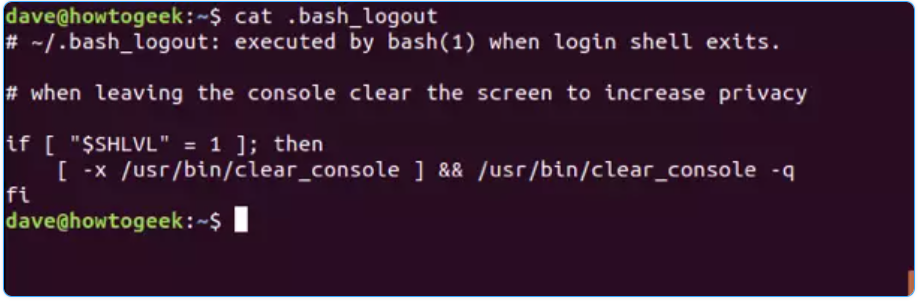

Đối với những file dài hơn số dòng ở trong terminal, các text sẽ hiện ra rất nhanh. Do đó, ta có thể pipe các output từ cat thông qua less để dễ kiểm soát hơn.

Bằng lệnh less, ta có thể cuộn lên hoặc xuống các file thông qua các phím mũi tên lên xuống, hoặc PgUp – PgDn, Home – End. Cuối cùng, nhập q để thoát khỏi less.

```sh
cat .bashrc | less
```

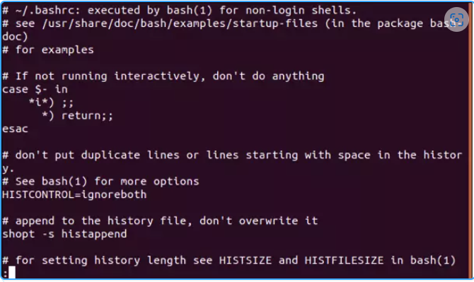

## diff

Lệnh diff so sánh hai text file và chỉ ra những điểm khác biệt. Có khá nhiều option khác nhau để tùy chỉnh hiển thị theo yêu cầu.

Option -y (side by side) hiển thị sự khác nhau giữa các dòng cạnh nhau. -w (width) cho phép điều chỉnh số dòng tối đa. Giả sử ta có hai file tên là alpha1.txt và alpha2.txt. Lệnh --suppress-common-lines ngăn diff liệt kê những dòng giống nhau, giúp ta chỉ tập trung vào những điểm khác biệt.

```sh
diff -y -W 70 alpha1.txt alpha2.txt --suppress-common-lines
```

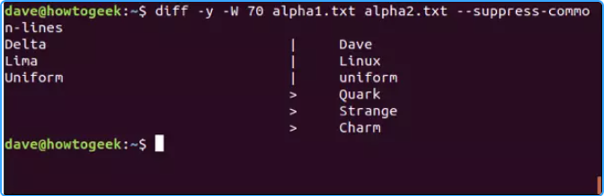

## find

Ta có thể dùng lệnh find để tìm các file có tồn tại, nhưng không thể nhớ vị trí của chúng. Trước hết, ta cần cho lệnh find biết nên bắt đầu tìm kiếm từ đâu, cũng như file cần tìm kiếm. Trong ví dụ này, . là folder hiện tại, còn option -name ra lệnh cho find tìm kiếm các file có tên khớp với mẫu tìm kiếm.

Bên cạnh đó, ta cũng có thể sử dụng các wildcard. Trong đó, `*` là bất kỳ chuỗi ký tự nào, còn `?` là bất kỳ kí tự đơn lẻ nào đó. Ví dụ này sử dụng `*one*` cho mọi file có chứa chuỗi kí tự “one“. Có thể là những từ như bones, stones,…

```sh
find . -name *one*
```

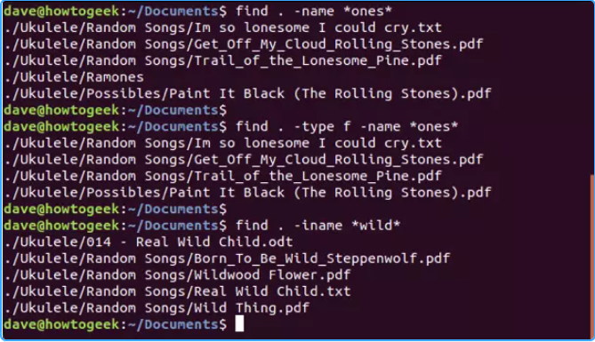

Có thể thấy ở đây, lệnh find trả về một danh sách những kết quả khớp. Trong đó có một directory gọi là Ramones. Ta có thể ra lệnh cho find thu hẹp kết quả tìm kiếm thành file, bằng option -type và tham số f (file):

```sh
find . -type f -name *ones*
```

Nếu không muốn kết quả bị case-sensitive, dùng option -iname (insensitive name):

```sh
find . -iname *wild*
```

## grep

grep tìm kiếm các dòng có chứa một mẫu tìm kiếm nào đó. Ở lệnh alias ở trên, ta đã dùng grep để tìm trong output của một chương trình khác, ps. Lệnh grep còn có thể được dùng để tìm nội dung của các file. Trong ví dụ dưới đây, grep dùng để tìm chữ “train” ở trong mọi text file của directory hiện tại.

```sh
grep train *.txt
```

Output của lệnh sẽ liệt kê ra tên của file và hiển thị những dòng khớp. Các text khớp đều được highlight.

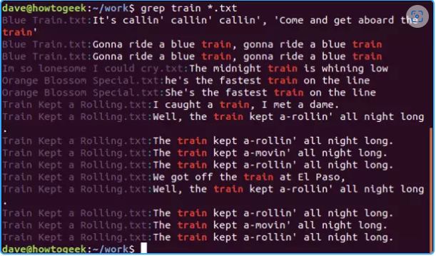

## gzip

Lệnh gzip có nhiệm vụ nén/giải nén các file. Theo mặc định, nó sẽ xóa file gốc và chỉ để lại phiên bản đã được nén. Để giữ cả hai bản, dùng option -k (keep).

```sh
gzip -k core.c
```

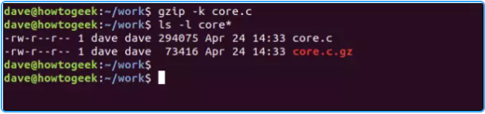

## Lệnh "wc"

Lệnh wc giúp hiển thị các thông tin thống kê của nội dung file, như số dòng, số từ, số ký tự


Các options
Lệnh “wc” có những lựa chọn như:

-c: hiển thị số bytes

-m: hiển thị số ký tự

-l: hiển thị số dòng

-w: hiển thị số từ

## head

Lệnh head đưa ra một danh sách 10 dòng đầu tiên của file. Nếu muốn xem thêm hoặc xem ít hơn, dùng option -n (number). Trong ví dụ này, head được dùng với mặc định là 10 dòng. Sau đó là 5 dòng:

```sh
head -core.c
head -n 5 core.c
```

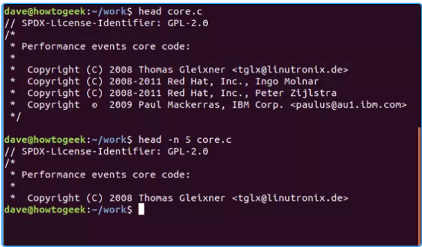

Và với tail thì công dụng ngược lại so với head

## less

Lệnh less cho phép xem các file mà không cần mở editor. Bằng lệnh less, ta có thể cuộn trước hoặc sau trong file bằng cách phím mũi tên lên xuống, PgUP – PgDn hoặc Home – End. Nhấn Q để có thể quit khỏi lệnh less.

Trước hết, cung cấp cho lệnh một tên như sau:

```sh
less core.c
```

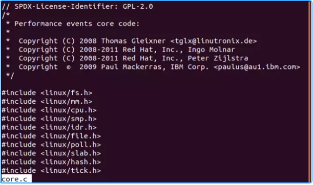

Bên cạnh đó, ta cũng có thể pipe output từ các lệnh khác vào trong less. Để xem output từ ls cho danh sách toàn bộ hard drive, nhập lệnh sau:

```sh
ls -R / | less
```

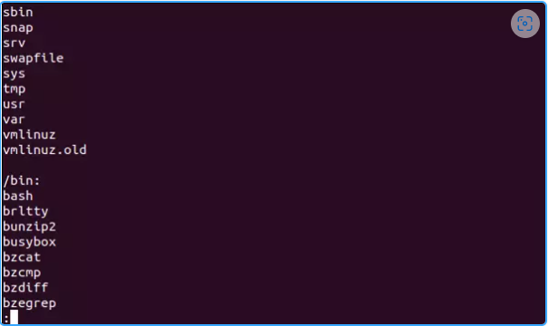

Dùng dấu `/` để tìm về phía trước của file, và ngược lại với kí tự `?`.

## man

Như đã đề cập ở trên, lệnh man hiển thị một “man page” (trang manual) cho một lệnh ở dạng less. Các man page này chính là user manual cho lệnh đó. Vì man sử dụng lệnh less để hiển thị các trang, nên ta cũng có thể dùng khả năng tìm kiếm của lệnh less.

Lấy ví dụ, để xem man page cho chown, dùng lệnh sau:

```sh
man chown
```

Dùng các phím mũi tên lên xuống, PgUp – PgDn để cuộn lên xuống trong tài liệu. Và cuối cùng , nhấn q (quit) để thoát hoặc h (help) để được trợ giúp.

## tail

Lệnh tail cung cấp danh sách 10 dòng cuối cùng của một file. Nếu muốn xem nhiều hoặc ít hơn, dùng option -n. Trong ví dụ này, chúng ta sử dụng lệnh tail với giá trị mặc định là 10 dòng, sau đó là 5 dòng:

```sh
tail core.c
tail -n 5 core.c
```

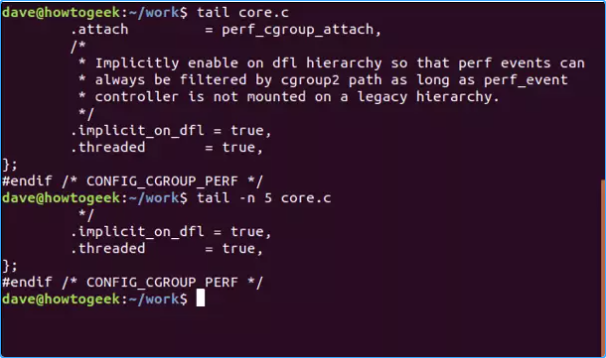

## tar

Lệnh tar cho phép tạo một file lưu trữ (còn gọi là tarball) chứa nhiều file khác. Việc này đặc biệt hữu ích khi phân phối tập hợp các file. Bên cạnh đó, ta cũng có thể dùng tar để giải nén cả file. Hoặc là sử dụng tar để nén các file lưu trữ.

Để tạo một file lưu trữ (archive), trước hết cần cung cấp cho lệnh tar các file cần có ở trong file lưu trữ, và tên của file lưu trữ đó.

Trong ví dụ dưới đây, ta sẽ lưu trữ tất cả các file trong directory Ukulele (chính là directory hiện tại):

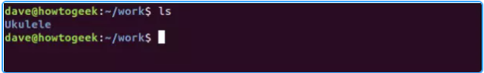

Sử dụng các option -c (create) và -v (verbose) cho lệnh. Trong đó, verbose cung cấp một số feedback trực quan bằng cách liệt kê các file vào trong terminal khi nó được thêm vào trong archive. Option -f (filename) để đặt tên cho archive đó, ví dụ như songs.tar.

```sh
tar -cvf songs.tar Ukulele/
```

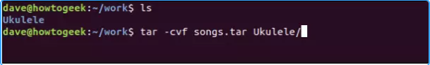

Tiếp đến, có hai cách để tar có thể nén các archive. Đầu tiên là dùng option -z (gzip) để nén các archive sau khi nó được tạo. Ta có thể thêm hậu tố “.gz” cho archive này, để người dùng khác khi giải nén các file có thể biết nên truyền lệnh nào vào tar để truy xuất file chính xác.

```sh
tar -cvzf songs.tar.gz Ukulele/
```


Các file sau đó cũng sẽ được liệt kê vào trong terminal khi chúng được thêm vào archive. Tuy nhiên, quá trình tạo archive sẽ lâu hơn một chút vì có thêm thao tác nén.

Để tạo một archive file được nén bằng thuật toán nén cao cấp hơn, kích thước archive nhỏ hơn, hãy dùng option -j (bzip2). Tất nhiên, quá trình tạo file sẽ lâu hơn so với gzip:

```sh
tar -cvjf songs.tar.bz2 Ukulele/
```


Đối với việc lưu trữ một lượng lớn các file, ta có thể lựa chọn giữa -z (nén vừa phải, tốc độ tốt) hoặc -j (nén tốt hơn, nhưng chậm hơn).

Có thể thấy ở dưới đây, file .tar có dung lượng lớn nhất, còn tar.gz thì nhỏ hơn, tar.bz2 hiển nhiên có dung lượng thấp nhất.

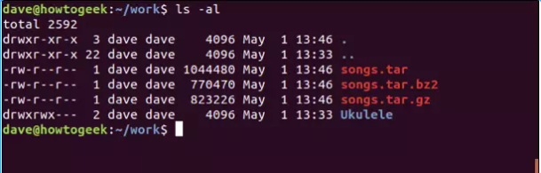

Tiếp theo, để giải nén các archive file, hãy sử dụng option -x (extract). Ngoài ra ta cũng có thể sử dụng các option -v và -f như ở trên. Dùng ls để xác nhận loại archive để giải nén các file:

```sh
ls
tar -xvf songs.tar
```

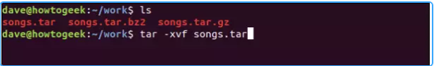

Các file cũng sẽ được thêm vào terminal khi giải nén.

Để có thể giải nén các file từ một archive tar.gz, dùng option -z (gzip):

```sh
tar -xvzf songs.tar.gz
```


Và cuối cùng, dùng option -j để giải nén tar.bz2:

```sh
tar -xvjf songs.tar.bz2
```


## vi/vim

– Các Editor ở giao diện dòng lệnh thông dụng sử dụng trong môi trường linux: VI,
VIM, NANO, Emacs.

– GEDIT chương trình hiểu chỉnh văn bảng ở giao diện đồ họa

– Chương trình VI chỉ có 2 màu trắng và đen. Chương trình VIM thì hỗ trợ nhiều
màu sắc hơn.

– VI có 2 mode hoạt động cơ bản: là “Command”, “Insert” mode

– Thao tác cơ bản trên chương trình VI

+ Mặc định khi mới mở file thì sẽ ở command mode.

+ Dùng phím “I” hoặc “A” hoặc “O” để chuyển từ Command mode —> Insert
mode
+ Dùng phím “ESC” để thoát Insert mode —> Command mode
+ Để hiện thị vị trí nhập lệnh sử dụng phím “Shift cộng dấu :”


– Một số câu lệnh thường được sử dụng Command mode
- save file and quit: `wq` hoac `x!`
- Thoát ra và không lưu lại: `q!`
- Xóa một hàng : `dd`
- Xóa một từ : `dw`
- Muốn copy một hàng : `yy`
- Dán : `p`
- Thay thế 1 loạt các từ hoặc ký tự: %s/<ký tự/từ cần thay thế>/<ký tự/từ sẽ được thay thế vào>. Ví dụ cần thay thế từ no thành yes: %s/no/yes
- Tìm một chữ nào đó: `?User` hoac `/User`
- `n`( không viết hoa) —> lùi lại
- `N` ( Viết hoa) —> tiếp theo
- Hiển thị số dòng : `set number` hoặc `set nu!`
- Muốn chuyển đến dòng thứ 100: sau khi gõ lệnh `set number`, gõ số 100
- Bấm phim `u` ==> undo
- Xóa đi dòng thứ 50, vào command mode, nhập vào `50d`
- Xóa từ dòng thứ 1 —> dòng thứ 10, vào command mode, nhập vào
`1,10d`
- Chuyen 1 loat dong thanh comment: [dong_bat_dau],[dong_ket_thuc]s/^/#
- Bỏ chú thích hàng loạt khi chú thích ở đầu dòng: 
  - Đặt con trỏ của bạn vào ký tự `#` đầu tiên , nhấn `Ctrl+V` (hoặc Ctrl+Q cho gVim) và đi xuống cho đến ký tự `#` cuối cùng và nhấn `x`, sẽ xóa tất cả các ký tự # theo chiều dọc.


## Tài liệu tham khảo

[xoa-het-noi-dung-file-text-bang-vi-vim: %d](https://cuongquach.com/xoa-het-noi-dung-file-text-bang-vi-vim.html)

<https://vietnix.vn/cac-cau-lenh-trong-linux/>

<https://kipalog.com/posts/Gioi-thieu-ve-CLI-va-cac-cau-lenh-lam-viec-voi-file-trong-Linux-a76b98ff-8cbb-4530-b40c-5d8e61f4bf01>

<https://beautyoncode.com/?s=linux>

## Nano

Là trình soạn thảo chỉnh sửa văn bản khá là phổ biến. KHÔNG giống như vi/vim, cần phải cài đặt thêm để sử dụng.

Cài đặt Nano trên Ubuntu:

```sh
sudo apt install nano -y
```

Cài đặt Nano trên CentOS:

```sh
sudo yum install epel-release nano -y
```

+ Mở hay tạo mới:

```sh
nano <tên-file>
```

Nhận được kết quả như sau:

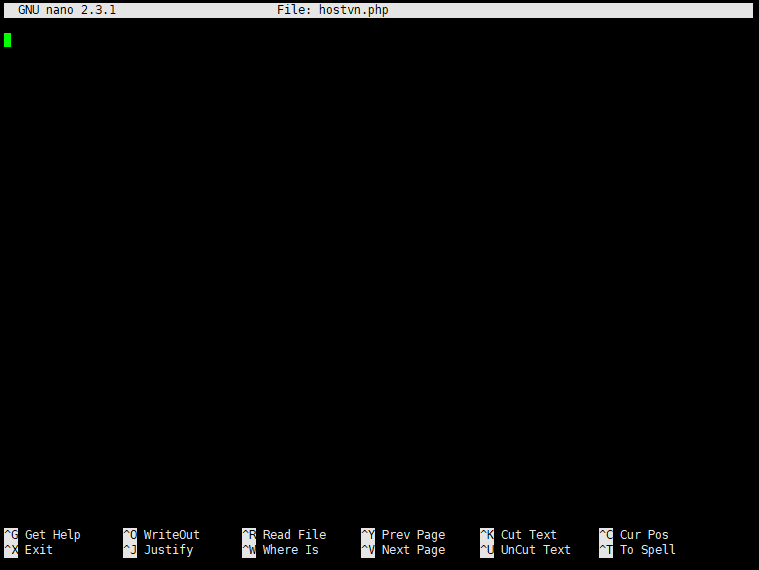

Tất cả các lệnh được bắt đầu bằng ký tự `^` hoặc `M`. Biểu tượng dấu mũ `^` đại diện cho phím `Ctrl`. Chữ `M` đại diện cho phím `Alt`. Ví dụ: các lệnh `^J` có nghĩa là nhấn các phím Ctrl và J cùng một lúc. Bạn có thể xem danh sách tất cả các lệnh bằng cách nhập Ctrl + g.

+ Chỉnh sửa tập tin

Để di chuyển con trỏ đến một dòng và số ký tự cụ thể, hãy sử dụng lệnh Ctrl + Shitf + _ .Lúc này Menu ở phía dưới màn hình sẽ thay đổi. Nhập số dòng muốn di chuyển tới và nhấn Enter

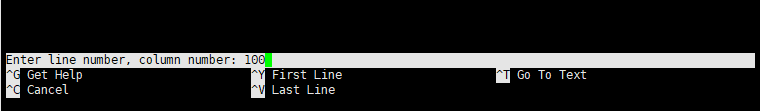

+ Tìm kiếm và thay thế

Để tìm kiếm văn bản, nhấn `Ctrl + w`, nhập cụm từ tìm kiếm và nhấn Enter. Con trỏ sẽ di chuyển đến từ mà bạn tìm kiếm. Để di đến vị trí tiếp theo, nhấn `Alt + w`.

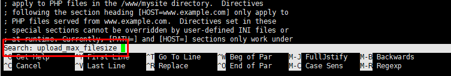

Nếu bạn muốn tìm kiếm và thay thế, hãy nhấn Ctrl + . Nhập cụm từ tìm kiếm và nhấn Enter.

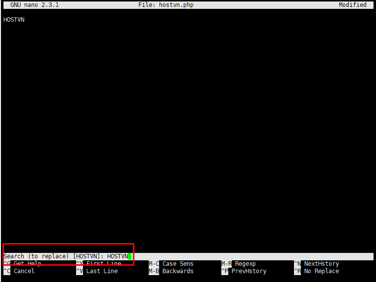

Sau đó hãy nhập cụm từ cần thay thế và nhấn Enter một lần nữa

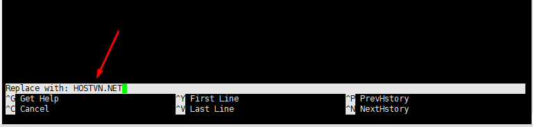

Trình chỉnh sửa sẽ tô đậm từ bạn muốn thay thế và hỏi bạn có muốn thay thế nó hay không. Sau khi nhấn Y nếu muốn thay thế nano sẽ tiến hành thay thế từ mà bạn chọn.

+ Lưu file và thoát khỏi Nano

Để lưu các thay đổi bạn đã thực hiện vào tệp, nhấn Ctrl + o. Nếu tập tin không tồn tại, nó sẽ được tạo khi bạn lưu nó.

Để thoát nano, nhấn Ctrl + x. Nếu có những thay đổi chưa được lưu, bạn sẽ được hỏi liệu bạn có muốn lưu các thay đổi đó không.

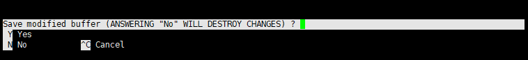

>Lưu ý: Để lưu tệp, bạn phải có quyền ghi vào tệp. Nếu bạn đang tạo một tệp mới, bạn cần có quyền ghi vào thư mục nơi tệp được tạo.


Tham khảo tại:

<https://www.nano-editor.org/docs.php>

<https://blog.hostvn.net/chia-se/huong-dan-su-dung-nano-tren-linux.html>

Date accessed: 24/05/2023

