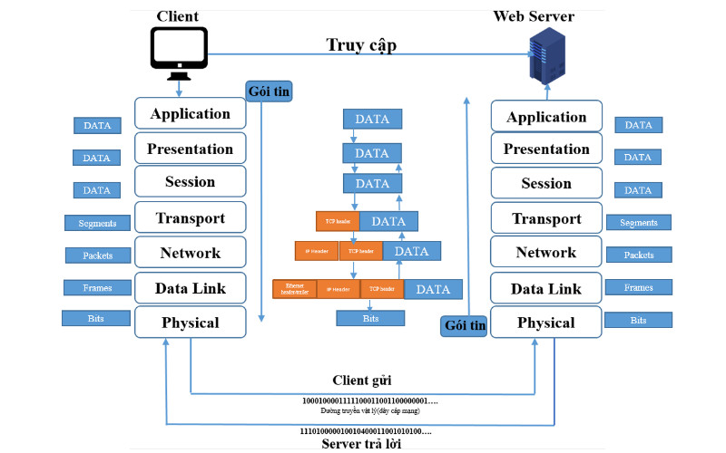
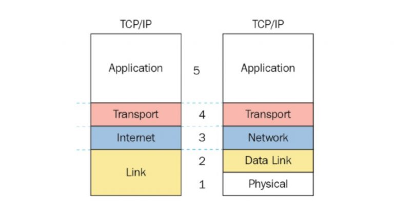
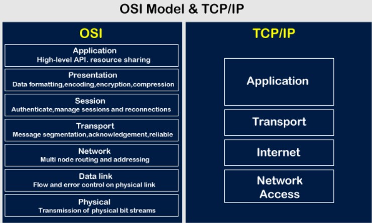

## Mục Lục

[1. Tìm hiểu về mô hình OSI](#tìm-hiểu-về-mô-hình-osi)

- [1.1 Các giao thức trong mô hình OSI là gì?](#các-giao-thức-trong-mô-hình-osi-là-gì)

- [1.2 Vai trò và chức năng của 7 tầng OSI](#vai-trò-và-chức-năng-của-7-tầng-osi)

- [Tóm tắt về các tầng](#tóm-tắt)

- [1.3 Cách hoạt động cơ bản](#cách-hoạt-động-cơ-bản)

[2. Mô Hình TCP/IP Có Mấy Tầng?](#mô-hình-tcpip-có-mấy-tầng)

- [2.1 Ưu điểm và nhược điểm của mô hình TCP/IP](#ưu-điểm-và-nhược-điểm-của-mô-hình-tcpip)

[So Sánh Mô Hình OSI Và TCP/IP](#so-sánh-mô-hình-osi-và-tcpip)

___

## Tìm hiểu về mô hình OSI

Mô hình OSI (Open Systems Interconnection Reference Model, viết ngắn là OSI Model hoặc OSI Reference Model) – tạm dịch là mô hình tham chiếu kết nối các hệ thống mở hay còn được gọi là mô hình bảy tầng của OSI. Mô hình OSI mô tả bảy tầng mà hệ thống máy tính sử dụng để giao tiếp qua mạng. Đây là mô hình tiêu chuẩn đầu tiên cho truyền thông mạng, được tất cả các công ty máy tính và viễn thông lớn áp dụng vào đầu những năm 1980.

Internet hiện đại không dựa trên OSI mà dựa trên mô hình TCP/IP đơn giản hơn. Tuy nhiên, mô hình 7 tầng OSI vẫn được sử dụng rộng rãi, vì nó giúp hình dung và giao tiếp cách mạng hoạt động, đồng thời giúp cô lập và khắc phục sự cố mạng.

Mô hình OSI có thể được xem như một ngôn ngữ chung cho mạng máy tính. Mô hình OSI được thiết kế dựa vào nguyên lý tầng cấp, lý giải một cách trừu tượng kỹ thuật kết nối truyền thông giữa các máy vi tính và thiết kế giao thức mạng giữa chúng dựa trên khái niệm chia hệ thống liên lạc thành bảy lớp trừu tượng, mỗi lớp xếp chồng lên lớp cuối cùng.

## Các giao thức trong mô hình OSI là gì?

Các giao thức trong mô hình OSI là yếu tố rất quan trọng, có 2 giao thức được sử dụng trong mô hình là giao thức hướng liên kết và giao thức không liên kết.

- Giao thức hướng liên kết (Connection Oriented)

    Trước khi bắt đầu quá trình truyền dữ liệu, các thực thể trong cùng một tầng của 2 hệ thống khác nhau cần phải thiết lập một liên kết logic chung. Chúng tiến hành trao đổi, thương lượng với nhau về tập các tham số sẽ sử dụng trong quá trình truyền dữ liệu, có thể là cắt bớt hoặc hợp nhất dữ liệu, liên kết sẽ được hủy bỏ. Việc thiết lập liên kết logic này sễ giúp nâng cao độ tin cậy và an toàn.

- Giao thức không liên kết (Connectionless)

    Với các giao thức không liên kết chỉ có giai đoạn duy nhất truyền dữ liệu và dữ liệu khi này được truyền độc lập trên các tuyến khác nhau.

## Vai trò và chức năng của 7 tầng OSI

### 7. Tầng 7 – Application Layer ( Tầng ứng dụng)

    Tầng ứng dụng là lớp trên cùng, xác định giao diện giữa người sử dụng và môi trường OSI. Tầng ứng dụng được sử dụng bởi phần mềm người dùng cuối như trình duyệt web và ứng dụng email. Nó cung cấp các giao thức cho phép phần mềm gửi, nhận thông tin và trình bày dữ liệu có ý nghĩa cho người dùng.

    - Cung cấp các dịch vụ tiêu biểu cho người dùng: Web, Mail, DNS (phân giải tên miền), DHCP (cấp phát IP  động), FTP (truyền file dữ liệu: hình ảnh,văn bản,...).

### 6. Tầng 6 – Presentation Layer (Tầng trình bày/Tầng trình diễn)

    Tầng kế tiếp tầng ứng dụng là tầng trình bày, tầng này sẽ giải quyết các vấn đề liên quan đến các cú pháp và ngữ nghĩa của thông tin được truyền.

    Tầng trình bày xác định cách hai thiết bị sẽ mã hóa và nén dữ liệu để nó được nhận một cách chính xác ở đầu bên kia. Tầng trình bày lấy bất kỳ dữ liệu nào được truyền bởi tầng ứng dụng và chuẩn bị cho việc truyền qua tầng phiên.

    Tầng này chịu trách nhiệm chính trong việc chuẩn bị dữ liệu để nó có thể được sử dụng bởi tầng ứng dụng; nói cách khác, tầng 6 làm cho dữ liệu hiển thị cho các ứng dụng sử dụng. Tầng trình bày chịu trách nhiệm dịch, mã hóa và nén dữ liệu.

    Hai thiết bị đang giao tiếp có thể sử dụng các phương pháp mã hóa khác nhau, do đó, tầng 6 chịu trách nhiệm dịch dữ liệu đến thành một cú pháp mà lớp ứng dụng của thiết bị nhận có thể hiểu được.

    - Các giao thức tiêu biểu tầng Presentation sử dụng : XDR (Extreme Dynamic Range), ASN.1 (Abstract Syntax Notation One), SMB (Server Message Block), AFP (Alpha-fetoprotein), NCP (Network Control Protocol).

### 5. Tầng 5 – Session Layer (Tầng phiên)

    Đây là lớp chịu trách nhiệm đóng mở giao tiếp giữa hai thiết bị. Khoảng thời gian từ khi giao tiếp được mở và đóng được gọi là phiên. Tầng phiên đảm bảo rằng phiên vẫn mở đủ lâu để chuyển tất cả dữ liệu đang được trao đổi, và sau đó nhanh chóng đóng phiên để tránh lãng phí tài nguyên.

    Lớp phiên cũng đồng bộ hóa việc truyền dữ liệu với các điểm kiểm tra. Ví dụ: nếu một tệp 100 megabyte đang được chuyển, tầng phiên có thể đặt một điểm kiểm tra cứ sau 5 megabyte. Trong trường hợp ngắt kết nối hoặc gặp sự cố sau khi 52 megabyte đã được chuyển, phiên có thể được tiếp tục từ điểm kiểm tra cuối cùng, có nghĩa là chỉ cần chuyển thêm 50 megabyte dữ liệu. Nếu không có các trạm kiểm soát, toàn bộ quá trình chuyển sẽ phải bắt đầu lại từ đầu.

    - Các giao thức tiêu biểu Session layer sử dụng :ASAP, TLS, ISO 8327 / CCITT X.225, RPC, NetBIOS, ASP.

### 4. Tầng 4 – Transport Layer (Tầng vận chuyển)

    Tầng 4 chịu trách nhiệm giao tiếp đầu cuối giữa hai thiết bị. Điều này bao gồm việc lấy dữ liệu từ lớp phiên và chia nó thành các phần được gọi là phân đoạn trước khi gửi đến tầng 3. Tầng truyền tải trên thiết bị nhận có trách nhiệm tập hợp lại các phân đoạn thành dữ liệu mà tầng phiên có thể sử dụng.

    Tầng vận chuyển cũng chịu trách nhiệm kiểm soát luồng và kiểm soát lỗi. Kiểm soát luồng xác định tốc độ truyền tối ưu để đảm bảo rằng người gửi có kết nối nhanh không làm người nhận có kết nối chậm bị choáng ngợp. Tầng truyền tải thực hiện kiểm soát lỗi ở đầu nhận bằng cách đảm bảo rằng dữ liệu nhận được là hoàn chỉnh và yêu cầu truyền lại nếu chưa.

- Các giao thức tiêu biểu tầng Transport sử dụng :

    TCP(Transmission Control Protocol)
    UDP(User Datagram Protocol)
    RTP(Real time transfer protocol),
    SCTP(Stream Control Transmission Protocol)

### 3. Tầng 3- Network Layer (Tầng mạng)

    Tầng mạng có nhiệm vụ tạo điều kiện thuận lợi cho việc truyền dữ liệu giữa hai mạng khác nhau. Nếu hai thiết bị giao tiếp trên cùng một mạng, thì tầng mạng là không cần thiết. Tầng mạng chia nhỏ các phân đoạn từ lớp truyền tải thành các đơn vị nhỏ hơn, được gọi là gói, trên thiết bị của người gửi và tập hợp lại các gói này trên thiết bị nhận. Tầng mạng cũng tìm ra con đường vật lý tốt nhất để dữ liệu đến đích của nó; điều này được gọi là định tuyến.

    Ngoài ra tầng mạng còn thống kê số lượng các gói tin truyền qua mạng hay cấm hoặc cho phép các gói tin của giao thức nào đó.

- Các giao thức tiêu biểu tầng Network sử dụng

  - IP (Internet Protocol),
  - IPX (Internetwork Packet Exchange),
  - BGP ( Border Gateway Protocol),
  - OSPF (Open Shortest Path First)
  - RIP (Rest in peace)
  - IGRP (Interior Gateway Routing Protocol)
  - EIGRP (Enhanced Interior Gateway Routing Protocol)
  - ARP (Address Resolution Protocol)
  - RARP (Reverse Address Resolution Protocol)

### 2. Tầng 2 – Data Link Layer (Tầng liên kết)

    Tầng liên kết dữ liệu rất giống với tầng mạng, ngoại trừ tầng liên kết dữ liệu tạo điều kiện thuận lợi cho việc truyền dữ liệu giữa hai thiết bị trên mạng nội bộ. Tầng liên kết dữ liệu lấy các gói từ tầng mạng và chia chúng thành các phần nhỏ hơn gọi là khung (Frames). Giống như tầng mạng, tầng liên kết dữ liệu cũng chịu trách nhiệm điều khiển luồng và điều khiển lỗi trong giao tiếp nội mạng (Tầng vận chuyển chỉ làm nhiệm vụ điều khiển luồng và điều khiển lỗi cho truyền thông giữa các mạng).

    Các giao thức tiêu biểu Data link layer sử dụng : Ethernet, Token ring, Frame, 802.11,WiFi, PPP

### 1. Tầng 1 – Physical Layer (Tầng vật lý)

    Lớp này bao gồm các thiết bị vật lý liên quan đến việc truyền dữ liệu, chẳng hạn như cáp và thiết bị chuyển mạch. Đây cũng là lớp nơi dữ liệu được chuyển đổi thành một luồng bit, là một chuỗi gồm các số 1 và 0. Lớp vật lý của cả hai thiết bị cũng phải đồng ý về một quy ước tín hiệu để các số 1 có thể được phân biệt với các số 0 trên cả hai thiết bị.

### Tóm tắt

|Tầng | Chức năng | Giao thức |
|:---:|-----------|:----------|
|Tầng 7 – Tầng ứng dụng (Application) | Tương tác với chương trình ứng dụng và mạng.|Ứng dụng|
Tầng 6 – Tầng trình bày (Presentation)|Chuyển đổi, nén dữ liệu, mã hóa và giải mã dữ liệu đảm bảo sự bảo mật trên mạng.|Giao thức
Biến đổi mã|
Tầng 5 – Tầng phiên (Session)|Kiểm soát các phiên hội thoại giữa các máy tính. Thiết lập, quản lý và kết thúc các phiên truyền thông giữa các ứng dụng.|Giao thức phiên|
Tầng 4 – Tầng vận chuyển (Transpost)|Nhận thông tin từ tầng Session chia thành các gói nhỏ hơn và truyền xuống lớp dưới, hoặc nhận thông tin từ lớp dưới chuyển lên phục hồi theo cách chia của hệ phát.|Giao thức Giao vận|
Tầng 3 – Tầng mạng (Network)|Đảm bảo chuyển chính xác số liệu giữa các thiết bị cuối trong mạng.|Giao thức mạng|
Tầng 2 – Tầng liên kết (Data Link)|Tạo/gỡ bỏ khung thông tin (Frames), kiểm soát luồng và kiểm soát lỗi.|Thủ tục kiểm soát|
Tầng 1 – Tầng vật lý (Physical)|Đảm bảo các yêu cầu truyền/nhận các chuỗi bit qua các phương tiện vật lý.|Giao diện DTE – DCE|

## Cách hoạt động cơ bản

- Bước 1: Đưa thông tin cần gửi vào máy tính
    Ở tầng Application (tầng 7), người dùng tiến hành đưa thông tin cần gửi vào máy tính. Các thông tin này thường có dạng như: hình ảnh, văn bản, số, ứng dụng trên điện di động, các dữ liệu mà các ứng dụng có thể hỗ trợ như google docs, google sheet…

    Sau đó các dữ liệu này được đưa xuống tầng Presentation (tầng 6) để chuyển hóa các dữ liệu thành một dạng chung để mã hóa dữ liệu và nén dữ liệu.

    Dữ liệu sau khi qua tầng 6 được chuyển xuống tầng Session (Tầng 5). Tầng phiên có chức năng bổ sung các thông tin cần thiết cho một phiên giao dịch (gửi-nhận) đồng thời.

- Bước 2: Tiếp theo
    Toàn bộ gói tin đang ở tầng 5 lại được đưa xuống tầng 4 (transport)
    Lúc này toàn bộ nội dung của gói tin lớp 7, 5, 6 sẽ được tầng 4 coi là 1 Data được đóng thêm một TCP header hoặc UDP header phần này sẽ được gọi là 1 segments, segments chứa 2 thành phần chính TCP/UDP header và data. Segments sẽ được đưa xuống tầng tiếp theo là tầng 3 network.

- Bước 3: Đóng thêm IP header vào Segments
    Tương tự tầng trên tầng 3 thực hiện đóng thêm 1 IP header vào Segments và được gọi với tên gọi khác Packet. Packet chứa IP header , TCP/UDP header và Data.

- Bước 4: Gói tin lần lượt được đưa xuống các tầng tiếp theo
    Tương tự như trên gói tin tiếp tục được đưa xuống tầng tiếp theo lần lượt Datalink, physical. Riêng ở layer 2, Data Link thì ngoài việc bọc thêm ethernet header lúc này sẽ được gọi là Frames nó còn bọc thêm phần kiểm tra lỗi FCS và xuống lớp vật lý. Đơn vị dữ liệu của lớp vật lý phải là các Bits. Tức là toàn bộ cấu trúc dữ liệu này sẽ được chuyển hóa thành một dòng Bit nhị phân để truyền trên đường truyền vật lý.

- Bước 5: Quá trình diễn ra ở đầu thu

    Ở phía đầu thu tức là ở bên máy chủ facebook.com thì quá trình lại diễn ra ngược lại tức là lúc này dòng Bit nhị phân được đưa vào đường truyền vật lý và truyền lên trên.

- Bước 6: Gói tin tiếp tụ được đẩy lên tầng trên Datalink

    Sau khi được truyền đến được máy chủ facebook.com với dãy bit 0100011000... Ở tầng physical thì nó sẽ được tiếp tục đẩy lên tầng trên Datalink. Bóc 1 lớp gói hàng ra được gọi ethernet header ra ở tầng Datalink gọi là lớp Frames và tương tự đẩy lên Tầng Network và bóc lớp Packets tương tự như vậy đến tầng transport bóc Segments và đẩy lên tầng trên của nó.

**Tóm tắt:**

- Kết thúc quá trình trên hoàn thành 1 quá trình gửi dữ liệu từ người dùng đến 1 máy tính khác và máy tính trả lời thông tin người dùng mong muốn.Thông qua bước trên chúng ta sẽ hiểu rõ 1 phần nào về mô hình hoạt động mạng OSI.
- Trong quá trình này, người dùng gửi đi 1 đoạn văn bản hoặc hình ảnh,... máy tính sẽ chia nhỏ thành các gói tin và tất cả các gói tin này sẽ thực hiện các bước trên.
- Tại nơi người gửi, mỗi tầng coi gói tin của tầng trên gửi xuống là dữ liệu được nhận phải giữ gìn dữ liệu và thêm vào gói tin các thông tin điều khiển của của tầng mà đang thêm để nhận dạng sau đó chuyển tiếp xuống tầng dưới.
- Tại nơi nhận, quá trình diễn ra ngược lại với quá trình gửi, mỗi tầng lại tách thông tin đã gắn vào và chuyển dữ liệu lên tầng trên tiếp tục tách các thông tin mà mỗi tầng đã gắn.

### Tham khảo tại

<https://vietnix.vn/mo-hinh-osi-la-gi/?utm_source=ggads&utm_medium=post&gclid=Cj0KCQjw98ujBhCgARIsAD7QeAi2VjaFWiVcZKWafTy1EKf85BzJQJ3IdiscOafUPiRc5z5_r1qJggsaAoXUEALw_wcB>

<https://suncloud.vn/mo-hinh-osi>

## Mô Hình TCP/IP Có Mấy Tầng?

Mô hình TCP IP - Transmission Control Protocol/ Internet Protocol, tạm dịch là “Giao thức điều khiển truyền nhận/ Giao thức liên mạng”. tiêu chuẩn gồm có 4 tầng chồng lên nhau theo thứ tự như sau: 1 Tầng vật lý (Physical) > 2 Tầng mạng (Network) > 3 Tầng giao vận (Transport) > 4 Tầng ứng dụng (Application).

Một số ý kiến khẳng định rằng mô hình TCP/IP có 5 tầng. Trong đó tầng 2 đến 4 được giữ nguyên. Riêng tầng Datalink sẽ tách thành 2 tầng, nhìn vào bức ảnh dưới đây bạn sẽ hiểu rõ hơn về cách phân tầng của chúng.

Giao thức TCP/IP không phải là 1 thể duy nhất, mà là sự kết hợp giữa 2 giao thức, gồm IP và TCP. Trong đó:

- IP (Internet Protocol ) – Giao thức liên mạng: Cho phép các gói tin được gửi đến đích. Tuy nhiên, giao thức này không đảm bảo các gói tin còn nguyên vẹn khi đến đích, nó có không theo thứ tự, bị trùng lặp, thậm chí là mất hoàn toàn.
- TCP (Transmission Control Protocol) – Giao thức điều khiển truyền nhận: Đóng vai trò kiểm tra và kiểm soát độ tin cậy của truyền dẫn, đảm bảo gói tin được chuyển đến đích một cách an toàn, đúng thứ tự và không xảy ra hiện tượng chậm, trễ trong đường truyền làm ảnh hưởng đến chất lượng gói tin. Trong quá trình làm việc, nếu phát hiện gói tin bị lỗi, TCP sẽ truyền đi một tín hiệu yêu cầu hệ thống gửi lại gói tin khác. Để hiểu rõ hơn về cách thức hoạt động và chức năng của TCP/IP, hãy cùng tìm hiểu chức năng của từng tầng trong mô hình này.

=>TCP và IP kết hợp với nhau, tạo thành 1 bộ giao thức. Bộ giao thức này điều khiển truyền thông giữa tất cả các máy tính trên Internet.

### 4. Tầng 4: ứng dụng (Application)

    Đây là tầng trên cùng của mô hình TCP/IP; có vai trò giao tiếp dữ liệu giữa 2 máy khác nhau thông qua các dịch vụ mạng (Chat, Email, duyệt web; SSH, SMTP, FTP…). Đến đây, dữ liệu sẽ được định dạng thành kiểu Byte nối Byte; các thông tin định tuyến giúp gói tin xác định đường đi đúng.

### 3. Tầng 3: giao vận (Transport)

    Tầng này có vai trò xử lý vấn đề giao tiếp giữa 2 máy chủ trong cùng 1 mạng hoặc khác mạng được kết nối với nhau thông qua Router (bộ định tuyến). Ở tầng này, dữ liệu được phân thành các đoạn nhỏ, kích thước có thể không bằng nhau, nhưng bắt buộc phải nhỏ hơn 64KB.

    Tầng Giao vận bao gồm 2 giao thức cốt lõi, gồm: UDP và TCP. Trong đó:

    - UDP: Không đảm bảo chất lượng gói tin, nhưng tốc độ truyền tải nhanh hơn.
    - TCP: Đóng vai trò kiểm tra độ tin cậy của dữ liệu, kiểm soát vấn đề tắc nghẽn lưu lượng dữ liệu để đảm bảo chất lượng gói tin. Hoạt động này tiêu tốn khá nhiều thời gian.

### 2. Tầng 2: mạng (Network)

    Tầng này đảm nhận việc truyền tải dữ liệu một cách hợp lý, logic. Các phân đoạn dữ liệu sẽ được đóng gói với kích thước phù hợp; đồng thời được chèn thêm Header chứa thông tin của tầng mạng và tiếp tục được chuyển sang tầng tiếp theo.

    Các giao thức chính trong tầng mạng gồm: IP (Internet Protocol), ICMP (Internet Control Message Protocol) và IGMP (Internet Group Message Protocol).

### 1. Tầng 1: vật lý (Physical)

    Đây là tầng thấp nhất trong mô hình TCP IP, đóng vai trò truyền dữ liệu giữa 2 thiết bị trong cùng 1 mạng. Ở tầng này, toàn bộ gói dữ liệu sẽ được đóng vào khung (Frame) và được định tuyến đi đến đích đã được chỉ định ban đầu.

## Ưu điểm và nhược điểm của mô hình TCP/IP

Sử dụng mô hình TCP IP có những lợi thế sau:

- Hoạt động độc lập với hệ điều hành
- Thiết lập kết nối giữa các loại máy tính khác nhau
- Không gây áp lực cho mạng hoặc máy tính do nhẹ
- Có khả năng mở rộng cao, hỗ trợ nhiều giao thức định tuyến
- Có khả năng tương thích cao với mọi hệ điều hành nên có thể giao tiếp với các hệ thống khác
- Chúng ta có thể tự do sử dụng vì mô hình này không chịu sự kiểm soát của bất kỳ tổ chức nào trên thế giới.

Bên cạnh những ưu điểm, mô hình TCP/IP cũng tồn tại một số hạn chế nhất định:

- Khó để thay thế các giao thức trong TCP/IP
- Khó quản lý và phức tạp trong cài đặt/ thiết lập
- Dễ bị tấn công đồng bộ hóa – một kiểu tấn công từ chối dịch vụ.
- Tầng giao vận (Transport) không đảm bảo việc phân phối các gói tin
- Các khái niệm về giao diện, giao thức và dịch vụ không tách bạch rõ ràng, bởi vậy mà không phù hợp để mô tả các công nghệ mới trong mạng mới.

Hầu hết các máy tính muốn lên mạng internet đều phải sử dụng kết nối thông qua giao thức TCP IP. Có thể thấy giao thức này đóng vai trò vô cùng quan trọng trong mạng internet, bởi nếu không có chúng đóng gói đơn giản hóa và phân tích dữ liệu thì sự phát triển của con người sẽ bị đẩy lùi.

## So Sánh Mô Hình OSI Và TCP/IP

Mô hình TCP IP và OSI có khá nhiều điểm tương đồng, cụ thể như sau:

- Cùng sử dụng kỹ thuật chuyển Packet
- Đều có lớp Network và lớp Transport
- Đều có kiến trúc phân lớp, vì chúng đều được xây dựng dựa trên các lớp, nói cách khác là đều phân tầng như nhau.
- Đều đơn giản hóa quá trình khắc phục sự cố bằng cách chia nhỏ chức năng phức tạp thành các phần giản đơn.

Bên cạnh những điểm giống nhau, Mô hình TCP IP và OSI còn có rất nhiều điểm riêng. Bảng so sánh dưới đây sẽ giúp bạn hiểu rõ.

|Nội dung|Mô hình OSI|Mô hình TCP/IP|
|:------:|-----------|--------------|
|Đơn vị phát triển|ISO (Tổ chức tiêu chuẩn quốc tế)|Bộ Quốc phòng (DoD)|
Số tầng|7 tầng|4 tầng|
Ý nghĩa|Là mô hình lý thuyết, được sử dụng cho hệ thống máy tính.|Là mô hình Server- Client (máy chủ – máy khách), được dùng để truyền dữ liệu qua internet.|
|Mức độ sử dụng|Ít người dùng|Được sử dụng phổ biến trên toàn cầu|
|Phương pháp tiếp cận|Tiếp cận theo chiều dọc|Tiếp cận theo chiều ngang|
|Thiết kế|Phát triển mô hình trước rồi mới phát triển giao thức|Các giao thức được thiết kế trước sau đó mới đến phát triển mô hình|
|Truyền thông|Hỗ trợ cả kết nối không dây và định tuyến|Hỗ trợ truyền thông không kết nối từ tầng mạng|
|Sự kết hợp giữa các tầng|Mỗi tầng khác nhau sẽ thực hiện một nhiệm vụ khác nhau, không có sự kết hợp giữa bất cứ tầng nào|Trong tầng ứng dụng có tầng trình diễn và tầng phiên được kết hợp với nhau|
|Tính phụ thuộc|Giao thức độc lập|Phụ thuộc vào giao thức|

### Tài liệu tham khảo

<https://fpttelecom.com/blog/mo-hinh-osi/>

<https://fpttelecom.com/blog/giao-thuc-tcp-ip-la-gi/>

<https://viblo.asia/s/mot-so-kien-thuc-co-ban-ve-mang-may-tinh-nB5pX8vr5PG>

