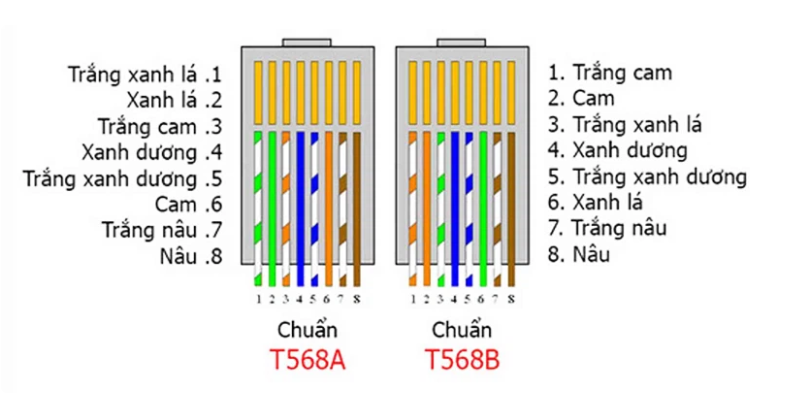

## Mục lục

TỔNG QUAN VỀ CÁC LOẠI CÁP MẠNG VÀ TIÊU CHUẨN BẤM CÁP MẠNG

[I. Tổng quan về các loại cáp mạng](#i-tổng-quan-về-các-loại-cáp-mạng)

- [1. Cáp mạng là gì?](#1-cáp-mạng-là-gì)

- [2. Phân loại cáp mạng](#2-phân-loại-cáp-mạng)

- [3. Ứng dụng cáp mạng](#3-ứng-dụng-cáp-mạng)

[II. Tiêu chuẩn bấm cáp mạng](#ii-tiêu-chuẩn-bấm-cáp-mạng)

- [1. Bấm thẳng](#1-bấm-thẳng)
- [2. Bấm chéo](#2-bấm-chéo)

[Tài liệu tham khảo](#tham-khảo-tại)

## I. Tổng quan về các loại cáp mạng

### 1. Cáp mạng là gì?

Cáp mạng là phần cứng mạng được sử dụng để kết nối một thiết bị mạng này với các thiết bị mạng khác, ví dụ, kết nối hai hoặc nhiều máy tính để chia sẻ máy in và máy scan; kết nối nhiều máy chủ với một bộ chuyển mạch Access Switch.

Cáp mạng bao gồm: cáp xoắn đôi, cáp đồng trục, cáp quang, đường dây điện,… Trong đó cáp xoắn đôi, cáp đồng trục, cáp quang là những loại phổ biến nhất hiện nay.

Cáp quang chứa các sợi quang làm bằng thủy tinh hoặc nhựa để truyền ánh sáng. So với cáp điện - thường truyền qua đồng dễ bị mất dữ liệu trong khoảng cách xa - cáp quang cung cấp băng thông và độ tin cậy cao hơn trong khoảng cách xa. Cáp quang cũng có xu hướng nhẹ hơn cáp điện nhưng nhìn chung đắt hơn. Do đó, chúng thường được sử dụng trong các ứng dụng mà băng thông và khoảng cách yêu cầu vượt qua giới hạn của cáp điện.

### 2. Phân loại cáp mạng

Có rất nhiều loại cáp mạng. Loại cáp được chọn cho mạng có liên quan đến cấu trúc liên kết, giao thức và kích thước của mạng. Hiểu được đặc điểm của các loại cáp khác nhau và cách chúng liên quan đến các khía cạnh khác của mạng là điều cần thiết để phát triển một mạng thành công.

- Cáp STP (Shielded Twisted Pair) và cáp UTP (Unshielded Twisted Pair)

Cáp xoắn đôi thường được bảo vệ để ngăn chặn hiện tượng nhiễu điện từ. Cáp xoắn đôi được che chắn bởi vỏ chống nhiễu được gọi là cáp xoắn được bảo vệ (STP). Ngược lại với STP, cặp xoắn đôi không được che chắn bởi vỏ chống nhiễu (UTP) sẽ để trần, không được bảo vệ.

Cáp STP cũng được chia thành loại có vỏ chống nhiễu chung và vỏ chống nhiễu riêng. Cáp STP với vỏ chống nhiễu riêng có lá nhôm cho mỗi cặp xoắn hoặc hai cặp xoắn một. Loại vỏ chống nhiễu này bảo vệ cáp khỏi hiện tượng nhiễu điện từ bên ngoài (EMI) vào hoặc ra khỏi cáp, và cũng bảo vệ các cặp xoắn lân cận khỏi hiện tượng nhiễu xuyên âm. Cáp Overall shielded twisted pair (OSTP) có vỏ chống nhiễu chung hoặc vỏ chống nhiễu riêng trên tất cả các cặp trong cáp xoắn đôi. Loại vỏ chống nhiễu này giúp ngăn EMI xâm nhập hoặc thoát khỏi cáp. Một cáp STP có thể có cả vỏ chống nhiễu chung và riêng.

Cáp UTP không có vỏ chống nhiễu dễ bị ảnh hưởng bởi hiện tượng nhiễu từ bên ngoài. Vì lý do đó, loại cáp này thường được tìm thấy trong các ứng dụng điện thoại trong nhà. Cáp điện thoại ngoài trời chứa hàng trăm hoặc hàng ngàn cặp. Các cặp có cùng tốc độ xoắn trong cáp có thể phải chịu một số mức độ nhiễu xuyên âm, vì vậy các cặp dây này thường được lựa chọn cẩn thận trong một cáp lớn để giảm hiện tượng nhiễu xuyên âm.

Hầu hết cáp UTP sử dụng đầu nối RJ45, trông giống như đầu nối điện thoại (RJ11) nhưng có 8 dây thay vì 4 dây.

- Cáp Ethernet - Cáp xoắn đôi thông dụng nhất

    _Category 1:_

    Cat1 là cáp đồng xoắn đôi không có vỏ bọc nguyên bản nhất theo tiêu chuẩn ANSI/EIA/TIA-568A, nó được phát triển dành cho giao tiếp thoại qua điện thoại không  thể truyền dữ liệu mạng máy tính.

    _Category 2:_

    Cat2 là cáp xoắn đôi không có vỏ bọc đầu tiên có thể được sử dụng để truyền dữ liệu mạng máy tính theo tiêu chuẩn ANS/EIA/TIA-568A. Tần số truyền sóng là 1MHz, tốc độ truyền sóng là 4MBb/s. Nó chủ yếu được sử dụng cho mạng mã thông báo cũ.

    _Category 3:_

    Cat3 là cáp xoắn đôi không có vỏ bọc đầu tiên có thể được sử dụng để truyền dữ liệu mạng máy tính theo tiêu chuẩn ANS/EIA/TIA-568A và ISO Class 2/Class A. được thiết kế để truyền dữ liệu đáng tin cậy lên đến 10 Mbit/giây, với băng thông có thể lên tới 16 MHz. Cat 3 là định dạng cáp phổ biến vào đầu những năm 1990, nhưng từ đó, nó gần như hoàn toàn được thay thế bằng tiêu chuẩn Cat 5 tương tự, nhưng mang lại tốc độ cao hơn.

    _Category 4:_

    Cat4 là cáp xoắn đôi không được che chắn được sử dụng cho mạng vòng mã thông báo theo tiêu chuẩn cấp ANS/EIA/TIA-568A và ISO Category 4/C. Tần số truyền là 20MHz và tốc độ truyền có thể đạt 16Mb/s. Chủ yếu được sử dụng cho mạng LAN dựa trên mã thông báo và 10BASE-T/100BASE-T.

    _Category 5:_

    Cat5 là cáp xoắn đôi không có vỏ bọc được sử dụng trong các tiêu chuẩn ANSI / EIA / TIA-568A và ISO Category 5/Class D để chạy CDDI (CDDI là mạng FDDI dựa trên dây đồng xoắn đôi) và Fast Ethernet. Tần số truyền là 100MHz, Tốc độ truyền lên đến 100Mb/s.

    Cat5e là cáp xoắn đôi không có vỏ bọc được sử dụng để chạy Fast Ethernet theo tiêu chuẩn SNSI/EIA/TIA-568B và ISO Class 5. Tần số truyền là 100MHz và tốc độ truyền có thể đạt 100Mb/s. So với cáp Category 5, Category 5e có những cải tiến lớn hơn trong bốn chỉ số chính về nhiễu xuyên âm gần cuối, tổng hợp nhiễu xuyên âm, suy hao và tỷ lệ tín hiệu trên nhiễu.

    _Category 6:_

    Cat6 là một loại cáp xoắn đôi không có vỏ bọc được quy định trong tiêu chuẩn ANSI/EIA/TIA-568B.2 và ISO Category6/Class E. Nó chủ yếu được sử dụng trong Fast Ethernet và Gigabit Ethernet. Bởi vì tần số truyền của nó có thể đạt 200-250MHz, gấp đôi băng thông của dòng super-type 5, tốc độ tối đa có thể đạt 1000Mb / s, có thể đáp ứng yêu cầu của Gigabit Ethernet.

    Cat6a là phiên bản cải tiến của Cat6. Đây cũng là loại cáp xoắn đôi không có vỏ bọc được chỉ định trong các tiêu chuẩn ANSI/EIA-568B.2 và ISO Category6/Class E. Nó chủ yếu được sử dụng trong mạng Gigabit. Nó tương tự như Cat6 về tần số truyền. Tương tự, nó cũng là 200-250 megabyte, và cây bạch đàn sách tối đa có thể đạt 1000Mb/s, nhưng nó có sự cải thiện lớn về tỷ lệ xuyên âm, suy hao và tín hiệu trên nhiễu.

    _Category 7:_

    Cat7 là loại cặp xoắn mới nhất trong tiêu chuẩn ISO 7/F. Nó chủ yếu được sử dụng để thích ứng với việc ứng dụng và phát triển công nghệ Ethernet 10 Gigabit. Nhưng nó không còn là cặp xoắn không được che chắn nữa mà là cặp xoắn được che chắn nên tần số truyền của nó có thể đạt ít nhất là 500MHz, cao hơn gấp đôi so với Cat6 và Cat6a, tốc độ truyền có thể đạt 10Gbps.

    _Category 8:_

    Cat8 hỗ trợ băng thông 2000MHz và tốc độ 40Gbps. Loại cáp này được thiết kế đặc biệt cho Trung tâm dữ liệu và mạng doanh nghiệp, và giá thành đắt hơn.

### 3. Ứng dụng cáp mạng

Hiện nay, cáp mạng đươc sử dụng trong nhiều thiết bị khác nhau từ các phòng máy đến các hệ thống mạng LAN, mạng khu vực hay thậm chí là các hệ thống mạng xuyên quốc gia. Tuy nhiên thực tế hơn hết vẫn là việc sử dụng dây mạng trong sinh hoạt hàng ngày từ việc kết nối Internet. Giờ đây việc sử dụng dây cáp mạng trở nên khá đơn giản khi ta chỉ cần cắm đầu dây mạng vào bất cứ một thiết bị mạng nào. Từ đó tốc độ truyền mạng nhanh hơn, ổn định hơn khiến hiệu quả công việc được tăng cao so với mạng không dây.

## II. Tiêu chuẩn bấm cáp mạng

Hiện nay kiểu bấm dây mạng theo tiêu chuẩn RJ45 là kiểu bấm được sử dụng thông dụng và phổ biến. Ta có 2 chuẩn quy định thứ tự màu dây để người dùng có thể dễ dàng phân biệt là chuẩn T-568B và chuẩn T-568A.

**Chuẩn bấm A**: Thứ tự các màu liên kết với nhau: Trắng xanh lá - Xanh lá - Trắng cam - Xanh dương - Trắng xanh dương - Cam - Trắng nâu - Nâu.

**Chuẩn bấm B**: Thứ tự các màu liên kết với nhau: Trắng cam - Cam - Trắng xanh lá - Xanh dương - Trắng xanh dương - Xanh lá - Trắng nâu - Nâu.

### 1. Bấm thẳng

là kiểu bấm này dùng để nối 2 thiết bị khác loại lại với nhau như: giữa PC – Switch, Switch – Router…Kiểu bấm này người dùng 2 đầu cùng 1 chuẩn (A-A hoặc B-B).

### 2. Bấm chéo

được sử dụng để nối 2 thiết bị cùng loại như: Router – Router, PC – PC, …Kiểu bấm này người dùng sẽ bấm mỗi đầu dây là 1 chuẩn (A-B hoặc B-A).

## Tham khảo tại

<https://vnpro.vn/thu-vien/tong-quan-ve-cac-loai-cap-mang-va-tieu-chuan-bam-cap-mang-4316.html>

<http://www.vinacap.vn/tin-cong-ty/%E2%80%9Cchi-mat-dat-ten%E2%80%9D-7-loai-cap-mang-pho-bien-hien-nay-ban-nen-biet.html>

<https://fptshop.com.vn/tin-tuc/for-gamers/rj45-la-gi-148825>

Date accessed: 29/05/2023
