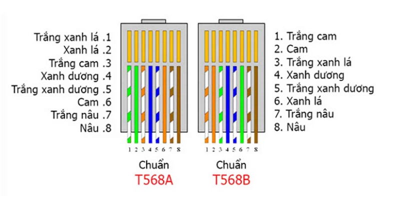
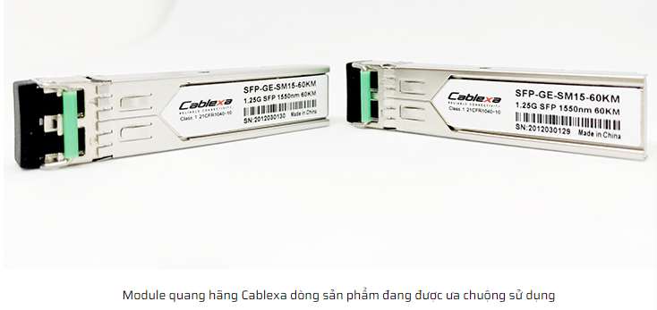

## Mục lục

TỔNG QUAN VỀ CÁC LOẠI CÁP MẠNG VÀ TIÊU CHUẨN BẤM CÁP MẠNG

[I. Tổng quan về các loại cáp mạng](#i-tổng-quan-về-các-loại-cáp-mạng)

- [1. Cáp mạng là gì?](#1-cáp-mạng-là-gì)

- [2. Phân loại cáp mạng](#2-phân-loại-cáp-mạng)

- [3. Ứng dụng cáp mạng](#3-ứng-dụng-cáp-mạng)

[II. Tiêu chuẩn bấm cáp mạng](#ii-tiêu-chuẩn-bấm-cáp-mạng)

- [1. Bấm thẳng](#1-bấm-thẳng)
- [2. Bấm chéo](#2-bấm-chéo)

[III. Các kiểu đầu cắm mạng (hạt mạng)](#iii-các-kiểu-đầu-cắm-mạng-hạt-mạng)

[Tài liệu tham khảo](#tham-khảo-tại)

___

## I. Tổng quan về các loại cáp mạng

### 1. Cáp mạng là gì?

Cáp mạng là phần cứng mạng được sử dụng để kết nối một thiết bị mạng này với các thiết bị mạng khác, ví dụ, kết nối hai hoặc nhiều máy tính để chia sẻ máy in và máy scan; kết nối nhiều máy chủ với một bộ chuyển mạch Access Switch.

Cáp mạng bao gồm: cáp xoắn đôi, cáp đồng trục, cáp quang, đường dây điện,… Trong đó cáp xoắn đôi, cáp đồng trục, cáp quang là những loại phổ biến nhất hiện nay.

Cáp quang chứa các sợi quang làm bằng thủy tinh hoặc nhựa để truyền ánh sáng. So với cáp điện - thường truyền qua đồng dễ bị mất dữ liệu trong khoảng cách xa - cáp quang cung cấp băng thông và độ tin cậy cao hơn trong khoảng cách xa. Cáp quang cũng có xu hướng nhẹ hơn cáp điện nhưng nhìn chung đắt hơn. Do đó, chúng thường được sử dụng trong các ứng dụng mà băng thông và khoảng cách yêu cầu vượt qua giới hạn của cáp điện.

### 2. Phân loại cáp mạng

Có rất nhiều loại cáp mạng. Loại cáp được chọn cho mạng có liên quan đến cấu trúc liên kết, giao thức và kích thước của mạng. Hiểu được đặc điểm của các loại cáp khác nhau và cách chúng liên quan đến các khía cạnh khác của mạng là điều cần thiết để phát triển một mạng thành công.

- Cáp STP (Shielded Twisted Pair) và cáp UTP (Unshielded Twisted Pair)

Cáp xoắn đôi thường được bảo vệ để ngăn chặn hiện tượng nhiễu điện từ. Cáp xoắn đôi được che chắn bởi vỏ chống nhiễu được gọi là cáp xoắn được bảo vệ (STP). Ngược lại với STP, cặp xoắn đôi không được che chắn bởi vỏ chống nhiễu (UTP) sẽ để trần, không được bảo vệ.

Cáp STP cũng được chia thành loại có vỏ chống nhiễu chung và vỏ chống nhiễu riêng. Cáp STP với vỏ chống nhiễu riêng có lá nhôm cho mỗi cặp xoắn hoặc hai cặp xoắn một. Loại vỏ chống nhiễu này bảo vệ cáp khỏi hiện tượng nhiễu điện từ bên ngoài (EMI) vào hoặc ra khỏi cáp, và cũng bảo vệ các cặp xoắn lân cận khỏi hiện tượng nhiễu xuyên âm. Cáp Overall shielded twisted pair (OSTP) có vỏ chống nhiễu chung hoặc vỏ chống nhiễu riêng trên tất cả các cặp trong cáp xoắn đôi. Loại vỏ chống nhiễu này giúp ngăn EMI xâm nhập hoặc thoát khỏi cáp. Một cáp STP có thể có cả vỏ chống nhiễu chung và riêng.

Cáp UTP không có vỏ chống nhiễu dễ bị ảnh hưởng bởi hiện tượng nhiễu từ bên ngoài. Vì lý do đó, loại cáp này thường được tìm thấy trong các ứng dụng điện thoại trong nhà. Cáp điện thoại ngoài trời chứa hàng trăm hoặc hàng ngàn cặp. Các cặp có cùng tốc độ xoắn trong cáp có thể phải chịu một số mức độ nhiễu xuyên âm, vì vậy các cặp dây này thường được lựa chọn cẩn thận trong một cáp lớn để giảm hiện tượng nhiễu xuyên âm.

Hầu hết cáp UTP sử dụng đầu nối RJ45, trông giống như đầu nối điện thoại (RJ11) nhưng có 8 dây thay vì 4 dây.

- Cáp Ethernet - Cáp xoắn đôi thông dụng nhất

_Category 1:_

Cat1 là cáp đồng xoắn đôi không có vỏ bọc nguyên bản nhất theo tiêu chuẩn ANSI/EIA/TIA-568A, nó được phát triển dành cho giao tiếp thoại qua điện thoại không  thể truyền dữ liệu mạng máy tính.

_Category 2:_

Cat2 là cáp xoắn đôi không có vỏ bọc đầu tiên có thể được sử dụng để truyền dữ liệu mạng máy tính theo tiêu chuẩn ANS/EIA/TIA-568A. Tần số truyền sóng là 1MHz, tốc độ truyền sóng là 4MBb/s. Nó chủ yếu được sử dụng cho mạng mã thông báo cũ.

_Category 3:_

Cat3 là cáp xoắn đôi không có vỏ bọc đầu tiên có thể được sử dụng để truyền dữ liệu mạng máy tính theo tiêu chuẩn ANS/EIA/TIA-568A và ISO Class 2/Class A. được thiết kế để truyền dữ liệu đáng tin cậy lên đến 10 Mbit/giây, với băng thông có thể lên tới 16 MHz. Cat 3 là định dạng cáp phổ biến vào đầu những năm 1990, nhưng từ đó, nó gần như hoàn toàn được thay thế bằng tiêu chuẩn Cat 5 tương tự, nhưng mang lại tốc độ cao hơn.

_Category 4:_

Cat4 là cáp xoắn đôi không được che chắn được sử dụng cho mạng vòng mã thông báo theo tiêu chuẩn cấp ANS/EIA/TIA-568A và ISO Category 4/C. Tần số truyền là 20MHz và tốc độ truyền có thể đạt 16Mb/s. Chủ yếu được sử dụng cho mạng LAN dựa trên mã thông báo và 10BASE-T/100BASE-T.

_Category 5:_

Cat5 là cáp xoắn đôi không có vỏ bọc được sử dụng trong các tiêu chuẩn ANSI / EIA / TIA-568A và ISO Category 5/Class D để chạy CDDI (CDDI là mạng FDDI dựa trên dây đồng xoắn đôi) và Fast Ethernet. Tần số truyền là 100MHz, Tốc độ truyền lên đến 100Mb/s.

Cat5e là cáp xoắn đôi không có vỏ bọc được sử dụng để chạy Fast Ethernet theo tiêu chuẩn SNSI/EIA/TIA-568B và ISO Class 5. Tần số truyền là 100MHz và tốc độ truyền có thể đạt 100Mb/s. So với cáp Category 5, Category 5e có những cải tiến lớn hơn trong bốn chỉ số chính về nhiễu xuyên âm gần cuối, tổng hợp nhiễu xuyên âm, suy hao và tỷ lệ tín hiệu trên nhiễu.

_Category 6:_

Cat6 là một loại cáp xoắn đôi không có vỏ bọc được quy định trong tiêu chuẩn ANSI/EIA/TIA-568B.2 và ISO Category6/Class E. Nó chủ yếu được sử dụng trong Fast Ethernet và Gigabit Ethernet. Bởi vì tần số truyền của nó có thể đạt 200-250MHz, gấp đôi băng thông của dòng super-type 5, tốc độ tối đa có thể đạt 1000Mb / s, có thể đáp ứng yêu cầu của Gigabit Ethernet.

Cat6a là phiên bản cải tiến của Cat6. Đây cũng là loại cáp xoắn đôi không có vỏ bọc được chỉ định trong các tiêu chuẩn ANSI/EIA-568B.2 và ISO Category6/Class E. Nó chủ yếu được sử dụng trong mạng Gigabit. Nó tương tự như Cat6 về tần số truyền. Tương tự, nó cũng là 200-250 megabyte, và cây bạch đàn sách tối đa có thể đạt 1000Mb/s, nhưng nó có sự cải thiện lớn về tỷ lệ xuyên âm, suy hao và tín hiệu trên nhiễu.

_Category 7:_

Cat7 là loại cặp xoắn mới nhất trong tiêu chuẩn ISO 7/F. Nó chủ yếu được sử dụng để thích ứng với việc ứng dụng và phát triển công nghệ Ethernet 10 Gigabit. Nhưng nó không còn là cặp xoắn không được che chắn nữa mà là cặp xoắn được che chắn nên tần số truyền của nó có thể đạt ít nhất là 500MHz, cao hơn gấp đôi so với Cat6 và Cat6a, tốc độ truyền có thể đạt 10Gbps.

_Category 8:_

Cat8 hỗ trợ băng thông 2000MHz và tốc độ 40Gbps. Loại cáp này được thiết kế đặc biệt cho Trung tâm dữ liệu và mạng doanh nghiệp, và giá thành đắt hơn.

### 3. Ứng dụng cáp mạng

Hiện nay, cáp mạng đươc sử dụng trong nhiều thiết bị khác nhau từ các phòng máy đến các hệ thống mạng LAN, mạng khu vực hay thậm chí là các hệ thống mạng xuyên quốc gia. Tuy nhiên thực tế hơn hết vẫn là việc sử dụng dây mạng trong sinh hoạt hàng ngày từ việc kết nối Internet. Giờ đây việc sử dụng dây cáp mạng trở nên khá đơn giản khi ta chỉ cần cắm đầu dây mạng vào bất cứ một thiết bị mạng nào. Từ đó tốc độ truyền mạng nhanh hơn, ổn định hơn khiến hiệu quả công việc được tăng cao so với mạng không dây.

## II. Tiêu chuẩn bấm cáp mạng

Hiện nay kiểu bấm dây mạng theo tiêu chuẩn RJ45 là kiểu bấm được sử dụng thông dụng và phổ biến. Ta có 2 chuẩn quy định thứ tự màu dây để người dùng có thể dễ dàng phân biệt là chuẩn T-568B và chuẩn T-568A.

**Chuẩn bấm A**: Thứ tự các màu liên kết với nhau: Trắng xanh lá - Xanh lá - Trắng cam - Xanh dương - Trắng xanh dương - Cam - Trắng nâu - Nâu.

**Chuẩn bấm B**: Thứ tự các màu liên kết với nhau: Trắng cam - Cam - Trắng xanh lá - Xanh dương - Trắng xanh dương - Xanh lá - Trắng nâu - Nâu.

### 1. Bấm thẳng

là kiểu bấm này dùng để nối 2 thiết bị khác loại lại với nhau như: giữa PC – Switch, Switch – Router…Kiểu bấm này người dùng 2 đầu cùng 1 chuẩn (A-A hoặc B-B).

### 2. Bấm chéo

được sử dụng để nối 2 thiết bị cùng loại như: Router – Router, PC – PC, …Kiểu bấm này người dùng sẽ bấm mỗi đầu dây là 1 chuẩn (A-B hoặc B-A).

## III. Các kiểu đầu cắm mạng (hạt mạng)

### 1. Hạt mạng rj45 cat5/cat6 amp

Giải pháp đúng để tùy chỉnh độ dài của cáp mạng modun hoặc Cat5. Những phích cắm kiểu mô-đun này được sản xuất từ ​​vật liệu polycarbonate có độ phản xạ cao để chống lại hao mòn hàng ngày và có các điểm tiếp xúc mạ vàng để truyền dữ liệu không có lỗi cho các ứng dụng thoại và dữ liệu.

Đầu nối của AMP hỗ trợ cho loại cáp mềm (stranded) hoặc cứng (solid) với những ứng dụng mạng hay điện thoại. Hạt mạng amp cat5 cat6 được chế tạo và bán dưới sự cho phép của AT&T. Hạt mạng AMP rj45 bọc sắt và loại thường, với kích cỡ chắc chắn, chất lượng cao, thỏa và vượt các yêu cầu hiệu suất và những ứng dụng UTP 4 đôi dây về đầu cắm (RJ45) chuẩn Category 5e của TIA/EIA -568A và TSB-40A. Những công cụ đa dạng của AMP sẵn sàng cho việc thi công với các loại đầu bấm.

### 2. Hạt mạng cat6a

- Thích hợp cho các kết nối dây dẫn T568A / A568B
- Độ dẻo dẻo tinh thể trong suốt, hiệu quả che chắn tốt hơn
- Nó áp dụng cho cả hai đầu cáp mạng, truyền dữ liệu LAN, công tắc, hub, ADS, các bộ định tuyến ...- Ứng dụng cho dây cáp được bảo vệ STP CAT6A, vv ..
- Dây có độ bền cao và dẻo dai tốt, mạ vàng 24K đồng dày cho kết nối tốt

### 3. Hạt mạng, đầu bấm mạng cat5/ cat6 bọc kim

Hạt mạng, đầu bấm mạng cat5/ cat6 bọc kim  giúp duy trì các xoắn đến điểm chấm dứt giảm đáng kể nhiễu xuyên âm và tăng đáng kể hiệu suất. Hạt mạng cat6 bọc kim được bảo vệ hoàn toàn sẽ giúp giảm nhiễu xuyên âm giữa các cặp, nhiễu xuyên âm và cải thiện đáng kể mức độ ồn ở mọi tần số.

Cải thiện đáng kể khả năng miễn dịch ở tất cả các tần số, đặc biệt là trên 30 MHz khi cân bằng cáp bắt đầu suy giảm đáng kể.

### Đặc trưng của hạt mạng, đầu bấm mạng rj45 cat5 cat6 amp

Tất cả các loại đầu nối được sản xuất tuân theo RoHS, được đúc với loại nhựa theo UL94V-0, được liệt kê trong UL theo tệp E81956.

Đầu nối, hạt mạng, đầu bấm mạng cat5 cat6 amp thỏa hoặc vượt yêu cầu chuẩn EIA/TIA 568A cho chuẩn cat5 cat6 và cat6A của dây mạng amp commscope. Sử dụng một thanh dẫn (load bar) giúp việc chuẩn bị và bấm đầu được dễ dàng, hiệu suất đầu bấm cao, giảm suy hao đáng kể ngay tai đầu bấm, và những yêu cầu khác cũng được đáp ứng (duy trì 1/2 xoắn), cấu trúc giúp việc thi công nhanh hơn.

AMP có sẵn đầu bấm cho cáp cứng (solid) và mềm(stranded).

### Module quang SFP là gì?

Module quang | SFP module Module SFP hay còn được gọi là SFP transceiver, SFP module hay module quang là loại module được dùng cho các thiết bị như switch, converter, DSLAM, SDH có cổng (khe) theo chuẩn SFP (Small Form Factor).

SFP module là một bộ thu phát nhỏ gọn - bộ thu phát quang dạng module thế hệ mới. Thiết bị này được thiết kế để sử dụng cho đầu nối (connector) dạng small form factor (SFF) và có khả năng cắm nóng.

Module quang thường được sử dụng trong các ứng dụng viễn thông và truyền số liệu. Ngày nay SFP module đã trở thành một chuẩn công nghiệp phổ biến, được nhiều nhà sản xuất thiết bị mạng phát triển và hỗ trợ.

Module SFP được thiết kế để hỗ trợ các chuẩn SONET, Gigabit Ethernet, Fibre Channel, và nhiều chuẩn truyền dẫn khác.

.jpg)

_Khái niệm Module quang SFP_

Small Form Factor (SFP) là 1 thiết bị thu phát nhỏ gọn, có thể "gắn nóng" được sử dụng cho cả viễn thông và truyền thông dữ liệu. Một đầu của SFP gắn vào các thiết bị như là switch, router, media converter hoặc thiết bị tương tự; đầu còn lại dùng để gắn cáp quang hoặc đồng. Nó là một giao thức chuẩn phổ biến được hỗ trợ bởi các nhà sản xuất thiết bị mạng và viễn thông.

Cũng như bộ chuyển đổi quang điện converter quang, SFP module cũng có rất nhiều loại và thường được chia làm một số loại dựa trên các đặc điểm sau:

Tốc độ: 155M (10/100Mbps ) , 1.25G (1000Mbps) hay SDH(STM-1, STM-4, STM-16)

Dùng loại cáp quang: multi mode (đa mốt) hay single mode (đơn mốt)

Số sợi quang : 2 sợi quang (2 FO hay dual fiber) , 1 sợi (1 FO hay single fiber)

Hiện nay, khoảng cách tối đa mà Module SFP có thể hỗ trợ là 140Km.

Một Module SFP với chức năng DDM, vậy DDM là gì? Thường khi chúng ta mua bộ thu phát SFP , chúng ta sẽ có tùy chọn với chức năng DDM của nó, vì vậy chức năng DDM là gì? Rõ ràng là một Module SFP với DDM là cao Ender hơn một mà không có chức năng DDM. Những gì sử dụng DDM cho?

DDM có nghĩa là là Digital-chẩn đoán, giám sát trong đó cung cấp cho người dùng với các thông tin quan trọng liên quan đến tình trạng của các tín hiệu truyền và nhận. Cách tiếp cận này cho phép người dùng cô lập các lỗi tốt hơn và phát hiện lỗi.

Công nghệ chuẩn đoán kỹ thuật số theo dõi nhiệt độ các module SFP, quyền lực thu, thiên vị phát hiện, và công suất máy phát. Thông thường, đầu ra của các giá trị vật chất của từng tham số là một điện áp tương tự hoặc hiện tại từ trở kháng khuếch đại Trans, trình điều khiển laser, hoặc các bộ khuếch đại sau.

Các kỹ sư sử dụng ADC để số hóa mọi giá trị vật chất. Đối với giá trị số hóa, một vi điều khiển có thể sau đó hoặc là xử lý dữ liệu như là một phần của một vòng điều khiển, hoặc kích hoạt báo động, hoặc chỉ ghi lại các dữ liệu vào một đăng ký.

Module quang SFP kết nối với những thiết bị gì?
Module quang là một dạng thiết bị cắm nóng nó mang tới sự tiện lợi và linh hoạt cho người dùng. Tất nhiên, module cũng có thể tùy chọn mà kết nối với nhiều thiết bị, nhiều chuẩn đường truyền khác nhau.

Ví dụ trong một hệ thống mạng quang thông thường module sẽ kết nối với dây nhảy quang đầu nối LC, bộ chuyển đổi quang sang lan, hộp ODF quang, đầu nối quang LC. Module quang cũng thường xuyên được dùng với các thiết bị chuyển mạch Switch.

## Tham khảo tại

<https://vnpro.vn/thu-vien/tong-quan-ve-cac-loai-cap-mang-va-tieu-chuan-bam-cap-mang-4316.html>

<http://www.vinacap.vn/tin-cong-ty/%E2%80%9Cchi-mat-dat-ten%E2%80%9D-7-loai-cap-mang-pho-bien-hien-nay-ban-nen-biet.html>

<https://fptshop.com.vn/tin-tuc/for-gamers/rj45-la-gi-148825>

<https://thietbimangthc.com/hat-mang-amp-cat5-cat6.html>

<https://vtxvn.com/hat-mang-la-gi-cach-phan-biet-cac-loai-hat-mang/>

<https://thietbiquang.net/module-quang-sfp-la-gi--c-322-329-5079.html>

Date accessed: 29/05/2023
