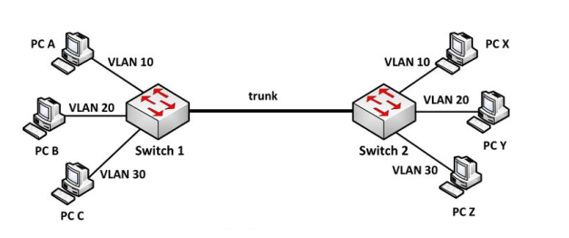

## Mục lục

_Tìm hiểu về VLan_

[Vlan là gì](#vlan-là-gì)

[Phân loại VLAN](#phân-loại-vlan)

[Cách hoạt động của vlan](#cách-hoạt-động-của-vlan)

[VLAN Standard (Tagging) và Native VLAN (untagging)](#vlan-standard-tagging-và-native-vlan-untagging)

[Ưu điểm của vlan](#ưu-điểm-của-vlan)

[Nhược điểm của vlan](#nhược-điểm-của-vlan)

[Khi nào thì cần vlan](#khi-nào-bạn-cần-một-vlan)

[Làm thế nào các máy tính trên VLAN khác nhau có thể giao tiếp với nhau?](#làm-thế-nào-các-máy-tính-trên-vlan-khác-nhau-có-thể-giao-tiếp-với-nhau)

[Tài liệu tham khảo](#tài-liệu-tham-khảo)

___


## VLAN là gì?

VLAN (Virtual Local Area Network) là một mạng tùy chỉnh, được tạo từ một hay nhiều mạng cục bộ khác (LAN). Mạng VLAN cho phép một nhóm thiết bị khả dụng trong nhiều mạng được kết hợp với nhau thành một mạng logic. Từ đó tạo ra một mạng LAN ảo (Virtual LAN), được quản lý giống như một mạng LAN vật lý.

LAN là một mạng cục bộ (viết tắt của Local Area Network), được định nghĩa là tất cả các máy tính trong cùng một miền quảng bá (broadcast domain). Cần nhớ rằng các router (bộ định tuyến) chặn bản tin quảng bá, trong khi switch (bộ chuyển mạch) chỉ chuyển tiếp chúng.

Một VLAN được định nghĩa là một nhóm logic các thiết bị mạng và được thiết lập dựa trên các yếu tố như chức năng, bộ phận, ứng dụng… của công ty. Về mặt kỹ thuật, VLAN là một miền quảng bá được tạo bởi các switch. Bình thường thì router đóng vai trò tạo ra miền quảng bá. Đối với VLAN, switch có thể tạo ra miền quảng bá.


Việc này được thực hiện khi bạn - quản trị viên - đặt một số cổng switch trong VLAN ngoại trừ VLAN 1 - VLAN mặc định. Tất cả các cổng trong một mạng VLAN đơn đều thuộc một miền quảng bá duy nhất.

Vì các switch có thể giao tiếp với nhau nên một số cổng trên switch A có thể nằm trong VLAN 10 và một số cổng trên switch B cũng có thể trong VLAN 10. Các bản tin quảng bá giữa những máy tính này sẽ không bị lộ trên các cổng thuộc bất kỳ VLAN nào ngoại trừ VLAN 10. Tuy nhiên, tất cả các máy tính này đều có thể giao tiếp với nhau vì chúng thuộc cùng một VLAN. Nếu không được cấu hình bổ sung, chúng sẽ không thể giao tiếp với các máy tính khác nằm ngoài VLAN này.

Nếu không có mạng Virtual LAN, một broadcast được gửi từ host có thể dễ dàng đi đến mọi thiết bị mạng. Khi đó, tất cả thiết bị đều sẽ xử lý những frame đã nhận broadcast đó. Việc này sẽ làm tăng đáng kể chi phí cho CPU trên mỗi thiết bị, đồng thời làm giảm khả năng bảo mật của hệ thống.

## Phân loại VLAN

- Port - based VLAN: là cách cấu hình VLAN đơn giản và phổ biến. Mỗi cổng của Switch được gắn với một VLAN xác định (mặc định là VLAN 1), do vậy bất cứ thiết bị host nào gắn vào cổng đó đều thuộc một VLAN nào đó.

- MAC address based VLAN: Cách cấu hình này ít được sử dụng do có nhiều bất tiện trong việc quản lý. Mỗi địa chỉ MAC được đánh dấu với một VLAN xác định.

- Protocol – based VLAN: Cách cấu hình này gần giống như MAC Address based, nhưng sử dụng một địa chỉ logic hay địa chỉ IP thay thế cho địa chỉ MAC. Cách cấu hình không còn thông dụng nhờ sử dụng giao thức DHCP.

## Cách hoạt động của VLAN

- Các Virtual LAN ở trong mạng được xác định bằng một con số cụ thể, hay còn gọi là ID Vlan.
- Phạm vi giá trị hợp lệ là 1- 4094. Trên một switch VLAN, ta có thể chỉ định các cổng với số VLAN thích hợp.

  - Dãy giá trị các VLAN ID chạy từ 0 -> 4095:
  - 1 – 1001 : dải VLAN thường được sử dụng.
  - 1002 – 1005 : dải này dùng để giao tiếp với các kiểu mạng LAN khác.
  - 1006 – 4094: dải VLAN mở rộng, sử dụng khi switch hoạt động ở mode Transparent.
  - 0 và 4095: VLAN dành riêng.
  - VLAN 1, 1002 – 1005: mặc định trên Switch và không thể xóa được.
  - Mặc định VLAN sau khi được tạo sẻ được lưu vào file vlan.dat trong bộ nhớ Flash.

- Tiếp đến, switch sẽ cho phép dữ liệu cần được gửi giữa các port khác nhau có cùng một Virtual LAN.
- Vì hầu hết các mạng đều có nhiều hơn là chỉ một switch duy nhất. Vì vậy, cần có một cách nào đó để có thể gửi lưu lượng giữa hai switch trong mạng. Cách đơn giản nhất chính là gán một port trên mỗi switch của Virtual LAN và chạy một cable giữa chúng (trunking).

## VLAN Standard (Tagging) và Native VLAN (untagging)

Các card Virtual LAN cho mạng Ethernet đều tuân theo tiêu chuẩn công nghiệp IEEE 802.1Q. Card 802.1Q bao gồm 32 bit (tương đương 4 byte) dữ liệu được chèn vào trong Ethernet frame header. Trong đó, 16 bit đầu chứa số 0x8100 được mã hóa, có nhiệm vụ kích hoạt các thiết bị Ethernet nhận dạng frame thuộc một Virtual LAN 802.1Q. Còn 12 bit cuối thì chứa số Virtual LAN, con số sẽ nằm giữa 1 đến 4094 như đã nói ở trên.

Các phương pháp hay nhất về việc quản trị Virtual LAN xác định một số loại mạng ảo tiêu chuẩn như sau:

- **Native LAN**: Các thiết bị Ethernet VLAN coi mọi frame không được dán nhãn (untagged frame) đều thuộc về Native VLAN. Số của native Virtual LAN theo mặc định là 1, tuy nhiên admin có thể thay đổi. Quy chuẩn là 802.3 Ethernet

- **Standard VLAN**: Hỗ trợ các kết nối từ xa của những người quản trị mạng. Có nhiều người thích sử dụng VLAN 1 để quản lý, nhưng cũng có người đặt các con số đặc biệt khác (nhằm tránh xung đột với các lưu lượng mạng khác).

## Ưu điểm của VLAN


**một số ưu điểm tiêu biểu của mạng Virtual LAN:**

- Giải quyết các vấn đề điển hình liên quan đến broadcast
- Giảm kích thước của broadcast domain
- Cho phép tạo thêm một lớp bảo mật bổ sung
- Giúp việc quản lý thiết bị trở nên đơn giản, dễ dàng hơn
- Cho phép tạo một nhóm logic các thiết bị, phân loại theo chức năng
- Có thể tạo các nhóm thiết bị được kết nối logic, có thể hoạt động như trên mạng riêng của mình
- Cho phép phân đoạn mạng dựa trên nhóm, hay chức năng
- Có thể cấu trúc mạng theo vị trí địa lý
- Đem lại hiệu suất cao hơn, độ trễ (latency) thấp hơn
- Người dùng có thể bảo vệ những thông tin nhạy cảm của mình
- Xóa bỏ ranh giới vật lý giữa các nhóm hay chức năng
- Tăng cường bảo mật mạng
- Phân tách các máy chủ
- Không cần thêm phần cứng, cáp, khi phải phân đoạn mạng giúp tiết kiệm đáng kể chi phí
- Việc thay đổi IP subnet của người dùng sẽ nằm trong phần mềm
- Giảm số lượng thiết bị cho cấu trúc liên kết mạng
- Đơn giản hóa việc quản lý các thiết bị vật lý

## Nhược điểm của VLAN

virtual LAN cũng có một số nhược điểm cần phải lưu ý, như:

- Packet có thể bị rò rỉ giữa các VLAN
- Packet được inject có thể dẫn đến cyber attack
- Các mối đe dọa ở trong một hệ thống đơn lẻ có thể phát tán virus cho toàn bộ mạng
- Cần có một router bổ sung để kiểm soát workload trong những mạng lớn
- Khả năng tương tác có thể gặp vấn đề
- Một VLAN không thể chuyển tiếp lưu lượng mạng sang những VLAN khác

## Khi nào bạn cần một VLAN?

Bạn cần cân nhắc việc sử dụng VLAN trong các trường hợp sau:

- Bạn có hơn 200 máy tính trong mạng LAN
- Lưu lượng quảng bá (broadcast traffic) trong mạng LAN của bạn quá lớn
- Các nhóm làm việc cần gia tăng bảo mật hoặc bị làm chậm vì quá nhiều bản tin quảng bá.
- Các nhóm làm việc cần nằm trên cùng một miền quảng bá vì họ đang dùng chung các ứng dụng. Ví dụ như một công ty sử dụng điện thoại VoIP. Một số người muốn sử dụng điện thoại có thể thuộc một mạng VLAN khác, không cùng với người dùng thường xuyên.
- Hoặc chỉ để chuyển đổi một switch đơn thành nhiều switch ảo.

**Tại sao không chia subnet?**

Một câu hỏi thường gặp đó là tại sao không chia subnet (mạng con) thay vì sử dụng VLAN? Mỗi VLAN nên ở subnet của riêng mình. VLAN có ưu điểm hơn subnet ở chỗ các máy tính tại những vị trí vật lý khác nhau (không quay lại cùng một router) có thể nằm trong cùng một mạng. Hạn chế của việc chia subnet với một router đó là tất cả máy tính trên subnet đó phải được kết nối tới cùng một switch và switch đó phải được kết nối tới một cổng trên router.

Với VLAN, một máy tính có thể được kết nối tới switch này trong khi máy tính khác có thể kết nối tới switch kia mà tất cả các máy tính vẫn nằm trên VLAN chung (miền quảng bá).

## Làm thế nào các máy tính trên VLAN khác nhau có thể giao tiếp với nhau?

Khi dùng VLAN, các mạng khác VLAN muốn kết nối với nhau thì dùng 1 đường dây để kết nối, tuy nhiên giả sử có 100 máy, cứ 2 máy cần kết nối 1 đường dây thì sẽ phải tốn 50 đoạn dây.

Khi đó Trunking ra đời để giải quyết vấn đề trên bằng cách dùng 1 đoạn dấy để có thể kết nối.



### Các chuẩn trunking trong một hệ thống mạng

_Chèn thông tin vào Ethernet frame. Khi nó đi trên đường trunk, để biết frame này đến từ VLAN nào để đẩy nó đến VLAN đúng._

#### Chuẩn IEEE và kỹ thuật trunking DOT1Q

Chèn thêm 4 byte VLAN Tag vào sau trường Source Address của Ethernet Frame trên đường đi.


Các trường trong 802.1Q VLAN Tag bao gồm:

- Tag Protocol ID (16 bit) nôi dung trường này luôn được set 0x8100 dùng để định danh ra frame này đã được tag 802.1q để phân biệt với frame untagged trên đường trunk.
- User Priority (3 bit) sử dụng cho kỹ thuật QoS.
- Canonical Format Indicator (1bit) cho biết địa chỉ MAC đang được sử dụng ở định dạng Token Ring hay Ethernet Frame.
- VLAN ID(12bit): cho biết Frame đang chạy trên đường trunk là của VLAN nào.

Khi switch nhận Frame có tag 802.1Q, nó sẽ kiểm tra xem Frame này đến từ VLAN nào. Sau đó nó gỡ bỏ tag và trả về frame mà đúng VLAN thuộc về.

#### Chuẩn Cisco: kỹ thuật trunking ISL


Kỹ thuật Trunking này của Cisco tiến hành chèn thêm Header 26 byte và trường CRC kiểm tra lỗi 4 byte vào Ethernet Frame.

Các trường trong ISL Tag bao gồm:

- DA(Destination Address): 40 bit sẻ set ở dạng 0x01-00-0C-00-00″ or “0x03-00-0c-00-00”. Để báo hiệu bên nhận rằng frame được tag ở dạng ISL.

- Type: 4bit chỉ ra type frame được và sử dụng là gì (0000:Ethernet, 0001: Token ring….).

- User: 4bit chỉ ra độ ưu tiên của frame khi đi qua switch(XX00: normal priority, XX01: priority 1, XX10: priority 2, XX11: highest priority).

- SA(Source Address): 48 bit địa chỉ nguồn của gói tin ISL. Tuy nhiên thiết bị nhận có thể bỏ qua địa chỉ này.

- LEN(Length): 16bit cho biết kích thước của gói tin thực tế.

- AAAA03 là một giá trị 24bit liên tục của 0xAAAA03. HSA (High Bits of Source Address):24 bit trường này chứa giá trị “0x00-00-0C.

- BPDU: được set để tất cả gói tin BPDU được tag ISL (hoạt động trên Spanning Tree Protocol).

- INDEX: 16bit chỉ ra chỉ số port nguồn của gói tin tồn tại trên Switch.

- RES: dài 16bit sử dụng khi Token ring hoặc FDDI được đóng gói frame ISL, với frame Ethernet trường RES được set tất cả bit 0.

### VLAN Trunking Protocol (VTP)

Giao thức đồng bộ thông tin VLAN giữa các thiết bị Switch của Cisco. Khi một hệ thống lớn thì việc tạo, xóa, sửa VLAN trong các Switch trở nên cực kì khó khăn. Thiếu tính chính xác và mất nhiều thời gian. Cisco đưa ra giao thức VTP tiến hành đồng bộ thông tin và cấu hình VLAN giữa các Switch trong cùng một miền Domain.
Các đặc điểm và cách thức hoạt động của VTP:
– VTP hoạt động trên các đường Trunking Layer 2 để trao đổi thông tin VLAN với nhau.
– 3 yếu tố quan trọng của VTP là : VTP domain, VTP password, VTP mode(Server, Client, Transparent). Trong đó
VTP domain : các switch được tổ chức cùng thuộc một domain mới có thể chia sẻ thông tin VLAN với nhau. Được thiết lập tĩnh trên các Switch.

_Đặc điểm_

- Giúp cho việc cấu hình VLAN luôn đồng nhất khi thêm, xóa, sửa thông tin về VLAN trong hệ thống mạng.

- VTP hoạt động trên các đường Trunking Layer 2 để trao đổi thông tin VLAN với nhau

- 3 yếu tố quan trọng của VTP là : VTP domain, VTP password, VTP mode(Server, Client, Transparent). Trong đó VTP domain : các switch được tổ chức cùng thuộc một domain mới có thể chia sẻ thông tin VLAN với nhau.

_VTP Mode_


_Revision Number_

Mặc định số Revision giữa các switch đều bằng 0.

Mỗi khi VTP server thay đổi database, server sẽ tăng giá trị revision lên 1.Sau đó server sẽ quảng cáo database với giá trị revision mới (N+1).

Nếu giá trị revision được quảng cáo cao hơn revision đang được lưu giữ trong các thiết bị khác, server sẽ yêu cầu các thiết bị kia đồng nhất database. Các thiết bị có số revision nhỏ hơn sẽ phải chấp nhận vlan database từ switch có revision lớn hơn.

Quá trình này có ý nghĩa là nếu VTP server xóa tất cả các vlan và vtp có revision number cao nhất, các thiết bị khác cũng sẽ bị xóa vlan.

Để xem revision number, bạn hãy dùng lệnh

```sh
#show vtp domain
```

_VTP Pruning_


- Thông thường, khi VLAN 10 gửi Frame đến host khác thuộc VLAN 10 nhưng nằm ở switch khác. Vì mỗi VLAN là một broadcast domain nên frame này sẽ được truyển đến tất cả các host thuộc VLAN 10 của switch 2. Mặc định khi đi trên trunk nó sẽ cho qua dữ liệu của tất cả VLan nên switch 4 cũng nhận được frame này.

- Khi được bật tính năng VTP Prunning. Switch 4 sẻ gửi thông điệp báo cho switch 1 rằng nó không cần dữ liệu của VLAN 10(vì không tồn tại VLAN10). Và khi switch 1 khi nhận được frame broadcast này sẻ tiến hành chặn frame này không forward nó qua đường trunk đến các SW không tồn tại VLAN 10(switch 4).

## Tài liệu tham khảo

<https://itforvn.com/bai-6-vlan-trunking-vtp/>

<https://quantrimang.com/cong-nghe/vlan-la-gi-lam-the-nao-de-cau-hinh-mot-vlan-tren-switch-cisco-64830>

<https://vietnix.vn/vlan/>

<https://www.forum.vnpro.org/forum/ccnp-enterprise/encor/1281-revision-number>

<https://fptshop.com.vn/tin-tuc/tin-moi/cach-don-gian-phan-biet-cac-loai-vlan-122720#:~:text=VLAN%20s%E1%BA%BD%20%C4%91%C6%B0%E1%BB%A3c%20chia%20ra,cho%20m%E1%BB%99t%20VLAN%20nh%E1%BA%A5t%20%C4%91%E1%BB%8Bnh.>

<https://www.totolink.vn/article/97-vtp-la-gi-vlan-trunking-protocol-la-gi.html#:~:text=K%E1%BA%BFt%20n%E1%BB%91i%20%E2%80%9Ctrunk%E2%80%9D%20l%C3%A0%20li%C3%AAn,VLAN%20tr%C3%AAn%20h%E1%BB%87%20th%E1%BB%91ng%20m%E1%BA%A1ng.>

Date accessed: 29/05/2023


