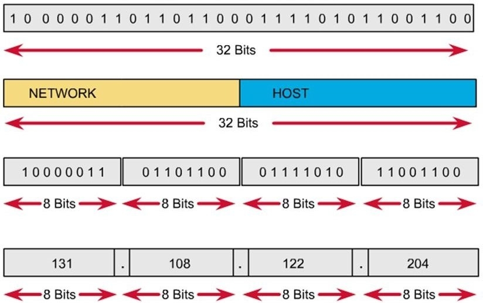
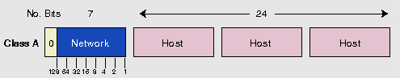
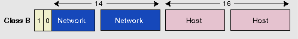
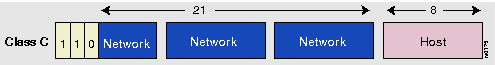

## Mục lục

_Tìm hiểu về địa chỉ IPv4_

[Over view](#over-view)

[I. Cấu trúc địa chỉ IPv4](#i-cấu-trúc-địa-chỉ-ipv4)

[Các lớp địa chỉ IPv4 của lớp Internet TCP/IP](#các-lớp-địa-chỉ-ipv4-của-lớp-internet-tcpip)

[Range địa chỉ Public và Private Address](#range-địa-chỉ-public-và-private-address)

[Địa chỉ Broadcast](#địa-chỉ-broadcast)

[Subnet mask và Prefix length](#subnet-mask-và-prefix-length)

[Tài liệu tham khảo](#tài-liệu-tham-khảo)

___

## Over view

- Chức năng của lớp Internet TCP/IP này trong mô hình TCP/IP tương tự như lớp Network trong mô hình OSI. Nhiệm vụ chính của lớp này là định tuyến đường truyền, tìm đường đi tối ưu nhất cho gói tin trong một lưu lượng. Cung cấp cách thức truyền tải dữ liệu trên sơ đồ đã định tuyến và cung cấp cách thức đánh địa chỉ logic để định tuyến đươc đường truyền.

- Và một giao thức đặc trưng của lớp Internet TCP/IP là giao thức IP – Internet Protocol, một giao thức của chồng giao thức TCP/IP, giao thức IP được sử dụng rộng rãi trọng mọi hệ thống mạng. Được sử dụng để định danh một thiết bị mạng trên hệ thống mạng giúp chúng nhận diện và liên lạc với nhau.

- Ipv4 là giao thức mang tính hướng dữ liệu và được sử dụng cho hệ thống chuyển mạch gói. Ipv4 không quan tâm đến thứ tự truyền gói tin, cũng không đảm bảo gói tin sẽ đến đích hay là có xảy ra tình trạng lặp gói tin ở đích đến hay không. Nó chỉ có cơ chế đảm bảo tính toàn vẹn dữ liệu bằng việc sử dụng những gói kiểm tra được thiết lập đi kèm với nó.

## I. Cấu trúc địa chỉ IPv4

- Địa chỉ IPv4 có 32 bit, chia thành 4 cụm, mỗi cụm 8 bit. Mỗi 1 cụm được gọi là 1 octet => có 4 octet, được ngăn cách nhau bởi dấu chấm.
- Địa chỉ IPv4 được chia thành 5 lớp A, B, C, D và E => có 2^32 khoảng 4,3 tỷ IP trong đó chỉ sử dụng 3 lớp A, B, C.
- Nên còn lại 3,8 tỷ địa chỉ IP.
- được chia thành 2 phần chính: net-id và host-id
- Trong phần Net-id:
  - Các bit phần Network không được đồng thời = 0
- Trong phần host-id nếu
  - các bit host = 0 : đây là địa chỉ mạng
  - các bit host = 1 : đây là địa chỉ broadcast



## Các lớp địa chỉ IPv4 của lớp Internet TCP/IP

- Lớp A:

  - Địa chỉ mạng thuộc lớp A sẻ lấy octet đầu tiên làm net-id, 3 octet cuối làm host-id,
  - Bit đâu tiên của lớp A luôn là 0.
  - Dãy địa chỉ lớp A : 1.0.0.0 – 126.0.0.0, có 2^7 mạng trong lớp A
  - địa chỉ 127.0.0.0 được dùng làm địa chỉ loopback, thường sử dụng để trỏ về lại chính thiết bị của mình.
  - Tổng số host của lớp A : (2^24) – 2  / do phần host có 24 bit

  

- Lớp B:

  - Địa chỉ mạng thuộc lớp B sẻ lấy 2 octet đầu tiên làm net-id, 2 octet cuối làm host-id,
  - Bit đâu tiên của lớp B luôn là 10.
  - Dãy địa chỉ lớp B : 128.0.0.0 – 191.255.0.0, có 2^14 mạng trong lớp B
  - Tổng số host của lớp B : (2^16) – 2  / do phần host có 16 bit

  

- Lớp C:

  - Địa chỉ mạng thuộc lớp c sẻ lấy 3 octet đầu tiên làm net-id, 1 octet cuối làm host-id,
  - Bit đâu tiên của lớp C luôn là 110.
  - Dãy địa chỉ lớp C : 192.0.0.0 – 223.255.255.0, có 2^21 mạng trong lớp C
  - Tổng số host của lớp C : (2^8) – 2  / do phần host có 8 bit

  

- Lớp D:

  - Gồm các địa chỉ nằm trong dãy: 224.0.0.0 – 239.255.255.255
  - Được sử dụng làm địa chỉ multicast VD : 224.0.0.5, 224.0.0.6 dùng cho giao thức OSPF, 224.0.0.9 dùng cho giao thức RIPv2
  - Chủ yếu dùng cho việc nghiên cứu.

- Lớp E:

  - Từ địa chỉ 240.0.0.0 trở đi, được sử dụng mục đích dự phòng

- Range địa chỉ dùng đặt cho các host của các lớp:

  - A: 1 – 126

  - B: 128 – 191

  - C: 192 – 223

  - D: 224 – 239

  - E: 240 – 255

## Range địa chỉ Public và Private Address

- Private address: được sử dụng trong mạng nội bộ, không được định tuyến trong môi trường Internet, trong các mạng LAN khác nhau có thể lặp lại.

- Public address: địa chỉ được sử dụng cho các gói tin trong môi trường Internet được định tuyến và sử dụng trong môi trường Internet. Địa chỉ public không được lặp lại và chỉ có một.

- Range địa chỉ Private :

  - A: 10.x.x.x
  - B: 172.16.x.x – 172.31.x.x
  - C: 192.168.x.x

- Range địa chỉ Public : các địa chỉ nằm ngoài Range địa chỉ Private, muốn chuyển đổi giữa IP private và IP public và ngược lại chúng ta dùng kĩ thuật NAT(Network Address Translation).

## Địa chỉ Broadcast

- Hay còn được gọi là _miền quảng bá_, mục đích chính là để gửi và nhận gói tin trên toàn mạng, nhằm xác định vị trí của mình và của đích trong lần đầu tiên giao tiếp.

- Được phân làm 2 loại:

  - Direct broadcast (trực tiếp): gửi gói tin broadcast đến chính xác một dải IP nhất định.
  - Local broadcast (địa phương): gửi gói tin broadcast ra toàn mạng
  - vd: host có địa chỉ IP là 192.168.2.1. Khi host gửi broadcast đến 255.255.255.255, tất cả các host trong mạng sẽ được nhận gói broadcast này. Trong trường hợp host gửi broadcast đến địa chỉ 192.168.1.255, chỉ các host trong mạng 192.168.1.0 sẽ nhận được gói broadcast này, còn host thuộc mạng 192.168.2.0 sẽ không nhận được.

- Bạn dễ nhầm lẫn giữa địa chỉ broadcast và địa chỉ multicast. Nhưng có 2 điểm để phân biệt chúng như sau:

  - Địa chỉ multicast chỉ đại diện cho một nhóm thiết bị trong mạng cụ thể; còn địa chỉ broadcast đại diện cho tất cả các thiết bị trong cùng mạng.
  - Các gói tin gửi đến địa chỉ multicast được phép đi qua bộ định tuyến; trên địa chỉ broadcast thì không được đi qua bộ định tuyến.

## Subnet mask và Prefix length

- Subnet mask: được định nghĩa một dãy nhị phân dài 32 bit kèm một địa chỉ IP để xác nhận Phần net – id mà host này thuộc về. Sử dụng thuật toán AND để xác định.

- Sử dụng thuật toán AND để tính toán:

    1 AND 1 = 1

    0 AND 0 = 0

    0 AND 1 = 0

    1 AND 0 = 0

- VD: 192.168.12.1 có subnet-mask là 255.255.255.0 thì hệ thống sẻ sử dụng AND để xác định lớp mạng mà host này thuộc về. Phép toán AND được mô tả dưới đây

```sh
192.168.12.1    11000000.10100000.00001100.00000001 - IP
255.255.255.0   11111111.11111111.11111111.00000000 - subnet-mask
192.168.12.0    11000000.10100000.00001100.00000000 - range
```

- Prefix length: số bít mạng của một địa chỉ IP được viết ngay sau địa chỉ IP để định danh subnetmask cho địa chỉ đó, ngắn cách bởi dấu “/” VD: 192.168.12.3/24, 172.16.23.12/16, 10.0.0.2/8.

## Tài liệu tham khảo

<https://maychusaigon.vn/ipv4-la-gi/>

<https://itforvn.com/bai-4-lop-internet-mo-hinh-tcpip/>

<https://bizflycloud.vn/tin-tuc/ipv4-la-gi-20210607115922143.htm>

<https://securityzone.vn/t/bai-5-tim-hieu-dia-chi-ipv4.97/>

<https://viblo.asia/s/mot-so-kien-thuc-co-ban-ve-mang-may-tinh-nB5pX8vr5PG>

<https://bizflycloud.vn/tin-tuc/dia-chi-broadcast-la-gi-cach-kiem-tra-dia-chi-broadcast-20200930155307999.htm>

subnet mask:

<https://viblo.asia/p/tim-hieu-giao-thuc-ip-phan-2-XL6lAMNmlek>
