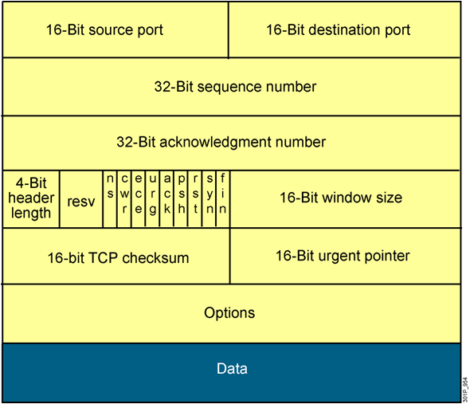
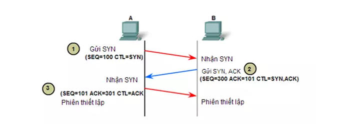
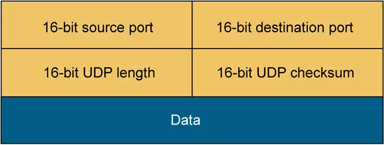

## Mục lục

_Tìm hiểu về UDP và TCP, so sánh chúng_

## Giao thức TCP (Tranmission Control Protocol)

- TCP là giao thức truyền tải hướng kết nối (connection-oriented), nghĩa là phải thực hiện thiết lập kết nối với đầu xa trước khi thực hiện truyền dữ liệu. Tiến trình thiết lập kết nối ở TCP được gọi là tiến trình bắt tay 3 bước (threeway handshake).

- Cung cấp cơ chế báo nhận (Acknowledgement) :Khi A gửi dữ liệu cho B, B nhận được thì gửi gói tin cho A xác nhận là đã nhận. Nếu không nhận được tin xác nhận thì A sẽ gửi cho đến khi B báo nhận thì thôi.

- Cung cấp cơ chế đánh số thứ tự gói tin (sequencing) cho các đơn vị dữ liệu được truyền, sử dụng để ráp các gói tin chính xác ở điểm nhận và loại bỏ gói tin trùng lặp.

- Có các cơ chế điều khiển luồng thích hợp (flow control) để tránh nghẽn xảy ra.

- Hỗ trợ cơ chế full-duplex ( truyền và nhận dữ liệu cùng một lúc)

- Phục hồi dữ liệu bị mất trên đường truyền ( A gửi B mà không thấy xác nhận sẽ gửi lại) .

### Cấu trúc gói tin TCP

Do là giao thức tin cậy nên cấu trúc gói tin của TCP rất phức tạp

- Source port và destination port (đều dài 16 bit): được sử dụng để định danh cho session của giao thức nào đó trên lớp ứng dụng đang được truyền tải trong TCP segment đang xét
- Sequence number (32 bit): dùng để đánh số thứ tự gói tin (từ số sequence nó sẽ tính ra được số byte đã được truyền).
- Acknowledge number (32 bit): dùng để báo đã nhận được gói tin nào và mong nhận được byte mang số thứ tự nào tiếp theo.
- Header length (4 bit): cho biết toàn bộ header dài bao nhiêu tính theo đơn vị word(1 Word = 4 byte).
- Các bit reserverd (4 bit): đều được thiết lập bằng 0
- Các bit control (9 bit): các bit dùng để điều khiển cờ (flag) ACK, cờ Sequence ...
- Window size (16 bit): số lượng byte được thiết bị sẵn sàng tiếp nhận
- Checksum (16 bit): kiểm tra lỗi của toàn bộ TCP segment
- Urgent pointer (16 bit): sử dụng trong trường hợp cần ưu tiên dữ liệu
- Options (tối đa 32 bit): cho phép thêm vào TCP các tính năng khác
- Data: dữ liệu của lớp trên

### Cách thức hoạt động

Giả sử host A muốn truyền dữ liệu cho host B thông qua một kết nối TCP. Trước khi thực hiện truyền , host A cần phải thiết lập kết nối TCP với host B việc này được tiến hành thông qua quá trình bắt tay 3 bước như sau:

- Bước 1: Host A gửi cho B một gói tin có cờ SYN được bật lên, với số thứ tự được đánh là 100. Segment đầu tiên này không chứa phần dữ liệu nên không có phần data, tuy nhiên số lượng byte dữ liệu vẫn được tính là một byte cho hoạt động gửi cờ SYN.
- Bước 2: Host B nhận được gói tin thì B gửi lại gói tin có cờ SYN được bật lên, kèm theo đó là cờ ACK để xác nhận.

Giả sử host B thiết lập segment có số thứ tự là 300. Segment trả lời từ Host B này cũng không có dữ liệu nhưng vẫn được tính là 1 byte cho phần data. Khi phản hồi lại host A, host B cũng cần phải chỉ rõ trong trường ACK sequence số thứ tự của byte kế tiếp mà nó muốn nhận từ host A. Do segment SYN do A gửi qua được tính là 1 byte nên B sẽ mong muốn nhận byte tiếp theo là byte thứ 101 từ A , do đó ACK sequence được đánh số là 101. (SEQ=300, ACK=101)

- Bước 3: Sau khi kết nối đã được thiết lập thì A gửi lại gói tin để đáp ứng nhu cầu của B. Gói tin được đánh số SEQ = 101 để đáp ứng nhu cầu của B. ACK =301 dùng để báo là đã nhận được gói tin có SEQ = 300.

Sau khi 3 bước được hoàn tất , kết nối TCP được thiết lập giữa host A và B, lúc này 2 host đã có thể truyền dữ liệu được với nhau.

- Giao thức TCP thường được dùng cho các hoạt động cần tính tin cậy cao như gửi mail, truyền file (nfs, ftp,...), login,....

### Các ưu và nhược điểm của TCP

**Ưu điểm**

- Hỗ trợ cài đặt kết nối các loại máy tính khác nhau lại với nhau.
- Vận hành riêng biệt với hệ điều hành.
- Hỗ trợ đa dạng giao thức định tuyến.
- Giúp Internet và các tổ chức kết nối với nhau.
- Với kiến ​​trúc client-server mô hình TCP/IP dễ dàng nâng cao.
- Vận hành độc lập.
- TCP được áp dụng vào việc thiết lập kết nối giữa hai máy tính với nhau.

**Nhược điểm**

- TCP sẽ không bao giờ dừng lại quá trình truyền tin mà không yêu cầu chi tiết tất cả dữ liệu đang chuyển động.
- Người dùng cũng không thể dùng để truyền phát hay truyền đa hướng.
- Người dùng cần phải tạo ranh giới riêng cho mình vì TCP không có ranh giới khối.
- Có một số tính năng mà người dùng không mong muốn từ TCP. Những tính năng này gây lãng phí băng thông, chiếm thời gian hoặc tốn công.
- Mô hình hóa lớp truyền tải không chịu trách nhiệm việc phân phối các gói tin.
- Việc thế chỗ giao thức trong TCP/IP rất khó khăn.
- Không cung cấp sự minh bạch với các dịch vụ, giao diện và giao thức của nó.

## Giao thức UDP (User Datagram Protocol)

- Ngược lại với giao thức TCP thì UDP là giao thức truyền tải hướng không kết nối (connectionless). Nó sẽ không thực hiện thao tác xây dựng kết nối trước khi truyền dữ liệu mà thực hiện truyền ngay lập tức khi có dữ liệu cần truyền (kiểu truyền best effort) => truyền tải rất nhanh cho dữ liệu của lớp ứng dụng.
- Không đảm bảo tính tin cậy khi truyền dữ liệu và không có cơ chế phục hồi dữ liệu ( nó không quan tâm gói tin có đến đích hay không, không biết gói tin có bị mất mát trên đường đi hay không) => dễ bị lỗi.
- Không thực hiện các biện pháp đánh số thứ tự cho các đơn vị dữ liệu được truyền…
- Nhanh và hiệu quả hơn đối với các dữ liệu có kích thước nhỏ và yêu cầu khắt khe về thời gian.
- Bản chất không trạng thái nên UDP hữu dụng đối với việc trả lời các truy vấn nhỏ với số lượng lớn người yêu cầu.

### Cấu trúc gói tin UDP

- source port và destination port(đều 16 bit): cho phép định danh một session của một ứng dụng nào đó chạy trên UDP. Có thể coi port chính là địa chỉ của tâng Transport
- UDP length(16 bit): cho biết chiều dài của toàn bộ UDP datagram tổng cộng bao nhiêu byte. (16 bit thì sẽ có tổng cộng 2^16 byte = 65536 giá trị (từ 0 -> 65535 byte)).
- UDP checksum(16 bit): sử dụng thuật toán mã vòng CRC để kiểm lỗi cho toàn bộ UDP datagram và chỉ kiểm tra một cách hạn chế
- Data: dữ liệu tầng trên được đóng gói vào UDP datagram đang xét.

### Cách hoạt động của UDP

UDP hoạt động tương tự như TCP nhưng nó không cung cấp kiểm tra lỗi khi truyền gói tin.

Khi một ứng dụng sử dụng UDP, các gói tin chỉ được gửi đến người nhận. Người gửi không đợi để đảm bảo người nhận nhận được gói tin hay không, mà tiếp tục gửi các gói tiếp theo. Nếu người nhận miss mất một vài gói tin UDP thì gói tin đó coi như bị mất vì người gửi sẽ không gửi lại chúng. => Các thiết bị có thể giao tiếp nhanh hơn.

Dễ thấy ví dụ nhất là sử dụng UDP trong việc live stream, đảm bảo nhanh, người dùng luôn được cập nhật thông tin 1 cách nhanh nhất có thể.

Thông thường UDP sẽ liên kết với các giao thức nâng cao để giám sát các dịch vụ truyền dữ liệu như:

- Giao thức truyền tải file đơn giản (TFTP).
- Giao thức truyền tin thời gian thực (RTSP).
- Giao thức liên mạng đơn giản (SNP).
- Hệ thống phân giải tên miền (DNS).

### Các ưu và nhược điểm của UDP

**Ưu điểm**

- Không giới hạn bạn với một mô hình giao tiếp dựa trên kết nối. Chính vì thế mà độ trễ khởi động của các ứng dụng phân tán thấp.
- Chúng không được quản lý bởi người nhận, nó bao gồm các ranh giới khối.
- UDP có thể truyền phát và truyền đa hướng.
- Có thể diễn ra việc mất dữ liệu.
- Giao dịch nhỏ (DNS lookup).
- Ứng dụng chuyên dụng về băng thông cho phép hiện tượng mất gói.

**Nhược điểm**

- Với UDP, trên cùng một gói tin có khả năng sẽ không được phân phối hoặc phân phối lần hai. Quá trình truyền sẽ không được diễn ra theo thứ tự.
- Trong trường hợp xảy ra xung đột thì các router sẽ không thực hiện truyền lại lần nữa.
- UDP không tích hợp Congestion Control và tính năng kiểm soát luồng, vì thế ứng dụng người dùng sẽ đảm nhiệm việc triển khai.
- Tình trạng bị mất gói nghiêm trọng hơn thường xuyên xảy ra tại UDP.

## So sánh UDP và TCP

Giống nhau: đều là các giao thức mạng TCP/IP, có chức năng kết nối các máy lại với nhau và có thể gửi dữ liệu cho nhau….

Khác nhau:

|TCP|UDP|
|---|---|
|Hướng kết nối|Hướng không kết nối|
|Độ tin cậy cao|Độ tin cậy thấp|
|Gửi dữ liệu dạng luồng byte|Gửi đi Datagram|
|Không cho phép mất gói tin|Cho phép mất gói tin|
|Đảm bảo việc truyền dữ liệu|Không đảm bảo việc truyền dữ liệu|
|Có sắp xếp thứ tự các gói tin|Không sắp xếp thứ tự các gói tin|
|Tốc độ truyền thấp hơn UDP|Tốc độ truyền cao|

## Tài liệu tham khảo

<https://viblo.asia/s/mot-so-kien-thuc-co-ban-ve-mang-may-tinh-nB5pX8vr5PG>

<https://vietnix.vn/udp-va-tcp/#:~:text=Trong%20%C4%91%C3%B3%2C%20TCP%20l%C3%A0%20m%E1%BB%99t,packet%20in%20chunks%20d%C3%B9ng%20UDP.>

