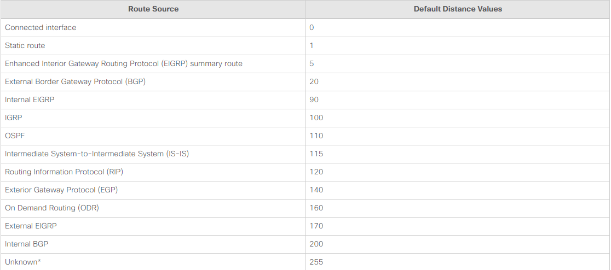

## Mục lục

_Lý thuyết cơ bản về định tuyến tĩnh và định tuyến động_

[Over view](#over-view)

[Định tuyến tĩnh](#định-tuyến-tĩnh)

[Định tuyến động](#định-tuyến-động)

[Một vài giá trị cơ bản trong routing](#một-vài-giá-trị-cơ-bản-trong-routing)

[Tài liệu tham khảo](#tài-liệu-tham-khảo)

## Over view

- Định tuyến (Routing) là quá trình tìm kiếm và xác định đường đi tốt nhất trên một mạng máy tính để gói tin tới được đích thông qua các thiết bị định tuyến. Hay có thể hiểu định tuyến là quá trình vẽ ra bản đồ mạng, với kết quả là tìm ra đường đi tốt nhất đến đích.

- Để làm được điều đó thì các thiết bị định tuyến cần phải dựa vào thông tin bẳng định tuyến (Routing Table) và giao thức định tuyến ( Routing Protocol).

- Phân loại về định tuyến:

  - Static Route- Định tuyến tĩnh.
  - Dynamic Route- Đinh tuyến động.
  - Default Route.

- Thông tin về các mạng đích đến (Destination networks) và đường đi tối ưu để đi đến các mạng này được router lưu trong một bảng gọi là bảng định tuyến (Routing table). Khi một gói tin đi đến router, Router sẽ kiểm tra xem destination của gói tin này đã được lưu trong bảng định tuyến chưa. Nếu đã được lưu trữ, router sẽ chuyển gói đi theo đường đi tối ưu đã được xác định. Nếu chưa được lưu trữ, router sẽ xem như mình không biết đường đi đến đích dến của gói tin, nó sẽ thực hiện loại “drop” gói tin và phát một bản tin ngược về nơi xuất phát của gói tin về để thông báo về điều này.

Để định tuyến cho một packet đi đến mạng nào đó, router cần phải cập nhật thông tin về mạng này trong bảng định tuyến và phải xác định được đường đi tối ưu để đi đến mạng đích này.

- Defaul gateway
  - Nó có địa chỉ IP cục bộ trong cùng dải địa chỉ với các máy khác trên mạng cục bộ.
  - Nó có thể chấp nhận dữ liệu vào mạng cục bộ và chuyển tiếp dữ liệu ra khỏi mạng cục bộ.
  - Nó định tuyến lưu lượng đến các mạng khác.
  => Cần có cổng mặc định để gửi lưu lượng ra bên ngoài mạng cục bộ. Router dựa vào địa chỉ IP đích (destination IP) trong các gói tin và sử dụng bảng định tuyến (routing table) để xác định đường đi cho chúng.

- Bảng định tuyến
  - Danh sách các đường đi có thể từ nguồn đến đích
  - Địa chỉ đích/mặt nạ mạng, Router kế tiếp (interface, metris)
  - Cho phép với một địa chỉ mạng đích thì phải gửi gói tin ra giao diện mạng nào của router
  - Bảng định tuyến được tạo ra do các router trao đổi bản tin định tuyến thông qua các giao thức định tuyến(routing protocols)

## Định tuyến tĩnh

- Định tuyến tĩnh là phương pháp định tuyến theo phương thức người quản trị khai báo thông tin định tuyến cho thiết bị định tuyến theo phương thức thủ công.

- Ưu điểm:
  - Sử dụng ít băng thông hơn so với các phương thức định tuyến khác.
  - Không tiêu tốn tài nguyên để tính toàn và phân tích gói tin định tuyến.
  - Dễ dàng triển khai, cấu hình.
  - Có tính bảo mật tốt hơn.

- Nhược điểm:
  - Không có khả năng tự động cập nhật đường đi.
  - Phải cấu hình thủ công khi mạng có sự thay đổi.
  - Khả năng mở rộng kém, phù hợp với mô hình mạng nhỏ.
  - Những trường hợp sử dụng định tuyến tĩnh:
  - Đường truyền có băng thông thấp.
  - Người quản trị cần kiểm soát các kết nối trong hệ thống.
  - Hệ thống co các tuyến kết nối ít.
  - Kết nối dùng định tuyến tĩnh là đường dự phòng cho đường kết nối dùng giao thức định tuyến động.

- Phương thức triển khai định tuyến tĩnh: Next hop hoặc Exit Interface
  - Next hop: thông tin sẽ chuyển đến Router kế tiếp nào trước khi đến đích.
  - Exit Interface: thông tin sẽ được đưa ra cổng nào trước khi đến đích.

## Định tuyến động

- Định tuyến động là phương thức tự động chia sẻ, trao đổi thông tin giữa các thiết bị định tuyến dựa trên các giao thức định tuyến động.
- Tự động cập nhật thông tin bảng định tuyến nếu hệ thống có sự thay đổi.
- Tính toán và đưa ra tuyến đường chuyển thông tin tốt nhất.

### Mục đích của định tuyến động

Trong một mạng rất lớn có rất nhiều bộ định tuyến như mạng Internet, việc cập nhật bảng định tuyến bằng tay là không thể, vì vậy cần phải có giao thức định tuyến, giao thức định tuyến cho phép các Router xây dựng bảng định tuyến một cách linh hoạt đó là:

- Khám phá mạng từ xa.
- Duy trì việc cập nhật thông tin định tuyến.
- Tính toán và chọn tuyến đường đi tốt nhất đến đích.
- Nếu tuyến đường chuyển thông tin chính bị lỗi, tự tính toán và đưa ra tuyến đường chuyển thông tin backup.

### Phân loại định tuyến động

- Exterior Gateway Protocols (định tuyến ngoài): có giao thức BGP
- Interior Gateway Protocols (định tuyến trong): Distance Vector Protocols và Link- State Protocols.
  - Giao thức Distance Vector: có giao thức RIPv1, RIPv2 và IGRP, EIGRP.
  - Giao thức Link- State: có giao thức OSPF và IS-IS
  - Giao thức Hybrid: tiêu biểu là giao thức EIGRP. Loại hình này kết hợp các đặc điểm của hai loại trên. Tuy nhiên, EIGRP thực chất vẫn là giao thức loại Distance – vector nhưng được Cisco cải tiến thêm để tăng tốc độ hội tụ và quy mô hoạt động. Đây cũng là loại hình định tuyến độc quyền của Cisco.

- Các giao thức IGP cũng có thể chia làm 2 loại:
  - Các giao thức classful: Router sẽ không gửi kèm subnet-mask trong bảng tin định tuyến của mình. Từ đó giao thức classful không hỗ trợ sơ đồ VLSM và mạng gián đoạn (Discontiguos networks). Giao thức tiêu biểu là RIPv1.
  - Các giao thức classless: ngược lại với classful, Router có thể gửi kèm subnet-mask trog bảng địn tuyến. Từ đó các giao thức classless có hỗ trợ sơ đồ VLSM và mạng gián đoạn. Các giao thức tiêu biểu là: RIPv2, OSPF, EIGRP.

## Một vài giá trị cơ bản trong routing

### Giá trị AD (Adminstraive Distance)

AD (Adminstraive Distance) là giá trị được sử dụng để đo đạc mức độ ưu tiên giữa các kĩ thuật định tuyến. Khi một router học được những đường đi khác nhau từ nhiều phương thức định tuyến khác nhau cho cùng một đích đến. Router sẽ chọn đường đi theo phương thức nào có AD nhỏ nhất.

Lưu ý giá trị AD này khác nhau theo từng Vendor qui định. Bảng dưới là giá trị AD của Cisco qui định.

Bên cạnh khái niệm AD thì Longest-match cũng là một khái niệm khá quan trọng trong routing. Khái niệm longest-match trong routing hay còn gọi là Longest prefix match. Sau khi xây dựng xong bảng tuyến, best-route sẽ được chọn để Router thực hiện forward dữ liệu dựa vào longest-match. Tức là mạng nào có prefix-lenth dài nhất. Tức là route này chi tiết nhất nên sẻ được chọn làm best-path route trong bản định tuyến.

### Metric

Metric là giá trị dùng để định lượng mức độ tối ưu của 1 đường đi trong tính toán định tuyến. Trong các đường đi đến cùng 1 đích đến. Đường đi nào có metric nhỏ nhất. Đường đi đó được xem là tối ưu nhất và được đưa vào bảng định tuyến để được sử dụng.

Mỗi kĩ thuật Routing khác nhau sẽ có phương pháp tính metric khác nhau cho các đường đi:

- RIP thực hiện metric dựa vào số router trên đường đi đến đích gọi là hop-count.
- OSPF tính metric dựa vào băng thông (Bandwidth) của các đường truyền.
- EIGRP tính metric dựa vào một bộ các thông số khác nhau trên đường đi đến dích như băng thông (Bandwidth), độ trể (delay), độ tin cậy (reliability), tải (load) của đường truyền.

### Sự hội tụ (Convergence)

Là quá trình router thay đổi và cập nhật thông tin định tuyến tương ứng với những sự thay đổi diễn ra trên hệ thống mạng. Khi trên mạng xảy ra một thay đổi như đường link nối giữa các router bị down. Hoặc đường link mới được thêm vào. Các tuyến trình định tuyến trên các router phải nắm bắt thông tin và cập nhật các đường đi sao cho phù hợp với những thay đổi này. Quá trình diễn ra phải càng nhanh càng tốt và mức độ hội tụ nhanh chậm còn tùy thuộc vào nhiều yếu tố. Các kĩ thuật định tuyến khác nhau sẽ có tốc độ hội tụ khác nhau.

## Tài liệu tham khảo

<https://itforvn.com/cac-ki-thuat-dinh-tuyen/>

<https://maychuvatly.com/blog/dinh-tuyen-la-gi-cac-loai-dinh-tuyen/>

<https://www.forum.vnpro.org/forum/ccna%C2%AE/icnd-2-routing-access-list/6244-%C4%91%E1%BB%8Bnh-tuy%E1%BA%BFn-%C4%91%E1%BB%99ng-v%C3%A0-%C4%91%E1%BB%8Bnh-tuy%E1%BA%BFn-t%C4%A9nh>

<https://vnpro.vn/thu-vien/khai-niem-va-cau-hinh-dinh-tuyen-tinh-2347.html>
