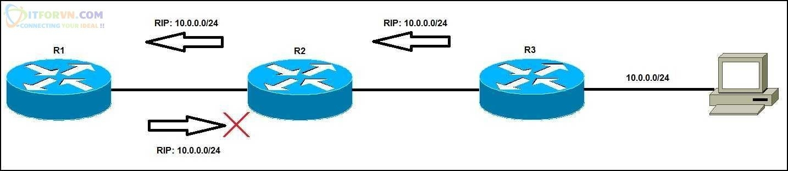
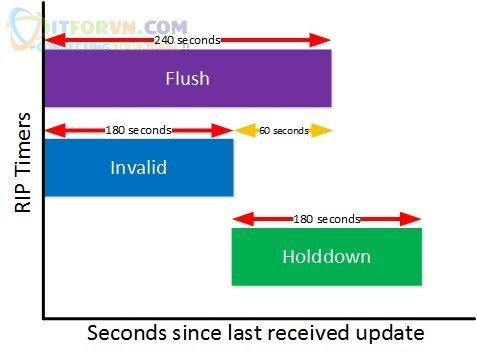
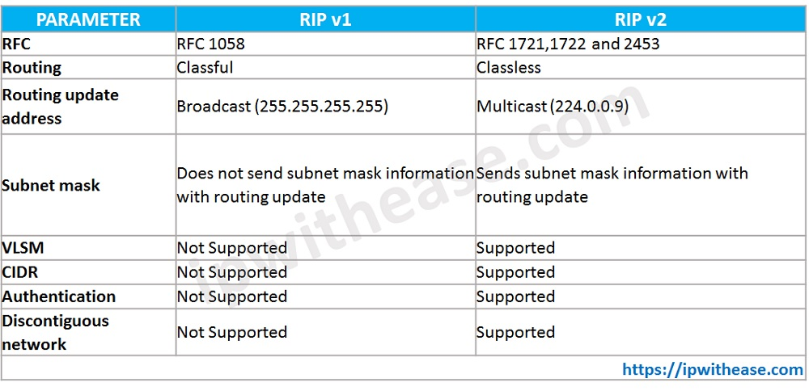
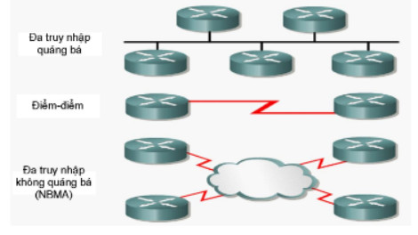
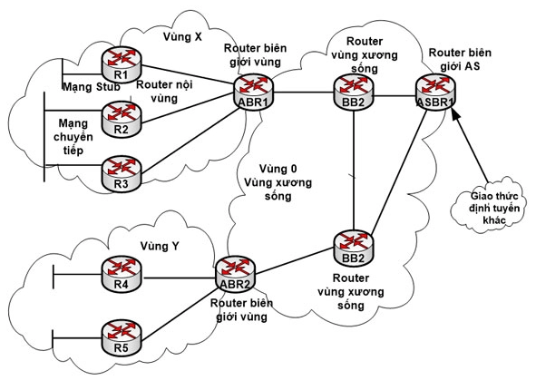
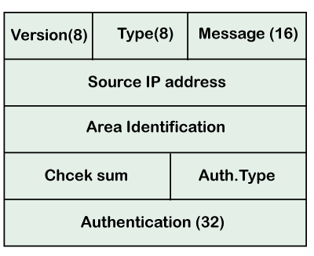
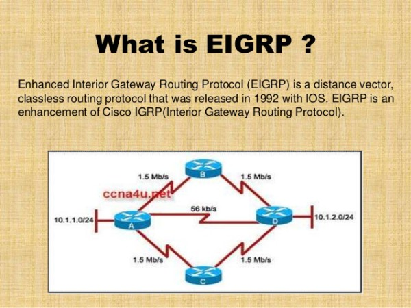
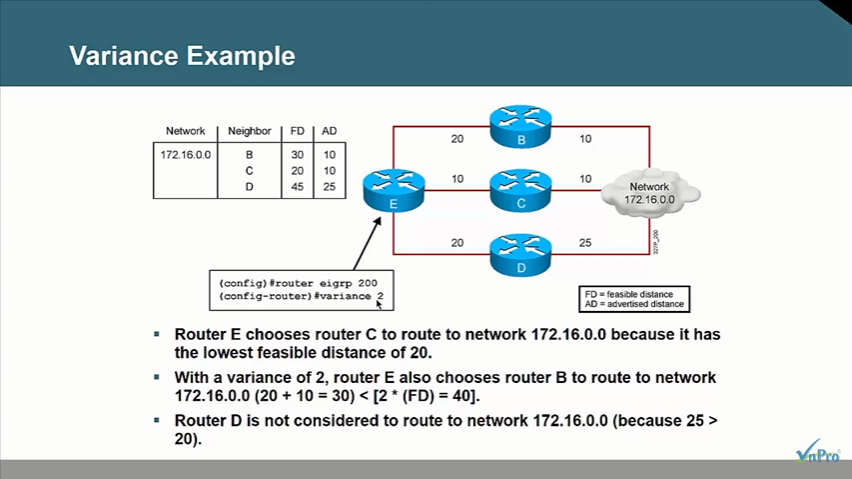

## Mục lục

_Một vài phương pháp định tuyến cơ bản_

[Giao thức định tuyến RIP - Routing information protocol](#giao-thức-định-tuyến-rip---routing-information-protocol)

[Giao thức định tuyến OSPF - Open Shortest Path First](#giao-thức-định-tuyến-ospf---open-shortest-path-first)

[Giao thức EIGRP - Enhanced Interior Gateway Routing Protocol](#giao-thức-eigrp---enhanced-interior-gateway-routing-protocol)

___


Các giao thức định tuyến có thể được phân loại thành Giao thức cổng bên trong (IGP) hoặc Giao thức cổng bên ngoài (EGP). IGP là các giao thức định tuyến trao đổi thông tin định tuyến với các bộ định tuyến khác trong một hệ thống tự trị duy nhất (AS). Một AS được định nghĩa là một mạng hoặc một tập hợp các mạng dưới sự kiểm soát của một doanh nghiệp.

## Giao thức định tuyến RIP - Routing information protocol

### Over view

Là một giao thức IGP điển hình của hình thức Distance-Vector. Mỗi Router trong mạng sẻ tiến hành gửi toàn bộ bảng định tuyến cho các neighbor theo định kì (mặc định là 30s). Router neighbor sau khi nhận được thông tin đó sẻ tiến hành cập nhật, tính toán và quảng bá tiếp tục cho router kế cận mà nó kết nối. Đặt biệt của hình thức định tuyến này là các chỉ các Router đấu nối trực tiếp mới bít về giáng liềng của mình.

Việc tính toán metric của RIP thực hiện bằng một thông số điếm số các Router cần đi đến mạng đích (hop-count). Trong RIP tối đa 16 Router được đấu nối và được gọi là infinity metric (metric vô hạn)

Metric tối đa của RIP là 15. Hình thức định tuyến RIP chỉ sử dụng được ở các Topology nhỏ mà mô hình đấu nối nhỏ hơn 16 Router. Nếu lớn hơn thì RIP không quảng bá đến được.

Là giao thức chuẩn mở của IEEE. Hoạt động ở layer 4 (transport – đóng gói vào các datagram của UDP) và sử dụng port 520. Với thiết bị Router Cisco RIP sử dụng giá trị AD (Administrative Distance - chỉ số tin cậy của phương thức định tuyến)= 120.

Có thể bị loop trên mạng khi gặp sự cố down mạng

### Cách hoạt động


hình trên là bảng định tuyến của các Router khi chưa chạy định tuyến. Các Router chỉ đang học được mạng kết nối trực tiếp với nó. Metric “0” là do nó kết nối trực tiếp nên để đi đến các subnet này không quan hopcount nào.

_Cơ chế như sau_

- R1 sẻ gửi thông tin định tuyến cho R2 ( các subnet mà nó học được ). Sau khi R2 nhận được thông tin định tuyến nó sẻ kiểm tra và thấy subnet 172.16.1.0/24 không có trong routing table của nó. Nên nó sẻ tiến hành điền subnet này vào bảng định tuyến và tiến hành gửi toàn bộ bảng định tuyến của nó qua cho R3. Khi R3 nhận được thông tin định tuyến này. Nó sẻ điền subnet nào nó không có trong bảng định tuyến vào Routing table của R3.


Ở đây bản định tuyến R2 điền vào 172.16.2.0/24 e0/0 1 tức là subnet này được học từ port e0/0 và phải đi qua một Router để đến được subnetnày.

- Tương tự thì khi R3 gửi thông tin bảng định tuyến của nó cho R2. R2 cũng tiến hành điền subnet 172.16.3.0/24 vào routing table của nó và tiến hành gửi toàn bộ bảng định tuyến cho R1. R1 sau khi nhận được thông tin định tuyến cũng tiến hành cập nhật các route mà nó chưa có và bảng định tuyến.


### Khả năng gây loop

Nhưng với kiểu định tuyến này thì các Router phải tin tưởng vào neighbor và các thông tin định tuyến mà neighbor gửi. Dễ sinh ra vòng loop. Ta xét trường hợp subnet 172.16.1.0/24 bị mất kết nối. Lập tức R1 sẻ đưa subnet này ra khỏi bảng định tuyến. Và sau chu kì mặt định 30s R2 sẻ tiến hành gửi lại bảng định tuyến của nó cho R1. Trong bản định tuyến của R2 lại có subnet 172.16.1.0/24. R1 lại tra routing table và thấy rằng subnet 172.16.1.0/24 không có trong đó và tiếp tục cập nhật subnet này vào bảng định tuyến và thay đổi cả metric

Và sau 30s R1 lại tiến hành gửi thông tin định tuyến subnet 172.16.1.0/24 cho R2 với metric mới. Và vòng loop cứ tiếp diễn. Ví dụ ta gửi gói tin ICMP từ R2 đến subnet 172.16.0.1/24 gói tin này sẻ đi theo vòng loop từ R2 -> R1. Nên từ đó IEEE đã đưa ra một số quy tắc để cắt loop trên hình thức định tuyến RIP.

### Các bộ quy tắc chống loop của RIP

#### Luật Split Horizon

Luật này phát biểu khi một Router nhận được một subnet từ một port nào đó thì nó sẻ không quảng bá ngược lại vào port mà nó đã nhận subnet này nữa.

Như hình trên thì subnet 10.0.0.0/24 R1 sẻ không quảng bá ngược trở ra khỏi cổng mà nó nhận vào.

Xét ví dụ trên

Khi subnet 172.16.1.0/2 của R1 down thì R2 cũng sẻ không thực hiện quảng bá route này sang cho R1 nữa theo luật Split Horizon. Từ đó R1 sẻ không nhận được thông tin định tuyến sai lệch.



#### Luật Route Poisoning

Khi một subnet đấu nối trực tiếp down. Router sẻ gửi đi một update packet có metric = 16 cho subnet này cho các neighbor của nó. Neighbor khi nhận được bản tin này thì bít rằng subnet này không còn nữa. Và nó sẻ tiếp tục “phun” gói tin infinity metric cho neighbor tiếp theo theo cơ chế truyền tin đồn để cho các neighbor trong topology bít được rằng subnet này không còn nữa. Cơ chế gửi gói update packet này được gửi ngay lập tức sau khi một subnet down không cần gửi theo định kì 30s/lần.


#### Luật Poison-reverse

Cơ chế này thực hiện một khi neighbor nhận được bản tin update có metric = 16 thì nó sẻ ngay lập tức trả về một gói tin respond cho subnet đó với metric = 16


#### Trigger Update

Là hoạt động phát ra bản tin Route-poisoning và poison-reserve được thực hiện ngay lập tức sau khi có một subnet down được gọi là Trigger Update. Và Trigger Update chỉ được gửi khi mạng có sự thay đổi như subnet down. Và các gói tin update thường xuyên vẫn được gửi theo định kỳ bình thường.

### Các loại timer trong RIP

- Holddown-timer

    Thời gian downtime cho mỗi route có định kì là 180s bắt đầu sau khi route đó mất đi. Router sẻ tiến hành quảng bá với láng giềng là route này không đến được nữa. Trong thời gian Holdtime này thì Router sẻ không nhận bất kì quảng báo nào từ route này trừ khi được neighbor cập nhật route này cho nó đầu tiên. Không chỉnh sửa bảng định tuyến cho đến khi hết thời gian timer này.

- Update timer

    Khoảng thời gian định kì mà Router chạy RIP gửi bản tin cập nhật định tuyến đến neighbor của nó trong topology. Timer mặc định là 30s.

- Invalid timer

    Khi Router nhận được bản tin cập nhật update về một subnet nào đó, sau khoảng thời gian invalid timer mà vẫn không nhận được bản cập nhật kế tiếp (theo định kì 30s/lần). Router sẻ xem route này invalid nhưng chưa vội xóa route này ra khỏi bản định tuyến mà sẻ tiến hành đưa route này vào Holddown timer. Giá trị mặc định của invalid timer là 180s

- Flush timer

    Khi Router nhận được bản tin cập nhật update về một subnet nào đó. Sau khoảng thời gian flush timer mà vẫn không nhận được bản cập nhật kế tiếp về subnet này nó sẻ xóa hoàn toàn route này ra khỏi routing table. Giá trị mặc định của flush timer là 240s

- Thời gian timer của RIP được hiểu là khi một Route bị mất thì sau 30s cập nhật Update timer nếu không tái xuất hiện thì sau 180s sẻ được đưa vào Invalid timer. Sau 60s nữa thì nó sẻ bị xóa hoàn toàn khỏi bảng định tuyến.




### RIPv1 vs RIPv2



### Tài liệu tham khảo về RIP

<https://itforvn.com/bai-12-giao-thuc-dinh-tuyen-rip/>

<https://vnpro.vn/thu-vien/so-luoc-ve-giao-thuc-dinh-tuyen-bgp-2061.html>


## Giao thức định tuyến OSPF - Open Shortest Path First

OSPF – Open Shortest Path First là một giao thức định tuyến link – state điển hình. Đây là một giao thức được sử dụng rộng rãi trong các mạng doanh nghiệp có kích thước lớn. Mỗi router khi chạy giao thức sẽ gửi các trạng thái đường link của nó cho tất cả các router trong vùng (area). Sau một thời gian trao đổi, các router sẽ đồng nhất được bảng cơ sở dữ liệu trạng thái đường link (Link State Database – LSDB) với nhau, mỗi router đều có được bản đồ mạng của cả vùng. Từ đó mỗi router sẽ chạy giải thuật Dijkstra tính toán ra một cây đường đi ngắn nhất (Shortest Path Tree) và dựa vào cây này để xây dựng nên bảng định tuyến.

### Cơ chế hoạt động của giao thức OSPF

Router chạy theo OSPF thì nó phải trải qua 4 bước:

- Router ID

- Thiết lập Neighbor

- Trao đổi LSDB (Link State Database)

- Xây dựng bảng định tuyến

#### Router ID

- Router ID đơn giản là một giá trị dùng định danh cho Router khi dùng giao thức OSPF

- Có định dạng của một địa chỉ IP A.B.C.D. Có định dạng là địa chỉ IP chứ không phải là địa chỉ IP

- Lấy IP cao nhất trong các Interface đang hoạt động và ưu tiên cổng Loopback.

  - IP cao nhất: là địa chỉ IP cao nhất. IP có octet đầu cao hơn được xem là lớn hơn


- Để tạo ra Router-id có 2 cách sau đây:

_Cách 1: Router tự động tạo_

- Dựa vào interface nào có địa chỉ IP cao nhất thì nó lấy IP đó làm Router-id
Ví dụ: Router có f0/0=10.0.0.1 f0/1=172.16.1.1 s0/0/0=192.168.1.1
=> Router-id = 192.168.1.1
- Nếu Router có Loopback tồn tại và cho tham gia định tuyến thì Router-id ưu tiên cho Loopback trước
Ví dụ: lookback 0=4.1.1.1 ;lookback1=4.2.2.2; f0/0=172.16.1.1; f0/1=192.168.1.1
=> Router-id = 4.2.2.2

_Cách 2: tự cấu hình_

- Định danh Router-id không nhất thiết là phải chọn IP có trên interface.
Ví dụ: lookback 0=4.1.1.1 ;lookback1=4.2.2.2; f0/0=172.16.1.1; f0/1=192.168.1.1
Bạn có thể cấu hình để chọn Router-id = 100.100.100.100. Ip này không thuộc interface nào của router cả.
- Lệnh cấu hình thực hiện trên Cisco packet tracer như sau:

    ```sh
    Router (config) # router ospf 1
    Router (config-router) # router-id A.B.C.D
    ```

#### Thiết lập quan hệ láng giềng (neighbor)

Router chạy OSPF sẽ gửi gói tin hello ra tất cả các cổng chạy OSPF, mặc định 10s/lần. Gói tin này được gửi đến địa chỉ multicast dành riêng cho OSPF là 224.0.0.5, đến tất cả các router chạy OSPF khác trên cùng phân đoạn mạng. Mục đích của gói tin hello là giúp cho router tìm kiếm láng giềng, thiết lập cũng như duy trì mối quan hệ này.

Hai router được gọi là láng giềng phải thỏa mãn các điều kiện sau:

- Cùng Area-id: Khi mạng lớn người ta chia làm nhiều vùng, vùng nào hỏng thì chỉ vùng đó chịu tác động. Mỗi một vùng sẽ đặt cho một Area-id. Vùng trung tâm có Area-id phải bằng 0. Mọi vùng khác phải có đường truyền trực tiếp về vùng 0 thì mới truyền được dữ liệu.
- Cùng Subnet: 2 IP phải cùng Subnet mới ping và trao đổi được thông tin.
- Phải cùng thông số: Hello/Dead-time ở trên 2 cổng, mặc định là 10s/40s.
- Phải cùng Xác thực trên 2 cổng: Dành cho mạng lớn (metro). Khi đặt xác thực các router khác không lấy được thông tin.
- Phải cùng cờ Stub Area Flag: dành cho OSPF đa vùng.

Để xem được neighbor dùng lệnh:

  ```sh
  Show IP OSPF Neighbor
  ```

#### Trao đổi LSDB (Link State Database)

LSDB là một tấm bản đồ mạng và router sẽ căn cứ vào đó để tính toán định tuyến. Giữa các router cùng vùng thì LSDB phải hoàn toàn giống nhau. Các router sẽ không trao đổi với nhau cả một bảng LSDB mà sẽ trao đổi với nhau từng đơn vị thông tin gọi là LSA (Link State Advertisement). Các đơn vị thông tin này lại được chứa trong các gói tin cụ thể gọi là LSU (Link State Update) mà các router thực sự trao đổi với nhau.

- LSDP: Link State Database. Do nó lớn nên nó chia nhỏ ra thành các bản LSA để gửi

  - LSA: Link State Advertisement. Để gửi được LSA thì nó phải đóng gói vào bản tin LSU

    - LSU: là Link State Update. Để trao đổi và gửi được LSU thì nó có 2 kiểu môi trường gửi:

      - Point - to - Point: 2 router chạy với nhau theo giao thức HDLC hay PPP. Sau khi nó kết nối được hàng xóm thì chỉ có 2 Router trao đổi trực tiếp gọi là Full
      - Broadcast Multiaccess: là nhiều Router kết nối với nhau thông qua một Switch. R1, R2, R3, R4 cùng kết nối vào 1 Switch. Lúc này nó trao đổi LSDB sẽ khác hoàn toàn.

      Trong 4 Router sẽ bầu ra một Router làm DR-Desigted Router, 3 router còn lại sẽ bầu ra một BDR-Backup DR.

      Các Router còn lại sẽ là DR Other. 2 Router là DR Other sẽ không gửi trực tiếp với nhau. Nó sẽ gửi thông tin về DR 1 bản và 1 bản cho BDR. Sau đó DR sẽ gửi phân phối xuống cho các Router còn lại.

      Theo mặc định, DR Other sẽ gử thông tin về DR bằng địa chỉ 224.0.0.6. DR sẽ gửi LSDB cho DR Other là 224.0.0.5.

      Tiêu chí nào được bầu làm DR và BDR:

      - Trên mỗi cổng kết nối của các Router sẽ có một tham số: Priority(0-255) mặc định là 1. Con nào cao nhất là DR và con nào thấp hơn là BDR.

      - Câu lệnh điều khiển router, thực hiện trên cisco packet tracer:

      ```sh
      (config)# int F0/1
      (config -if)# ip ospf  priority (0-255)
      ```

      - Nếu không may có Priority là bằng nhau nó sẽ dựa vào Router - ID. Router có Router-id cao nhất là DR

      - Nếu hệ thống đã có DR và BDR nếu cắm thêm một Router mới có DR cao hơn nó vẫn ưu tiên DR đang hoạt động.

      - Nếu để Priority là 0 nó sẽ không bầu DR hay BDR

#### Tính toán xây dựng bảng định tuyến

Trong OSPF không còn gọi là Metrict, thay vào đó gọi là Cost (Cost trên interface).

Cost được tính khi đi vào 1 cổng và đi ra không tính.

Metric = cost = 10^8/Bandwidth (đơn vị bps). 1 Mbps = 10^6 bps (you are converting between megabit/second and bit/second)

vd:Ethernet (BW = 10Mbps) → cost = 10.

Fast Ethernet (BW = 100Mbps) → cost = 1.

Serial (BW = 1.544Mbps) → cost = 64 (bỏ phần thập phân trong phép chia).

Dựa vào đó xây dựng bảng định tuyến nó dùng giải thuật Dijkstra để đưa ra đường đi tốt nhất

### Các loại liên kết trong OSPF

Có bốn loại liên kết trong OSPF:



- Point-to-point link: Liên kết điểm-điểm kết nối trực tiếp hai bộ định tuyến mà không có máy chủ hoặc bộ định tuyến nào ở giữa.

- Transient link: Khi một số bộ định tuyến được gắn vào một mạng, chúng được gọi là liên kết tạm thời. Liên kết tạm thời có hai cách triển khai khác nhau:

  - Cấu trúc liên kết không thực tế: Khi tất cả các bộ định tuyến được kết nối với nhau, nó được gọi là cấu trúc liên kết không thực tế.
  - Cấu trúc liên kết thực tế: Khi một số bộ định tuyến được chỉ định tồn tại trong mạng thì nó được gọi là cấu trúc liên kết thực tế. Ở đây bộ định tuyến được chỉ định là bộ định tuyến mà tất cả các bộ định tuyến được kết nối với nhau. Tất cả các gói được gửi bởi các bộ định tuyến sẽ được chuyển qua bộ định tuyến được chỉ định.

- Stub link: Đây là một mạng được kết nối với một bộ định tuyến duy nhất. Dữ liệu đi vào mạng thông qua một bộ định tuyến duy nhất và rời khỏi mạng thông qua cùng một bộ định tuyến.

- Virtual link: Nếu liên kết giữa hai bộ định tuyến bị hỏng, quản trị viên sẽ tạo ra một đường dẫn ảo giữa các bộ định tuyến và đường dẫn đó cũng có thể là một đường dài.



### Những trạng thái của OSPF

- Down: Tại trạng thái này, trên giao diện sẽ không nhận bất kỳ gói tin HELLO nào nếu thiết bị ở trạng thái ngừng hoạt động (quá trình OSPF chưa bắt đầu).
- Init: Thiết bị của bạn ở trạng thái Init sẽ đồng nghĩa với việc thiết bị đã nhận được gói HELLO từ một bộ định tuyến khác.
- 2WAY: Nếu thiết bị của bạn trong trạng thái này thì cả hai bộ định tuyến đều đã nhận được gói tin HELLO từ bộ định tuyến khác và giữa những bộ định tuyến này đã được hình thành liên kết.
- Exstart: Cả hai bộ định tuyến sẽ chuyển sang trạng thái khởi động khi quá trình trao đổi giữa chúng bắt đầu. Cả chủ và khách tại trạng thái này sẽ được chọn dựa trên ID của bộ định tuyến.
- Exchange: Cả hai bộ định tuyến trong trạng thái trao đổi sẽ gửi danh sách các LSA có chứa mô tả cơ sở dữ liệu cho nhau.
- Loading: LSR, LSU và LSA tại trạng thái tải sẽ tiến hành trao đổi cho nhau.
- Full: Sau khi LSA hoàn tất việc trao đổi, các bộ định tuyến sẽ ngay lập tức chuyển sang trạng thái đầy đủ này.

### Định dạng tin nhắn OSPF



- Version: Đây là trường 8 bit chỉ định phiên bản giao thức OSPF.

- Type: Đây là trường 8 bit. Nó chỉ định loại gói OSPF.

- Message: Nó là một trường 16 bit xác định tổng độ dài của thông báo, bao gồm cả header. Do đó, tổng độ dài bằng tổng độ dài của thông điệp và Header.

- Source IP address: Nó xác định địa chỉ mà các gói được gửi đi. Nó là một địa chỉ IP định tuyến gửi.

- Area identification: Nó xác định khu vực mà quá trình định tuyến diễn ra.

- Checksum: Nó được sử dụng để sửa lỗi và phát hiện lỗi.

- Authentication type: Có hai loại xác thực, tức là 0 và 1. Ở đây, 0 có nghĩa là không có nghĩa là không có xác thực nào khả dụng và 1 có nghĩa là chỉ định xác thực dựa trên mật khẩu.

- Authentication: Nó là một trường 32 bit chứa giá trị thực của dữ liệu xác thực.

### Các loại gói tin OSPF

Có năm loại gói tin khác nhau trong OSPF:

- 1. Hello:

    Gói Hello được sử dụng để tạo mối quan hệ láng giềng và kiểm tra khả năng tiếp cận của neighbor. Do đó, gói Hello được sử dụng khi kết nối giữa các bộ định tuyến cần được thiết lập.

- 2. Database Description:

    Sau khi thiết lập kết nối, nếu router láng giềng đang giao tiếp với hệ thống lần đầu tiên, nó sẽ gửi thông tin cơ sở dữ liệu về cấu trúc liên kết mạng đến hệ thống để hệ thống có thể cập nhật hoặc sửa đổi cho phù hợp.

- 3. Link state request:

    Link state request được gửi bởi bộ định tuyến để lấy thông tin của một tuyến được chỉ định. Giả sử có hai bộ định tuyến, tức là bộ định tuyến 1 và bộ định tuyến 2, và bộ định tuyến 1 muốn biết thông tin về bộ định tuyến 2, vì vậy bộ định tuyến 1 gửi yêu cầu trạng thái liên kết đến bộ định tuyến 2. Khi bộ định tuyến 2 nhận được yêu cầu trạng thái liên kết, thì nó gửi thông tin trạng thái liên kết đến bộ định tuyến 1.

- 4. Link-state update

    Link state update được bộ định tuyến sử dụng để quảng cáo trạng thái của các liên kết của nó. Nếu bất kỳ bộ định tuyến nào muốn phát trạng thái của các liên kết của nó, nó sẽ sử dụng bản cập nhật trạng thái liên kết.

- 5. Link state Acknowledgment

    Xác nhận trạng thái liên kết làm cho việc định tuyến đáng tin cậy hơn bằng cách buộc mỗi bộ định tuyến gửi xác nhận trên mỗi bản cập nhật trạng thái liên kết. Ví dụ: bộ định tuyến A gửi bản cập nhật trạng thái liên kết tới bộ định tuyến B và bộ định tuyến C, sau đó đổi lại, bộ định tuyến B và C gửi xác nhận trạng thái liên kết đến bộ định tuyến A, để bộ định tuyến A biết rằng cả hai bộ định tuyến đã nhận được bản cập nhật trạng thái liên kết.

### Router hình thành mạng liên quan

Điều đầu tiên xảy ra trước khi mối quan hệ được hình thành là mỗi bộ định tuyến chọn ID bộ định tuyến.

ID bộ định tuyến (RID): ID bộ định tuyến là một số xác định duy nhất mỗi bộ định tuyến trên mạng. ID bộ định tuyến ở định dạng địa chỉ IPv4. Có một số cách để đặt ID bộ định tuyến, cách đầu tiên là đặt ID bộ định tuyến theo cách thủ công và cách khác là để bộ định tuyến tự quyết định.

Sau đây là logic mà bộ định tuyến chọn để đặt ID bộ định tuyến:

Chỉ định thủ công: Bộ định tuyến sẽ kiểm tra xem ID bộ định tuyến có được đặt theo cách thủ công hay không. Nếu nó được đặt theo cách thủ công, thì đó là một ID bộ định tuyến. Nếu nó không được đặt theo cách thủ công, thì nó sẽ chọn địa chỉ IP giao diện lặp lại trạng thái ‘lên’ cao nhất. Nếu không có giao diện lặp lại, thì nó sẽ chọn địa chỉ IP giao diện không lặp lại trạng thái ‘lên’ cao nhất.

Hai bộ định tuyến được kết nối với nhau thông qua point to point hoặc nhiều bộ định tuyến được kết nối có thể giao tiếp với nhau thông qua giao thức OSPF. Hai bộ định tuyến chỉ kề nhau khi cả hai bộ định tuyến gửi gói HELLO cho nhau. Khi cả hai bộ định tuyến nhận được thông báo của gói HELLO, thì chúng ở trạng thái hai chiều. Vì OSPF là một giao thức định tuyến link state, vì vậy nó cho phép tạo ra mối quan hệ láng giềng giữa các bộ định tuyến.

Hai bộ định tuyến chỉ có thể là neighbor của nhau khi chúng thuộc cùng một mạng con, chia sẻ cùng một khu vực ID, subnet mask, bộ định thời gian và xác thực. Mối quan hệ OSPF là mối quan hệ được hình thành giữa các bộ định tuyến để chúng có thể biết nhau. Hai bộ định tuyến có thể là hàng xóm của nhau nếu ít nhất một trong số chúng là bộ định tuyến được chỉ định hoặc bộ định tuyến được chỉ định dự phòng trong mạng hoặc được kết nối thông qua liên kết point-to-point.

### Ưu và nhược điểm của OSPF

- _Ưu điểm:_

  - Chi phí được dùng làm thông số định tuyến để chọn đường đi chính xác trong hệ thống mạng.
  - Router có thể dễ dàng lựa chọn đường đi bằng cách sử dụng những thông tin mới nhất.
  - Giao thức định tuyến OSPF có khả năng hỗ trợ CIDR và VLSM.
  - Mỗi Router sẽ đồng bộ về toàn bộ cấu trúc hệ thống mạng và một bộ hồ sơ đầy đủ nên chúng rất khó bị lặp vòng.

- _Nhược điểm:_

  - OSPF tốn nhiều bộ nhớ và yêu cầu năng lực xử lý cao hơn nên chi phí đầu tư sẽ không phù hợp với các tổ chức nhỏ có thiết bị cũ hay chi phí hạn hẹp.
  - Hệ thống mạng phải chia thành nhiều vùng nhỏ để giảm độ phức tạp và độ lớn của cơ sở dữ liệu.
  - OSPF đòi hỏi người quản trị phải nắm rõ giao thức.


### Tài liệu tham khảo OSPF

<https://www.daihockhonggiay.com/blogs/post/link-state-ospf#:~:text=OSPF%20%E2%80%93%20Open%20Shortest%20Path%20First,router%20trong%20v%C3%B9ng%20(area).>

<https://vietnix.vn/giao-thuc-ospf-la-gi/>

Một vài bài hướng dẫn thực hành:

<https://youtu.be/lRm_kTwnqkY>

<https://youtu.be/OMx849gKQVM>

<https://youtu.be/3DOaG5fpOpE>

<https://youtu.be/o4FR0FyTRN4>


## Giao thức EIGRP - Enhanced Interior Gateway Routing Protocol



Giao thức định tuyến EIGRP (Enhanced Interior Gateway Routing Protocol) là một giao thức định tuyến độc quyền của Cisco được phát triển từ giao thức định tuyến nội miền IGRP (Interior Gateway Routing Protocol ).

Không giống như IGRP là một giao thức định tuyến theo lớp địa chỉ, EIGRP có hỗ trợ định tuyến liên miền không theo lớp địa chỉ CIDR (Classless Interdomain Routing) và cho phép người thiết kế mạng tối ưu không gian sử dụng địa chỉ VLSM (Variable-Length Subnet .Mask). So với IGRP, EIGRP có thời gian hội tụ nhanh hơn, khả năng mở rộng hơn và khả năng chống lặp vòng cao hơn.

EIGRP thường được xem là giao thức lai vì nó kết hợp các ưu điểm của cả giao thức định tuyến dạng distance-vector và dạng link-state.

EIGRP là một giao thức định tuyến nâng cao dựa trên các đặc điểm của giao thức định tuyến theo trạng thái đường liên kết. Những ưu điểm tốt nhất của OSPF như thông tin cập nhật một phần, phát hiện router lân cận… được đưa vào EIGRP. Tuy nhiên, cấu hình EIGRP dễ hơn cấu hình OSPF. EIGRP là một lựa chọn lý tưởng cho các mạng lớn, đa giao thức được xây dựng dựa trên các bộ định tuyến.

### Các khái niệm trong EIGRP

EIGRP router lưu trữ các thông tin về đường đi và cấu trúc mạng trên RAM, nhờ đó chúng đáp ứng nhanh chóng theo sự thay đổi. Giống như OSPF, EIGRP cũng lưu những thông tin này thành từng bảng và từng cơ sở dữ liệu khác nhau.

EIGRP lưu các con đường mà nó học được theo một cách đặc biệt. Mỗi con đường có trạng thái riêng và có đánh dấu để cung cấp thêm nhiều thông tin hữu dụng khác.

Trong EIGRP có ba loại bảng sau:

- Bảng láng giềng (Neighbor table)
- Bảng cấu trúc mạng ( Topology table).
- Bảng định tuyến (Routing table).

Bảng láng giềng là bảng quan trọng nhất trong EIGRP. Mỗi router EIGRP lưu trữ một bảng láng giềng, trong đó là danh sách các router liên kết trực tiếp với nó. Bảng này tương tự như cơ sở dữ liệu của OSPF. Đối với mỗi giao thức mà EIGRP hỗ trợ, EIGRP có một bảng láng giềng riêng tương ứng.

Khi phát hiện một router lân cận mới, router sẽ ghi lại địa chỉ và cổng kết nối của router lân cận đó vào bảng láng giềng. Khi router lân cận gửi gói hello, trong đó có thông số về khoảng thời gian lưu giữ. Nếu router không nhận được gói hello khi đến định kỳ thì khoảng thời gian lưu giữ là khoảng thời gian mà router chờ và vẫn xem là router lân cận còn kết nối được và còn hoạt động. Khi khoảng thời gian lưu giữ đã hết mà vẫn không nhận được gói hello từ router lân cận đó, thì xem như router lân cận không còn kết nối được hoặc không còn hoạt động, thuật toán cập nhật nhiều mức DUAL (Diffuing Update Algorithm) sẽ thông báo sự thay đổi này và thực hiện tính toán lại theo mạng mới.

Bảng cấu trúc mạng là bảng cung cấp dữ liệu để xây dựng nên bảng định tuyến của EIGRP. DUAL lấy thông tin từ bảng láng giềng và cấu trúc mạng để tính toán chọn đường có chi phí thấp nhất đến từng mạng đích.

Mỗi EIGRP router lưu một bảng cấu trúc mạng riêng tương ứng với từng loại giao thức mạng khác nhau. Bảng cấu trúc mạng chứa thông tin về tất cả các con đường mà router học được. Nhờ những thông tin này mà router có thể xác định đường đi khác để thay thế nhanh chóng khi cần thiết. Thuật toán DUAL chọn ra đường tốt nhất đến mạng đích gọi là đường thành công (successor route).

Sau đây là những thông tin chứa trong bảng cấu trúc mạng:

- Feasible distance (FD): là thông số định tuyến nhỏ nhất mà EIGRP tính được cho từng mạng đích.
- Route source: là nguồn khởi phát thông tin về một con đường nào đó. Phần thông tin này chỉ có đối với những đường được học từ ngoài mạng EIGRP.
- Reported distance (RD): là thông số định tuyến đến một mạng đích do router lân cận liên kết trực tiếp thông báo qua.
- Thông tin về cổng giao tiếp mà router sử dụng để đi đến mạng đích.
- Trạng thái đường đi: Trạng thái không hoạt động (P-passive) là trạng thái ổn định, sẵn sàng sử dụng được, trạng thái hoạt động (A-active) là trạng thái đang trong tiến trình tính toán lại của DUAL.

Bảng định tuyến EIGRP lữu giữ danh sách các con đường tốt nhất đến các mạng đích. Những thông tin trong bảng định tuyến được rút ra từ bảng cấu trúc mạng. Router EIGRP có bảng định tuyến riêng cho từng giao thức mạng khác nhau.

Đường được chọn làm đường thành công đến mạng đích gọi là đường successor. Từ thông tin trong bảng láng giềng và bảng cấu trúc mạng, DUAL chọn ra một đường thành công và đưa lên bảng định tuyến. Đến một mạng đích có thể có đến 4 successor. Những đường này có chi phí bằng nhau hoặc không bằng nhau. Thông tin về đường thành công cũng được đặt trong bảng cấu trúc mạng.

Đường có thể hoạt động FS (Feasible successor) là đường dự phòng cho đường thành công. Đường này cũng được chọn ra cùng với đường thành công nhưng chúng chỉ được lưu trong bảng cấu trúc mạng. Đến một mạng đích có thể có nhiều đường dự phòng được lưu trong bảng cấu trúc mạng nhưng điều này không bắt buộc.

Router xem hop kế tiếp của đường có thể hoạt động FS là hop dưới nó, gần mạng đích hơn nó. Do đó, chi phí của đường dự phòng được tính bằng chi phí của chính nó cộng với chi phí mà router lân cận thông báo qua. Trong trường hợp đường thành công bị sự cố thì router sẽ tìm đường dự phòng để thay thế. Một đường dự phòng bắt buộc phải có chi phí mà router lân cận thông báo qua thấp hơn chi phí của đường thành công hiện tại. Nếu trong bảng cấu trúc mạng không có sẵn đường dự phòng thì con đường đến mạng đích tương ứng được đưa vào trạng thái hoạt động (Active) và router bắt đầu gửi các gói yêu cầu đến tất cả các router lân cận để tính toán lại cấu trúc mạng. Sau đó với các thông tin mới nhận được, router có thế sẽ chọn ra được đường thành công hoặc đường dự phòng mới. Đường mới được chọn xong sẽ có trạng thái là Passive.

Bảng cấu trúc mạng còn lưu nhiều thông tin khác về các đường đi. EIGRP phân loại ra đừơng nội vi và đường ngoại vi. Đường nội vi là đường xuất phát từ bên trong hệ thống tự trị AS (Autonomous system) của EIGRP. EIGRP có dán nhãn (Administrator tag) với giá trị từ 0 đến 255 để phân biệt đường thuộc loại nào.

Đường ngoại vi là đường xuất phát từ bên ngoài AS của EIGRP. Các đường ngoại vi là những đường được học từ các giao thức định tuyến khác như RIP, OSPF và IGRP. Đường cố định cũng được xem là đường ngoại vi

#### Thuật toán DUAL

EIGRP thường được xem là giao thức lai vì nó kết hợp các ưu điểm của cả giao thức định tuyến theo vectơ khoảng cách và giao thức định tuyến theo trạng thái đường liên kết. Và thành phần trung tâm của EIGRP là thuật toán cập nhật nhiều mức DUAL (Diffusing Update Algorithm ), là bộ máy tính toán đường đi của EIGRP. Tên đầy đủ của kỹ thuật này là DUAL FSM (finite-state machine-máy trạng thái giới hạn ). FSM là một bộ máy thuật toán nhưng không phải là một thiết bị cơ khí có các thành phần di chuyển được. FSM định nghĩa một tập hợp các trạng thái có thể trải qua, sự kiện nào gây ra trạng thái nào và sẽ có kết quả là gì. FSMs cũng mô tả một thiết bị, một chương trình máy tính, hoặc một thuật toán định tuyến sẽ xử lý một tập hợp các sự kiện đầu vào như thế nào. DUAL FSM đảm bảo rằng mỗi đường là một vòng tự do và những đường có chi phí thấp nhất được DUAL đặt trong bảng định tuyến. DUAL FSM chứa tất cả các logic được sử dụng để tính toán và so sánh đường đi trong mạng EIGRP. EIGRP sẽ giữ những tuyến đường quan trọng này và cấu trúc sẵn có ở tất cả thời gian, để thông tin có thể truy nhập ngay lập tức.

DUAL chạy hai thuật toán song song là định tuyến theo trạng thái đường liên kết (LSP) và định tuyến theo vectơ khoảng cách (DVP)

Thuật toán trạng thái liên kết (LSA): Trong thuật toán trạng thái liên kết, các node mạng quảng bá giá trị liên kết của nó với các node xung quanh tới các node khác. Sau khi quảng bá tất cả các node đều biết rõ topo mạng và thuật toán sử dụng để tính toán con đường ngắn nhất tới node đích

Thuật toán Vector khoảng cách (DVA): Là một thuật toán định tuyến tương thích nhằm tính toán con đường ngắn nhất giữa các cặp node trong mạng, dựa trên phương pháp tập trung được biết đến như là thuật toán Bellman-Ford. Các node mạng thực hiện quá trình trao đổi thông tin trên cơ sở của địa chỉ đích, node kế tiếp, và con đường ngắn nhất tới đích.

Đầu tiên mỗi router sẽ gửi thông tin cho biết nó có bao nhiêu kết nối và trạng thái của mỗi đường kết nối như thế nào, và nó gửi cho mọi router khác trong mạng bằng địa chỉ multicast. Do đó mỗi router đều nhận được từ tất cả các router khác thông tin về các kết nối của chúng. Kết quả là mỗi router sẽ có đầy đủ thông tin để xây dựng cơ sở dữ liệu về trạng thái các đường liên kết. Như vậy mỗi router đều có một cái nhìn đầy đủ và cụ thể về cấu trúc của hệ thống mạng.

Router sẽ lưu tất cả các đường mà router lân cận thông báo qua. Dựa trên thông số định tuyến tổng hợp của mổi đường, DUAL sẽ so sánh và chọn ra đường có chi phí thấp nhất đến đích. DUAL đảm bảo mỗi một đường này là không có lặp vòng. Đường được chọn gọi là đường thành công (successor) và nó sẽ được lưu trong bảng định tuyến, đồng thời cũng được lưu trong bảng cấu trúc mạng. Khi mạng bị đứt thì DUAL sẽ tìm đường dự phòng (feasible successor) trong bảng cấu trúc mạng.

Gói tin hello được gửi theo chu kỳ và EIGRP có thể cấu hình được. Khoảng thời gian hello mặc định phụ thuộc vào băng thông tuy nhiên do gói tin hello rất nhỏ nên nó ít tốn băng thông và thời gian hội tụ nhanh.

Đối với DUAL hoạt động cập nhật được diễn ra liên tục để cập nhật sự thay đổi trạng thái của một đường liên kết va thông tin được phát ra cho tất cả các router trên mạng.

#### Các đặc điểm của EIGRP

EIGRP hoạt động khác với IGRP. Về bản chất EIGRP là một giao thức định tuyến dạng distance-vector nhưng khi cập nhật và bảo trì thông tin router lân cận và thông tin định tuyến thì nó làm việc giống như một giao thức định tuyến dạng link-state. Sau đây là các ưu điểm của EIGRP so với giao thức định tuyến distance-vector cách thông thường:

- Tốc độ hội tụ nhanh. Hoàn toàn không xảy ra loop trong quá trình hội tụ
- Sử dụng băng thông hiệu quả.
- Có hỗ trợ mạng VLSM (Variable- Length Subnet Mask) và định tuyến liên miền không phân lớp CIDR (Classless Interdomain Routing). Không giống như IGRP, EIGRP có trao đổi thông tin về subnet mask nên nó hỗ trợ được cho hệ thống IP không theo lớp.
- Hỗ trợ cho nhiều giao thức mạng khác nhau.
- Không phụ thuộc vào giao thức được định tuyến. Nhờ cấu trúc từng phần riêng biệt tương ứng với từng giao thức mà EIGRP không cần phải chỉnh sửa lâu. Ví dụ như khi phát triển để hỗ trợ một giao thức mới như IP X chẳng hạn, EIGRP cần phải có thêm phần mới tương ứng cho IP X nhưng hoàn toàn không cần phải viết lại EIGRP.
- Dễ dàng triển khai và cập nhật bảng định tuyến gần như ngay tức thì.
- Cân bằng tải trên cả các đường có metric bằng nhau, hoặc không bằng nhau

EIGRP router hội tụ nhanh vì chúng sử dụng thuật toán DUAL. DUAL bảo đảm hoạt động không bị lặp vòng khi tính toán đường đi, cho phép mọi router trong hệ thống mạng thực hiện đồng bộ cùng lúc khi có sự thảy đổi xảy ra.

EIGRP sử dụng băng thông (Bandwidth) hiệu quả vì nó chỉ gửi thông tin cập nhật một phần và giới hạn chứ không gửi toàn bộ bảng định tuyến. Nhờ vậy nó chỉ tốn một lượng băng thông tối thiểu khi hệ thống mạng đã ổn định. Điều này tương tự như hoạt động cập nhật của OSPF, nhưng không giống như router OSPF, router EIGRP chỉ gửi thông tin cập nhật một phần cho router nào cần thông tin đó mà thôi, chứ không gửi cho mọi router khác trong vùng như OSPF. Chính vì vậy mà hoạt động cập nhật của EIGRP gọi là cập nhật giới hạn. Thay vì hoạt động cập nhật theo chu kì, các router EIGRP giữ liên lạc với nhau bằng các gói hello rất nhỏ. Việc trao đổi các gói hello theo định kỳ không chiếm nhiều băng thông đường truyền.

EIGRP có thể hỗ trợ cho IP, IPX và Apple Talk nhờ có cấu trúc từng phần theo giao thức (PDMs- Protocol dependent modules). EIGRP có thể phân phối thông tin của IPX RIP và SAP để cải tiến hoạt động toàn diện. Trên thực tế, EIGRP có thể điều khiển hai giao thức này. Router EIGRP nhận thông tin định tuyến và dịch vụ, chỉ cập nhật cho các router khác khi thông tin trong bảng định tuyến hay bảng SAP thay đổi.

EIGRP còn có thể điều khiển giao thức Apple Talk định tuyến bảng duy trì RTMP (Routing Table Maintenance Protocol ). RTMP sử dụng số lượng hop để chọn đường nên khả năng chọn đường không được tốt lắm. Do đó, EIGRP sử dụng thông số định tuyến tổng hợp cấu hình được để chọn đường tốt nhất cho mạng Apple Talk. Là một giao thức định tuyến theo vectơ khoảng cách, RTMP thực hiện trao đổi toàn bộ thông tin định tuyến theo chu kỳ. Để giảm bớt sự quá tải này, EIGRP thực hiện phân phối thông tin định tuyến Apple Talk khi có sự kiện thay đổi mà thôi. Tuy nhiên, Apple Talk client cũng muốn nhận thông tin RTMP từ các router nội bộ, do đó EIGRP dùng cho Apple Talk chỉ nên chạy trong mạng không có client, ví dụ như các liên kết WAN chẳng hạn.

Hỗ trợ cân bằng tải trên tối đa 16 đường có metric bằng nhau. với các đường có metric không bằng nhau thì cần thoả mãn thông số Variance. Thông số này mặc định là = 2 (có thể cấu hình khác), trên các con đường đến đích có metric khác nhau thì router sẽ lấy variance x FD min. Nếu kết quả lớn hơn các FD còn lại thì đó là đường đi đến đích, còn các đường khác dùng để cân bằng tải thì cần có chỉ số FD > FD min và AD (Administrative Distance - chỉ số tin cậy của các phương thức định tuyến) < FD min.



### Tài liệu tham khảo EIGRP

<https://www.forum.vnpro.org/forum/ccnp-enterprise/encor/420991-giao-th%E1%BB%A9c-%C4%91%E1%BB%8Bnh-tuy%E1%BA%BFn-eigrp>

<https://vnpro.vn/thu-vien/so-luoc-ve-giao-thuc-dinh-tuyen-eigrp-2055.html>

<https://www.youtube.com/watch?v=t0d4um-jrvg>

<https://vnnet.edu.vn/giao-thuc-dinh-tuyen-eigrp-enhanced-interior-gateway-routing-protocol/>

<https://www.daihockhonggiay.com/blogs/post/gioi-thieu-ve-giao-thuc-eigrp>

<https://itforvn.com/tu-hoc-ccna-bai-13-giao-thuc-eigrp/>

Date accessed: 31/05/2023

