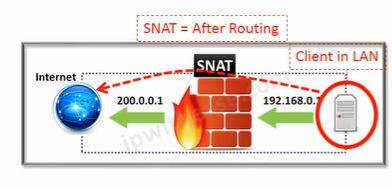
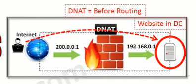
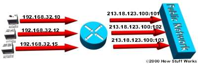

## Mục Lục

_Lý thuyết cơ bản về NAT_

[NAT là gì](#nat-là-gì)

[Phân loại NAT](#phân-loại-nat)

[Tài liệu tham khảo](#tài-liệu-tham-khảo)

____

## NAT là gì?

NAT được viết đầy đủ là Network Address Translation, là quá trình dịch hay chuyển địa chỉ IP của mạng nội bộ sang địa chỉ IP bên ngoài bằng cách thay đổi tiêu đề của gói IP khi truyền qua Router.

Nói theo cách đơn giản, NAT sẽ đóng vai trò như một thông dịch viên, NAT dịch hay thay đổi một hoặc cả hai địa chỉ bên trong một gói tin khi gói tin đó đi qua một Router, hay một số thiết bị khác. Thông thường NAT thường thay đổi địa chỉ thường là địa chỉ riêng (IP Private) của một kết nối mạng thành địa chỉ công cộng (IP Public).

NAT cũng có thể coi như một Firewall (tường lửa) cơ bản. NAT duy trì một bảng thông tin về mỗi gói tin được gửi qua. Khi một máy tính trên mạng kết nối đến 1 website trên Internet header của địa chỉ IP nguồn được thay thế bằng địa chỉ Public đã được cấu hình sẵn trên NAT sever, sau khi có gói tin trở về NAT dựa vào bảng record mà nó đã lưu về các gói tin, thay đổi địa chỉ IP đích thành địa chỉ của PC trong mạng và chuyển tiếp đi. Thông qua cơ chế đó quản trị mạng có khả năng lọc các gói tin được gửi đến hay gửi từ một địa chỉ IP và cho phép hay ngăn truy cập đến một port cụ thể.

_Nhắc lại lý thuyết_

`IP Public`:IP Public chính là IP ngoại miền. Thực chất, đây là dạng địa chỉ cung cấp bởi tổ chức nắm quyền điều phối mạng internet. Chẳng hạn như phía nhà mạng cung cấp dịch vụ internet.

Mỗi IP Public luôn mang tính duy nhất, cung cấp bởi phía nhà mạng internet. Điều này đồng nghĩa người dùng không thể tự động thay đổi IP.

`IP Private`
Từng thiết bị hoạt động trong hệ thống mạng nội bộ LAN đều có một địa chỉ IP Private riêng. Mỗi IP Private đều có khả năng liên kết với nhau hình thành mạng router. Tuy nhiên, chúng không kết nối trực tiếp với hệ thống internet bên ngoài.

=>Nếu muốn IP Private liên kết nối mạng internet bên ngoài, NAT cần tiến hành chuyển đổi từ IP Private sang IP Public.

### Các thuật ngữ liên quan đến NAT

- Địa chỉ inside local: Đây là địa chỉ IP được đặt cho 1 thiết bị ở mạng nội bộ bên trong. Nó không được cung cấp bởi NIC (Network Information Center).
- Địa chỉ inside global: Đây là địa chỉ IP đã được đăng ký tại NIC. Địa chỉ inside global thường được dùng để thay thế cho địa chỉ IP inside local.
- Địa chỉ outside local: Đây là địa chỉ IP của một thiết bị nằm ở mạng bên ngoài. Các thiết bị thuộc mạng bên trong sẽ tìm thấy thiết bị thuộc mạng bên ngoài thông qua địa chỉ IP này. Địa chỉ outside local không nhất thiết phải được đăng ký với NIC. Nó hoàn toàn có thể là một địa chỉ Private.
- Địa chỉ outside global: Đây là địa chỉ IP được đặt cho một thiết bị nằm ở mạng bên ngoài. Địa chỉ này là một IP hợp lệ trên mạng internet.

## Các kiểu NAT

### Source Network Address Translation

SNAT còn là viết tắt của Source Network Address Translation. SNAT thường được sử dụng khi máy chủ nội bộ/private cần bắt đầu kết nối với máy chủ bên ngoài/public. Thiết bị thực hiện NAT thay đổi địa chỉ IP private của máy chủ nguồn thành IP Public. Nó cũng có thể thay đổi cổng nguồn trong TCP/UDP.

Một tình huống điển hình của SNAT là khi được yêu cầu thay đổi địa chỉ hay cổng private thành public khi các gói rời khỏi mạng. Về thứ tự hoạt động, SNAT xuất hiện sau khi quyết định định tuyến được đưa ra. Bên cạnh đó, khi có nhiều máy chủ trên mạng “bên trong” muốn truy cập vào “bên ngoài”, SNAT sẽ được sử dụng.




### Destination Network Address Translation

DNAT còn là viết tắt của Destination Network Address Translation. Nó có chức năng thay đổi địa chỉ đích trong IP của gói tin.

Ngoài ra, DNAT cũng có thể thay đổi cổng đích trong TCP / UDP. Ứng dụng điển hình của nó là chuyển hướng các gói đến với đích là một địa chỉ/ cổng public, đi đến một địa chỉ/ cổng IP private bên trong mạng.

Người dùng qua internet truy cập máy chủ web được lưu trữ trong trung tâm dữ liệu là một ví dụ điển hình mà DNAT được sử dụng để ẩn địa chỉ private. Đồng thời, thiết bị NAT chuyển IP đích public mà người dùng internet có thể truy cập thành địa chỉ IP private của máy chủ web.



### Sự khác nhau giữa SNAT và DNAT

||SNAT|DNAT|
|:---:|---|---|
|Viết tắt cho|Source NAT|Destination NAT|
|Thuật ngữ|SNAT đổi địa chỉ IP của nguồn kết nối thành công cộng.Ngoài ra có thể đổi cổng nguồn trong TCP / UDP. Thường được dùng bởi người dùng nội bộ.|DNAT đổi địa chỉ đích trong IP. Có thể thay đổi cổng đích trong TCP / UDP. Thường sử dụng khi cần chuyển hướng các gói đến có đích là địa chỉ/ cổng public đến địa chỉ / cổng IP private bên trong mạng.|
|Trường hợp sử dụng|Khi một client bên trong mạng LAN hay sau firewall muốn sử dụng internet.|Khi một website được lưu trữ bên trong trung tâm dữ liệu, sau firewall cần cho người dùng bên ngoài (public) kết nối đến thông qua mạng .|
|Thay đổi về địa chỉ|SNAT thay đổi địa chỉ nguồn của gói đi qua thiết bị NAT.|DNAT thay đổi địa chỉ đích của gói đi qua Router.|
|Thứ tự hoạt động|Sau khi quyết định định tuyến được thực hiện.|Trước khi xác định việc định tuyến.|
|Luồng giao tiếp|Xảy ra khi bên trong mạng được bảo mật bắt đầu giao tiếp với bên ngoài.|Xảy ra khi mạng không an toàn bên ngoài (public network) bắt đầu giao tiếp với bên trong (private network).|
|Đơn/ đa máy chủ|SNAT cho phép nhiều máy chủ bên trong mạng truy cập vào bất ký máy chủ nào bên ngoài.|DNAT cho phép máy chủ bên ngoài truy cập vào một máy chủ bên trong.|


## Các cách để NAT

### Static NAT (NAT tĩnh)

Static NAT (NAT tĩnh) là phương thức NAT một đôi một. Một IP Private sẽ được map với một IP Public. Thường được cấu hình thủ công bởi người quản trị

NAT tĩnh được sử dụng khi một số thiết bị nhất định cần truy cập ra/vào mạng internet.


VD: Trong Static NAT (NAT tĩnh), địa chỉ IP của máy tính là 192.168.32.10 luôn được Router biên dịch đến địa chỉ IP 213.18.123.110.

Cách cấu hình trong Router trên cisco packet tracer để có Stactic NAT như sau:

- Thiết lập mối quan hệ chuyển đổi giữa địa chỉ IP cục bộ và IP Public ở ngoài:
    Router (config) # ip nat inside source static [local ip] [global ip]
- Xác định các cổng kết nối với mạng cục bộ:
    Router (config-if) # ip nat inside
- Xác định cổng kết nối với mạng bên ngoài với lệnh sau:
    Router (config-if) # ip nat outside

Ví dụ:

```sh
Router (config) # ip nat inside source static 192.168.1.100 202.1.1.10

Router (config) # interface fa0/0

Router (config-if) # ip nat inside

Router (config) # interface s0/0/0

Router (config-if) # ip nat outside
```

### Dynamic NAT (NAT động)

Thay vì làm thủ công, gán cho 1 IP Private với 1 IP Public nhất định thì ta để hệ thống tự gán. Dynamic NAT được dùng để ánh xạ một địa chỉ IP này sang một địa chỉ khác một cách tự động, thông thường là ánh xạ từ một địa chỉ cục bộ sang một địa chỉ được đăng ký. Bất kỳ một địa chỉ IP nào nằm trong dải địa chỉ IP công cộng đã được định trước đều có thể được gán một thiết bị bên trong mạng.

_Cấu hình Dynamic NAT_

- Xác định dải địa chỉ đại diện bên ngoài (public):các địa chỉ NAT

Router (config) # ip nat pool [name start ip] [name end ip] netmask [netmask]/prefix-lenght [prefix-lenght]

- Thiết lập ACL cho phép những địa chỉ nội bộ bên trong nào được chuyển đổi: các địa chỉ được NAT

Router (config) # access-list [access-list-number-permit] source [source-wildcard]

- Thiết lập mối quan hệ giữa địa chỉ nguồn đã được xác định trong ACL với dải địa chỉ đại diện ra bên ngoài.

Router (config) # ip nat inside source list <acl-number> pool <name>

- Xác định các cổng kết nối vào mạng nội bộ

Router (config-if) # ip nat inside

- Xác định các cổng kết nối ra bên ngoài

Router (config-if) # ip nat outside

Ví dụ:

```sh
Router (config) # ip nat pool abc 202.1.1.177 202.1.1.185 netmask 255.255.255.0

Router (config) # access-list 1 permit 192.168.1.0  0.0.0.255

Router (config) # ip nat inside source list 1 pool abc

Router (config) # interface fa0/0

Router (config-if) # ip nat inside

Router (config) # interface s0/0/0

Router (config-if) # ip nat outside
```


### NAT Overload

NAT Overload hay gọi là PAT (Port Address Translation). Đây được xem là dạng biến đổi của Dynamic NAT có thể chuyển đổi IP bằng cách tự động. Nhưng về hoạt động thì NAT Overload là ánh xạ nhiều địa chỉ IP Private thành 1 địa chỉ IP Public (many - to - one) bằng cách dùng các port khác nhau để phân biệt. Đây cũng là cách phổ biến nhất trong việc ứng dụng NAT ở thực tế.



Trong Overloading NAT, mỗi máy tính trong mạng nội bộ (Private Network) được Router biên dịch đến cùng một địa chỉ IP 213.18.123.100 nhưng trên các cổng giao tiếp khác nhau.

Chỉ số cổng được mã hóa 16 bit, do đó có tới 65536 địa chỉ nội bộ có thể được chuyển đổi sang một địa chỉ công cộng.

_Cấu hình NAT Overload trong router trên cisco packet tracer:_

- Xác định địa chỉ IP mạng nội bộ cần ánh xạ bên ngoài:
Router (config) # access-list [ACL-number] permit [source] [wildcard]
- Cấu hình để chuyển IP đến cổng kết nối bên ngoài:
Router (config) # ip nat inside source list [ACL-number] interface [interface] overload
- Xác định nết nối với mạng nội bộ:
Router (config-if) # ip nat inside
- Xác định các cổng kết nối với mạng bên ngoài:
Router (config-if) # ip nat outside

Ví dụ:

```sh
Router (config) # access-list <ACL-number> permit <source> <wildcard>

Router (config) # ip nat inside source list <ACL-number> interface <interface> overload

Router (config-if) # ip nat inside

Router (config-if) # ip nat outside
```

_Các lệnh kiểm tra cấu hình NAT_

Hiển thị bảng NAT đang hoạt động

```sh
#show ip nat translation
```

Hiển thị trạng thái hoạt động của NAT

```sh
#show ip nat statistics
```

Xóa bảng NAT

```sh
#clear ip nat translation
```

Kiểm tra hoạt động của NAT, hiển thị các thông tin chuyển đổi NAT bởi router.

```sh
#debug ip nat
```

### Những lợi ích và bất lợi mà NAT mang lại

Một số lợi ích của NAT bao gồm:

- Giúp tái sử dụng địa chỉ IP, tiết kiệm lượng địa chỉ IP riêng.
- Cung cấp các tính năng bảo mật tốt giúp tăng cường bảo mật cho các mạng riêng bằng cách tách mạng nội bộ khỏi mạng bên ngoài.
-Giúp bảo tồn không gian địa chỉ IP. Bạn có thể kết nối một số lượng lớn máy chủ lưu trữ bằng địa chỉ IP nhỏ với internet toàn cầu.

Các bất lợi khi sử dụng NAT:

- NAT tiêu thụ tài nguyên bộ nhớ, CPU vì NAT cần dịch địa chỉ IPv4 cho tất cả các biểu đồ dữ liệu IPv4 từ hệ thống nội bộ ra ngoài và ngược lại đồng thời để giữ các chi tiết dịch trong bộ nhớ.
- Có thể gây ra sự chậm trễ trong giao tiếp IPv4.
- Có thể gây mất khả năng truy xuất nguồn gốc IP của thiết bị đầu cuối
- Một số công nghệ và ứng dụng mạng sẽ không hoạt động như mong đợi trong hệ thống mạng được cấu hình NAT.

## Tài liệu tham khảo

<https://www.totolink.vn/article/90-3-loai-nat-network-address-translation-ban-can-biet.html>

<https://quantrimang.com/cong-nghe/gioi-thieu-chung-ve-nat-116>

<https://quantrimang.com/cong-nghe/network-address-translation-nat-hoat-dong-nhu-the-nao-phan-1-118495>

<https://vietnix.vn/nat-la-gi/>

<https://fptcloud.com/nat-la-gi/>

<https://ndhlife.wordpress.com/2011/12/20/vai-net-c%c6%a1-b%e1%ba%a3n-v%e1%bb%81-distance-vector-va-link-state/>


Date accessed: 31/05/2023

