## Nội dung chính

_Cài đặt và triển khai VictoriaMetrics cluster (chế độ cụm)_

[Ôn lại lý thuyết](#ôn-lại-lý-thuyết)

- [vmstorage](#vmstorage)
- [vminsert](#vminsert)
- [vmselect](#vmselect)

[Tiến hành cài đặt](#tiến-hành-cài-đặt)

- [Chuẩn bị](#chuẩn-bị)
- [Cài đặt triển khai](#cài-đặt-triển-khai)
  - [Triển khai vmstorage](#triển-khai-vmstorage)
  - [Triển khai vmselect](#triển-khai-vmselect)
  - [Triển khai vminsert](#triển-khai-vminsert)

[Kết hợp với Nginx](#kết-hợp-với-nginx)

- [Triển khai thêm một node nginx](#triển-khai-thêm-một-node-nginx)

[Kết hợp với các trình giám sát khác](#kết-hợp-với-các-trình-giám-sát-khác)

- [Cài Prometheus](#cài-prometheus)
- [Cài phần mềm node_exporter](#cài-phần-mềm-node_exporter)


[Tài liệu tham khảo](#tài-liệu-tham-khảo)


## Ôn lại lý thuyết

Về cơ bản một cụm VictoriaMetrics đáp ứng các yêu cầu sau:

- Đảm bảo tính sẵn sàng
- Đảm bảo tính toàn vẹn của dữ liệu
- Đạt hiệu năng cao đáp ứng nhu cầu cao trên quy mô lớn như: cụm công nghiệp, tài chính doanh nghiệp, chứng khoán,...
- Dễ dàng mở rộng - thu hẹp quy mô khi cần

Ngoài các thành phần cơ bản cần có của VictoriaMetrics ra thì, các thành phần chính để hình thành một cụm bao gồm:

### vmstorage

- chịu trách nhiệm lưu trữ, quản lý dữ liệu.
- Để hoạt động, buộc phải có 2 trường giá trị `-retentionPeriod` và `-storageDataPath`.
- Trên các node vmstorage cần có các port như sau:
  - port `8482`: thường được hướng đến, với điều hướng `/metrics` để thu thập các metrics của việc storage.
  - port `8400`: thường dùng dể lắng nghe các dữ liệu được gửi tới từ `vminsert`.
  - port `8401`: thường được dùng để kết nối với các truy xuất đến từ `vmselect`

### vminsert

- chịu trách nhiệm ghi dữ liệu vào cụm, thường là sẽ ghi dữ liệu vào tất cả các node storage có trong cụm.
- Cầu nối cho bên thứ 3 ghi dữ liệu vào cụm như Grafana, Prometheus,...
- Để hoạt động buộc phải có trường giá trị `-storageNode=<vmstorage_host>`.
- Một số port cần thiết trên vminsert:
  - port `8480`: với điều hướng `/metrics` dùng để thu thập metrics của việc insert trên node.

### vmselect

- chịu trách nhiệm truy xuất dữ liệu trong cụm
- cầu nối cho bên thứ 3 kết nối vào, đọc dữ liệu có trong cụm. VD như Grafana,...
- Để hoạt động buộc phải có trường giá trị `-storageNode=<vmstorage_host>`.
- Port `8481` với điều hướng /metrics sẽ được dùng để thu thập metrics của node.

>Tất cả các port cần thiết có thể được thay đổi với trường `-httpListenAddr`

**_Tất cả các thành phần trên có thể tuỳ chọn cài đặt trên từng node riêng biệt hoặc trên cùng một node. Tuỳ thuộc theo nhu cầu cấu hình của bài toán._**

## Tiến hành cài đặt

- Dưới dây thực hiện với user là `root`.
- Cài đặt tất cả các thành phần cần thiết trên một node.
- Các node đều chạy Ubuntu 22.04 LTS.
- Đã tắt dịch vụ firewall `ufw`

### Chuẩn bị

- Thực hiện trên tất cả các node.
- Mô hình triển khai, với tất cả các node trong mô hình có cùng một cấu hình phần cứng giống nhau:

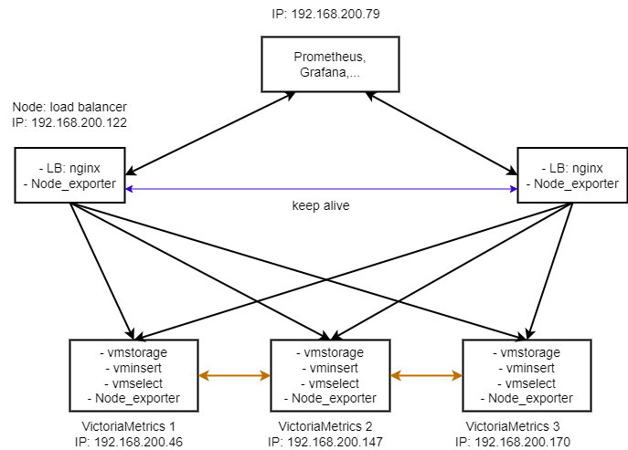

- Cài đặt một vài thứ cần thiết:

```sh
apt install curl jq vim wget -y
```

- Tạo các thư mục cần thiết:

```sh
mkdir -pv {victoriametric-binary,/opt/metric-storage,/var/log/vmstorage,/var/log/vmselect/,/var/log/vminsert/} && cd cd victoriametric-binary
```

- Tải xuống VictoriaMetrics phiên bản cluster mới nhất trên trang phát hành chính thức:

<https://github.com/VictoriaMetrics/VictoriaMetrics/releases>

```sh
VM_VERSION=`curl -sg "https://api.github.com/repos/VictoriaMetrics/VictoriaMetrics/tags" | jq -r '.[0].name'`
wget https://github.com/VictoriaMetrics/VictoriaMetrics/releases/download/${VM_VERSION}/victoria-metrics-linux-amd64-${VM_VERSION}-cluster.tar.gz -o victoriametric-binary
```

- Giải nén và di chuyển các thành phần sang một thư mục chuẩn để quản lý:

```sh
tar -xvzf victoria-metrics-linux-amd64-v1.91.2-cluster.tar.gz -C /usr/bin
```

### Cài đặt triển khai

- Về cơ bản để triển khai các thành phần của cụm VictoriaMetrics thì ta chỉ cần tạo và cấu hình file service cho thành phần đó.

#### Triển khai vmstorage

- Tạo file cấu hình

```sh
vim /etc/systemd/system/vmstorage.service
```

- Đưa vào cấu hình sau:

```sh
[Unit]
Description=vmstorage systemd service.

[Service]
User=root
Type=simple
StartLimitBurst=5
StartLimitInterval=0
Restart=on-failure
RestartSec=3

ExecStart=/usr/bin/vmstorage-prod -storageDataPath=/opt/metric-storage -retentionPeriod=3d -httpListenAddr=:8482 -vminsertAddr=:8400 -vmselectAddr=:8401

ExecStop=/bin/kill -s SIGTERM \$MAINPID
ExecReload=/bin/kill -HUP \$MAINPID
ProtectSystem=full
LimitNOFILE=1048576
LimitNPROC=1048576
LimitCORE=infinity
StandardOutput=file:/var/log/vmstorage/vmstorage.log

[Install]

WantedBy=multi-user.target
```

- Cấp quyền thực thi cho thư mục vừa tạo

```sh
chmod 644 /etc/systemd/system/vmstorage.service
```

- Khởi chạy:

```sh
systemctl start vmstorage
```

- Nên kiểm tra trạng thái dịch vụ để tầm soát lỗi

```sh
systemctl status vmstorage
```

- Trả về kết quả tương tự sau là thành công:

```sh
root@victoriametrics3:~# systemctl status vmstorage
* vmstorage.service - vmstorage systemd service.
     Loaded: loaded (/etc/systemd/system/vmstorage.service; disabled; vendor preset: enabled)
     Active: active (running) since Mon 2023-06-12 11:38:46 +07; 1 day 4h ago
   Main PID: 1882 (vmstorage-prod)
      Tasks: 10 (limit: 2284)
     Memory: 31.0M
        CPU: 5min 52.900s
     CGroup: /system.slice/vmstorage.service
             `-1882 /usr/bin/vmstorage-prod -storageDataPath=/opt/metric-storage -retentionPeriod=3d -httpListenAddr=:8482 -vminsertAddr=>

Jun 12 11:38:46 victoriametrics3 systemd[1]: Started vmstorage systemd service..
```

- Nếu suất hiện bất kỳ lỗi nào có thể dùng lệnh để check log và tiến hành khắc phục:

```sh
tail /var/log/vmstorage/vmstorage.log
```

Hoặc

```sh
tail /var/log/syslog
```

- Có thể bật khởi động cùng hệ thống nếu muốn:

```sh
systemctl enable vmstorage
```

#### Triển khai vmselect

- Các bước tương tự như trên nên sẽ không có mô tả chi tiết mà chỉ còn câu lệnh:

```sh
vim /etc/systemd/system/vmselect.service
```

```sh
[Unit]
Description=vmselect systemd service.

[Service]
User=root
Type=simple
StartLimitBurst=5
StartLimitInterval=0
Restart=on-failure
RestartSec=3
ExecStart=/usr/bin/vmselect-prod  -httpListenAddr=:8481 -storageNode=192.168.200.46:8401 -storageNode=192.168.200.147:8401 -storageNode=192.168.200.170:8401
ExecStop=/bin/kill -s SIGTERM \$MAINPID
ExecReload=/bin/kill -HUP \$MAINPID
StandardOutput=file:/var/log/vmselect/vmselect.log

[Install]
WantedBy=multi-user.target
```

```sh
chmod 644 /etc/systemd/system/vmselect.service
```

```sh
systemctl start vmselect
```

```sh
systemctl status vmselect
```

```sh
root@victoriametrics3:~# systemctl status vmselect
* vmselect.service - vmselect systemd service.
     Loaded: loaded (/etc/systemd/system/vmselect.service; disabled; vendor preset: enabled)
     Active: active (running) since Mon 2023-06-12 13:06:26 +07; 1 day 3h ago
   Main PID: 1911 (vmselect-prod)
      Tasks: 9 (limit: 2284)
     Memory: 4.3M
        CPU: 1min 52.156s
     CGroup: /system.slice/vmselect.service
             `-1911 /usr/bin/vmselect-prod -httpListenAddr=:8481 -storageNode=192.168.200.46:8401 -storageNode=192.168.200.147:8401 -stor>

Jun 12 13:06:26 victoriametrics3 systemd[1]: Started vmselect systemd service..
```

```sh
tail /var/log/vmselect/vmselect.log
```

hoặc

```sh
tail /var/log/syslog
```

```sh
systemctl enable vmselect
```

#### Triển khai vminsert

- Các bước tương tự như trên nên sẽ không có mô tả chi tiết mà chỉ còn câu lệnh:

```sh
vim /etc/systemd/system/vminsert.service
```

```sh
[Unit]
Description=vminsert systemd service.

[Service]
User=root
Type=simple
StartLimitBurst=5
StartLimitInterval=0
Restart=on-failure
RestartSec=3
ExecStart=/usr/bin/vminsert-prod  -httpListenAddr=:8480 -storageNode=192.168.200.46:8400 -storageNode=192.168.200.147:8400 -storageNode=192.168.200.170:8400
ExecStop=/bin/kill -s SIGTERM \$MAINPID
ExecReload=/bin/kill -HUP \$MAINPID
StandardOutput=file:/var/log/vminsert/vminsert.log

[Install]
WantedBy=multi-user.target
```

```sh
chmod 644 /etc/systemd/system/vminsert.service
```

```sh
systemctl start vminsert
```

```sh
systemctl status vminsert
```

```sh
root@victoriametrics3:~# systemctl status vminsert
* vminsert.service - vminsert systemd service.
     Loaded: loaded (/etc/systemd/system/vminsert.service; disabled; vendor preset: enabled)
     Active: active (running) since Mon 2023-06-12 13:23:39 +07; 1 day 3h ago
   Main PID: 1949 (vminsert-prod)
      Tasks: 8 (limit: 2284)
     Memory: 2.9M
        CPU: 3min 30.688s
     CGroup: /system.slice/vminsert.service
             `-1949 /usr/bin/vminsert-prod -httpListenAddr=:8480 -storageNode=192.168.200.46:8400 -storageNode=192.168.200.147:8400 -stor>

Jun 12 13:23:39 victoriametrics3 systemd[1]: Started vminsert systemd service..
```

```sh
tail /var/log/vminsert/vminsert.log
```

hoặc

```sh
tail /var/log/syslog
```

## Kết hợp với Nginx

- Cơ bản thì Nginx là một web server giống Apache và IIS, tuy ra đời sau nhưng nó rất mạnh mẽ. Đảm bảo hiệu năng cao cho web site, có hiệu năng tốt trong việc cân bằng tải, chuyển hướng kết nối,...Đáp ứng được cho bài toán đột ngột có trên 10K ccu.
- Mục tiêu là để cân bằng tải và duy trì tính sẵn sàng cho cụm. Trong điều kiện thử nghiệm ta có thể triển khai đơn giản như sau.
- Có thể thực hiện trên một node riêng biệt hoặc kết hợp với một node đã cài các dịch vụ của VictoriaMetrics.
- Trong bài viết này ta thực hiện trên một node riêng biệt
- Cài đặt Nginx

```sh
apt install nginx
```

- Kiểm tra xem đã cài đặt thành công chưa:

```sh
curl localhost
```

- Trả về kết quả tương tự như sau là cài đặt thành công:

```sh
root@nginxlb:~# curl localhost
<!DOCTYPE html>
<html>
<head>
<title>Welcome to nginx!</title>
<style>
    body {
        width: 35em;
        margin: 0 auto;
        font-family: Tahoma, Verdana, Arial, sans-serif;
    }
</style>
</head>
<body>
<h1>Welcome to nginx!</h1>
<p>If you see this page, the nginx web server is successfully installed and
working. Further configuration is required.</p>

<p>For online documentation and support please refer to
<a href="http://nginx.org/">nginx.org</a>.<br/>
Commercial support is available at
<a href="http://nginx.com/">nginx.com</a>.</p>

<p><em>Thank you for using nginx.</em></p>
</body>
</html>
root@nginxlb:~#
```

- Mặc định cài đặt theo `apt` thì nó sẽ tự khởi động và bật khởi động theo hệ thống.

- Tạo file cấu hình điều hướng việc đọc ghi dữ liệu đến cụm VictoriaMetrics trên Nginx:

```sh
vim /etc/nginx/sites-enabled/victoriametrics.conf
```

- Nhập vào cấu hình sau:

```sh
   upstream vminsert {
      server 192.168.200.46:8480; 
      server 192.168.200.147:8480;
      server 192.168.78.170:8480;
   }

   upstream vmselect {
      server 192.168.200.46:8481; 
      server 192.168.200.147:8481;
      server 192.168.200.170:8481;
   }

   server {
      listen 192.168.200.122:8480; 
      location / {
          proxy_pass http://vminsert;
      }
   }

   server {
      listen 192.168.200.122:8481; 
      location / {
          proxy_pass http://vmselect;
      }
   }
```

- Kiểm tra cấu hình và khởi động lại

```sh
nginx -t
```

>Nếu trong các file cấu hình bị sai cú pháp sẽ được thông báo


```sh
systemctl restart nginx
```

Nếu khởi động lại bị lỗi hãy kiểm tra log tại:

```sh
tail /var/log/syslog
```

hoặc

```sh
tail /var/log/nginx/error.log
```


### Triển khai thêm một node nginx

- Hãy triển khai thêm một node nginx với cấu hình proxy như trên.
- Lúc này sẽ có 2 node chạy Nginx để đảm bảo tính sẵn sàng (High Availability) cho dịch vụ.
- Sử dụng dịch vụ `Keepalived` để đảm bảo tính HA cho hệ thống. Về cơ bản dịch vụ `Keepalived` có các chế độ như nhau:

  - MASTER-BACKUP: ban đầu mọi công việc sẽ do máy MASTER đảm nhiệm. Khi MASTER down, mọi công việc sẽ được chuyển sang cho máy BACKUP. Khi MASTER up, mọi công việc sẽ lại được chuyển về MASTER. Chế độ này dễ cấu hình, triển khai, hoạt động tốt trong môi trường ít sự cố. Tuy nhiên nếu máy MASTER down-up quá nhiều và quá nhanh, rất dễ gây ra lỗi. Để không sử dụng tính năng tự chuyển đổi như thế, thì ta có tính năng `nopreempt` - Không chiếm quyền.

  - ACTIVE-ACTIVE: mọi công việc thực hiện bởi tất cả các máy, đảm bảo hiệu suất cao cho hệ thống. Khi một máy down, các máy còn lại sẽ đảm nhiệm công việc của máy đó. Hơi phức tạp trong triển khai, yêu cầu các máy được cấu hình có uptime đảm bảo là hiệu suất cao.

### Cấu hình keep-alive cho 2 node nginx

- Đã tắt firewall, nếu sử dụng dịch vụ firewall hãy tiến hành thông các port cần thiết.

```sh
sudo ufw allow to 224.0.0.18 comment 'VRRP Broadcast'
sudo ufw allow from <ip-của-máy> comment 'VRRP Router'
```

- Thực hiện cấu hình dịch vụ với tính năng MASTER-BACKUP. Thực hiện trên node MASTER như sau:

  - `B1`: thêm user quản lý dịch vụ

  ```sh
  sudo useradd --no-create-home --shell /bin/bash keepalived_script
  ```

  - `B2`: bật tính năng cần thiết trên Linux, cho phép gắn địa chỉ IP ảo lên card mạng và IP Forward.

  ```sh
  echo "net.ipv4.ip_nonlocal_bind = 1" >> /etc/sysctl.conf
  echo "net.ipv4.ip_forward = 1" >> /etc/sysctl.conf
  sysctl -p
  ```

  - `B3`: Cài đặt dịch vụ

  ```sh
  apt install -y keepalived
  ```

  - `B4`: Backup file configure

  ```sh
  sudo cp /etc/keepalived/keepalived.conf /etc/keepalived/keepalived.conf-org
  ```

  - `B5`: Cấu hình với các thông số cơ bản như sau

  ```sh
  sudo vi /etc/keepalived/keepalived.conf
  ```

  Nhập vào cấu hình như sau:

  ```sh
  global_defs {
    # Keepalived process identifier
    router_id nginx
  }

  # Script to check whether Nginx is running or not
  vrrp_script check_nginx {
  script "/bin/check_nginx.sh"
  interval 2
  weight 50
  }

  # Virtual interface - The priority specifies the order in which the assigned interface to take over in a failover
  vrrp_instance VI_01 {
  state MASTER
  interface enp0s3
  virtual_router_id 151
  priority 110

  # The virtual ip address shared between the two NGINX Web Server which will float
  virtual_ipaddress {
    192.168.200.250/24 # nên dùng chung dải với IP của máy đang có
    }
  track_script {
    check_nginx
    }
  authentication {
    auth_type PASS
    auth_pass 11118888 #chỉ nhận các password có độ dài > 8 ký tự
    }
  }
  ```

  - `B6`: Lưu lại và thoát, thực hiện tạo một file script như sau cho dịch vụ:

  ```sh
  vi /bin/check_nginx.sh
  ```

  Nhập vào cấu hình sau:

  ```sh
  #!/bin/bash
  
  STATE=$(pidof nginx | wc -l)

  if [ $STATE -eq 1  ]
  then
                #SUCCESS
                exit 0
  else
                #FAILED
                exit 1
  fi
  EOF
  ```

  - `B7`: cấp quyền thực thi cho file .sh vừa tạo:

  ```sh
  sudo chmod 755 /bin/check_nginx.sh
  ```

  - `B8`: Khởi động dịch vụ

  ```sh
  sudo systemctl start keepalived
  ```

  Kiểm tra tình trạng của dịch vụ:

  ```sh
  sudo systemctl status keepalived
  ```

  Nhận được kết quả tượng tự là thành công:

  ```sh
  root@nginxlb:~# systemctl status keepalived
   * keepalived.service - Keepalive Daemon (LVS and VRRP)
     Loaded: loaded (/lib/systemd/system/keepalived.service; enabled; vendor prese>
     Active: active (running) since Tue 2023-06-20 11:26:18 +07; 3h 16min ago
   Main PID: 677123 (keepalived)
      Tasks: 2 (limit: 2284)
     Memory: 1.9M
        CPU: 1min 17.318s
     CGroup: /system.slice/keepalived.service
             |-677123 /usr/sbin/keepalived --dont-fork
             `-677124 /usr/sbin/keepalived --dont-fork
  ```

  - Thực hiện trên máy thứ 2, các bước tương tụ. Với cấu hình BACKUP như sau:

  ```sh
  global_defs {
    # Keepalived process identifier
    router_id nginx
  }

  # Script to check whether Nginx is running or not
  vrrp_script check_nginx {
  script "/bin/check_nginx.sh"
  interval 2
  weight 50 # trọng số cộng thêm khi node còn lại down
  }

  # Virtual interface - The priority specifies the order in which the assigned interface to take over in a failover
  vrrp_instance VI_01 {
  state BACKUP
  interface enp0s3 # card mạng đưuọc sử dụng
  virtual_router_id 151
  priority 100 # thể hiện mức độ ưu tiên của máy

  # The virtual ip address shared between the two NGINX Web Server which will float
  virtual_ipaddress {
    192.168.200.250/24 # nên dùng chung dải với IP của máy đang có
    }
  track_script {
    check_nginx
    }
  authentication {
    auth_type PASS
    auth_pass 11118888 #chỉ nhận các password có độ dài > 8 ký tự
    }
  }
  ```

- Trong quá trình cấu hình nếu có bất kỳ lỗi nào hay kiểm tra log:

Check log

```sh
tail -f /var/log/syslog | grep vrrp
```

- Kiểm thử hoạt động của dịch vụ, đơn giản với lệnh:

```sh
ip add show
```

- Nếu thấy suất hiện VIP trên máy MASTER là cơ bản thành công:

```sh
root@nginxlb2:~# ip add show
1: lo: <LOOPBACK,UP,LOWER_UP> mtu 65536 qdisc noqueue state UNKNOWN group default qlen 1000
    link/loopback 00:00:00:00:00:00 brd 00:00:00:00:00:00
    inet 127.0.0.1/8 scope host lo
       valid_lft forever preferred_lft forever
    inet6 ::1/128 scope host
       valid_lft forever preferred_lft forever
2: eth0: <BROADCAST,MULTICAST,UP,LOWER_UP> mtu 1500 qdisc fq_codel state UP group default qlen 1000
    link/ether fa:16:3e:01:05:78 brd ff:ff:ff:ff:ff:ff
    inet 192.168.200.99/24 brd 192.168.200.255 scope global dynamic eth0
       valid_lft 517385sec preferred_lft 517385sec
    inet 192.168.200.250/24 scope global secondary eth0
       valid_lft forever preferred_lft forever
    inet6 fe80::f816:3eff:fe01:578/64 scope link
       valid_lft forever preferred_lft forever
```

- Thử stop dịch vụ của Nginx rồi kiểm tra, ta sẽ không thấy VIP xuất hiện nữa. Sang máy BACKUP kiểm tra, nếu thấy VIP xuất hiện tức là cấu hình thành công.


Trang man page về keepalived: <https://manpages.ubuntu.com/manpages/jammy/man5/keepalived.conf.5.html>
Trang docs của nginx: <https://docs.nginx.com/nginx/admin-guide/high-availability/ha-keepalived-nodes/>

Tham khảo cấu hình

<https://viblo.asia/p/trien-khai-dich-vu-high-available-voi-keepalived-haproxy-tren-server-ubuntu-jOxKdqWlzdm>

<https://cuongquach.com/cau-hinh-keepalived-thuc-hien-ip-failover-he-thong-ha.html>

<https://github.com/nduytg/ansible_keepalived/blob/master/files/check_nginx.sh>

<https://www.linuxtechi.com/setup-highly-available-nginx-keepalived-linux/>


#### Lưu ý trong triển khai keepalived

- Trong trường hợp bạn thử nghiệm trong môi trường ảo hoá như VMware, KVM,...Hay thực hiện trên cloud như Google Cloud, AWS,...Thì cần chú ý đến việc thông port hoặc các chính sách bảo mật mạng của dịch vụ đang sử dụng.

Bài viết này sử dụng môi trường OpenStack, nên có một số điều đáng chú ý sau.

- Tạo một IP để có thể sử dụng Virtual IP, vì trên môi trường OpenStack đã được cấu hình không cho phép các VM (virtual machine) tự ý tạo IP. Tạo như sau:

  - Truy cập dashboard
  - Thực hiện theo thứ tự sau, vì đang sử dụng dải internal nên sẽ chọn nó

  - 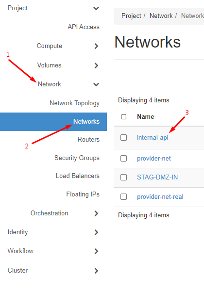

  - Sau khi chọn dải mạng, sẽ được chuyển sang giao diện tương tự như sau, chuyển sang tab `Port` rồi chọn `Create port`

  - 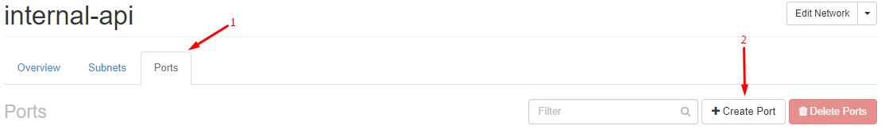

  - Chọn vào ô `Specify IP address or subnet`, sẽ có một vài chế độ hiện ra, hãy chọn chế độ `Fixed IP Address` - để được quyền tự fix ip cần thiết. Hãy bỏ chọn ở ô `Port Security` - để không nhận bất kỳ chính sách bảo mật nào.

  - 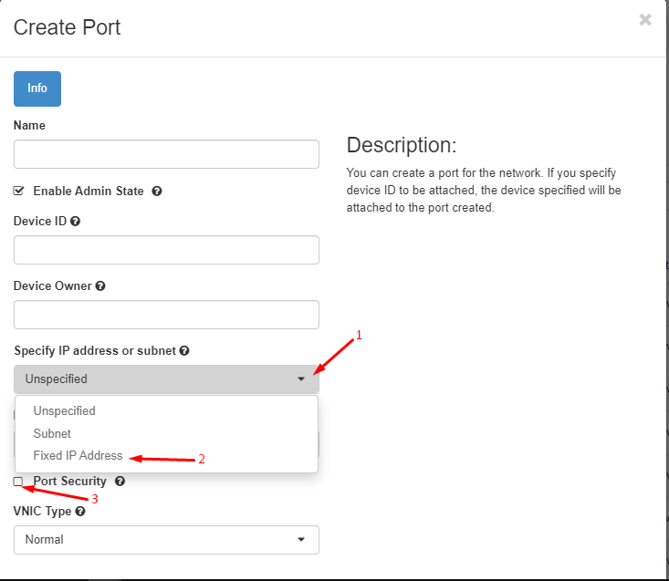

  - Sau khi chọn `Fixed IP Address`, ta sẽ nhận được giao diện như sau, hãy nhập IP cần thiết vào ô `Fixed IP Address`, rồi chọn `Create`

  - 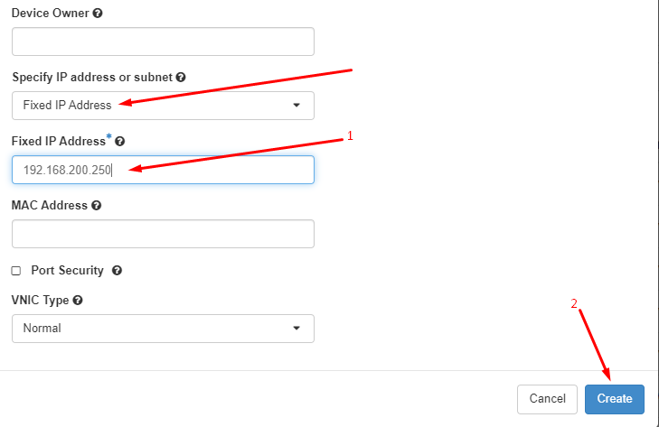

  - IP được tạo thành công, sẵn sàng để sử dụng

  - 

- Tạo xong IP, còn một thứ nữa để ta quan tâm. Nếu bạn có sử dụng `Security Groups` thì cần thông port cho chúng.
  - Cũng trong mục `Network`, chọn vào `Security Groups`, sẽ nhận được giao diện như dưới. Có thể tạo mới với `Create Security Group`, ở đây đã có sẵn `victoriametric-sg` nên sẽ chọn `Manage Rules`

  - 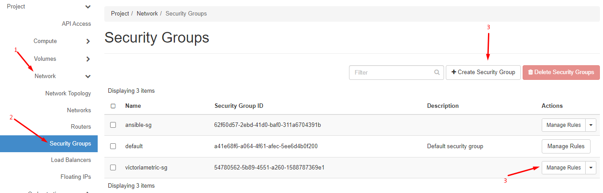

  - Chọn `Manage Rules` sẽ nhận được giao diện như sau, chọn `Add Rule`:

  - 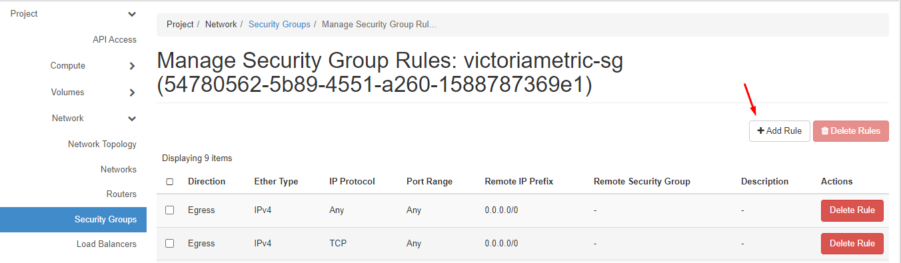

  - Sau khi chọn `Add rule`, sẽ thu được một pop-up như sau

  - 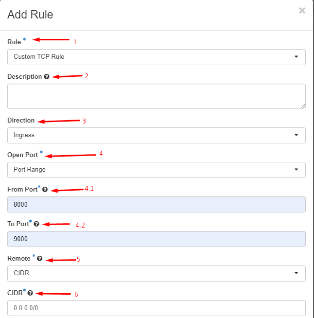

  - Trong đó:

    - 1: các giao thức mà rule hỗ trợ như: TCP, UDP, HTTP,...Tuỳ thuộc vào nhu cầu mà chọn giao thức. Ở đây cần sử dụng TCP nên sẽ để TCP.
    - 2: Mô tả về rule mới này, không bắt buộc phải điền
    - 3: hướng đi của rule, mặc định là `Ingress` - đi vào, vì thường thì đi vào mới cần phải lọc, đi ra - `Engress` thì thường không cần lọc.
    - 4: chế độ mở port, có thể mở một port, một dải port hay toàn bộ. Hãy chọn theo nhu cầu. Sau đây sẽ chọn `Port Range`
    - 5: xác định nơi mà luồng dữ liệu được chấp nhận. `CIDR` tức là mọi nơi, hoặc chỉ định chỉ nhận luồng dữ liệu từ một `Security Group` nhất định nào khác. Ở đây để mặc định
    - 6: dải IP sẽ được chấp nhận dữ liệu, mặc định chấp nhận tất cả.

  - Sau khi nhập các thông tin cần thiết, hãy chọn `Add` để thêm `Rule`. Hay chắc chắn là thông tin nhập đúng, vì không có chỉnh sửa `Rule`

  - 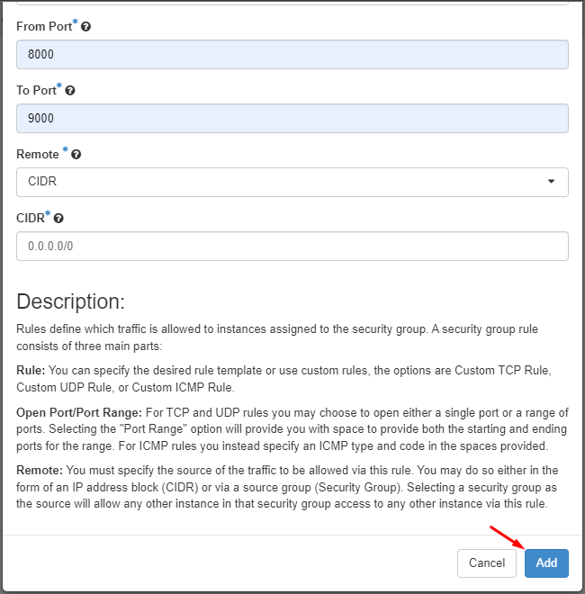

  - Thành công thêm `Rule` để dữ liệu có thể di chuyển giữa các máy.
  
  - 
  
  - Nếu ban đầu bạn không sử dụng `Security Group` này, thì hãy thêm cho máy nào cần.

  - 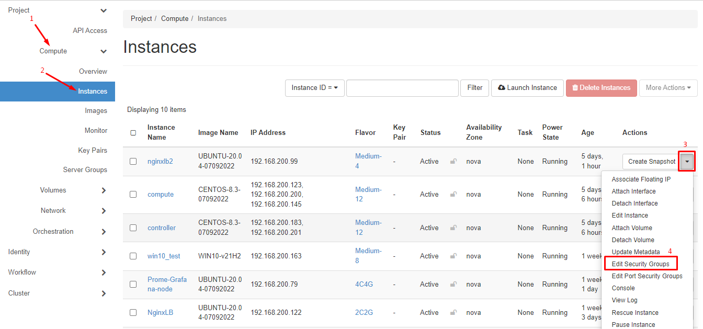

  - Sau khi chọn `Edit...`, sẽ nhận được pop-up như sau, thực hiện theo thứ tự là `Security Group` sẽ được thêm cho máy, với các `Rule` mà ta đã tạo ở trên:

  - 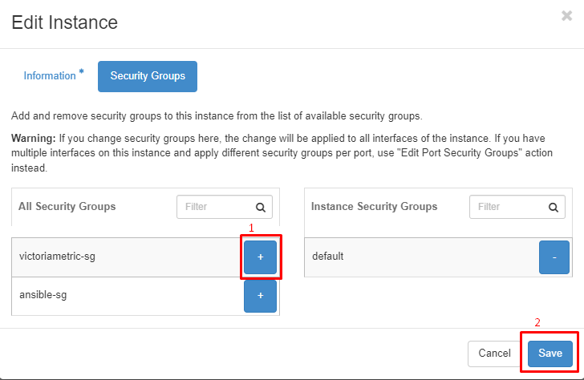


## Kết hợp với các trình giám sát khác

- Sau khi đã có node nginx cho phép cân bằng tải cho cụm. Ta có thể tiến hành kết nối đến cụm như: lưu trữ, truy xuất,...
- Trong bài sẽ sử dụng kết hợp với Prometheus để ghi dữ liệu vào cụm, và Grafana để truy xuất dữ liệu đã được ghi vào. Chưa có đối tượng để _cào_ (scrape), nên ta sẽ cào dữ liệu từ ngay các máy trong cụm.
- Sẽ cài đặt Prometheus và Grafana trên một node khác rồi trỏ vào node đã cài Nginx.

### Cài Prometheus

- Sử dụng cách: tải xuống từ trang phát hành chính thức và cấu hình thủ công như ta đã làm từ trên.
- Trang phát hành chính thứ:

<https://github.com/prometheus/prometheus/releases/>

- `B1`: tạo người dùng quản trị cho Prometheus

```sh
sudo groupadd --system prometheus
sudo useradd -s /sbin/nologin --system -g prometheus prometheus
```

- `B2`: tạo các thư mục cần thiết và phân lại quyền

```sh
sudo mkdir -pv /var/log/Prometheus/
sudo mkdir -pv /var/lib/prometheus
for i in rules rules.d files_sd; do sudo mkdir -p /etc/prometheus/${i}; done
```

- `B3`: Tải xuống Prometheus từ trang phát hành chính thức

```sh
mkdir -p /tmp/prometheus && cd /tmp/prometheus
wget https://github.com/prometheus/prometheus/releases/download/v2.44.0/prometheus-2.44.0.linux-amd64.tar.gz
```

- `B4`: giải nén, rồi copy sang thư mục khác để quản lý

```sh
tar xvf prometheus*.tar.gz
cd prometheus*/
```

Copy sang thư mục khác

```sh
sudo cp prometheus promtool /usr/local/bin/
sudo chown prometheus:prometheus /usr/local/bin/prom*
```

Kiểm tra phiên bản:

```sh
prometheus --version && promtool --version
```

output tương tự như sau là thành công tải về:

```sh
root@prome-grafana-node:~# prometheus --version && promtool --version
prometheus, version 2.44.0 (branch: HEAD, revision: 1ac5131f698ebc60f13fe2727f89b115a41f6558)
  build user:       root@739e8181c5db
  build date:       20230514-06:18:11
  go version:       go1.20.4
  platform:         linux/amd64
  tags:             netgo,builtinassets,stringlabels
promtool, version 2.44.0 (branch: HEAD, revision: 1ac5131f698ebc60f13fe2727f89b115a41f6558)
  build user:       root@739e8181c5db
  build date:       20230514-06:18:11
  go version:       go1.20.4
  platform:         linux/amd64
  tags:             netgo,builtinassets,stringlabels
root@prome-grafana-node:~#
```

- `B5`: Copy các file cấu hình và thư viện

```sh
sudo cp prometheus.yml /etc/prometheus/prometheus.yml
sudo cp -r consoles/ console_libraries/ /etc/prometheus/
sudo chown -R prometheus:prometheus /etc/prometheus/consoles
sudo chown -R prometheus:prometheus /etc/prometheus/console_libraries
```

- `B6`: cấu hình cho Prometheus

```sh
sudo vim /etc/prometheus/prometheus.yml
```

Nội dung file cấu hình cơ bản như sau:

```sh
# my global config
global:
  scrape_interval:     10s # By default, scrape targets every 15 seconds.
  evaluation_interval: 10s # By default, scrape targets every 15 seconds.
  # scrape_timeout is set to the global default (10s).

  # Attach these labels to any time series or alerts when communicating with
  # external systems (federation, remote storage, Alertmanager).

# A scrape configuration containing exactly one endpoint to scrape:
# Here it's Prometheus itself.
scrape_configs:
  # The job name is added as a label `job=<job_name>` to any timeseries scraped from this config.

  - job_name: 'node prometheus'

    # Override the global default and scrape targets from this job every 5 seconds.
    scrape_interval: 5s

    static_configs:
         - targets: ['localhost:9090']

  - job_name: 'node_exporter VictoriaMetrics'

    # Override the global default and scrape targets from this job every 5 seconds.
    scrape_interval: 5s

    static_configs:
         - targets: ['192.168.200.46:9100']
         - targets: ['192.168.200.147:9100']
         - targets: ['192.168.200.170:9100']

  - job_name: 'node nginxlb'
    scrape_interval: 5s
    static_configs:
         - targets: ['192.168.200.122:9100']


remote_write:
  - url: "http://<VIP-of-Keepalived>:8480/insert/0/prometheus/api/v1/write"
    queue_config:
        max_samples_per_send: 10000

alerting:
  alertmanagers:
    - static_configs:
      - targets:
        - localhost:9093                                     
```

- `B6`: Tạo file điều khiển cho dịch vụ của Prometheus

```sh
vi /etc/systemd/system/prometheus.service
```

Nội dung file cơ bản như sau:

```sh
[Unit]
Description=Prometheus
Documentation=https://prometheus.io/docs/introduction/overview/
Wants=network-online.target
After=network-online.target

[Service]
Type=simple
User=prometheus
Group=prometheus
ExecStart=/usr/local/bin/prometheus \
  --config.file=/etc/prometheus/prometheus.yml \
  --storage.tsdb.path=/var/lib/prometheus \
  --web.console.templates=/etc/prometheus/consoles \
  --web.console.libraries=/etc/prometheus/console_libraries \
  --web.listen-address=0.0.0.0:9090

SyslogIdentifier=prometheus
StandardOutput=file:/var/log/Prometheus/prometheus.log
Restart=on-failure
RestartSec=3
StartLimitBurst=5
StartLimitInterval=5

[Install]
WantedBy=multi-user.target
```

>Nhấn `ESC` để thoát khỏi chế độ chỉnh sửa của `vim` rồi nhập vào `:wq` để lưu lại và thoát.


- `B7`: Khởi chạy và kiểm tra

```sh
sudo systemctl daemon-reload
sudo systemctl start prometheus
sudo systemctl status prometheus
```

output tương tự là cấu hình thành công

```sh
root@prome-grafana-node:~# sudo systemctl status prometheus
* prometheus.service - Prometheus
     Loaded: loaded (/etc/systemd/system/prometheus.service; disabled; vendor preset: enabled)
     Active: active (running) since Mon 2023-06-12 15:20:02 +07; 1 day 17h ago
       Docs: https://prometheus.io/docs/introduction/overview/
   Main PID: 2793 (prometheus)
      Tasks: 9 (limit: 2310)
     Memory: 279.9M
     CGroup: /system.slice/prometheus.service
             `-2793 /usr/local/bin/prometheus --config.file=/etc/prometheus/prometheus.yml --storage.tsdb.path=/var/lib/>
```

- Nếu xảy ra bất kỳ lỗi nào trong quá trình cài đặt, hãy kiểm tra log để biết lỗi và khắc phục. Kiểm tra log với câu lệnh:

```sh
tail /var/log/Prometheus/prometheus.log
```

Hoặc

```sh
tail /var/log/syslog
```

- Truy cập vào dashboard với đường dẫn:

```sh
http://<server-ip>:9090
```

Thu được trang web như sau:

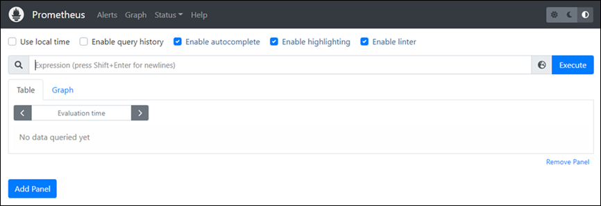

_Cài đặt thành công node Prometheus, để có thể lấy dữ liệu và theo dõi hệ thống từ các node khác thì nên cài phần mềm `node_exporter` do Prometheus cung cấp trên các node cần giám sát_

### Cài phần mềm node_exporter

Về cơ bản Node_exporter là một phần mềm mã nguồn mở cho phép xuất các dữ liệu của hệ thống dưới các định đạng mà Prometheus có thể đọc được.
Mặc định, nó sẽ thu thập và đưa ra gần hết các thông số của hệ thống, có thể điều chỉnh việc thu thập và xuất dữ liệu theo nhu cầu cá nhân.

Trang tài liệu chính thức: <https://github.com/prometheus/node_exporter>
Trang manpage trên ubuntu: <https://manpages.ubuntu.com/manpages/focal/man1/prometheus-node-exporter.1.html>
Trang phát hành các phiên bản chính thức: <https://github.com/prometheus/node_exporter/releases/>

Ta sẽ cài node_exporter trên tất cả các node trong cụm ở mô hình triển khai ban đầu.

Các bước cài đặt:

`B1`: Thêm account để quản lý node_exporter, tạo thư mục ghi log

```sh
sudo useradd --no-create-home --shell /bin/false exporter
mkdir -pv /var/log/exporter
```

`B2`: Tải xuống phiên bản phù hợp với bạn từ trang phát hành chính thức

```sh
mkdir node_exporter && cd node_exporter
wget https://github.com/prometheus/node_exporter/releases/download/v1.6.0/node_exporter-1.6.0.linux-amd64.tar.gz
```

`B3`: Giải nén và copy các file cần thiết sang thư mục chuẩn để quản lý

```sh
tar xfzv node_exporter-1.6.0.linux-amd64.tar.gz -C /usr/local/bin
```

`B4`: Tạo file cấu hình để quản lý

```sh
sudo vi /etc/systemd/system/node_exporter.service
```

Có thể nhập vào cấu hình mặc định như sau để có thể lấy hết thông tin của hệ thống hiện có:

```sh
[Unit]
Description=NodeExporter
Wants=network-online.target
After=network-online.target

[Service]
User=exporter
Group=exporter
Type=simple
ExecStart=/usr/local/bin/node_exporter-1.6.0.linux-amd64/node_exporter

#--collector.disable-defaults \
#--collector.meminfo \
#--collector.loadavg \
#--collector.filesystem

Restart=on-failure
RestartSec=3
ExecStop=/bin/kill -s SIGTERM \$MAINPID
ExecReload=/bin/kill -HUP \$MAINPID
StandardOutput=file:/var/log/exporter/exporter.log

[Install]
WantedBy=multi-user.target
```

>Xem thêm các giá trị của các cờ trong trang man page

`B5`: Khởi động dịch vụ và kiểm tra trạng thái của dịch vụ

```sh
sudo systemctl daemon-reload
sudo systemctl start node_exporter
sudo systemctl status node_exporter
```

Kiểm tra trạng thái nếu trả về kết quả tương tự như sau là thành công, ví dụ:

```sh
root@victoriametrics3:~# sudo systemctl status node_exporter
* node_exporter.service - NodeExporter
     Loaded: loaded (/etc/systemd/system/node_exporter.service; disabled; vendor preset: enabled)
     Active: active (running) since Mon 2023-06-12 15:56:48 +07; 18h ago
   Main PID: 2452 (node_exporter)
      Tasks: 6 (limit: 2284)
     Memory: 9.0M
        CPU: 3min 29.555s
     CGroup: /system.slice/node_exporter.service
             `-2452 /usr/local/bin/node_exporter-1.6.0.linux-amd64/node_exporter

Jun 12 15:56:48 victoriametrics3 systemd[1]: Started NodeExporter.
```

Trong trường hợp gặp bất kỳ lỗi không mong muốn nào, hay kiểm tra log để khắc phục

```sh
tail /var/log/exporter/exporter.log
```

Hoặc

```sh
tail /var/log/syslog
```

### Kết hợp với Grafana

- Sử dụng Grafana để đọc dữ liệu có trong cụm `vmstorage`
- Sẽ tiến hành cập nhật tiếp

## Tài liệu tham khảo

<https://docs.victoriametrics.com/Cluster-VictoriaMetrics.html>

<https://chungphan.com/2020-08-18-victoriametric.html>

<https://www.vultr.com/docs/install-and-configure-victoriametrics-on-debian/#:~:text=Install%20VictoriaMetrics&text=Or%20you%20can%20download%20the,API%20and%20then%20downloads%20it.>

<https://lightsail.aws.amazon.com/ls/docs/en_us/articles/amazon-lightsail-install-prometheus>

<https://computingforgeeks.com/install-prometheus-server-on-debian-ubuntu-linux/>

<https://computingforgeeks.com/how-to-install-grafana-on-ubuntu-linux-2/>

Date accessed: 20/06/2023
