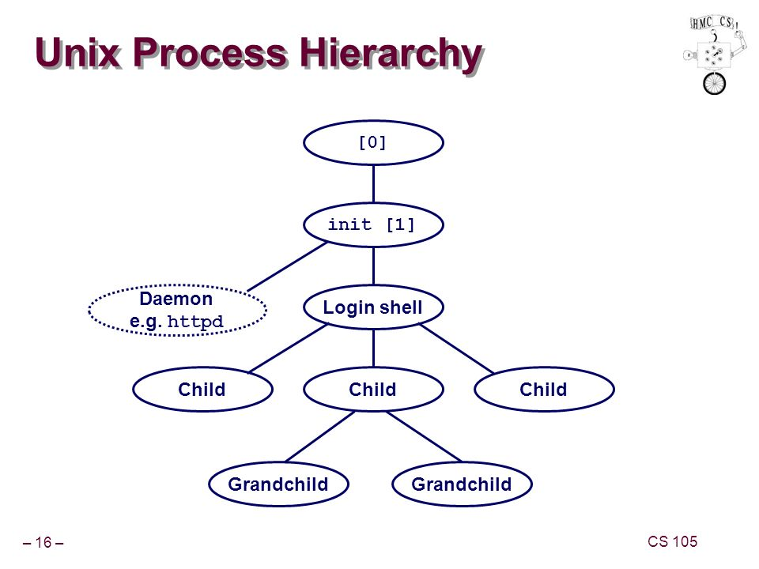
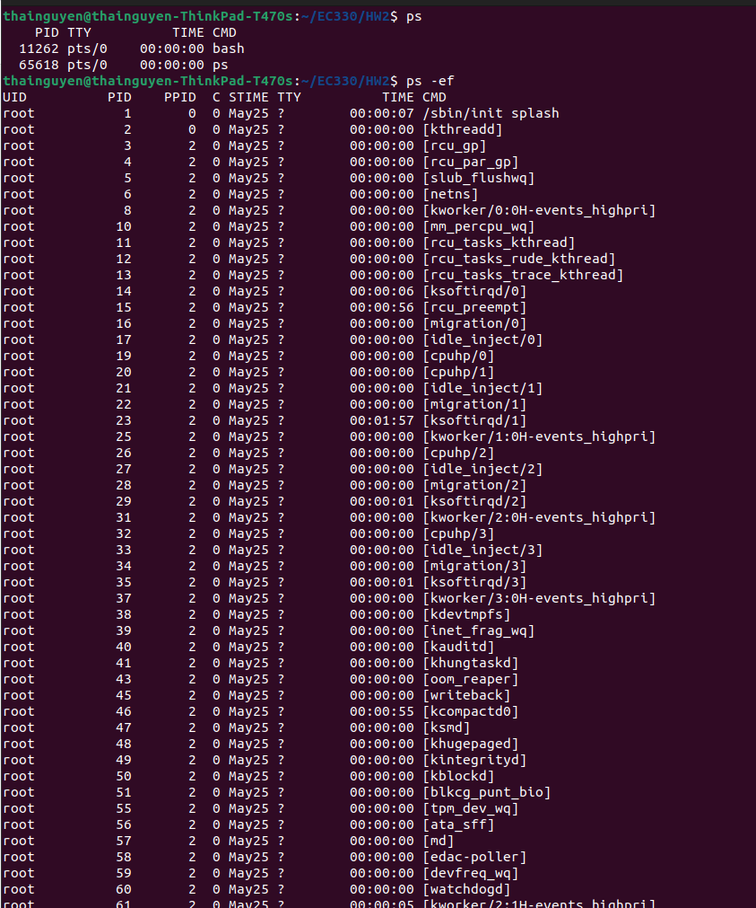
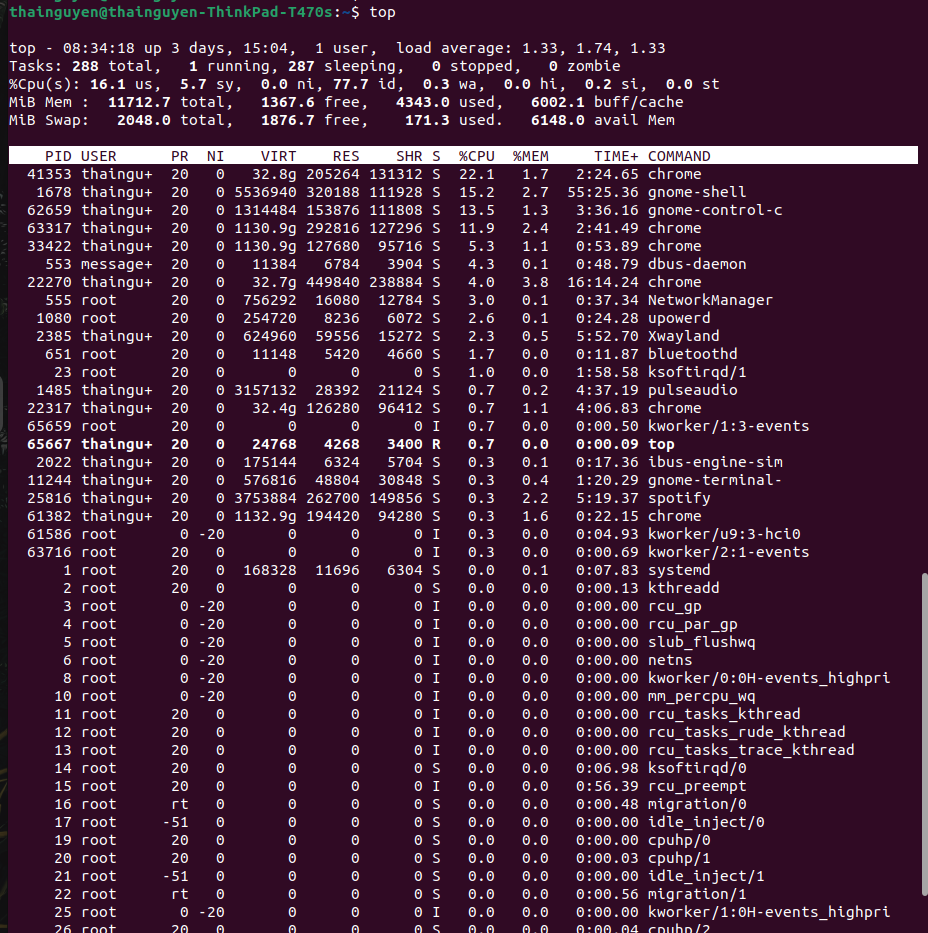
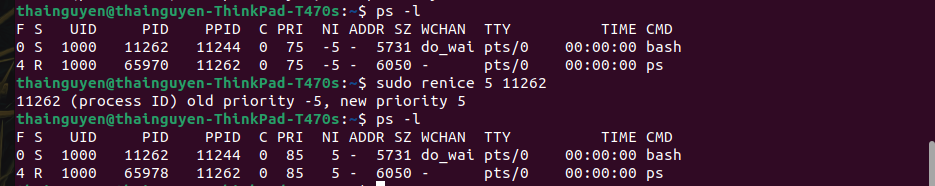

## Định nghĩa
Các tiến trình được tạo ra khi chạy một chương trình hoặc lệnh trong hệ điều hành linux. Mục đích của chúng là thực hiện các task trong hệ điều hành. Mỗi quy trình có thể được xác định bằng một ID quy trình (PID) duy nhất.
## Tiến trình
Các Tiến trình có thể được chạy theo hai cách
1. Foreground: chạy bằng cách nhận input từ bàn phím và hiển thị ouput ở trên terminal
2. Background: chạy khi không có input từ bàn phím

### Phân loại tiến trình:
- tiến trình init,(init là viết tắt của khởi tạo), được định nghĩa là cha của tất cả quy trình linux và có PID là 1. Đây là quy trình đầu tiên bắt đầu sau khi hệ điều hành linux được khởi động và chạy cho đến khi máy tính tắt.
- tiến trình cha và con: tiến trình con được chạy từ tiến trình cha
- tiến trình orphan: xuất hiện khi tiến trình mẹ bị khử trước tiến trình con
- tiến trình zombie: tiến trình bị khử nhưng khi chạy ps vẫn hiển thị tiến trình với trạng thái zombie
- tiến trình daemon: background process chạy với quyền truy cập root




## Lệnh tương tác:
1. ps: hiển thị các tiến trình và trạng thái của các tiến trình
```
ps [options] 
```
các mục được có thể được hiển thị bởi lệnh ps:
- UID: userID của người dùng mà tiến trình thuộc về
- PID: mã tiến trình
- PPID: processID của process cha (ID của process khởi động nó)
- C: Mức sử dụng CPU của tiến trình
- STime: Thời gian bắt đầu xử lý
- TTY: Loại thiết bị đầu cuối được liên kết với quy trình này
- Time: thời gian CPU mà tiến trình tiêu thụ
- CMD: lệnh bắt đầu quá trình này


options:
+ -a:hiển thị process không liên quan đến terminal
+ -T : tất cả các process liên quan đến terminal
+ -A hoặc -e: viết thông tin cho tất cả process
+ -d : hiển thông tin cho tất cả process ngoại trừ session leader
+ -r: tất cả process đang chạy
+ -x: tất cả process được sở hữu bởi người dùng hiện tại
+ -ef: hiển thị các process đang chạy
+ -u username: hiển thị process của một người dùng nhất định
+ -p PID: hiển thị process với processID nhất định
+ -C command: hiển thị process với command chỉ định
+ -l : hiển thị các tiến trình và giá trị ưu tiên hiện tại

2. top: hiển thị trạng thái chạy của tất cả các tiến trình trên hệ điều hành và cập nhật trạng thái liên tục
```
top [options]
```

options:
- n X: chạy cho đến vòng lặp thứ X
- u username: hiển thị tiến trình của một username nhất định
- c: bắt đầu top với tiến trình bị đóng gần nhất
- d X: đặt thời gian X ( hệ số X tính theo giây) trước khi terminal được cập nhật
Khi top đang chạy, có thể tiến hành bấm nút như sau:
- P: sort theo cột CPU
- M: sort theo cột memory
- N: sort theo cột PID
- T: sort theo cột Time
- u: hiển thị cho 1 user
- l: chỉ hiện thị task đang chạy
- n rồi đánh số: hiển thị một số dòng nhất định
- k: đóng một process theo Process ID

3. kill: dùng để dừng chạy tiến trình
Option:
+ hiển thị trang có nhiều loại signals khác nhau có thể được sử dụng
```
kill -l
```
một số kill signal:
- sigkill: hủy tiến trình ngay lập tức, bao gồm cả child process
- sigstop: dừng tiến trình tạm thời
- sigcont: tiếp tục tiến trình đang bị dừng 
- sigill : hủy tiến trình do lỗi, can't be ignored

+ hủy một process theo process ID
```
kill [pid]
```
+ hủy process theo tên của process 
```
killall [signal number] [process name]
```


4. nice N: 
+ dùng để chuyển nice value, giá trị quyết định độ ưu tiên của tiến trình
+ nice value càng cao thì độ ưu tiên càng thấp
+ Sử dụng ps -l để hiển thị các nice value, sẽ xuất hiện trong phần NI.


+ khởi động process mới với độ ưu tiên được chỉ định( số N) bằng lệnh nice N

```
nice -N [process name]
```
5. renice: thay đổi độ ưu tiên của một process đang chạy
```
renice -N [process name]
```

flag của nice và renice:
- u username: thay đổi độ ưu tiên của một user
- g groupname: thay đổi độ ưu tiên của một group
```
renice [priority] -u/g [name]
```

## Nguồn tham khảo:
1. [Nguồn 1](https://hoclaptrinh.vn/tutorial/hoc-unix/quan-ly-tien-trinh-trong-unix-linux)
2. [Nguồn 2](https://www.hostinger.vn/huong-dan/cach-kill-proccess-linux)
3. [Nguồn 3](https://www.makeuseof.com/change-processs-priority-linux-nice-renice/)
4. [Nguồn 4](https://slideplayer.com/amp/6410625/)

