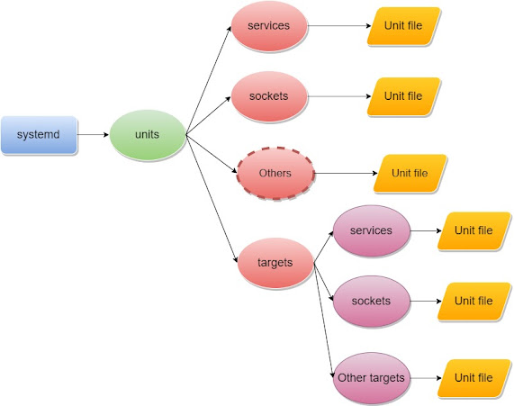
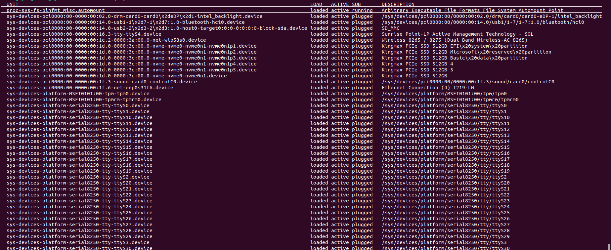

## Systemd
-systemd là trình quản lý hệ thống và dịch vụ cho hệ điều hành linux. systemd có thể được sử dụng để kiểm soát và quản lý các dịch vụ và unitfile, chẳng hạn như sử dụng lệnh systemctl.
- service: nhóm các routine để điều khiển một thiết bị phần cứng trả về thông tin của hệ thống hiện tại, thường chạy ở chế độ background
- systemd giúp cho việc quản lý các service, ví dụ khởi động, dừng hoặc kiểm tra trạng thái service, và quản lý unit file
- systemd là tiến trình init được chạy đầu tiên khi khởi động hệ thống, với processID = 1
## Thành phần của systemd
- systemctl: quản lý trạng thái của các dịch vụ trong hệ thống
- journald : quản lý log hoạt động của hệ thống
- logind : quản lý và kiểm soát hoạt động đăng nhập và đăng xuất của người dùng
- networkd: dùng để quản lý các kết nối mạng
- timedated : dùng để quản lý thời gian trên hệ thống
- udev: dùng để quản lý các thiết bị và firmware
- libudev: thư viện chuẩn để sử dụng udev
- homed: quản lý thư mục chính của người dùng
- resolved: cung cấp độ phân giải tên mạng cho các ứng dụng cục bộ
- timesyncd: được sử dụng để đồng bộ hóa đồng hồ hệ thống trên mạng
- localectl: giúp định cấu hình bố cục bàn phím và cục bộ của hệ thống.
## Unit file:
- systemd quản lý các service bằng unit file, đây là các đối tượng được systemd dùng để quản lý service
- unit file có file extension dựa trên 12 loại unit file như sau:
1. service( quản lý hoạt động của các chương trình)
2. socket( quản lý kết nối)
3. device(quản lý thiết bị)
4. mount(quản lý file system mount point)
5. automount(cung cấp và kiểm soát việc mount các hệ thống file theo yêu cầu.)
6. swap(quản lý vùng không gian bộ nhớ trên đĩa cứng)
7. target(quản lý tạo liên kết)
8. path( quản lý đường dẫn)
9. timer(quản lý việc bật hoặc tắt service dựa trên timer, hỗ trợ việc thực hiện scheduling)
10. snapshot( sao lưu lại trạng thái hiện tại của các units)
11. slice( quản lý tài nguyên được các tiến trình sử dụng)
12. scope( quy định scope hoạt động của service)



## Cấu trúc của một tập tin đơn vị
Các tệp đơn vị được tổ chức thành các phần, thường được biểu thị bằng một cặp dấu ngoặc vuông với tên phần bên trong.
1. Phần đơn vị
  Phần đầu tiên được tìm thấy trong hầu hết các tệp đơn vị là phần [UNIT]. Điều này thường được sử dụng để xác định siêu dữ liệu và cấu hình mối quan hệ giữa các đơn vị. Phần này thường được đặt ở đầu tệp đơn vị.
  Các chỉ thị chung:
  + Description = : mô tả tên và chức năng cơ bản của thiết bị
  + Documentation = : cung cấp danh sách các URL cho tài liệu
  + Requires = : cung cấp danh sách các đơn vị mà tệp phụ thuộc vào
  + Wants = : Systemd sẽ cố gắng khởi động bất kỳ đơn vị nào được liệt kê ở đây khi đơn vị này được kích hoạt. Thiết bị hiện tại sẽ tiếp tục chạy ngay cả khi các thiết bị này không khởi động được hoặc không tìm thấy
  + BindsTo = : tương tự như yêu cầu =, nhưng đơn vị hiện tại sẽ dừng nếu đơn vị liên quan trong chỉ thị này kết thúc
  + Before = : các đơn vị trong chỉ thị này sẽ được bắt đầu trước đơn vị hiện tại
  + Sau = các đơn vị trong chỉ thị này sẽ được bắt đầu sau đơn vị hiện tại
  + Conflicts = : các đơn vị trong lệnh này không thể chạy cùng lúc với đơn vị hiện tại
  + Condition.. = : các đơn vị trong phần này sẽ bắt đầu nếu điều kiện được đáp ứng
  + Assert...= : tương tự như Điều kiện ... , tuy nhiên nếu đơn vị nào trong phần này không chạy được thì sẽ gây ra lỗi với tập tin này
 
  2. [Install]
  Phần này xác định hành vi của một đơn vị nếu nó được bật hoặc tắt.
  Các chỉ thị chung:
  + WantedBy = : điều này chỉ định cách kích hoạt một đơn vị. Chẳng hạn, một phụ thuộc có thể được chỉ định sẽ kích hoạt đơn vị này nếu đơn vị chính được bật.
  + RequiredBy = : tương tự như WantedBy =, tuy nhiên phụ thuộc là bắt buộc và kích hoạt sẽ không thành công nếu không được đáp ứng
  + Alias = : cho phép kích hoạt đơn vị dưới tên khác
  + Also = : cho phép bật hoặc tắt đơn vị dưới dạng một bộ
 
### Mục dành riêng cho một số đơn vị
1. [Service]:
Được sử dụng để cung cấp cấu hình cho các đơn vị dịch vụ.
Các chỉ thị chung:
+ ExecStart = : chỉ định đường dẫn và đối số lệnh sẽ được thực thi khi bắt đầu quá trình
+ ExecStartPre= : cung cấp thêm các lệnh sẽ được thực thi trước khi tiến trình bắt đầu
+ ExecStartPost = :cung cấp các lệnh bổ sung sẽ được thực hiện sau khi quá trình bắt đầu
+ ExecReload = : có các lệnh cần thiết để tải lại cấu hình
+ ExecStop= : chỉ ra các lệnh cần thiết để dừng dịch vụ.
+ ExecStopPost= : lệnh chạy sau khi dừng dịch vụ
+ RestartSec = : chỉ định khoảng thời gian chờ trước khi cố gắng khởi động lại dịch vụ
+ Restart = : cho biết khi nào systemd sẽ tự khởi động lại dịch vụ
+ TimeoutSec = : định cấu hình khoảng thời gian chờ sau khi dừng dịch vụ trước khi tắt dịch vụ

2. [socket]
Quản lý cấu hình để triển khai kích hoạt dựa trên socket trong các dịch vụ.
Các mục chung:
+ ListenStream = : xác định địa chỉ cho stream socket
+ ListenDatagram = : xác định địa chỉ cho socket datagram
+ ListenSequentialPacket = : xác định địa chỉ giao tiếp với datagram có độ dài tối đa
+ Accept = : xác định liệu một phiên bản bổ sung của dịch vụ có được bắt đầu cho mỗi kết nối hay không
+ SocketUser = : chỉ định chủ sở hữu của socket
+ SocketGroup = : chỉ định nhóm socket
3. [Mount]
  Quản lý điểm gắn kết từ bên trong systemd
  chỉ thị chung
  + What = : đường dẫn tuyệt đối đến resource cần mount
  + Where = : đường dẫn tuyệt đối của mount point cho tài nguyên đó
  + Type = : kiểu filesystem của mount
  + Options = : bất kỳ tùy chọn gắn kết nào được áp dụng
  + SloppyOptions = : xác định xem mount có thất bại hay không nếu có tùy chọn không được nhận dạng
  + DirectoryMode = : xác định quyền tạo thư mục mẹ cho mount point
  + TimeOutSec = : lượng thời gian hệ thống sẽ đợi cho đến khi hoạt động gắn kết được đánh dấu là không thành công
3. [Swap]
- được sử dụng để định cấu hình không gian hoán đổi trên hệ thống
- Mục thường gặp:
+ What = : đường dẫn tuyệt đối đến vị trí của không gian hoán đổi
+ Priority = : biểu thị mức độ ưu tiên của hoán đổi được cấu hình
+ TimeOutSec = lượng thời gian hệ thống sẽ đợi hoán đổi được kích hoạt trước khi đánh dấu hoạt động là thất bại
4. [Path]
- xác định đường dẫn hệ thống tập tin mà systemd có thể giám sát
Các chỉ thị chung:
+ PathExists = : kiểm tra đường dẫn có tồn tại không
+ PathChanged = : theo dõi vị trí đường dẫn để thay đổi
+ DirectoryNotEmpty = : cho phép systemd kích hoạt đơn vị liên quan nếu thư mục không trống
+ Unit = : chỉ định đơn vị kích hoạt khi điều kiện đường dẫn được đáp ứng
+ MakeDirectory = : xác định xem hệ thống có tạo cấu trúc thư mục của đường dẫn trước khi giám sát hay không
+ DirectoryMode = đặt chế độ cấp phép cho bất kỳ thành phần đường dẫn nào phải được tạo
## lệnh tương tác:
 1. khởi động service
 ```
 systemctl start application.service
 ```
 2. dừng service:
 ```
 systemctl stop application.service
 ```
 3. khởi động lại service:
 ```
 systemctl restart application.service
 ```
 4. reload service
 ```
 systemctl reload application.service
 ```
 Theo mặc định, một số unit file của systemd không được bật luôn khi khởi động. Người dùng có thể bật hoặc tắt các file này như sau:
 5. enable service:
 ```
 systemctl enable application.service
 ```
 6. disable service:
 ```
 systemctl disable application.service
 ```
 Người dùng có thể kiểm tra trạng thái của các unit file bằng những lệnh sau:
 7. kiểm tra trạng thái:
 ```
 systemctl status application.service
 ```
 8. hiển thị các unit đang hoạt động:
 ```
 systemctl list-units
 ```
 
 9. hiển thị các unit file, bao gồm unit file không hoạt động:
 ```
 systemctl list-unit-files
 ```
 10. edit service files
 ```
 systemctl edit application.service
 ```
## Nguồn tham khảo
1. [Nguồn 1](https://www.digitalocean.com/community/tutorials/how-to-use-systemctl-to-manage-systemd-services-and-units)
2.  [Nguồn 2](https://access.redhat.com/documentation/en-us/red_hat_enterprise_linux/8/html/configuring_basic_system_settings/assembly_working-with-systemd-unit-files_configuring-basic-system-settings)
3. [Nguồn 3](https://viblo.asia/p/tim-hieu-va-van-dung-systemd-de-quan-ly-he-thong-linux-phan-co-ban-WAyK8kN65xX)
4. [Nguồn 4](https://www.ithands-on.com/2021/01/linux-101-systemd-components-overview.html)
