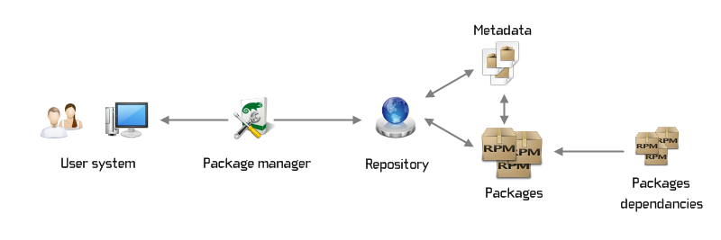

## Packages
Package là file nén chứa executable files, configuration files, các libraries và metadata cần thiết để phần mềm hoạt động chính xác trong hệ điều hành. 
## Repository
- repositories là một kho lưu trữ chứa các gói phần mềm(package) thiết yếu hoặc phổ biến sẽ được sử dụng hoặc cài đặt bởi hệ điều hành
- repositories chứa các file được sử dụng cho việc cài đặt các bản cập nhật cho phần mềm

## Trình quản lý gói( package manager)
Trình quản lý gói là phần mềm được sử dụng để phân phối các gói thông qua hệ điều hành. Trình quản lý gói giúp giảm độ phức tạp của người dùng cuối bằng cách tự động cài đặt, cập nhật, nâng cấp và xóa gói, chẳng hạn như bằng cách tự động kiểm tra các phần phụ thuộc hoặc xác minh nội dung của gói. Điều này giúp cải thiện trải nghiệm của người dùng và cũng giúp cải thiện bảo mật bằng cách đảm bảo rằng các gói chính xác được cài đặt và cập nhật. Các trình quản lý gói phổ biến bao gồm yum, apt-get, dnf,...

## Dependencies:
Dependencies là các gói bổ sung cần thiết để gói hoạt động. Chúng cũng cần được cài đặt, cập nhật, bảo trì và gỡ bỏ tương ứng, thường sử dụng trình quản lý gói.




### Lệnh tương tác:
1. yum: dùng để quản lý các packages cho một số hệ điều hành linux ví dụ như red hat,có các tính năng như tải, cài đặt, xóa package,vv..
+ install package:
```
yum install package name 
```
+ remove package:
```
yum remove package name
```
+ update package
```
yum update package name
```
2. rpm:
- dùng để quản lý các RPM package
- RPM package manager là 1 phần mềm để cài đặt, xóa và quản lý các package trong linux
cài đặt rpm package
```
rpm [flag] [package name]
```
flag:
- i: install
- U: upgrade
- F : freshen(upgrade nhưng cho các package mà version hiện tại là version cũ)
- e: xóa package

3. dnf: 1 phần mềm quản lý package trên fedora linux, công dụng như yum
+ search package
```
dnf search packagename
```
+ install package
```
dnf install packagename
```
+ remove package
```
dnf remove packagename
```
+ upgrade package:
```
dnf upgrade packagename
```
4. apt-get: dùng để quản lý package từ command-line cho ubuntu linux
```
apt-get [options] [command] [package]
```

options:
- y: yes cho tất cả các confirmation request khi cài package
-assume-no: no cho tất cả các confirmation request khi cài package
- d: tải package nhưng không cài đặt
- f: sửa lỗi dependencies trong quá trình cài package
- m: ignore missing packages
- q: không hiển thị lỗi hay cảnh báo
- reinstall: cài lại

commands:
- update
- upgrade
- install
- reinstall
- remove
- purge: xóa package và configuration files
- check: kiểm tra package và tìm broken dependencies
- source:tải về source code của package
 5. dpkg 
 
 dpkg là trình quản lý gói được sử dụng để tải xuống, cài đặt và gỡ bỏ gói dành cho hệ điều hành linux dựa trên Debian.
+ cài đặt package
```
dpkg -i packagename.deb
```
+ xóa package:
```
dpkg -r packagename
```
+ list packages:
```
dpkg -l 
```
+ tìm package 
```
dpkg -k | grep package_name
```
+ view content of package:
```
dpkg -c package name
```
+ check if package is installed or not
```
dpkg -s package_name
```
+ update package:
```
dpkg --update package_name
```
## Nguồn tham khảo:
1. [Nguồn 1](https://www.geeksforgeeks.org/)
2. [Nguồn 2](https://itsfoss.com/package-manager/)
3. [Nguồn 3](https://www.internetblog.org.uk/post/1520/what-is-a-linux-package/)
