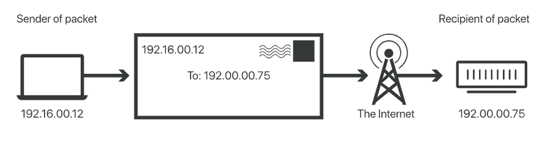
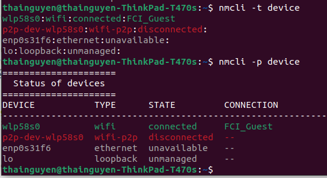
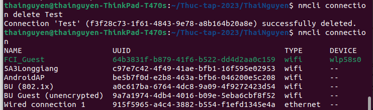

## Định nghĩa:
 Network là một tập hợp các hệ thống máy tính được kết nối với nhau qua các kênh liên lạc để hỗ trợ việc chia sẻ thông tin và tài nguyên giữa các người dùng
## Vai trò 
Linux sử dụng mạng cho nhiều mục đích khác nhau, ví dụ như:
1. chia sẻ tài nguyên: mạng cho phép người dùng chia sẻ và sử dụng tài nguyên như ổ đĩa, máy in và các thiết bị khác
2. thiết lập giao tiếp giữa các máy tính: Linux cho phép các máy tính kết nối với nhau và giao tiếp bằng các giao thức truyền thông
3. Truy cập internet: linux cho phép người dùng truy cập internet để truy cập thông tin trực tuyến và cũng có thể truy cập các tài nguyên và dịch vụ được chia sẻ trực tuyến
## Một số khái niệm cơ bản
## Socket

Socket là một điểm cuối trong kênh giao tiếp hai chiều giữa hai chương trình đang chạy trên mạng.

## IP(Internet protocol)

IP là một tập hợp các quy tắc được sử dụng để định tuyến địa chỉ các gói dữ liệu khi chúng di chuyển qua mạng và đến đích chính xác của chúng. Thông tin IP được gắn vào mỗi gói dữ liệu để giúp các bộ router gửi chúng qua mạng. Mỗi gói dữ liệu chứa thông tin IP của cả người gửi và người nhận gói dữ liệu. Một địa chỉ IP được cung cấp cho mỗi thiết bị hoặc domain name với internet để các gói dữ liệu có thể được chuyển hướng đến địa chỉ IP được đính kèm với chúng. Điều này cho phép dữ liệu đến nơi cần thiết.



### Protocol:

- xác định cách thức liên lạc giữa hai hệ thống máy tính, và cách thức xử lý khi máy tính truyền hoặc nhận thông tin từ máy khác

## Network interface

Giao diện mạng mô tả điểm kết nối giữa máy tính và mạng. Đây có thể là thẻ hoặc thiết bị phần cứng, chẳng hạn như thẻ giao diện mạng (NIC) hoặc có thể là thẻ ảo. Mục đích của giao diện mạng là cho phép máy tính giao tiếp với mạng và các máy tính khác được kết nối với cùng mạng đó.

+ Giao diện mạng vật lý: thiết bị phần cứng để tạo điều kiện kết nối với mạng như thẻ NIC
+ Giao diện mạng ảo: đây là ảo hóa của giao diện mạng máy tính cho phép máy tính kết nối với mạng. Nó được tạo bằng phần mềm chứ không phải thiết bị phần cứng và thường được sử dụng trong môi trường ảo hóa.

### Routing table
- một bảng dùng để xác định các data packet được truyền trên network theo hướng nào.
- bao gồm các thông tin như sau:
+ network id hoặc địa chỉ theo route được chỉ định
+ subnet mask: dùng để liên kết địa chỉ IP của điểm đến và network ID
+ next hop: địa chỉ IP mà packet sắp được chuyển đến
+ outgoing interface: interface dùng để chuyển packet đến điểm đến
+ metric: số router ít nhất cần phải đi qua để đến điểm đến
## Firewall

tường lửa(firewall) là một hệ thống bảo mật giúp lọc và kiểm soát lưu lượng mạng dựa trên một bộ quy tắc định trước. Tường lửa sẽ chặn bất kỳ lưu lượng nào không tuân thủ các bộ quy tắc này.


## các lệnh tương tác
1. ifconfig
hiển thị IP address của 3 network: ethernet, local network, và WLAN
``` 
ifconfig [..options] [interface]
```
### command: 
- eth0: ethernet
- lo: local network
- wlan0: WLAN
###Options:
- -a: hiển thị tất cả các interface hiện có
- -s: hiển thị thông tin từ ifconfig dưới dạng danh sách ngắn
- -v: hiển thị thông tin có thêm nhiều chi tiết hơn so với -s
- [interface] up: khởi động interface chỉ định
- [interface] down: vô hiệu hóa interface chỉ định
- add addr /prefixlen: thêm một địa chỉ IP vào interface(IPv6)
- del addr /prefixlen: bỏ một địa chỉ IP vào interface(IPv6)
- [-]promisc:bật hoặc tắt chế độ promiscuous, là chế độ cho phép interface nhận tất cả các packet trên network
- mtusize N:
cho phép người dùng đặt Maximum transfer size, là size lớn nhất của 1 data packet trên network
+ Syntax như sau
```
ifconfig interface_name mtusize size
```
2. ip
dùng để quản lý địa chỉ IP và network
```
ip [options] object {command}
```
options:
- address: hiển thị địa chỉ IP
- address show [interface]: hiển thị địa chỉ IP của một interface nhất định
- link: hiển thị thông tin từ data link layer
nếu cần hiển thị thêm thông tin có thể làm như sau, thêm tên của interface nếu cần hiển thị cụ thể:
```
ip -s link (interface name)
```
- route: hiển thị thông tin từ routing table:
+ hiển thị routing table:
```
ip route show
```
+thêm route mới vào routing table
``` 
ip route add [network] via [gateway] dev [interface]
```
+ xóa route:
```
ip route delete [network] 
```
+ thay đổi route đang có:
``` 
ip route change [network] via [gateway] dev [interface]
```
- add: thêm địa chỉ IP vào interface
```
ip a add [ip_address] dev (interface)
```
- del: xóa địa chỉ IP khỏi interface
```
ip a del [ip_address] dev (interface)
```
- up: bật interface
```
ip link set (interface) up
```
- down: tắt interface
```
ip link set (interface) down 
```
- neighbour: xem MAC address của các thiết bị đang được kết nối với network
```
ip neighbour
```
3. traceroute
- hiển thị địa chỉ IP mà các packet phải đi qua để tới điểm đến
```
traceroute [options] [destination] 
```
options:
- -4: dùng IPv4
- -6: dùng IPv6
- -F: không chia nhỏ packet
- -g gate: route packet qua gate chỉ định
- -m max_hop: đặt số hop tối đa để packet có thể tới được điểm đến
- -p Port: đặt port chỉ định cho điểm đến của packet
- -q num: đặt số probe cho mỗi hop, số mặc định là 3
4. ping : kiểm tra thời gian phản hồi khi gửi packet đến một địa chỉ
```
ping [destination]
```
option :
- -c num: số packet cần gửi trước khi dừng
- -i num: đặt thời gian trước khi gửi packet
- -s size: đặt kích cỡ của packet
- -W timeout: đặt thời gian timeout khi đang đợi phản hồi
5. netstat
- dùng để hiển thị thông tin về network
```
netstat [options] 
```
options:
- -t : hiển thị tất cả TCP Port
- -u: hiển thị tất cả UDP Port
- -l: hiển thị listening port
- -s: hiển thị tất cả thông số của tất cả các port
- -r: hiển thị routing table
- -i: hiển thị thông số của interface
6. dig
- được sử dụng để lấy thông tin về máy chủ DNS
```
dig [server name] [commands]
```
commands:
- +short: rút ngắn lượng thông tin, thường chỉ hiển thị mỗi địa chỉ IP
- +nocomments: bỏ comments
- +noall: xóa hết displayflag
- +trace: trace DNS path
- +stats: hiển thị thông số
7. route
- dùng khi người dùng muốn sử dụng route table
+ hiển thị route table:
```
route
```
+ hiển thị route table bản đầy đủ hơn:
```
route -n
```
+ thêm default gateway
```
route add default gw [ip]
```
+ từ chối routing đến một host hoặc network cụ thể
```
route add - host [ip] reject
```
8. host
- dùng để tìm địa chỉ IP cho hostname và tìm domain name cho IP address
```
host [website name/IP]
```
9. wget
- công cụ dùng để lấy nội dung và file từ các máy chủ khác nhau
```
wget [options] [URL]
```
options: 
- O: xác định tên file và vị trí trong thư mục để lưu file vừa tải
- P: xác định tên directory để lưu file
- r : recursive downloading, wget có thể truy cập và tải các file từ các link trong URL
- N: tải file nếu như file đó là bản mới hơn của bản được lưu trong thư mục
- c: tiếp tục tải 1 file đang trong trạng thái dừng tải
10. curl
chức năng giống wget
```
curl [options] [URL]
```
Options:
-o filename: lưu file với tên được chỉ định
-O : lưu file cùng tên với URL
-C: tiếp tục download file đang download dở
--limit-rate [value]: giới hạn băng thông xuống 1 giá trị nhất định

## Using nmcli command
nmcli is a network manager controlled using the command-line interface. Its uses include but not limited to display network status, enabling or displaying networks and delete network connections.

```
nmcli [options] object {command|help}
```
Users can pick from 8 sections to fill in for the object field.

|Object|Use|
|----|-----|
|general|get the status and global configuration of the network manager|
|networking|start, restart and manage the network manager|
|radio| manage wireless devices and protocols|
|connecion|manage connections|
|device| manage network devices|
|agent| configure and manage security settings|
|monitor|monitor network changes|

Common options:
- -t: prints output in a brief format
- -f [fieldname]: prints output with only the specified fields
- -p: prints output in an organized, easily readable format



Một số lệnh thông dụng:
+ hiển thị toàn bộ các kết nối
```
nmcli connection show
```
+ hiển thị các thiết bị và trạng thái của chúng 
```
nmcli device status
```
+ dừng và bật các thiết bị
```
nmcli dev connect/disconnect [device]
```
+ xóa thiết bị
```
nmcli delete [device]
```
+ bật kết nối:
```
nmcli con up [id]
```
+ tắt kết nối:
```
nmcli con down [id]
```
+ tạo kết nối:
```
nmcli connection add [common options] [type specfic options] [ip options]
```
ví dụ như:
```
nmcli connection add type ethernet ifname "interface-name" con-name "connection-name" ethernet.mtu 1600
```


+ xóa kết nối:
```
nmcli connection delete [id/uuid]
```




Nguồn tham khảo:
1. [Nguồn 1](https://www.geeksforgeeks.org/)
2. [Nguồn 2](https://mindmajix.com/linux-networking-commands-best-examples)
3. [Nguồn 3](https://www.cloudflare.com/learning/network-layer/internet-protocol/)
4. [Nguồn 4](https://docs.oracle.com/javase/tutorial/networking/nifs/definition.html)
5. [Nguồn 5](https://access.redhat.com/documentation/en-us/red_hat_enterprise_linux/7/html/networking_guide/sec-configuring_ip_networking_with_nmcli)

