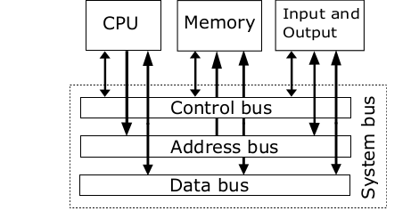
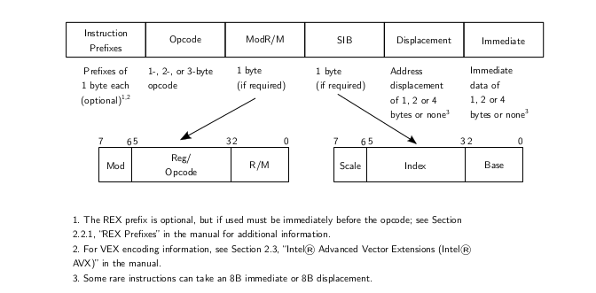
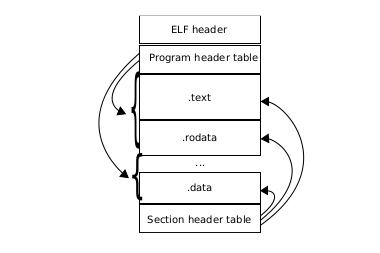

# Main points:
## Chap1:
Problem domain: bất kỳ thứ gì bên ngoài lập trình mà một kỹ sư phần mềm cần hiểu để tạo ra mã chính xác có thể đạt được mục tiêu mong muốn của họ. Ví dụ, để viết phần mềm tài chính, lập trình viên cần hiểu các khái niệm tài chính.
Documentation:
Lý do tại sao chúng ta cần tài liệu:
1. Để ghi lại các lỗi chưa được giải quyết hoặc một số đặc điểm cụ thể của hệ thống
2. Cung cấp tài liệu cho thành viên mới tham gia dự án
3. Hướng dẫn hoặc cung cấp thông tin hữu ích cho khách hàng sử dụng sản phẩm
## Chap 2:
Transistors: allows control of current through one channel by varying the intensity of a smaller current on the second channel → because of this, it can be used to implement a bit by varying current from the secondary channel.
cho phép điều khiển dòng điện qua một kênh bằng cách thay đổi cường độ của dòng điện nhỏ hơn trên kênh thứ hai → do đó, nó có thể được sử dụng để thực hiện một bit bằng cách thay đổi dòng điện từ kênh thứ cấp.
Cổng logic là một thiết bị thực hiện chức năng boolean. Các cổng logic có thể được nối với nhau để thực hiện các chức năng phức tạp hơn. Đầu vào và đầu ra của chúng là nhị phân. Cổng logic là các thành phần cơ bản được sử dụng để xây dựng chip.
Machine code : một chuỗi các số 1 và 0 cho thiết bị biết cách thực hiện các lệnh, vì cổng logic chỉ chấp nhận đầu vào nhị phân
Assembly language: biểu diễn machine code bằng cách đặt tên các mẫu bit thường được sử dụng nhất định → cho phép viết mã và gỡ lỗi nhanh hơn
Assembly language-> assembler biên dịch assembly language sang machine code
High level and low level programming languages
Trừu tượng hóa: kỹ thuật che giấu sự phức tạp khi nó không liên quan đến ngữ cảnh của vấn đề.
Ví dụ:
- Machine cung cấp tính trừu tượng cho các cổng logic
- Assembly language cung cấp tính trừu tượng cho machine code
- Ngôn ngữ lập trình cung cấp tính trừu tượng cho assembly language
## Chap 3:
Computer architecture
von Neumann: 
von Neumann  một mô hình kiến trúc máy tính thường được sử dụng, tập trung vào ý tưởng dữ liệu và hướng dẫn được lưu trữ riêng biệt với CPU. Sau đó, CPU sẽ tìm nạp, giải mã và thực thi dữ liệu khi cần (thường được gọi là chu trình tìm nạp-giải mã-thực thi).

Registers: thành phần phần cứng để truy cập và truyền dữ liệu tốc độ cao. Phần mềm có thể điều khiển phần cứng bằng cách ghi trực tiếp vào một thanh ghi. Ngoài ra, nó có thể được sử dụng để lưu trữ dữ liệu tốc độ cao tạm thời cho CPU.. 
Port: thanh ghi chuyên dụng trong một thiết bị phần cứng dùng để giao tiếp với các thiết bị khác. Khi dữ liệu được ghi vào một cổng, các lệnh được thực hiện theo các giá trị được ghi vào cổng đó.
## Chap 4:
Tại sao cần assembly?
Không phải mọi thứ mà nền tảng phần cứng cung cấp đều có thể được bao phủ bằng ngôn ngữ lập trình cấp cao và compiler.
Object file: chứa machine code do trình dịch hợp ngữ hoặc trình biên dịch tạo ra, sử dụng objdump để hiển thị thông tin về object file

Objdump displays assembly instructions with the following information:
- Cột đầu tiên: địa chỉ của assembly instruction
- Cột thứ hai: giá trị hex của lệnh đó
- Cột thứ ba: lệnh assembly
Cấu trúc của lệnh assembly:

### Cấu trúc của assembly instruction:
+ Instruction prefix: xuất hiện ở đầu lệnh nhưng không bắt buộc
+ Opcode: mã duy nhất xác định một lệnh trong mã máy
+ ModR/M: chỉ định toán hạng của lệnh (thanh ghi, vị trí bộ nhớ hoặc giá trị)
+ Scale Index Base byte: mã hóa cách tính vị trí ô nhớ thành một phần tử trong mảng. Ưu điểm của việc sử dụng byte này là nó giảm số lần phần tử này cần được truy cập → tăng hiệu suất CPU.
+ Cơ cấu SIB:
     + index: offset vào mảng
     + scale: hệ số của chỉ số, một trong các giá trị 1,2,4,8
     + Cơ sở: địa chỉ xuất phát
     + Địa chỉ hiệu quả= S*I+ B
         + Offset: số nguyên chỉ khoảng cách giữa điểm bắt đầu của đối tượng và khoảng cách hoặc điểm (có lẽ là bên trong đối tượng)
### Examined compiled code
how stack is used:

khi local variable được tạo → được đẩy vào stack, khi nó vượt quá phạm vi → xóa khỏi stack

đối với các lệnh gọi hàm, các đối số được đẩy vào ngăn xếp theo thứ tự ngược lại

Vòng lặp: đặt lại con trỏ lệnh thành lệnh đã thực hiện

Conditional: nhảy đến một dòng theo điều kiện
## Chap 5:

ELF: executable and linkable format, located at the beginning of an executable. Its purpose is to provide instructions for the operating system to load into main memory and run the executable.
	định dạng thực thi và có thể liên kết, nằm ở đầu tệp thực thi. Mục đích của nó là cung cấp hướng dẫn để hệ điều hành tải vào bộ nhớ chính và chạy tệp thực thi.
Kết cấu:
+ tiêu đề: mô tả tổ chức tệp
+ bảng tiêu đề chương trình: mô tả các phân đoạn của tệp thực thi
+ section header table: mô tả các phần của một file thực thi
+ Segment: nhóm các section được nạp trực tiếp vào OS khi chạy
+ Phần: khối nhị phân là mã chương trình  và dữ liệu có sẵn trong bộ nhớ hoặc metadata về các phần khác được sử dụng trong quá trình liên kết
## Chap6: 
Trình gỡ lỗi được định nghĩa là chương trình cho phép kiểm tra chương trình đang chạy.
4 mục đích chính của trình gỡ lỗi:
1. Bắt đầu chương trình và chỉ định thông tin có thể ảnh hưởng đến hành vi của nó.
2. Dừng chương trình trong các điều kiện cụ thể (ví dụ: thêm điểm ngắt, sử dụng lệnh bước)
3. Kiểm tra chương trình khi nó đã dừng (ví dụ: kiểm tra các giá trị trong thanh ghi)
4. Thay đổi mọi thứ trong chương trình của bạn để tập trung sửa từng lỗi một
## Chap7:
Bootloader: một ứng dụng được sử dụng để tải HĐH bằng cách giao tiếp trực tiếp với phần cứng
BIOS (Hệ thống đầu vào/đầu ra cơ bản):
- được định nghĩa là firmware thực hiện khởi tạo phần cứng và cung cấp một bộ chương trình con chung cho các thiết bị đầu vào/đầu ra.
- kiểm tra tất cả các thiết bị lưu trữ khả dụng để xem có thiết bị nào có khả năng khởi động hay không, bằng cách kiểm tra 2 byte cuối cùng của sector đầu tiên nếu nó có boot signature là 0x55, 0xAA. Nếu thiết bị có khả năng khởi động, BIOS sẽ tải thiết bị, đặt program counter thành địa chỉ của thiết bị đó và để CPU thực thi mã từ đó.
- Khu vực đầu tiên được gọi là MBR (Bản ghi khởi động chính). Chương trình trong khu vực đầu tiên được gọi là MBR Bootloader.
- BIOS cung cấp các dịch vụ cơ bản để kiểm soát phần cứng ở giai đoạn khởi động

Quá trình khởi động:
1. BIOS cho phép bộ tải khởi động MBR tiếp quản bằng cách nhảy tới 0000:7c00h, trong đó bộ tải khởi động được giả định là
2. Thiết lập môi trường máy khởi động bằng cách khởi tạo các thanh ghi đoạn
3. Nạp nhân
- đọc kernel từ đĩa
- lưu trong bộ nhớ chính
- chuyển đến mã bắt đầu của kernel và thực thi (chuyển điều khiển sang hệ điều hành nếu thành công)
4. Dừng lại nếu xảy ra lỗi và in thông báo để thông báo cho người dùng

Makefiles: cho phép nhiều lệnh xây dựng chạy theo thứ tự
## Chap9:
Các khái niệm cơ bản về hệ điều hành
+ Quản lý CPU: cho phép các chương trình chia sẻ CPU để chạy đa nhiệm
+ Quản lý bộ nhớ: phân bổ đủ dung lượng cho các chương trình chạy
+ Quản lý thiết bị: phát hiện và giao tiếp với các thiết bị khác nhau

Về bản chất, hệ điều hành cho phép người dùng ra lệnh cho máy tính phải làm gì

+ Drivers: các chương trình cho phép HĐH giao tiếp và sử dụng các tính năng của thiết bị phần cứng.
+ Kernel space: đề cập đến môi trường làm việc của HĐH mà chỉ hạt nhân mới có thể truy cập.
+ User space: các quy trình được HĐH giám sát và chạy phía trên HĐH để người dùng truy cập
## Chap10:
+ Tasks: đơn vị công việc mà hệ điều hành cần thực hiện
+ Tiến trình: cấu trúc dữ liệu theo dõi việc thực hiện một tác vụ
+ Scheduler: quản lý tài nguyên bằng cách quyết định tác vụ nào chạy trước tác vụ khác và trong bao lâu.
Mức độ ưu tiên được sử dụng để quyết định tác vụ nào chạy trước tác vụ khác để phân bổ tài nguyên CPU
Hệ điều hành ưu tiên: có thể dừng thực thi một quy trình và chuyển sang quy trình khác
Một hệ điều hành không ưu tiên: các tác vụ chạy cho đến khi hoàn thành
Trạng thái quá trình:
- run: CPU đang thực thi mã trong các tiến trình
- ngủ: cho biết CPU đang thực thi một số tiến trình khác
- bị hủy: quá trình được thực hiện và chờ bị hủy hoàn toàn
## Chap11
Interrupt: là tín hiệu do một thiết bị  phát ra để thu hút sự chú ý đến một số nhiệm vụ hoặc sự kiện khẩn cấp cần được chú ý ngay lập tức
Xử lý ngắt:
1. Thiết bị phát tín hiệu ngắt
2. CPU dừng chương trình hiện tại đang được thực hiện
3. Thiết bị được thông báo rằng yêu cầu được nhận dạng và bộ xử lý phục vụ yêu cầu
4. Quá trình đã dừng được tiếp tục sau khi ngắt được phục vụ
 
## Chap 12
Chương 12:
Address space: tập hợp tất cả các vị trí bộ nhớ có thể định địa chỉ
Có hai loại:
- bộ nhớ
- I/O
Bộ nhớ ảo: Hệ điều hành chuyển địa chỉ bộ nhớ ảo thành địa chỉ bộ nhớ vật lý, do đó, nó có vẻ liên tục từ góc nhìn của không gian người dùng mặc dù dữ liệu được lưu trữ ở các vị trí bộ nhớ khác nhau
Bộ nhớ ảo cho phép mỗi chương trình có bộ nhớ riêng để hoạt động, ngăn không cho chúng ghi đè lên dữ liệu của nhau

## Chap 13
Hệ thống tập tin
Tệp: có 2 thành phần: siêu dữ liệu và dữ liệu thực tế. Siêu dữ liệu chứa các thuộc tính của dữ liệu thô trong tệp

