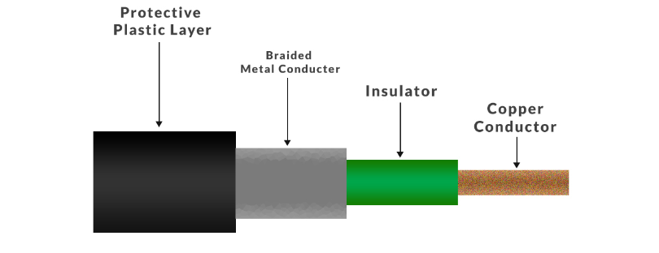
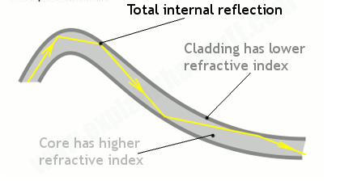
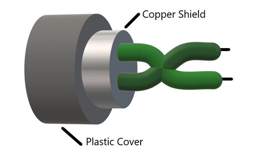
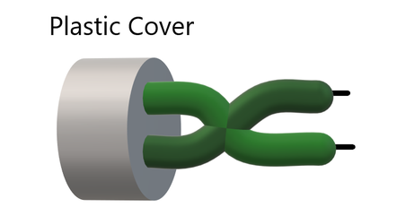
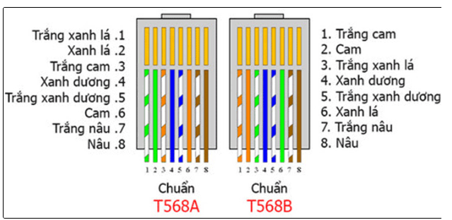
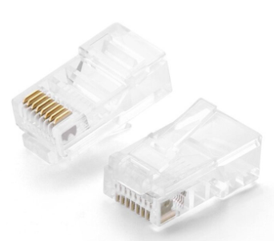
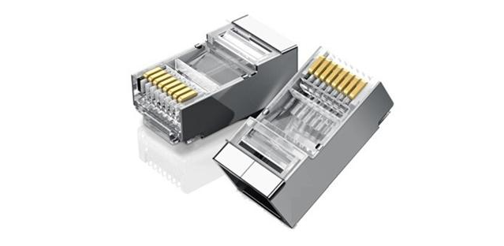

## Định nghĩa
Cáp mạng là phần cứng được sử dụng để kết nối một thiết bị mạng với thiết bị khác. Dữ liệu được truyền qua các cáp này ở dạng mã nhị phân 1 và 0.
## 4 loại cáp mạng
1. Cáp đồng trục
+ là loại cáp có ruột cáp điện với ruột dẫn bằng đồng và lớp cách điện che chắn xung quanh. Nó cũng có một lưới kim loại bện bao quanh chất cách điện để ngăn nhiễu tín hiệu.

Mục đích của từng thành phần:
     + Lớp nhựa: bảo vệ cáp khỏi các tác nhân bên ngoài
     + lưới bện: giúp che chắn cáp khỏi nhiễu tín hiệu
     + cách điện: ngăn không cho ruột dẫn và lưới bện chạm vào nhau sẽ gây đoản mạch trong dây
     + dây dẫn: mang tín hiệu điện từ để truyền dữ liệu dọc theo sợi cáp dưới dạng mã nhị phân

### Ưu điểm:
- hỗ trợ băng thông lớn
- dễ lắp đặt
- bền 
- hỗ trợ nhiều kênh
### Nhược điểm:
- giá thành cao
- phải được nối đất để tránh nhiễu tín hiệu
- có nhiều lớp nên cồng kềnh
2. Cáp quang
+ truyền ánh sáng dọc theo dây cáp thủy tinh thay cho tín hiệu điện
+ Ánh sáng truyền xuống cáp bằng cách dội vào thành cáp như bên dưới

+ Tế bào quang điện dùng để biến đổi tín hiệu quang thành tín hiệu điện

### Ưu điểm:
- băng thông lớn hơn các loại cáp lõi dây đồng
- nhẹ và mỏng hơn các loại cáp thông thường
- giảm việc nhiễu tín hiệu trong đường truyền
- bảo mật tốt hơn các loại cáp khác do không phát ra các tín hiệu điện

### Nhược điểm:
- không bền bằng các loại cáp bằng đồng, dễ bị hỏng nếu bị bẻ cong quá mức
- đắt hơn các loại cáp bằng đồng thông dụng

3. Cáp xoắn đôi
- là một sợi cáp gồm nhiều đôi dây đồng có cách điện xoắn lại với nhau. Việc xoắn giúp giảm nhiễu tín hiệu.
     + cáp xoắn đôi có vỏ bọc (STP): cáp có lớp cách điện bổ sung hoặc lớp phủ trên dây dẫn để giảm nhiễu tín hiệu hơn nữa
     ### Ưu điểm:
     - lớp vỏ bọc giúp làm giảm nhiễu tín hiệu 
     - băng thông lớn hơn loại không có vỏ bọc
     ### Nhược điểm:
     - giá thành cao
     - cần tốn công sức để bảo trì hơn các loại cáp khác

     + Cáp xoắn đôi không có vỏ bọc (UTP): các cặp dây đồng được xoắn với nhau mà không có vỏ bọc bổ sung
     
     ### Ưu điểm:
     - giá thành hợp lý
     - dễ lắp đặt
     ### Nhược điểm:
     - tính bảo mật không cao, tín hiệu truyền trên cáp dễ bị nhiễu hơn khác loại cáp khác
     - băng thông bị giới hạn
    

## Các loại cáp xoắn đôi

|Danh mục|Tốc độ tối đa|Băng thông|Mô tả|
|----|----|----|----|
|cat1|1Mbps|1Mhz|Chỉ có hai cặp dây|
|cat2|4Mbps|10MHz|tối thiểu 4 cặp dây|
|cat3|10Mbps|16Mhz| cáp đầu tiên được sử dụng trong mạng LAN|
|cat4|20Mbps|20MHz| |
|cat5|100Mbps|100MHz| dùng trong mạng LAN tốc độ cao|
|cat5e|1000Mbps|100MHz| yêu cầu tối thiểu cho mạng LAN hiện đại|
|mèo6| 10Gbps|250MHz| dùng lõi nhựa để chống nhiễu tín hiệu |
|cat6a|10Gbps|500MHz|giảm nhiễu tín hiệu|

cat 1,2,3,4,5 đã lỗi thời và không còn được sử dụng. Cat 5e,6,6a là các loại cáp xoắn đôi thông dụng.
## Chuẩn cắm
có 2 loại chuẩn cắm chính : T568A(chuẩn A) và T568B(chuẩn B)

Có 2 kiểu bấm dây mạng:
1. bấm thẳng: là khi 2 đầu dây cáp mạng được bấm cùng 1 chuẩn, thường được dùng khi kết nối 2 thiết bị khác loại với nhau
2. bấm chéo: là khi 2 đầu dây cáp mạng được bấm khác chuẩn (1 đầu chuẩn A 1 đầu chuẩn B hoặc ngược lại), thường được dùng để kết nối các thiết bị cùng loại với nhau

## Đầu cắm mạng (hạt mạng)
- là loại thiết bị dùng để kết nối dây cắm mạng với internet hoặc kết nối một thiết bị mạng với dây cáp, cho phép người sử dụng dây cáp mạng để kết nối với internet
### Một số loại đầu cắm mạng ethernet
1. Cat 5: làm bằng nhựa trong suốt, chân tiếp xúc đều nhau, giá thành thấp hơn so với hạt mạng cat6

2. Cat 6: làm bằng nhựa trong suốt, các khe cắm xen kẽ nhau 1 khe dài 1 khe ngắn, đầu tiếp xúc thường được làm bằng hợp kim mạ vàng nên có màu có óng ánh, khác so với cat5. Ngoài ra cat6 thường được bọc thêm 1 lớp kim loại bảo vệ. 

## Nguồn tham khảo
1. [Nguồn 1](https://www.geeksforgeeks.org/twisted-pair-cable/)
2. [Nguồn 2](https://www.computernetworkingnotes.com/networking-tutorials/network-cable-types-and-specifications.html)
3. [Nguồn 3](https://quantrimang.com/cong-nghe/huong-dan-cach-bam-day-mang-116835)
4. [Nguồn 4](https://daymang.com/3218/cach-bam-day-mang-nhanh-va-chuan.html)
5. [Nguồn 5](https://catthanh.com/hat-mang-cat5hat-mang-cat6-khac-nhau-nhung-gi/)

