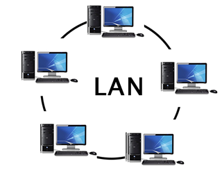

## Định nghĩa:
+  LAN(local area network):
- một nhóm các hệ thống máy tính được kết nối với nhau trên một khu vực có diện tích nhỏ

+  VLAN(Virtual LAN): là một nhóm máy tính được kết nối bằng một mạng LAN ảo, không kể khoảng cách địa lý giữa chúng

Broadcast domain is a network segment in which when a device broadcast a packet, all devices on that domain will receive it.The broadcast domain is usually limited to switches only. 

VLAN ranges
- VLAN 0,4095: reserved for VLAN which cannot be seen or used
- VLAN 1: default VLAN of switches. cannot be deleted or edit but can be used.
- VLAN 2-1001: this is the normal VLAN range and can be created,edit and deleted.
- VLAN 1002-1005: used for FDDI and token rings. cannot be deleted.
- VLAN 1006-4094: extended range of VLAN

Key features:
1. VLAN tagging: is a method to identify and distinguish VLAN traffic from other network traffic, usually by adding a VLAN tag to the Ethernet frame header
2. VLAN membership: assigning network devices to specific VLANs
+ static VLANs: the network administrator creates a VLAN and assigns switch ports to the VLAN( also called port-based VLAN). VLAN ports does not change until the administrator changes the port assignment
+ Dynamic VLAN: switch automatically assigns the port to a VLAN using information from user like MAC address or IP address. When a device is connected to a switch, the switch queries a database to establish VLAN membership. When we move a device from a port on one switch to another switch, the dynamic VLANs automatically configure the membership of the VLAN.
3. VLAN trunking: allows mutiple VLANs to be carried over a single physical link.
### Trunking 

