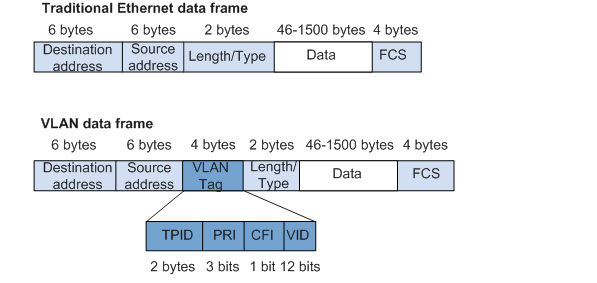
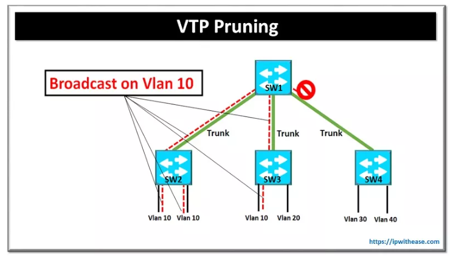

## Định nghĩa:
+  LAN(local area network):
- một nhóm các hệ thống máy tính được kết nối với nhau trên một khu vực có diện tích nhỏ

+  VLAN(Virtual LAN): là một nhóm máy tính được kết nối bằng một mạng LAN ảo, không kể khoảng cách địa lý giữa chúng

Broadcast domain là một phân đoạn mạng trong đó khi một thiết bị phát một gói, tất cả các thiết bị trên domain đó sẽ nhận được nó. Broadcast domain thường chỉ giới hạn ở các bộ chuyển mạch.
## Ưu điểm khi dùng VLAN
- đơn giản hóa việc quản lý network: nhóm người dùng có thể được xếp vào các nhóm VLAN khác nhau dựa trên nhu cầu của người dùng hoặc các tiêu chí khác thay vì vị trí địa lý của họ. Điều này giúp tối ưu hóa hiệu suất mạng và giúp việc quản lý mạng hiệu quả.
- tăng khả năng bảo mật: bằng cách xếp người dùng vào các broadcast domain, VLANs giúp hạn chế việc các người dùng không được cấp phép truy cập vào hệ thống mạng bằng cách quản lý các giao tiếp từ bên ngoài vào VLAN và giới hạn việc các thông tin ở được quảng bá trong broadcast domain được nhận bởi những máy nằm ngoài những máy đang ở trong VLAN
- tăng độ linh hoạt: mạng VLAN cho phép thêm người dùng và mở rộng network một cách dễ dàng và cho phép các thiết bị được di chuyển tự do mà không cần phải nối dây cáp. Cấu hình VLAN có thể được sửa đổi dễ dàng khi hệ thống mạng phát triển.

## Nhược điểm khi sử dụng VLAN
- vẫn có lỗi về bảo mật, ví dụ như nếu một virus xâm nhập thành công vào hệ thống VLAN có thể lan ra toàn hệ thống
- overhead: sử dụng VLAN khiến cho switch phải xử lý thêm dữ liệu,ví dụ như xử lý thông tin trong ethernet header để định tuyến các frame qua trunk link, dẫn đến giảm hiệu suất và tăng thời gian xử lý của switch
- khả năng tương thích: sử dụng VLAN đòi hỏi các thiết bị mạng phải hỗ trợ VLAN và một số chuẩn và giao thức, nên các thiết bị mạng cũ và lỗi thời sẽ không thể kết nối được với VLAN.

## Khi nào nên sử dụng VLAN
+ khi có hơn 200 máy trên một mạng LAN
+ khi mạng có lưu lượng cao
+ khi một nhóm người dùng trong network cần nâng cao bảo mật
+ khi muốn tăng số lượng switch để mở rộng số port
+ khi các người dùng không ở trong cùng một broadcast domain. VLAN sẽ giúp họ trao đổi thông tin dễ dàng hơn.

## Các loại VLAN
1. Port-based VLAN: nhóm mạng cục bộ ảo theo port. Mỗi port được xếp vào một VLAN cụ thể và các thiết bị mạng được phân loại dựa trên việc chúng được kết nối với port nào trên switch.
2. Protocol-based VLAN:  Các thiết bị được xếp vào các VLAN tương ứng dựa trên các giao thức mạng mà chúng dùng. Các nhóm giao thức sau đó được giới hạn với các port tương ứng.
3. MAC-based VLAN: cho phép gán các gói không được gắn tag đến cho Vlan bằng cách nhóm các thiết bị mạng vào các VLAN dựa trên địa chỉ MAC của các thiết bị đó
## Phạm vi Vlan
- VLAN 0,4095: dành riêng cho VLAN không thể nhìn thấy hoặc sử dụng
- VLAN 1: VLAN mặc định của switch. không thể xóa hoặc chỉnh sửa nhưng có thể được sử dụng.
- VLAN 2-1001: đây là dải VLAN thông thường và có thể tạo, chỉnh sửa và xóa.
- VLAN 1002-1005: dùng cho FDDI và token ring. không thể bị xóa.
- VLAN 1006-4094: phạm vi mở rộng của VLAN

Token ring:
- là một giao thức truyền thông trong đó tất cả các thiết bị được kết nối trong một vòng. Mã thông báo(token) thường ở dạng mẫu bit đặc biệt hoặc gói tin nhỏ và được chuyển qua các thiết bị theo thứ tự được xác định trước. Nếu một thiết bị có dữ liệu đang chờ gửi và nhận được mã thông báo, thiết bị sẽ gửi những dữ liệu đó sau đó chuyển token sang thiết bị tiếp theo. Nếu không, nó sẽ chỉ chuyển token sang thiết bị tiếp theo.

FDDI(Fiber Distributed Data Interface):
- - là bộ tiêu chuẩn truyền dữ liệu trong mạng LAN qua cáp quang. Có thể mở rộng kết nối lên đến 200km. Nó dựa trên giao thức token ring.

Các tính năng chính:
1. VLAN tagging: là phương pháp xác định và phân biệt lưu lượng VLAN với lưu lượng mạng khác, thường bằng cách thêm VLAN tag vào tiêu đề khung Ethernet
2. VLAN membership: chỉ định các thiết bị mạng cho các Vlan cụ thể
+ static VLANs: người quản trị mạng tạo VLAN và gán port của switch vào VLAN (còn gọi là port-based VLAN). Các cổng VLAN không thay đổi cho đến khi administrator thay đổi việc gán port
+ Dynamic VLAN: switch tự động gán port vào một VLAN bằng việc sử dụng thông tin từ người dùng như địa chỉ MAC hoặc địa chỉ IP. Khi một thiết bị được kết nối với một công tắc, switch sẽ tra cứu cơ sở dữ liệu để thiết lập tư cách thành viên Vlan. Khi chúng tôi di chuyển một thiết bị từ một port trên một switch này sang một switch khác, dynamic VLAN sẽ tự động định cấu hình tư cách thành viên của Vlan.
3. VLAN trunking: cho phép nhiều VLAN được truyền qua một liên kết vật lý duy nhất.
### Trunking 
khi chúng ta muốn kết nối hai hay nhiều switch lại với nhau để mở rộng số lượng port, trunking được sử dụng để kết nối các VLAN trên switch này với switch khác bằng cách sử dụng một liên kết duy nhất để kết nối tất cả các VLAN
- trunking được sử dụng để cải thiện khả năng mở rộng và tính linh hoạt của việc kết nối nhiều VlAN, thường là trên nhiều thiết bị switch, với nhau

+ Gắn tag: Mỗi frame được truyền qua một trunklink được gắn VLAN tag. Tag thường được đặt trong header của Ethernet frame và cho biết frame đó thuộc về VLAN nào.
+ Chuyển tiếp frame: khi một frame đến trunking port, switch sẽ kiểm tra VLAN tag. Nếu frame không được gắn tag, nó được coi là thuộc về Vlan gốc và được chuyển tiếp đến đó. Nếu khung được gắn tag, switch sẽ xem liệu VLAN tương ứng có được cho phép trên trunk link không. Nếu nó được cho phép, frame sẽ được chuyển tiếp đến VLAN thích hợp. nếu VLAN ID cho thấy nó không được phép có ở trên trunk link , switch sẽ loại bỏ frame đó.

IEEE 802.1Q là một tiêu chuẩn mạng hỗ trợ VLAN trên mạng Ethernet. Nó cung cấp cơ chế trunking bằng cách thêm VLAN tag vào ethernet header. Các trường của VLAN tag được hiển thị bên dưới:

|Trường|Độ dài|Mô tả|
|----|-----|-----|
|TPID|2 byte|cho biết loại khung, ví dụ: giá trị 0x8100 cho biết frame của tiêu chuẩn IEEE 802.1 Q|
|PRI|3 bit| biểu thị mức độ ưu tiên của frame, giá trị cao hơn có nghĩa là mức độ ưu tiên cao hơn. Nếu tắc nghẽn xảy ra, frame có mức độ ưu tiên cao hơn sẽ được gửi trước.|
|CFI|1 bit| cho biết liệu địa chỉ MAC có được đóng gói ở định dạng chuẩn hay không (0 nếu có và 1 nếu ở định dạng không chuẩn)|
|VID|12 bit|chỉ ra ID của VLAN mà frame thuộc về|

## VLAN trunking protocol(VTP)
- là một giao thức độc quyền của Cisco giúp đơn giản hóa quá trình quản lý và cấu hình VLAN trong mạng. Nó cho phép các switch trao đổi thông tin VLAN, cho phép cấu hình VLAN nhất quán trên nhiều switch. Nó cho phép người dùng thêm, xóa và đổi tên thông tin VLAN, thông tin này sẽ được truyền đến các thiết bị chuyển mạch khác trong miền VTP.

Yêu cầu đối với VTP:
1. Phiên bản VTP phải giống nhau trên tất cả các switch mà người dùng muốn cấu hình
2. Tên miền VTP phải giống nhau trên các switch
3. Một trong các switch phải là máy chủ

Chế độ VTP:
+ Chế độ máy chủ: switch ở chế độ máy chủ có thể tạo, sửa đổi và xóa VLAN. Chúng phát những sửa đổi về thông tin Vlan của họ tới các switch khác trong mạng.
+ Chế độ máy khách: các switch ở chế độ này sẽ nhận và áp dụng các cấu hình VLAN do các switch máy chủ gửi đến. Họ không thể thay đổi cấu hình VLAN, nhưng có thể chuyển cấu hình cho các công tắc khác.
+ Chế độ trong suốt: các switch ở chế độ này sẽ không cập nhật cấu hình VLAN của mình theo cấu hình mà switch máy chủ quảng cáo, tuy nhiên có thể chuyển cấu hình cho các switch khác

### Configuration revision number
- Số 32 bit được sử dụng để chỉ ra mức độ sửa đổi của gói VTP. Con số này được theo dõi bởi các switch để xác định xem thông tin nhận được có mới hơn phiên bản hiện tại hay không. Mỗi khi server switch thực hiện sửa đổi trên dữ liệu của các VLAN, con số này sẽ tăng thêm một. Client switch sẽ kiểm tra configuration number mà nó nhận được. Nếu nó lớn hơn số của chính họ, configuration data sẽ được cập nhật. Nếu nó không lớn hơn, configuration data sẽ được chuyển đến các thiết bị client switch khác trong cùng một miền.

### VTP pruning
- đó là một tính năng để cải thiện hiệu quả mạng bằng cách xác định VLAN nào được sử dụng tích cực trên mỗi trunk link và loại bỏ các VLAN không cần thiết trên một trunk link cụ thể.

Switch duy trì thông tin về việc thông số sử dụng VLAN trên chúng. Khi một switch xác định rằng một VLAN không hoạt động trên một trunk link cụ thể, nó sẽ gửi một prune request tới các switch lân cận của nó. Nếu các thiết bị switch lân cận  đồng ý với yêu cầu này sau khi so sánh nó với thông tin sử dụng VLAN trên nó, thì VLAN đó sẽ bị loại bỏ khỏi trunk link.

Tính năng này giúp giảm lưu lượng mạng và tránh lãng phí tài nguyên.

## Nguồn tham khảo
1. [Nguồn 1](https://support.huawei.com/enterprise/en/doc/EDOC1100088104#fig208591149121117)
2. [Nguồn 2](https://www.cisco.com/c/en/us/support/docs/lan-switching/vtp/10558-21.html)
3. [Nguồn 3](https://ipwithease.com/vtp-pruning/)
4. [Nguồn 4](https://www.geeksforgeeks.org/vlan-trunking-protocol-vtp/)
5. [Nguồn 5](https://www.guru99.com/vlan-definition-types-advantages.html#10)

