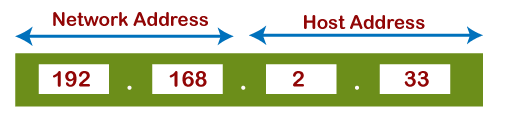
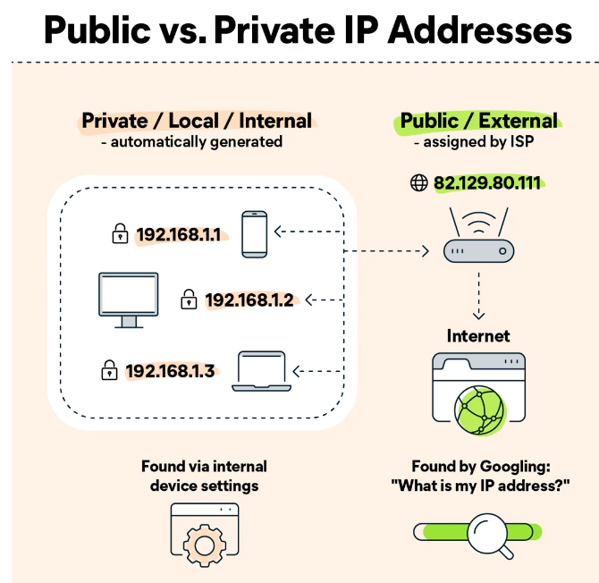
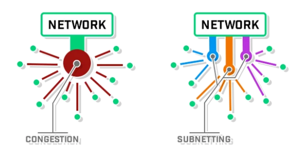

## Khái quát về IP protocol
IP là một tập hợp các quy tắc được sử dụng để định tuyến địa chỉ các gói dữ liệu khi chúng di chuyển qua mạng và đến đích chính xác của chúng. Thông tin IP được gắn vào mỗi gói dữ liệu để giúp các bộ router gửi chúng qua mạng. Mỗi gói dữ liệu chứa thông tin IP của cả người gửi và người nhận gói dữ liệu. Một địa chỉ IP được cung cấp cho mỗi thiết bị hoặc domain name với internet để các gói dữ liệu có thể được chuyển hướng đến địa chỉ IP được đính kèm với chúng. Điều này cho phép dữ liệu đến nơi cần thiết.
## Địa chỉ IPv4
IPv4 là địa chỉ 32 bit được sử dụng để xác định thiết bị trên mạng. Địa chỉ được chia thành các octet(8 bit) được phân tách bằng dấu chấm trên số địa chỉ. Địa chỉ IP được dùng để xác định người nhận và người gửi của các gói tin, giúp cho chúng được chuyển đến bên nhận một cách đầy đủ và hiệu quả.

Định dạng IPv4 sử dụng 32 bit, cho phép khoảng 4,3 tỷ địa chỉ. Tuy nhiên, số lượng thiết bị mạng ngày càng tăng đồng nghĩa với việc không có đủ địa chỉ IPv4. Điều này dẫn đến sự phát triển của IPv6, có định dạng địa chỉ 128-bit, cung cấp một kho địa chỉ IP khổng lồ đáp ứng đủ nhu cầu cho các hệ thống mạng hiện tại.

## Cấu trúc của địa chỉ IPv4
Địa chỉ IPv4 có thể được chia thành hai phần: địa chỉ mạng (network prefix) và địa chỉ máy chủ (host number).

Địa chỉ mạng: chỉ định số duy nhất nào được gán cho mạng.

Địa chỉ host: chỉ định số duy nhất nào được gán cho mỗi thiết bị host. Các host trong cùng một mạng sẽ có cùng một địa chỉ mạng và sẽ được xác định theo địa chỉ host duy nhất của chúng.

## Address space
Address space của IPv4 được chia thành các lớp địa chỉ khác nhau: lớp A, B, C, D và E.
|Phân loại lớp| Phạm vi|Sử dụng|
|----|----|----|
|Lớp A|0.0.0.0 đến 127.255.255.255| sử dụng octet đầu tiên để xác định mạng và ba octet còn lại để xác định các host machine|
|Lớp B| 128.0.0.0 đến 191.255.255.255| hai octet đầu tiên để xác định mạng và hai octet còn lại để xác định các host machine|
|Lớp C|192.0.0.0 đến 223.255.255.255| ba octet đầu tiên để xác định mạng và octet cuối cùng được sử dụng để xác định host machine|
|Lớp D|224.0.0.0 đến 239.255.255.255|được sử dụng cho multicast communication, trong đó địa chỉ được sử dụng để gửi các gói dữ liệu đến nhiều host machine cùng một lúc|
|Lớp E|240.0.0.0 đến 255.255.255.255|dành riêng cho mục đích thử nghiệm|

## Địa chỉ IPv4 public và private
Địa chỉ IP public là địa chỉ IP được nhà cung cấp dịch vụ internet (ISP) gán cho bộ định tuyến mạng. Chúng phục vụ như một cách để ISP giao tiếp với các bộ định tuyến trong mạng. Địa chỉ công cộng có thể được định tuyến từ Internet và mỗi địa chỉ IP public là duy nhất cho từng thiết bị trên internet.

Địa chỉ IP private là địa chỉ IP được dành riêng để sử dụng trong các local network và không thể định tuyến trên internet. Chúng được chỉ định bởi quản trị viên mạng(network administrator) và chỉ được sử dụng để liên lạc nội bộ trong các local network. Địa chỉ IP private có thể được sử dụng lại bởi các thiết bị khác trong các local network khác.

Địa chỉ IP private có thể được chia thành ba loại:

|Lớp|Phạm vi|
|----|---|
|Lớp A|10.0.0.0 đến 10.255.255.255|
|Lớp B|172.16.0.0 đến 172.31.255.255|
|Lớp C|192.168.0.0 đến 192.168.255.255|

## Phân chia mạng con(Subnet division) và prefix length 
IPv4 hỗ trợ khái niệm mạng con(subnet), cho phép chia nhỏ một mạng thành các mạng nhỏ hơn được gọi là mạng con. Điều này cho phép phân bổ địa chỉ IP hiệu quả hơn và cho phép quản lý mạng tốt hơn. Số mạng con xác định có bao nhiêu bit được sử dụng cho phần mạng của địa chỉ IP.

Subnet mask được tạo bằng cách đặt tất cả network bit thành 1 và đặt tất cả host bit bằng 0. Do đó, số lượng bit mạng cần được xác định trước khi tạo subnet mask.

Prefix length được biểu thị bằng dấu gạch chéo lên '/' được đặt sau địa chỉ IP và theo sau là một số, biểu thị số lượng bit được chỉ định cho phần network bit của địa chỉ IP.
+ với địa chỉ IP có prefix length nhỏ: số lượng mạng con lớn nhưng số lượng máy trên mỗi mạng con nhỏ
+ với địa chỉ IP có prefix length lớn: số lượng mạng con nhỏ nhưng số lượng máy trên mỗi mạng con lớn

Để tìm địa chỉ mạng, địa chỉ IP và subnet mask trải qua thao tác AND theo bit, dẫn đến địa chỉ mạng.
Thao tác ANH theo bit là khi mỗi bit của địa chỉ IP và mỗi bit tương ứng của subnet mask trải qua quá trình như sau:
|Case| Result|
|---|---|
|0 AND 0|0|
|0 AND 1|0|
|1 AND 0|0|
|1 AND 1|1|

### Một số lợi ích khi sử dụng subnetting:
- giảm network traffic: subnetting giúp làm giảm kích cỡ của các broadcast domain, nên mỗi gói tin có thể chỉ được gửi đến một subnet cụ thể thay vì cả network
- giúp việc quản lý mạng dễ dàng hơn: việc chia network thành các subnet khiến cho network dễ quản lý hơn và lỗi có thể được xác định dễ dàng hơn
- subnet mask giúp tăng độ hiệu quả của việc truyền các gói tin trên network 

## Nguồn tham khảo
1. [Nguồn 1](https://www.avast.com/c-ip-address-public-vs-private)
2. [Nguồn 2](https://www.cloudns.net/blog/what-is-ipv4-everything-you-need-to-know/)
3. [Nguồn 3](https://www.javatpoint.com/ip-address-format-and-table)
4. [Nguồn 4](https://community.fs.com/blog/know-ip-address-and-subnet-mask.html)
5. [Nguồn 5](https://avinetworks.com/glossary/subnet-mask/)
6. [Nguồn 6](https://www.accessagility.com/blog/benefits-of-subnetting#:~:text=Subnetting%20is%20the%20practice%20of,control%2C%20and%20improving%20network%20security.)
