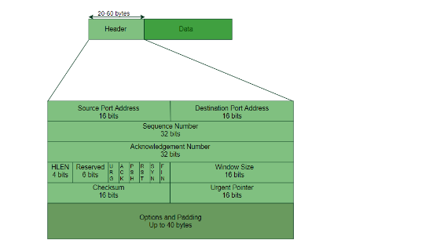
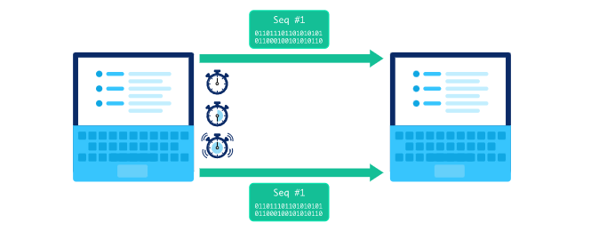
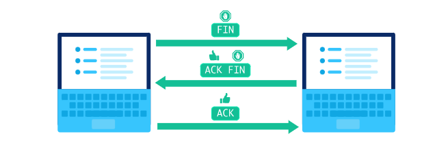

## Giao thức gói dữ liệu người dùng (UDP)
UDP là một tiêu chuẩn giao tiếp thường được sử dụng cho các lần truyền nhạy cảm với thời gian như tra cứu DNS. Nó tăng tốc giao tiếp bằng cách không chính thức thiết lập kết nối trước khi truyền dữ liệu. 
### Cách hoạt động
UDP xác định máy tính mục tiêu và bắt đầu gửi các gói dữ liệu (gọi là 'datagrams') tới nó. UDP không chỉ ra thứ tự truyền của các datagram của nó hoặc xác nhận rằng các gói đã được nhận. Nếu người nhận phát hiện ra một số gói đã được nhận bị lỗi, UDP không có cơ chế gửi lại gói nên các gói đó thường sẽ bị loại bỏ.

UDP ưu tiên việc truyền thông tin một cách nhanh nhất có thể, nên thường được dùng khi tốc độ cần đường truyền cần được tối ưu, ví dụ như livestream. 

### Cấu trúc của tiêu đề UDP
Giao thức UDP thêm header riêng của nó vào mỗi gói dữ liệu.

|Thành phần|Chiều dài|Công dụng|
|---|----|----|
|Số port nguồn|16 bit| xác định port nào sẽ gửi gói tin |
|Số port đích|16 bit| xác định port nào sẽ nhận gói ở phía người nhận |
|Segment length|16 bit| chỉ định độ dài của gói UDP bao gồm header|
|Checksum| 16 bit| Checksum được sử dụng để xác minh nếu dữ liệu bị hỏng. Máy tính nhận sẽ tính toán checksum của dữ liệu và so sánh nó với giá trị này. Nếu 2 checksum không bằng nhau, dữ liệu được xác định là bị hỏng. Tuy nhiên, UDP không có bất kỳ cơ chế nào để sửa lỗi trong quá trình truyền dữ liệu, vì vậy gói dữ liệu có khả năng bị loại bỏ nếu bị hỏng.|

## Giao thức điều khiển truyền dẫn (TCP)
TCP là một tiêu chuẩn truyền thông cho phép trao đổi thông tin qua mạng. Tính năng chính của nó là nó đảm bảo việc truyền dữ liệu thành công qua mạng.

Giao thức TCP hay được dùng khi việc truyền thông tin ưu tiên độ tin cậy hơn là tốc độ truyền các gói tin, ví dụ như gửi email.

## Cấu trúc của header TCP:
Mỗi gói dữ liệu được thêm một header TCP khi được truyền bằng giao thức TCP.

|Thành phần|Chiều dài|Công dụng|
|---|----|----|
|Số port nguồn|16 bit| xác định cổng nào sẽ gửi gói tin |
|Số port đích|16 bit| xác định cổng nào sẽ nhận gói ở phía người nhận |
|Sequence number|32-bit| holds the sequence number so that the receiver can reassemble the data packets|
|Số xác nhận(acknowledgement number)| 32-bit| nó giữ số byte mà người nhận muốn nhận tiếp theo.|
|Header length| 4bit| giữ độ dài của TCP segment header |
|Control flag|6 bit| URG: urgent pointer, ACK: số xác nhận, PSH: yêu cầu đẩy, RST: đặt lại kết nối, SYN: đồng bộ hóa số thứ tự, FIN: kết thúc kết nối|
|Window size|16 bit| cho biết kích thước window để gửi TPC theo byte|
|Urgent pointer| 16 bit|khi cờ điều khiển URG được đặt, nó trỏ đến dữ liệu cần đến quá trình nhận sớm nhất|
|Checksum| 16 bit| Checksum được sử dụng để xác minh nếu dữ liệu bị hỏng. Máy tính nhận sẽ tính toán checksum của dữ liệu và so sánh nó với giá trị này. Nếu 2 checksum không bằng nhau, dữ liệu được xác định là bị hỏng. Tuy nhiên, UDP không có bất kỳ cơ chế nào để sửa lỗi trong quá trình truyền dữ liệu, vì vậy gói dữ liệu có khả năng bị loại bỏ nếu bị hỏng.|

Thiết lập kết nối:
Kết nối cần được thiết lập bằng bắt tay ba bước
1. Máy tính đầu tiên gửi một gói có bit 'SYN' được đặt thành 1.
2. Máy tính thứ hai gửi một gói có bit 'SYN' được đặt thành 1 và bit 'ACK' được đặt thành 1.
3. Máy tính đầu tiên gửi xác nhận (gói có bit 'ACK' thành 1) trở lại máy tính thứ hai

Sau khi quá trình này hoàn tất, kết nối được thiết lập.
 
### Gửi gói dữ liệu:

  Giao thức TCP yêu cầu người nhận phải xác nhận rằng các gói dữ liệu đã được nhận bằng cách gửi lại một gói có bit 'ACK' được đặt thành 1 và số xác nhận tăng theo độ dài của dữ liệu nhận được. Người nhận có thể sử dụng checksum để kiểm tra xem có gói dữ liệu nào bị thiếu hoặc bị hỏng không.

### Phát hiện mất gói tin:
   Sau khi gửi một gói, một timer sẽ được đặt bởi người gửi. Nếu hết giờ và không nhận được gói xác nhận nào từ người nhận, gói sẽ được gửi lại bởi người gửi. Điều này có thể dẫn đến các gói trùng lặp nhưng người nhận có thể chỉ cần giữ một gói và loại bỏ các gói bị trùng lặp.

Checksum được sử dụng để phát hiện lỗi trong gói, bằng cách so sánh giá trị checksum với giá trị checksum trên gói dữ liệu. Nếu chúng không khớp, gói được tuyên bố là bị hỏng và người nhận yêu cầu người gửi truyền lại gói tin.

### Phát hiện gói không đúng thứ tự:
   Giao thức TCP sử dụng số thứ tự và số xác nhận để phát hiện xem các gói có theo thứ tự hay không. Chẳng hạn, nếu người nhận nhận được một gói có số thứ tự cao hơn dự kiến, nó sẽ gửi một gói có acknowledgement number được đặt thành số thứ tự dự kiến để cho người gửi biết gói nào cần được gửi lại.
   Người nhận sử dụng số thứ tự để tập hợp lại các gói dữ liệu hiện tại theo thứ tự.
  
### Đóng kết nối
   1. Máy tính gửi một gói có bit 'FIN' được đặt thành 1 để bắt đầu đóng kết nối.
   2. Máy tính kia gửi một gói có cả bit 'ACK' và 'FIN' được đặt thành 1.
   3. Máy tính đầu tiên gửi một gói có bit 'ACK' được đặt thành 1 để xác nhận trước khi đóng kết nối

## TCP vs UDP
| | TCP| UDP|
|------|----|------|
|Độ tin cậy| cao| thấp| 
|Loại kết nối|Yêu cầu thiết lập kết nối trước khi truyền dữ liệu. Kết nối bị đóng sau khi truyền hoàn tất| Không cần thiết lập kết nối để bắt đầu truyền dữ liệu |
|Chuỗi dữ liệu| Có thể sắp xếp lại các gói dựa trên số thứ tự trên mỗi gói | không thể sắp xếp lại các gói dữ liệu |
|Sửa dữ liệu | yêu cầu truyền lại dữ liệu nếu dữ liệu bị hỏng hoặc thiếu | không truyền lại dữ liệu nên dữ liệu bị mất hoặc bị hỏng không thể sửa được |
|Đảm bảo dữ liệu| Đảm bảo cung cấp dữ liệu đến tuyến đường đích | việc gửi dữ liệu đến đích không được đảm bảo |
|tốc độ| Chậm hơn UDP | Nhanh hơn TCP|

References:
1. [Source 1](https://bunny.net/academy/network/what-is-user-datagram-protocol-udp-and-how-does-it-work/)
2. [Source 2](https://www.khanacademy.org/computing/computers-and-internet/xcae6f4a7ff015e7d:the-internet/xcae6f4a7ff015e7d:transporting-packets/a/transmission-control-protocol--tcp)
3. [Source 3](https://www.avast.com/c-tcp-vs-udp-difference#:~:text=The%20main%20difference%20between%20TCP,reliable%20but%20works%20more%20quickly.)
4. [Source 4](https://www.geeksforgeeks.org/user-datagram-protocol-udp/)
5. [Source 5](https://www.geeksforgeeks.org/services-and-segment-structure-in-tcp/)
