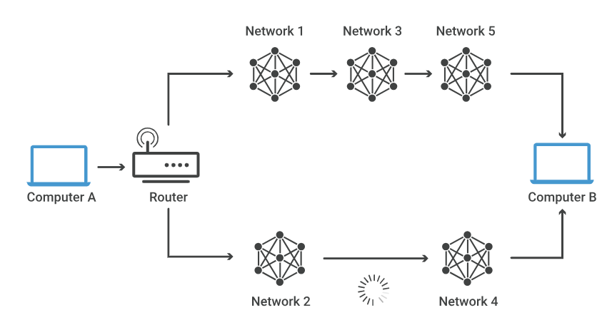
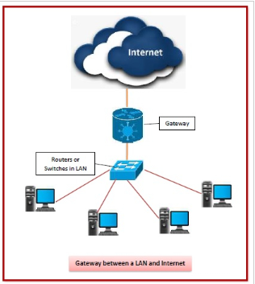
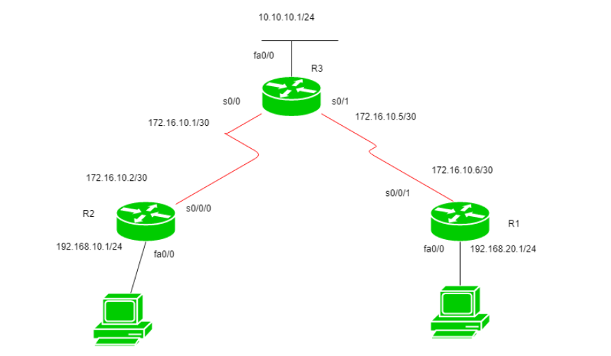
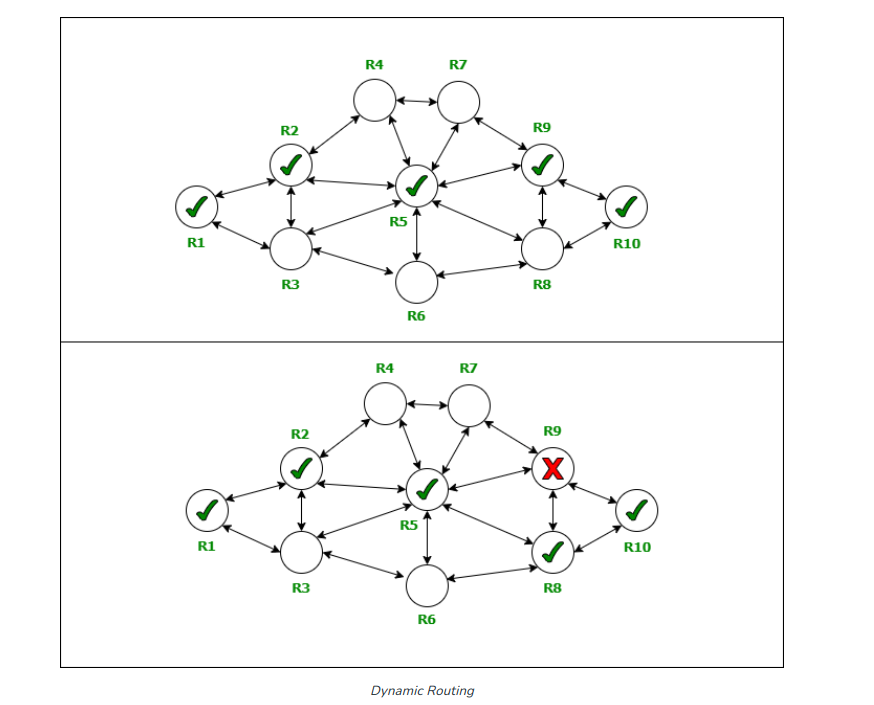

## Định nghĩa định tuyến
Định tuyến là quá trình chọn đường dẫn tốt nhất để gửi gói dữ liệu từ người gửi đến người nhận trong mạng. Định tuyến rất quan trọng trong việc tạo ra hiệu quả trong giao tiếp giữa các thiết bị trong mạng và cũng giúp giảm thiểu lỗi mạng. Định tuyến được thực hiện bởi một bộ định tuyến sử dụng bảng định tuyến để xác định đường dẫn tốt nhất để gửi gói dữ liệu từ nơi này đến nơi khác.

### Routing table
- một bảng được sử dụng bởi router để tìm quãng đường thuận lợi nhất để truyền một gói tin đến điểm nhận của nó.
- bao gồm các thông tin như sau:
+ network id hoặc địa chỉ theo route được chỉ định
+ subnet mask: chỉ định subnet mask cụ thể 
+ next hop: địa chỉ IP mà packet sắp được chuyển đến
+ outgoing interface: interface dùng để chuyển packet đến điểm đến
+ metric: số router ít nhất cần phải đi qua để đến điểm đến

khi một gói dữ liệu được nhận bởi một router,router sẽ kiểm tra header của nó để tìm địa chỉ IP đích. Sau đó, router sẽ so sánh IP này với routing table của nó. Nếu khớp, bộ định tuyến sẽ chuyển tiếp gói dữ liệu tới IP được chỉ định trong phần next hop. Nếu có nhiều kết quả khớp, bộ định tuyến sẽ chọn mục có subnet mask dài nhất và chuyển tiếp nó đến địa chỉ IP được chỉ định trong phần 'next hop' của nó.

### Network gateway

Gateway là một thiết bị hoặc node kết nối hai mạng riêng biệt bằng cách chuyển đổi các giao thức truyền thông từ mạng này sang mạng khác. Gateway cũng quản lý luồng dữ liệu giữa hai mạng. Điều này cho phép thông tin được truyền giữa các mạng khác nhau dù chúng có sử dụng hai giao thức mạng khác nhau. Gateway có thể là một chiều (chỉ cho phép luồng dữ liệu theo một hướng) hoặc hai chiều (cho phép luồng dữ liệu theo cả hai hướng).

## Các loại định tuyến
Định tuyến có thể được phân thành hai loại chính: định tuyến tĩnh và định tuyến động
## Định tuyến tĩnh:

Định tuyến tĩnh là  khi người quản trị mạng tự thêm hoặc sửa đổi các route vào routing table. Bộ định tuyến chỉ có thể gửi các gói đến đích dọc theo các tuyến do quản trị viên(network administrator) xác định. Bằng cách này, các quyết định định tuyến không dựa trên cấu trúc liên kết của mạng mà dựa trên quản trị viên, vì bảng định tuyến không thay đổi cho đến khi quản trị viên mạng sửa đổi nó theo cách thủ công.

Bảng định tuyến được sử dụng trong định tuyến tĩnh có một route mặc định(default route). Đây là route được sử dụng khi không có route nào khác để truyền gói dữ liệu đến một điểm đích nhất định.
Định tuyến tĩnh thường được sử dụng trong các mạng nhỏ.

### Ưu điểm:

- Đơn giản: định tuyến tĩnh dễ configure và không yêu cầu các thuật toán định tuyến phức tạp để duy trì bảng định tuyến(routing table) cho các bộ định tuyến(router)

- Tăng khả năng kiểm soát: định tuyến tĩnh cho phép người quản trị mạng định cấu hình các gói dữ liệu đi theo các route cụ thể theo ý muốn

- Hiệu quả tài nguyên: thiết lập và duy trì bảng định tuyến trong định tuyến tĩnh không tiêu tốn thêm tài nguyên máy tính hoặc băng thông mạng. Các router không cần phải trao đổi thông tin để duy trì bảng định tuyến, giảm lưu lượng mạng.

- Bảo mật: định tuyến tĩnh cung cấp cho quản trị viên mạng nhiều quyền kiểm soát hơn đối với mạng, cho phép chọn lọc cho phép hoặc từ chối lưu lượng truy cập dựa trên các route cụ thể

### Nhược điểm:

- thiếu khả năng mở rộng: khi mạng phát triển lớn hơn, quản trị viên mạng khó duy trì và cập nhật bảng định tuyến. Định cấu hình thủ công các route cho một mạng lớn cũng có thể tốn thời gian và dễ bị lỗi.

- Sử dụng tài nguyên không hiệu quả: các route được quản trị viên mạng chỉnh sửa thủ công trên bảng định tuyến(routing table) có thể không phải là các route hiệu quả nhất để truyền gói dữ liệu từ điểm A đến điểm B, dẫn đến lãng phí tài nguyên mạng.

- Khả năng chịu lỗi hạn chế: trong trường hợp lỗi liên kết, định tuyến tĩnh có thể không tự động định tuyến lại lưu lượng(traffic), dẫn đến lỗi mạng cho đến khi các route được cập nhật thủ công bởi quản trị viên mạng

## Định tuyến động

Định tuyến động là khi các bảng định tuyến được cập nhật tự động bằng cách sử dụng các giao thức định tuyến để đáp ứng với những thay đổi về cấu trúc liên kết mạng hoặc trạng thái liên kết giữa các nút. Trong định tuyến động, các cơ chế định tuyến được sử dụng để cho phép các router liên lạc với nhau về những thay đổi đối với cấu trúc liên kết mạng hoặc trạng thái liên kết và cập nhật bảng định tuyến(routing table) của chúng cho phù hợp. Các thông tin được trao đổi giữa các router bao gồm các network mà mỗi bộ định tuyến biết, cũng như cost và các số liệu liên quan để tiếp cận các network này.

Định tuyến động thường được sử dụng trong các mạng lớn hoặc các mạng dự kiến sẽ trải qua nhiều thay đổi.

## Ưu điểm:

- khả năng chịu lỗi: nếu xảy ra lỗi liên kết, định tuyến động cho phép bộ định tuyến(router) tự động định tuyến lại lưu lượng, đảm bảo rằng các gói dữ liệu vẫn có thể đến đích

- tăng hiệu quả mạng: định tuyến động đảm bảo rằng các gói dữ liệu luôn được truyền dọc theo route hiệu quả nhất bất kể những thay đổi về cấu trúc liên kết mạng, đảm bảo rằng tài nguyên mạng được sử dụng hiệu quả

- khả năng mở rộng: định tuyến động cho phép mạng dễ dàng xử lý việc bổ sung các thiết bị mạng mới mà không cần nhiều sự can thiệp từ quản trị viên mạng

- khả năng thích ứng: định tuyến động cho phép các mạng dễ dàng phản ứng với những thay đổi về cấu trúc liên kết mạng hoặc trạng thái liên kết, cho phép các mạng lớn và phức tạp được quản lý dễ dàng hơn.
## Nhược điểm:

- Độ phức tạp: các cơ chế định tuyến động yêu cầu sử dụng các thuật toán định tuyến phức tạp và yêu cầu network administrator phải quản lý các cơ chế định tuyến, điều này có thể gây khó khăn cho người quản trị mạng so với định tuyến tĩnh

- Tiêu thụ tài nguyên: việc trao đổi thông tin liên tục giữa mỗi bộ định tuyến về các thay đổi về network sẽ tiêu tốn băng thông và các tài nguyên khác 

- bảo mật kém hơn định tuyến tĩnh : định tuyến động kém an toàn hơn định tuyến tĩnh. Chẳng hạn, những kẻ tấn công có thể cố gắng thay đổi thông tin định tuyến hoặc đưa vào thông tin định tuyến sai, khiến lưu lượng mạng bị chuyển hướng hoặc bị gián đoạn. Do đó, định tuyến động yêu cầu quản trị viên mạng triển khai các cơ chế bảo mật bổ sung.

Nguồn tham khảo
1. [Nguồn 1](https://www.cloudflare.com/learning/network-layer/what-is-routing/)
2. [Nguồn 2](https://www.geeksforgeeks.org/difference-between-static-and-dynamic-routing/)
3. [Nguồn 3](https://www.geeksforgeeks.org/types-of-routing/)
4. [Nguồn 4](https://www.geeksforgeeks.org/what-is-dynamic-routing-in-computer-network/)
5. [Nguồn 5](https://www.tutorialspoint.com/what-are-gateways-in-computer-network)
6. [Nguồn 6](https://aws.amazon.com/what-is/routing/)
