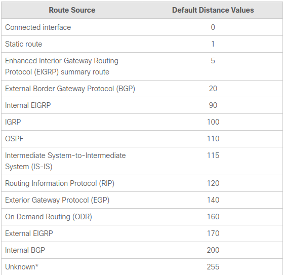

## Cơ chế định tuyến
- cơ chế định tuyến là cơ chế được sử dụng trong định tuyến động để cho phép các bộ định tuyến trao đổi thông tin định tuyến với nhau. Điều này cho phép các bộ định tuyến cập nhật bảng định tuyến của chúng theo những thay đổi xảy ra trong mạng và chọn tuyến đường tốt nhất để chuyển tiếp lưu lượng mạng.

### Administrative distance
 - là một tính năng được router dùng để chọn route tốt nhất cho việc truyền các gói tin khi có 2 hoặc hơn route đến cùng một điểm đích nhưng sử dụng các cơ chế định tuyến khác nhau. Administrative distance giúp xác định độ đáng tin cậy của các cơ chế định tuyến. Giá trị này càng nhỏ thì có độ đáng tin cậy càng lớn. Với 2 hoặc hơn route với các cơ chế định tuyến khác nhau,router sẽ chọn route có AD value thấp nhất và truyền gói tin bằng cơ chế định tuyến tương ứng với AD value đó.  Giá trị được gán cho từng loại cơ chế định tuyến sẽ khác nhau tùy vào vendor.
 Ví dụ bảng AD value của Cisco sẽ như sau :
 
 
 
Ba cơ chế định tuyến động phổ biến sẽ được thảo luận dưới đây:

## Routing Information Protocol (RIP)
RIP là một giao thức định tuyến động sử dụng số hop làm chỉ số định tuyến để tìm tuyến đường tốt nhất từ nguồn đến đích. Nó được phân loại là một giao thức định tuyến theo vectơ khoảng cách(distance vector).

Số hop được xác định là số lượng bộ định tuyến xảy ra giữa nguồn và đích. Route có số hop thấp nhất được coi là route tốt nhất và được đưa vào bảng định tuyến(routing table). Router sẽ chọn quãng đường có số hop thấp nhất trong routing table để truyền các gói tin đi.
