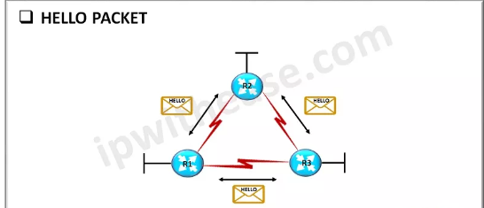
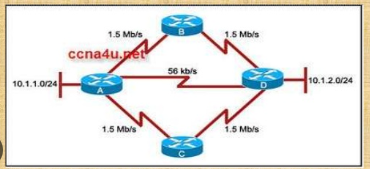
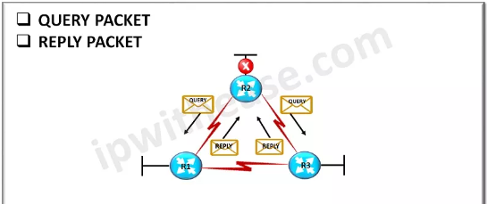

## Cơ chế định tuyến
- cơ chế định tuyến là cơ chế được sử dụng trong định tuyến động để cho phép các bộ định tuyến trao đổi thông tin định tuyến với nhau. Điều này cho phép các bộ định tuyến cập nhật bảng định tuyến của chúng theo những thay đổi xảy ra trong mạng và chọn tuyến đường tốt nhất để chuyển tiếp lưu lượng mạng.

### Administrative distance
 - là một tính năng được router dùng để chọn route tốt nhất cho việc truyền các gói tin khi có 2 hoặc hơn route đến cùng một điểm đích nhưng sử dụng các cơ chế định tuyến khác nhau. Administrative distance giúp xác định độ đáng tin cậy của các cơ chế định tuyến. Giá trị này càng nhỏ thì có độ đáng tin cậy càng lớn. Với 2 hoặc hơn route với các cơ chế định tuyến khác nhau,router sẽ chọn route có AD value thấp nhất và truyền gói tin bằng cơ chế định tuyến tương ứng với AD value đó.  Giá trị được gán cho từng loại cơ chế định tuyến sẽ khác nhau tùy vào vendor.
 Ví dụ bảng AD value của Cisco sẽ như sau :
 
 
 
Ba cơ chế định tuyến động phổ biến sẽ được thảo luận dưới đây:

## Routing Information Protocol (RIP)
### Sơ lược 
RIP là một giao thức định tuyến động sử dụng số hop làm chỉ số định tuyến để tìm tuyến đường tốt nhất từ nguồn đến đích. Nó được phân loại là một giao thức định tuyến theo vectơ khoảng cách(distance vector).

Số hop được xác định là số lượng bộ định tuyến giữa nguồn và đích. Route có số hop thấp nhất được coi là route tốt nhất và được đưa vào bảng định tuyến(routing table). Router sẽ chọn quãng đường có số hop thấp nhất trong routing table để truyền các gói tin đi. Số hop tối đa cho cơ chế RIP là 15, nếu một địa chỉ có số hop 16 hoặc lớn hơn thì được coi là không thể truy cập.
 RIP trao đổi các bản cập nhật của mạng theo định kỳ giữa các router và các bản cập nhật luôn được phát trong mạng. Router đầy đủ được gửi trong bản cập nhật. Các router luôn tin tưởng thông tin định tuyến nhận được từ các bộ định tuyến lân cận.
### Các loại
1. RIPv1:
+ classful routing protocol: các thông tin được gửi không bao gồm subnet mask
+ không có tính năng xác thực thông tin nhận được
2. RIPv2:
+ classless routing protocol: các thông tin được gửi bao gồm subnet mask
+ có tính năng xác thực thông tin nhận được

### Cách hoạt động
- Các bộ định tuyến khám phá các bộ định tuyến lân cận của chúng và chỉ trao đổi thông tin với các router lân cận được kết nối trực tiếp
- Mỗi bộ định tuyến định kỳ phát thông tin định tuyến của nó tới các bộ định tuyến lân cận khác, bao gồm các bảng định tuyến có địa chỉ IP và số bước nhảy cần thiết để đến các địa chỉ này
- Khi một bộ định tuyến nhận được cập nhật định tuyến từ các láng giềng của nó, nó sẽ so sánh bảng định tuyến trong bản cập nhật với bảng định tuyến của chính nó. Bất kỳ tuyến đường nào có số bước nhảy nhỏ hơn tuyến đường hiện có trong bảng định tuyến của nó đều được cập nhật tương ứng và bất kỳ tuyến đường nào chưa có trong bảng định tuyến đều được thêm vào. Bộ định tuyến chọn tuyến đường tốt nhất dựa trên tuyến đường có số bước nhảy ngắn nhất.
- RIP sử dụng một cơ chế gọi là split horizon để ngăn chặn các routing loop. Sử dụng cơ chế này, một bộ định tuyến không quảng cáo các tuyến trở lại cùng một giao diện mà nó nhận được. RIP cũng sử dụng poison reverse để thông báo cho các bộ định tuyến về các mạng không thể truy cập được. Những cơ chế này sẽ được thảo luận nhiều hơn dưới đây.
- RIP sử dụng timer để quản lý việc quảng bá thông tin định tuyến. Các bản cập nhật được gửi định kỳ đến các bộ định tuyến khác và nếu một route không được cập nhật trong một thời gian nhất định, nó được coi là không hợp lệ và sẽ bị xóa khỏi bảng định tuyến trong mỗi bộ định tuyến.
- Hội tụ(convergence): khi bộ định tuyến trao đổi thông tin với các bộ định tuyến khác và cập nhật bảng định tuyến của nó, mạng sẽ hội tụ ở trạng thái mà tất cả các bộ định tuyến đều có thông tin định tuyến nhất quán.

### Routing loop
Routing loop xảy ra khi dữ liệu được định tuyến trong một vòng lặp giữa hai bộ định tuyến mà không bao giờ đến đích do lỗi mạng. RIP sử dụng cơ chế chia chân trời để ngăn điều này xảy ra.

Split horizon áp dụng quy tắc để router không được quảng bá các route đến cùng interface vừa gửi những thông tin về route đó. Điều này giúp ngăn chặn trường hợp các bộ định tuyến nhận được thông tin quảng bá của chính chúng trong một vòng lặp.

### Poison reverse
Cơ chế poison reverse thường được sử dụng với split horizon để giảm hơn nữa khả năng xảy ra các vòng lặp định tuyến.

Khi một bộ định tuyến phát hiện một route không thể truy cập, nó sẽ xác định route đó trong bảng định tuyến của nó và đặt số hop của tuyến đường đó thành 16. Sau đó, route không thể truy cập được sẽ được quảng bá tới các bộ định tuyến lân cận. Các bộ định tuyến lân cận cập nhật bảng định tuyến của chúng cho phù hợp và sau đó gửi các bản cập nhật cho các bộ định tuyến lân cận của nó. Điều này cho phép thông tin về route không thể truy cập lan truyền trên một network.

### Timer
RIP sử dụng timer để quản lý việc trao đổi thông tin giữa các bộ định tuyến.
- Update timer: thời gian mặc định để trao đổi thông tin định tuyến là 30 giây. Bộ đếm thời gian này được sử dụng để cho phép trao đổi định kỳ các bảng định tuyến giữa các bộ định tuyến.
- Invalid timer: nếu không có bản cập nhật nào sau 180 giây, thì route được coi là không hợp lệ.
- Hold down timer: thời gian router đợi 1 router lân cận phản hồi. Đó là 180 giây theo mặc định.
- Flush time: thời gian mà mục nhập của route sẽ bị xóa nếu nó không phản hồi trong thời gian tuôn ra. Đó là 60 giây theo mặc định.

### Ưu điểm
+ đơn giản: RIP là một cơ chế khá đơn giản nên có thể được triển khai một cách dễ dàng
+ không tốn nhiều tài nguyên như các cơ chế định tuyến khác
+ tốc độ convergence của RIP khá nhanh nếu như triển khai trên các hệ thống mạng cỡ nhỏ và vừa
### Nhược điểm
- vì giới hạn hop count là 15 nên RIP không thích hợp cho các hệ thống mạng cỡ lớn
- converge chậm trên các hệ thống mạng cỡ lớn và sẽ tiêu tốn rất nhiều băng thông do phải trao đổi các routing table liên tục

### Nguồn tham khảo
1. [Nguồn 1](https://www.geeksforgeeks.org/routing-information-protocol-rip/)
2. [Nguồn 2](https://en.wikipedia.org/wiki/Routing_Information_Protocol)
3. [Nguồn 3](https://www.javatpoint.com/rip-protocol)
4. [Nguồn 4](https://www.techtarget.com/searchnetworking/definition/poison-reverse)

## OSPF( Open Shortest Path First) protocol

OSPF là một giao thức định tuyến trạng thái liên kết(link-state routing protocol) thường được sử dụng trong các mạng doanh nghiệp quy mô lớn. OSPF hoạt động bằng cách trao đổi thông tin giữa các bộ định tuyến để xây dựng và duy trì bản đồ cấu trúc liên kết của mạng.

### Cách hoạt động
- OSPF thiết lập adjacencies với các router lân cận bằng cách trao đổi các gói Hello. Bộ định tuyến sử dụng các gói Hello để khám phá và duy trì các mối quan hệ với router lân cận.
- Mỗi bộ định tuyến OSPF thu thập thông tin về các liên kết được kết nối trực tiếp của nó, chẳng hạn như trạng thái liên kết, chi phí và mức độ ưu tiên. Thông tin này được lưu trữ trong Cơ sở dữ liệu trạng thái liên kết (LSDB). Các bộ định tuyến OSPF sau đó tạo Quảng cáo trạng thái liên kết (LSA) chứa thông tin về các liên kết cục bộ của chúng.
- Các bộ định tuyến OSPF quảng bá LSA của chúng đến tất cả các bộ định tuyến khác trong vùng OSPF. Điều này đảm bảo rằng tất cả các bộ định tuyến trong khu vực có thông tin nhất quán về cấu trúc liên kết mạng.
- OSPF sử dụng giải thuật Dijkstra để tính toán đường đi ngắn nhất tới mỗi mạng bên trong miền OSPF. Mỗi bộ định tuyến xây dựng Cây đường dẫn ngắn nhất(Shortest Path tree) (SPT) dựa trên LSDB, xác định các đường dẫn ngắn nhất đến tất cả các đích. Đường đi ngắn nhất được tính toán dựa trên chi phí hoặc số liệu tích lũy được liên kết với mỗi liên kết.
- Các bộ định tuyến OSPF tạo các bản cập nhật định tuyến, được gọi là OSPF advertisement, để thông báo cho các bộ định tuyến lân cận về đường đi tốt nhất đến mỗi mạng. Advertisement được gửi dưới dạng gói OSPF, còn được gọi là Gói trạng thái liên kết OSPF (LSP). Các gói này chứa thông tin về các route và chi phí liên quan của chúng.
- Khi nhận được quảng cáo OSPF, các bộ định tuyến sẽ cập nhật bảng định tuyến của chúng dựa trên thông tin được cung cấp. Bảng định tuyến chứa đường dẫn tốt nhất cho mỗi mạng đích được học thông qua OSPF.
- Các bộ định tuyến OSPF liên tục theo dõi trạng thái của các láng giềng lân cận của chúng. Nếu một láng giềng bị hỏng hoặc không thể truy cập được, các bộ định tuyến OSPF sẽ tính toán lại các tuyến và cập nhật bảng định tuyến của chúng cho phù hợp. Quá trình này đảm bảo khả năng phục hồi của mạng và thích ứng năng động với các thay đổi cấu trúc liên kết.

### Loại liên kết
- liên kết được định nghĩa là kết nối giữa hai bộ định tuyến

1. Point-to-point link: kết nối trực tiếp 2 bộ định tuyến mà không cần bất kỳ máy chủ nào ở giữa
2. Broadcast link: loại liên kết kết nối nhiều bộ định tuyến bằng một phương tiện chung, chẳng hạn như Ethernet. Trong một liên kết quảng bá, các bộ định tuyến OSPF chọn một bộ định tuyến được chỉ định (DR) và một bộ định tuyến được chỉ định dự phòng (BDR). DR và BDR chịu trách nhiệm chuyển tiếp tin nhắn đến tất cả các bộ định tuyến trên liên kết quảng bá. Mỗi bộ định tuyến thiết lập các vùng lân cận với DR và BDR thay vì với nhau. BDR sẽ đảm nhận trách nhiệm của DR nếu DR bị lỗi.
3. Non-broadcast Multiaccess Link: tương tự như một liên kết quảng bá trong đó nhiều máy được gắn vào một phương tiện dùng chung, tuy nhiên dữ liệu chỉ được truyền trực tiếp từ máy tính này sang máy tính khác.
4. Point-to-multipoint link: cho phép một bộ định tuyến giao tiếp với nhiều bộ định tuyến. Liên kết point-multipoint được coi là một tập hợp các liên kết point-to-point, cho phép bộ định tuyến trung tâm trao đổi các gói tới từng bộ định tuyến từ xa.
5. Virtual link: được sử dụng để thiết lập kết nối khi không có đường truyền vật lý trực tiếp. Nó tạo ra một đường dẫn ảo thông qua các bộ định tuyến trung gian. Các bộ định tuyến OSPF tham gia vào liên kết ảo này sẽ thiết lập adjacency với các router lân cận và sau đó cho phép thông tin định tuyến OSPF đi qua liên kết.

### Các trạng thái khác nhau của OSPF:
Các thiết bị vận hành OSPF trải qua một số trạng thái:
|Trạng thái|Mô tả|
|----|----|
|Xuống|Không có gói tin hello nào được nhận trên giao diện này|
|INIT|gói tin hello đã được nhận từ bộ định tuyến khác |
|2WAY|cả hai bộ định tuyến đã nhận được gói tin hello từ bộ định tuyến kia|
|Exstart||NULL DBD (Database description) được trao đổi. Trạng thái này cũng quyết định bộ định tuyến nào sẽ gửi DBD của nó trước|
|Exchange |các bộ định tuyến trao đổi DBD, chứa thông tin tóm tắt về cơ sở dữ liệu của chúng. DBD giúp các bộ định tuyến so sánh cơ sở dữ liệu của chúng và cập nhật thông tin|
|Loading state|Nếu có sự khác biệt trong cơ sở dữ liệu OSPF ở trạng thái trao đổi, các bộ định tuyến sẽ gửi các gói yêu cầu trạng thái liên kết (LSR) để yêu cầu các LSA (Quảng cáo trạng thái liên kết) cụ thể từ các router lân cận của chúng. Sau đó, các bộ định tuyến nhận các LSA được yêu cầu trong các gói Cập nhật trạng thái liên kết (LSU) và cập nhật OSPF database của chúng cho phù hợp|
|Full state| Khi các bộ định tuyến đã đồng bộ hóa thành công cơ sở dữ liệu OSPF của chúng, chúng sẽ chuyển sang trạng thái Full. Điều này cho thấy mối quan hệ neighbor OSPF đã được thiết lập đầy đủ.|

### Cấu trúc OSPF packet

Các gói tin OSPF có cấu trúc như sau:

Có các mục như sau:
|Mục| Mô tả|
|----|----|
|Version|trường 8 bit dùng để chỉ định phiên bản OSPF|
|Type|trường 8 bit dùng để chỉ định loại gói tin của gói tin OSPF|
|Message| trường 16 bit dùng để chỉ định độ dài tổng của gói tin bao gồm cả header|
|source IP address| chứa địa chỉ IP của bên gửi gói tin|
|Area identification| xác định miền mà quá trình routing sẽ diễn ra|
|Checksum|dùng để kiểm tra lỗi dữ liệu|
|Authentication type| chỉ định cơ chế xác thực( ví dụ như 0 là không có cơ chế nào và 1 là có cơ chế xác thức bằng mật khẩu)|
|Authentication| trường 32 bit chứa giá trị cụ thể của dữ liệu dùng để xác thực.|

### Loại gói tin
|Loại| Mô tả|
|----|----|
|Hello packet| dùng để phát hiện các router lân cận và thiết lập liên kết OSPF với chúng|
|Database description| chứa thông tin database về bản đồ liên kết network (network topology) của hệ thống|
|Link state request(LSR)| được gửi từ router để yêu cầu thông tin từ một route cụ thể|
|Link state update(LSU)|được gửi từ router để quảng bá (advertise) các thông tin về những liên kết của nó|
|Link state acknowledgement|được các router gửi để xác nhận rằng chúng đã nhận được LSU sau khi một router phát gói tin LSU trên hệ thống|

## Timer
+ Hello timer: khoảng thời gian cho việc OSPF router gửi gói tin hello cho một interface. Mặc định là 10 giây.
+ Dead timer: khoảng thời gian cho trước khi một router lân cận được coi là 'dead' nếu nó không thể gửi một gói tin hello nào. Mặc định là 40 giây.

### Ưu điểm
+ convergence nhanh: bằng việc sử dụng LSA, OSPF sẽ thích nghi rất nhanh với các thay đổi trên hệ thống mạng
+ sử dụng OSPF cho phép việc thêm router vào network thuận lợi hơn, khiến cho chúng phù hợp với các hệ thống mạng lớn
+ các gói tin OSPF có bao gồm cơ chế xác thực gói giúp làm tăng khả năng bảo mật
### Nhược điểm
+ tiêu tốn nhiều tài nguyên xử lý và băng thông hơn các cơ chế khác ví dụ như RIP
+ OSPF có độ phức tạp khá cao, gây khó khăn cho việc quản lý hệ thống bởi network administrator

### Nguồn tham khảo
1. [Nguồn 1](https://www.cisco.com/c/en/us/support/docs/ip/open-shortest-path-first-ospf/7039-1.html)
2. [Nguồn 2](https://datatracker.ietf.org/doc/html/rfc2328)
3. [Nguồn 3](https://www.javatpoint.com/ospf-protocol)
4. [Nguồn 4](https://ipcisco.com/lesson/ospf-cost-and-spf-algorithm/)

## Enhanced Interior Gateway Routing protocol (EIGRP)
- là một giao thức định tuyến độc quyền của Cisco được sử dụng để trao đổi thông tin định tuyến và tạo vectơ định tuyến động. Nó là một giao thức định tuyến theo distance vector.
  EIGRP sử dụng 5 bảng để lưu trữ thông tin
  1. bảng định tuyến(routing table): lưu trữ các tuyến đến các đích cụ thể và các chỉ số liên quan của nó
  2. Neighbor table: lưu địa chỉ IP của các router đang kết nối trực tiếp với router này.
  3. Bảng cấu trúc liên kết(topology table): lưu trữ tất cả các tuyến đã học được từ các hàng xóm EIGRP. Nó bao gồm thông tin về mạng đích, địa chỉ next-hop và giao diện ra của mỗi tuyến.
  4. Bảng successor: lưu trữ các route có số liệu tốt nhất
  5. Bảng feasible successor: lưu trữ các route có số liệu tốt thứ hai, được sử dụng nếu các tuyến chính trong bảng kế tiếp không thành công
 
### Các loại gói tin EIGRP

|Loại gói tin|Mô tả|
|----|----|
|Hello| dùng để thiết lập quan hệ Neighbourship với các router lân cận. Hello packet có chứa các thông tin để các router lân cận kiểm tra độ tương thích với router gửi hello packet trước khi thiết lập kết nối|
|Update| dùng để gửi các routing update, hay các bản cập nhật về các route. Update packet được sử dụng để giúp route cập nhật và sửa đổi routing table và topology table|
|Query| dùng để yêu cầu các router gửi routing update, thường là cho việc yêu cầu tìm feasible successor trong trường hợp successor route bị lỗi. Query packet còn thường được gửi trong trường hợp có thay đổi về cấu trúc liên kết mạng(topology), ví dụ như một kết nối giữa 2 router bị ngắt.|
|Reply | được các router gửi đi để trả lời query packet. Reply packet chứa feasible successor cho request của router gửi query packet.| 
|Ack| các Ack packet được dùng cho cơ chế xác nhận khi truyền các gói tin Update, Query hoặc Reply. Các router sau khi nhận được gói tin sẽ gửi gói tin Ack cho bên gửi để xác nhận là chúng đã nhận được gói tin.|
### Timer
- Hello timer: xác định khoảng thời gian giữa 2 lần gửi hello packet và xác định thời gian đợi cho việc nhận hello packet từ các router lân cận. Nếu router không nhận được hello packet nào trong khoảng thời gian này, kết nối đó được xác định là đã bị ngắt.
- Dead timer: là khoảng thời gian tối đa mà một router có thể đợi để nhận hello packet từ một liên kết trước khi liên kết đó được coi là không thể truy cập được(trạng thái unreachable).
- Hold time: giá trị được cho vào các hello packet để xác định thời gian mà chúng còn hợp lệ. Nếu router không nhận được  hello packet nào nữa trong khi hold time đã hết, liên kết mà hello packet đó vừa được gửi qua được coi là đã bị ngắt hoặc không thể truy cập được.
### Cách hoạt động
+ các bộ định tuyến gửi các gói Hello để khám phá các bộ định tuyến lân cận. Các gói chứa thông tin cần thiết như ID bộ định tuyến. Các bộ định tuyến nhận gói hello xác minh thông tin trên đó để kiểm tra khả năng tương thích trước khi thiết lập kết nối.

+ Khi đã thiết lập được quan hệ neighbour, các router trao đổi thông tin định tuyến thông qua các gói tin Update. Bộ định tuyến sử dụng các gói Cập nhật để cập nhật bảng định tuyến(routing table) và topology table của chúng.
+ EIGRP sử dụng Diffusing Update Algorithm (DUAL) để tính toán đường đi tốt nhất đến đích. Route tốt nhất được xác định là route có metric thấp nhất. Metric có thể được tính bằng các giá trị như băng thông, độ trì hoãn của đường truyền, MTU(Maximum Transmission Unit). EIGRP mặc định dùng băng thông và độ trì hoãn để tính toán giá trị metric.
+ Giá trị metric được sử dụng để tìm feasible distance (FD): giá trị được tính bởi mỗi router, là metric của route tối ưu nhất để đến một địa chỉ IP. Mỗi router cũng sẽ nhận được các advertised distance (AD) từ các router lân cận. Advertised distance là giá trị metric mà mỗi router lân cận tính được cho route đến cùng địa chỉ IP đó.
+ Dựa vào FD và AD, router sẽ chọn ra route nào có giá trị metric thấp nhất(hay còn gọi là successor) và tìm các route có giá trị metric thấp thứ hai(hay còn gọi là feasible successor). Nếu successor route gặp lỗi, các gói tin sẽ được gửi qua feasible successor. 

### Xử lý lỗi kết nối:
- các hello packet được gửi theo chu kỳ để duy trì kết nối và mối quan hệ neighborship
- khi một kết nối bị lỗi, ví dụ như không nhận được hello packet nào sau khi hello và dead timer đã hết, router sẽ sử dụng thuật toán DUAL để tính toán metric mới và tìm các route khác dựa trên metric đã được tính và so sánh nó với metric của các route được gửi đến từ các router lân cận. Nếu router tìm được các successor route và feasible successor route dựa trên dữ liệu đang có như trên, nó sẽ gửi update packet đến các lân cận để cho các router lân cận cập nhật topology và routing table của chúng. 
- trong trường hợp router không thể tìm được route thay thế nào cho liên kết vừa bị ngắt hoặc hỏng, nó sẽ gửi query packet đến các router lân cận. Các gói tin query sẽ được lan truyền qua khắp hệ thống mạng đó cho đến khi một router tìm ra được thông tin về feasible success route để khắc phục việc không thể truy cập được liên kết trên. Khi đó, router với thông tin về feasible route sẽ gửi reply packet về router đầu tiên, trong packet đó có chứa thông tin về các feasible successor route để khắc phục lỗi kết nối.
- Sau khi routing table và topology table của router ban đầu đã được cập nhật để khắc phục lỗi mất kết nối trên, các update packet sẽ được gửi cho các router lân cận và lan truyền đi khắp hệ thống để tất cả các router trên hệ thống mạng đều cập nhật routing table và topology table của chúng một cách tương ứng.
- Convergence: sau khi các update packet được lan truyền khắp hệ thống mạng, tất cả các router sẽ có thông tin nhất quán trong routing table và topology table của chúng

### Reliable transport protocol (RTP) 
- là một giao thức được sử dụng để đảm bảo việc gửi và nhận các gói tin EIGRP. Phương thức hoạt động khá giống TCP.
- nó cung cấp các cơ chế như:
+ Packet segmentation: RTP phân tách các gói tin lớn thành các gói tin nhỏ hơn, cho phép chúng có thể được truyền các liên kết có chỉ số MTU khác nhau
+ Sequence numbering (đánh số): các gói tin nhỏ sau khi được tách ra sẽ được đánh số, cho phép bên nhận có thể sắp xếp lại các gói tin.
+ Sau khi gửi gói tin, bên gửi sẽ đặt một timer. Nếu timer hết mà chưa nhận được gói ack nào từ bên nhận, mặc định là người nhận chưa nhận được gói và gói đó sẽ được gửi lại.
+  Acknowledgement mechanism (cơ chế xác thực): khi nhận được gói tin, bên nhận sẽ gửi ack packet cho bên gửi để xác nhận đã nhận gói. Trong trường hợp bị thiếu gói tin, ack packet được gửi về sẽ bao gồm số thứ tự của gói tin đó để bên gửi gửi lại gói tin. 
+ RTP có duy trì một database ở cả bên nhận và bên gửi để hỗ trợ việc lưu trữ và gửi các gói tin. Database cũng giúp cho việc quản lý việc xác thực và gửi lại gói tin.

### Ưu điểm:
- convergence nhanh: các thay đổi trong network sẽ được router cập nhật rất nhanh do sử dụng thuật toán DUAL và các cơ chế khác ở trong EIGRP
- sử dụng băng thông hiệu quả do các update packet chỉ chứa những thông tin cần cập nhật thay vì cả routing table như cơ chế RIP
- cho phép mở rộng network thuận tiện nhờ vào cơ chế trao đổi hello packet để thiết lập quan hệ neighbor

### Nhược điểm

- công nghệ độc quyền nên chỉ có thể sử dụng được trên các thiết bị của Cisco và có thể không tương thích với các thiết bị không được sản xuất bởi cisco
- vì đây là cơ chế độc quyền nên các thuật toán được sử dụng sẽ không có tính minh bạch cao, dẫn đến khó khăn trong việc tìm lỗi trong network
- cơ chế định tuyến EIGRP vẫn sử dụng khá nhiều tài nguyên mạng do các router luôn luôn phải liên tục trao đổi các packet, dẫn đến việc khó khăn khi triển khai trong hệ thống không đáp ứng nhu cầu về tài nguyên

## Nguồn tham khảo:
1. [Nguồn 1](https://packetlife.net/blog/2009/jan/17/rtp-eigrp/)
2. [ Nguồn 2](https://ipwithease.com/eigrp-packet-types/)
3. [Nguồn 3](https://www.nwkings.com/eigrp-protocol-in-networking)

