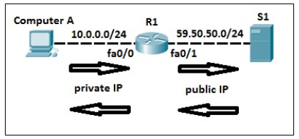
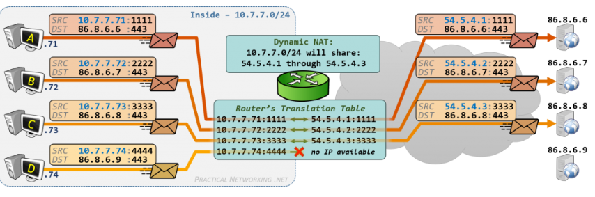
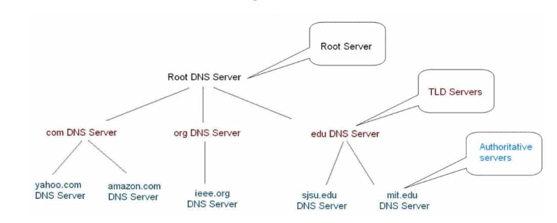
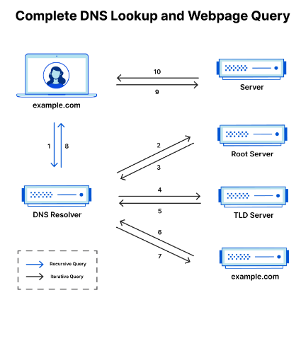
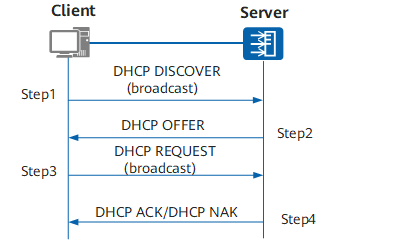
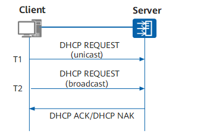

# Network address translation (NAT)
## Định nghĩa
NAT là một quy trình chuyển đổi private IP thành public IP. Điều này cho phép nhiều thiết bị có thể truy cập vào mạng qua 1 địa chỉ public IP. Việc này còn giúp giải quyết vấn đề bị hết địa chỉ IPv4. Cơ chế NAT thường hoạt động trên router hoặc firewall.

## NAT table
- là một bảng chứa địa chỉ IP private và số port của từng thiết bị liên kết cũng như địa chỉ IP public và số port chỉ định tương ứng. Bảng này sẽ được lưu ở trên router.

Bảng này thường có các mục như sau:
|Mục|Mô tả|
|---|---|
|source IP address| địa chỉ private IP của gói tin|
|source port number| số port gốc của gói tin|
|Destination IP address| địa chỉ IP public của server tại điểm đến |
|Destination port number| số port của server tại điểm đến |
|Translate source IP address| địa chỉ IP public được gán cho gói tin bởi router|
|Translated source port number| số port độc nhất được gán cho gói tin bởi router|
|Translation protocol| cho biết giao thức được dùng để truyền gói tin, ví dụ như UDP, TCP,..|
|Timestamp| chứa thông tin về thời gian địa chỉ IP này được thêm vào bảng, cũng như khoảng thời gian mà địa chỉ IP này hợp lệ trước khi timeout( khoảng thời gian này còn được gọi là timeout period)|

Khi một thiết bị trong local network tạo kết nối với một server bên ngoài network đó, các dữ liệu về địa chỉ IP của thiết bị đó và server tại điểm đến sẽ được thêm vào theo các mục trên.

Các thông tin trên NAT table sẽ được cập nhật liên tục. Nếu một liên kết tương ứng với một mục trên bảng không hoạt động trong sau khi timeout period hoặc một liên kết bị ngắt, mục tương ứng với liên kết đó sẽ bị xóa khỏi bảng.

## Cách hoạt động
### chuyển gói tin từ thiết bị trong local network đến server qua internet(Source NAT): 
- khi một thiết bị trong một hệ thống mạng muốn kết nối với một server qua internet, nó sẽ gửi một packet có bao gồm địa chỉ private IP và số source port của thiết bị đó. Ngoài ra, packet đó còn bao gồm địa chỉ public IP và số port của bên nhận. 
- router sẽ duy trì một NAT table ( bảng NAT) có chứa các liên kết đang hoạt động và IP chuyển đổi tương ứng của chúng. Router sẽ tham chiếu bảng này để tìm ra địa chỉ public IP tương ứng. Nếu chưa có, router sẽ thay địa chỉ IP private của packet bằng địa chỉ IP public của nó, và sẽ chỉ định một số port độc nhất cho packet này. Dữ liệu này cũng sẽ được lưu vào NAT table.
- router sẽ chuyển tiếp gói này, với địa chỉ IP public đã được chuyển đổi của nó, tới đích đến dựa trên địa chỉ public IP đến và số port của điểm đến.
- server tại điểm đến sẽ nhận gói tin và xử lý chúng

### chuyển gói tin từ server quay trở lại thiết bị trong local network qua internet(Destination NAT)

- khi gửi lại gói tin, server sẽ gửi lại cho router thông qua địa chỉ public IP và số port được chỉ định từ trước trên gói tin
- khi router nhận được gói tin, nó sẽ tiến hành tra cứu NAT table dựa trên địa chỉ public IP và số port độc nhất trên gói tin để tìm ra địa chỉ IP private và số port ban đầu của gói tin đó. 
- Router sẽ thay địa chỉ public IP đích và số port chỉ định với địa chỉ IP private và số port ban đầu dựa trên việc tra cứu NAT table 
- Cuối cùng, dựa trên địa chỉ private IP và số port gốc trên gói tin sau khi đã được thay, gói tin sẽ được chuyển về thiết bị tương ứng
### Port address translation (PAT) or NAT overload
- đây là quá trình chuyển đổi số port khi chuyển một gói tin từ local network đến một server ngoài network đó và ngược lại, như đã được mô tả ở phía trên.
- điều này giúp cho nhiều thiết bị từ một local network có thể truy cập internet bằng một địa chỉ IP public
Cụ thể như sau:
- packet được gửi từ một thiết bị trong local network có chứa số port gốc của thiết bị gửi. 
- khi được gửi đến router, ngoài việc chuyển đổi địa chỉ IP từ private thành public như trên, số port gốc sẽ được thay bằng một số port độc nhất được chỉ định bởi router. 
- gói tin sẽ được chuyển đến điểm đến bằng địa chỉ IP public và số port đã được chuyển đổi
- khi packet được gửi lại từ server về local network dựa trên public IP và số port chỉ định, router sẽ nhận packet, tra cứu địa chỉ IP public và số port chỉ định để tìm ra private IP và số port gốc tương ứng
- địa chỉ IP private và số port gốc sẽ được thay vào packet header và packet sẽ được chuyển từ router đến thiết bị tương ứng với dữ liệu trên

## Static NAT
 NAT tĩnh là một kỹ thuật ánh xạ một-một để dịch các địa chỉ IP private cụ thể sang các địa chỉ IP public tương ứng. Với static NAT, các bộ định tuyến dịch một địa chỉ IP private thành một địa chỉ IP public duy nhất bằng NAT table bằng cách đối chiếu private IP đó với các ánh xạ(mapping) đã được định sẵn. Ánh xạ giữa IP private và IP public được định cấu hình theo cách thủ công và duy trì cố định cho đến khi quản trị viên mạng sửa đổi hoặc xóa.
 
 
 
## Dynamic NAT
Dynamic NAT là một quá trình trong đó các địa chỉ IP private được dịch bằng cách phân bổ động các địa chỉ IP public từ nhóm địa chỉ IP public có sẵn. Các bộ định tuyến sẽ tự động ánh xạ(map) một địa chỉ IP private từ một gói mà nó nhận được sang một địa chỉ IP public trong nhóm có sẵn của nó và thêm mục nhập đó vào bảng NAT. Nếu kết nối giữa 1 mapping kết thúc hoặc hết thời gian chờ(timeout), địa chỉ IP public cho mục nhập đó sẽ được giải phóng trở lại nhóm IP, cho phép sử dụng lại địa chỉ đó.

## Lợi ích của việc sử dụng NAT
- giúp các địa chỉ IP được phân bố một cách tối ưu, vì cho phép nhiều thiết bị trong một private network kết nối với internet thông qua 1 địa chỉ IP public
- giảm độ phức tạp trong việc quản lý cấu hình mạng vì các cá nhân và các tổ chức không cần phải quản lý một kho dữ liệu quá lớn chứa các địa chỉ IP
- cho phép các private network khác nhau dùng lại địa chỉ IP private 

# Cơ chế DNS
- DNS là một cơ chế chuyển đổi dùng để chuyển đổi tên miền thành địa chỉ IP giúp cho việc liên lạc giữa các máy tính. Cơ chế hoạt động chính của nó là hoạt động như một cơ sở dữ liệu để cho phép các máy tính tìm được địa chỉ IP gắn với một tên miền cụ thể, và thiết lập kết nối với địa chỉ IP đó.
## Hệ thống phân tầng DNS

- Root server: cung cấp điểm bắt đầu cho các truy vấn DNS. Chức năng chính là trả lời các truy vấn về vị trí của máy chủ TLD. Hiện tại có 13 root server trên thế giới. 
- Top-level domain server(TLD server): chịu trách nhiệm về các TLD, chẳng hạn như .com hoặc .edu. Máy chủ TLD lưu trữ thông tin về các authoritative name server chịu trách nhiệm cho các miền riêng lẻ trong TLD của chúng.
- authoritative name servers: các server này chứa các thông tin về DNS như địa chỉ IP của một tên miền (domain name) cụ thể
- recursive resolver: nhận các DNS queries từ các máy tính của người dùng ví dụ như nhận DNS query từ web browser khi người dùng gõ tên miền vào browser. Chịu trách nhiệm cho việc giao tiếp với các root server, TLD server và authoritative name server để tìm được và gửi về địa chỉ IP của một tên miền nhất định cho người dùng

## cách hoạt động
- khi người dùng đánh tên miền vào web browser, máy sẽ kiểm tra trong DNS cache của nó xem đã lưu địa chỉ IP gắn liền với tên miền đó chưa
- nếu như chưa có địa chỉ IP của tên miền đó trong DNS cache, máy sẽ gửi một DNS query cho recursive resolver. 
- Recursive resolver sẽ thiết lập kết nối với root server trước tiên, và gửi thông tin đến root server để tìm địa chỉ IP của TLD server liên quan đến tên miền được nhập vào bởi người dùng trước đó
- recursive resolver sau đó sẽ gửi query đến TLD server sau khi có được địa chỉ IP của chúng để tìm địa chỉ IP của authoritative name server liên quan đến tên miền được nhập vào bởi người dùng trước đó
- recursive resolver sau đó sẽ gửi query đến authoritative name server sau khi có được địa chỉ IP của chúng để tìm địa chỉ IP của tên miền được nhập vào bởi người dùng trước đó
- địa chỉ IP của tên miền sau khi được trả về từ recursive resolver sẽ được lưu vào DNS cache trên máy để cho các lần sử dụng tiếp theo. Máy của người dùng sau đó có thể dùng địa chỉ IP này để tiến hành liên lạc trực tiếp với server với địa chỉ IP trên.

## Lợi ích
- mỗi máy tính không cần phải lưu trữ một kho dữ liệu lớn chứa các tên miền và địa chỉ IP của nó mà các dữ liệu đó sẽ được lưu trữ tại các server có thể được truy cập từ mỗi máy, giúp tiết kiệm bộ nhớ của máy
- giúp cải thiện trải nghiệm của người dùng, vì việc đánh tên miền sẽ dễ dàng hơn nhiều so với việc người dùng phải nhớ và đánh một địa chỉ IP cụ thể
- địa chỉ IP gắn với một tên miền nếu có thay đổi sẽ không ảnh hưởng đến người dùng, vì địa chỉ IP cũ của một tên miền chỉ cần được cập nhật bằng địa chỉ IP. Người dùng sau đó vẫn có thể truy cập được server có địa chỉ IP mới này qua cùng tên miền đó.

# Cơ chế DHCP
DHCP là một giao thức mạng cho phép tự động phân địa chỉ IP và các thông tin cấu hình mạng cho các thiết bị đang được kết nối trên một network. Cơ chế hoạt động chính là phân các địa chỉ IP cho các máy từ một nhóm địa chỉ IP đã được định sẵn, với thời gian cho phép sử dụng cho mỗi địa chỉ IP. Địa chỉ IP nào không được sử dụng nữa hoặc đã hết thời gian sử dụng sẽ được trả lại về DHCP server để được sử dụng tiếp trong việc phân bố địa chỉ IP.  Việc này cho phép quản lý hệ thống mạng dễ dàng hơn và giảm thiểu overhead. 

## cơ chế hoạt động
- khi một máy tính bắt đầu thiết lập kết nối với một hệ thống mạng, nó sẽ gửi một discover request đến tất cả các thiết bị trên network đó, bao gồm cả các DHCP server.
- DHCP server sau khi nhận được sẽ gửi lại offer message, trong đó có bao gồm địa chỉ IP và lease duration. Lease duration là thời gian một thiết bị được sử dụng địa chỉ IP được phân bởi DHCP server.
- nếu một máy nhận được nhiều DHCP offer message, nó sẽ chọn ra một offer và gửi request cho DHCP server tương ứng với offer đó để xác thực việc nhận địa chỉ IP trong offer message đó.
- DHCP server đó sẽ gửi acknowledgement message để xác nhận việc phân bố địa chỉ IP này cho máy trên
- sau khi quá trình này diễn ra, máy tính trên đã được phân một địa chỉ IP. 

Mỗi địa chỉ IP sau khi được phân bố cho một máy sẽ hợp lệ cho đến khi lease duration kết thúc.

- Nếu thời gian lease duration kết thúc và máy vẫn cần sử dụng địa chỉ IP, nó sẽ gửi một request đến DHCP server để gia hạn lease duration. Nếu DHCP server chấp nhận request này, nó sẽ gửi một acknowledgement message cho máy trên để xác nhận việc gia hạn. Lease duration sau đó sẽ được gia hạn. Nếu request không được chấp nhận, máy sẽ phải request các DHCP server khác để nhận địa chỉ IP mới bằng cách broadcast discover request cho toàn hệ thống như trên
- Nếu một máy tính không cần dùng địa chỉ IP của nó nữa, nó sẽ gửi một release request đến DHCP server. DHCP server sau khi nhận được release request có thể thu hồi địa chỉ IP này về trở lại nhóm địa chỉ IP của nó để được dùng tiếp khi các máy tính khác kết nối vào hệ thống mạng.

Các hệ thống mạng lớn thường có nhiều hơn một DHCP server để giảm tải băng thông, tuy nhiên chúng sẽ đều dùng chung một nhóm địa chỉ IP đã được định sẵn để tránh việc bị trùng lặp địa chỉ IP.

## Nguồn tham khảo
1. [Nguồn 1](https://www.tutorialspoint.com/what-is-the-difference-between-snat-and-dnat#:~:text=SNAT%20transforms%20the%20source%20address,the%20routing%20decision%20is%20built.)
2. [Nguồn 2](https://devopscube.com/what-is-nat-how-does-nat-work/)
3. [Nguồn 3](https://www.practicalnetworking.net/series/nat/dynamic-nat/)
4. [Nguồn 4](https://www.cloudflare.com/learning/dns/what-is-dns/)
5. [Nguồn 5](https://aws.amazon.com/route53/what-is-dns/#:~:text=The%20Internet's%20DNS%20system%20works,These%20requests%20are%20called%20queries.)
6. [Nguồn 6](https://support.huawei.com/enterprise/en/doc/EDOC1100195158/bb57bdaa/how-dhcp-works)

