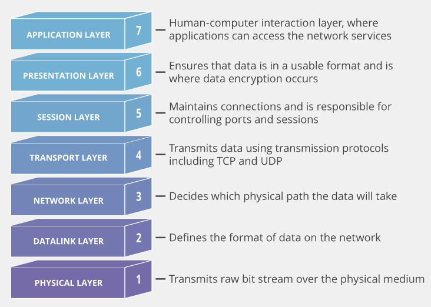

### OSI model:

1. Physical layer: bao gồm tất cả các hardware để vận hành network ví dụ như cable, router,...
2. Data link: chịu trách nhiệm trong việc điều khiển luồng và phát hiện lỗi (error-detection)
3. Network: 
- chịu trách nhiệm quản lý việc trao đổi thông tin giữa các network khác nhau
- sử dụng router để kết nối các network:
+ router kết nối với ISP(internet service provider)
+ router có thể chọn lựa quãng đường thuận tiện nhất để gửi dữ liệu dưới dạng packets
+ lưu thông tin về địa chỉ IP và routing information bằng routing table
4. Transport: 
- quản lý việc trao đổi dữ liệu giữa 2 thiết bị
- chia các gói dữ liệu lớn thành các packet và đánh số trước khi chuyển chúng đi
- nhận các packet và sắp xếp chúng theo thứ tự để thành gói dữ liệu hoàn chỉnh
- kiểm tra và xác nhận số lượng packet được nhận đã đầy đủ hay chưa
5. Session layer:
- phụ trách việc thiết lập, duy trì và hủy bỏ các session(phiên liên lạc) giữa các máy
6. Presentation layer:
- phụ trách xử lý dữ liệu bằng việc dịch, giải nén hoặc nén, và mã hóa dữ liệu
7. Application layer:
- trực tiếp tương tác với dữ liệu từ người dùng
- bao gồm các protocol và dữ liệu được dùng bởi phần mềm mà người dùng sử dụng như email hay trình duyệt web
