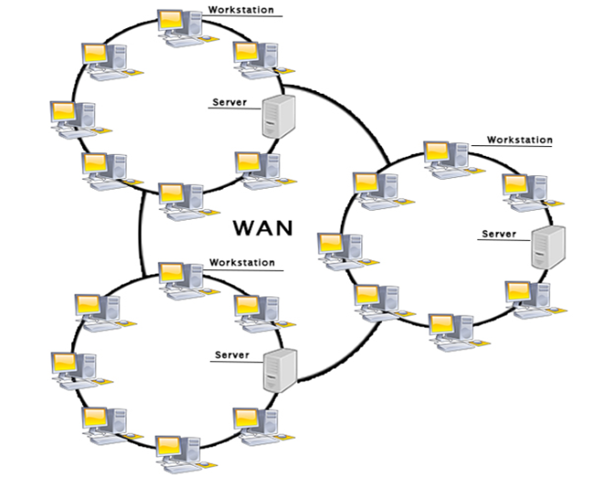
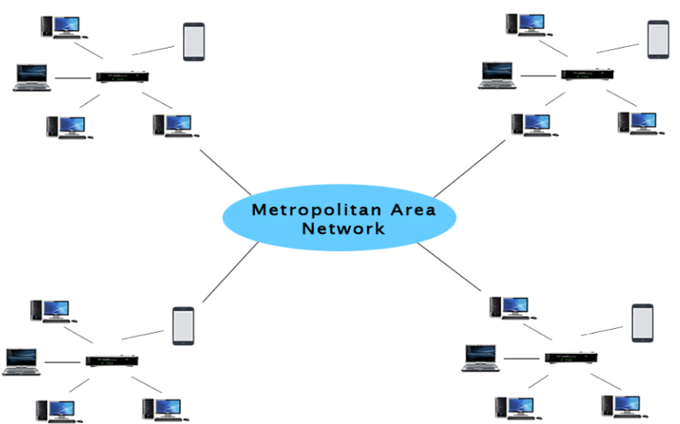

## định nghĩa:
- là một tập hợp các hệ thống máy tính được kết nối với nhau qua các kênh liên lạc để hỗ trợ việc chia sẻ thông tin và tài nguyên giữa các người dùng
## các loại network:

1. PAN(Personal Area network): nhóm các hệ thống máy tính của 1 cá nhân được kết nối với nhau, thường trong phạm vi 10 mét
2. LAN(local area network):
- một nhóm các hệ thống máy tính được kết nối với nhau trên một khu vực có diện tích nhỏ

3. WAN( wide area network): một nhóm các hệ thống máy tính được kết nối với nhau trên một khu vực có diện tích lớn

4. VLAN(Virtual LAN): là một nhóm máy tính được kết nối bằng một mạng LAN ảo, không kể khoảng cách địa lý giữa chúng
5. MAN(Metropolitan Area Network): hệ thống mạng được tạo ra từ việc kết nối nhiều hệ thống mạng LAN với nhau

# Nguyên lý hoạt động cơ bản
## Protocol:
- xác định cách thức liên lạc giữa hai hệ thống máy tính, và cách thức xử lý khi máy tính truyền hoặc nhận thông tin từ máy khác
### OSI model:

1. Physical layer: bao gồm tất cả các hardware để vận hành network ví dụ như cable, router,...
2. Data link: chịu trách nhiệm trong việc điều khiển luồng và phát hiện lỗi (error-detection)
3. Network: 
- chịu trách nhiệm quản lý việc trao đổi thông tin giữa các network khác nhau
- sử dụng router để kết nối các network:
+ router kết nối với ISP(internet service provider)
+ router có thể chọn lựa quãng đường thuận tiện nhất để gửi dữ liệu dưới dạng packets
+ lưu thông tin về địa chỉ IP và routing information bằng routing table
4. Transport: 
- quản lý việc trao đổi dữ liệu giữa 2 thiết bị
- chia các gói dữ liệu lớn thành các packet và đánh số trước khi chuyển chúng đi
- nhận các packet và sắp xếp chúng theo thứ tự để thành gói dữ liệu hoàn chỉnh
- kiểm tra và xác nhận số lượng packet được nhận đã đầy đủ hay chưa
5. Session layer:
- phụ trách việc thiết lập, duy trì và hủy bỏ các session(phiên liên lạc) giữa các máy
6. Presentation layer:
- phụ trách xử lý dữ liệu bằng việc dịch, giải nén hoặc nén, và mã hóa dữ liệu
7. Application layer:
- trực tiếp tương tác với dữ liệu từ người dùng
- bao gồm các protocol và dữ liệu được dùng bởi phần mềm mà người dùng sử dụng như email hay trình duyệt web
### Routing table
- một bảng dùng để xác định các data packet được truyền trên network theo hướng nào.
- bao gồm các thông tin như sau:
+ network id hoặc địa chỉ theo route được chỉ định
+ subnet mask: dùng để liên kết địa chỉ IP của điểm đến và network ID
+ next hop: địa chỉ IP mà packet sắp được chuyển đến
+ outgoing interface: interface dùng để chuyển packet đến điểm đến
+ metric: số router ít nhất cần phải đi qua để đến điểm đến
Nguồn tham khảo:
1. [Nguồn 1](https://www.javatpoint.com/types-of-computer-network)
