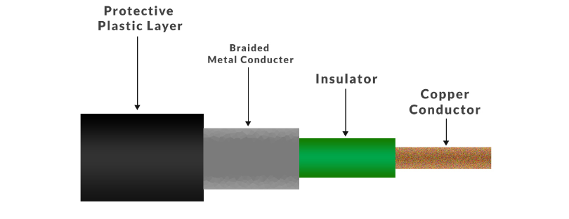
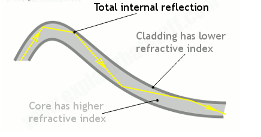
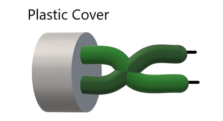

## định nghĩa
Cáp mạng là phần cứng được sử dụng để kết nối một thiết bị mạng với thiết bị khác. Dữ liệu được truyền qua các cáp này ở dạng mã nhị phân 1 và 0.
## 4 loại cáp mạng
1. Cáp đồng trục
+ là loại cáp có ruột cáp điện với ruột dẫn bằng đồng và lớp cách điện che chắn xung quanh. Nó cũng có một lưới kim loại bện bao quanh chất cách điện để ngăn nhiễu tín hiệu.

Mục đích của từng thành phần:
     + Lớp nhựa: bảo vệ cáp khỏi các tác nhân bên ngoài
     + lưới bện: giúp che chắn cáp khỏi nhiễu tín hiệu
     + cách điện: ngăn không cho ruột dẫn và lưới bện chạm vào nhau sẽ gây đoản mạch trong dây
     + dây dẫn: mang tín hiệu điện từ để truyền dữ liệu dọc theo sợi cáp dưới dạng mã nhị phân
2. Cáp quang
+ truyền ánh sáng dọc theo dây cáp thủy tinh thay cho tín hiệu điện
+ Ánh sáng truyền xuống cáp bằng cách dội vào thành cáp như bên dưới

+ Tế bào quang điện dùng để biến đổi tín hiệu quang thành tín hiệu điện

3. Cáp xoắn đôi
- là một sợi cáp gồm nhiều đôi dây đồng có cách điện xoắn lại với nhau. Việc xoắn giúp giảm nhiễu tín hiệu.
     + cáp xoắn đôi có vỏ bọc (STP): cáp có lớp cách điện bổ sung hoặc lớp phủ trên dây dẫn để giảm nhiễu tín hiệu hơn nữa

     + Cáp xoắn đôi không có vỏ bọc (UTP): các cặp dây đồng được xoắn với nhau mà không có vỏ bọc bổ sung

    

