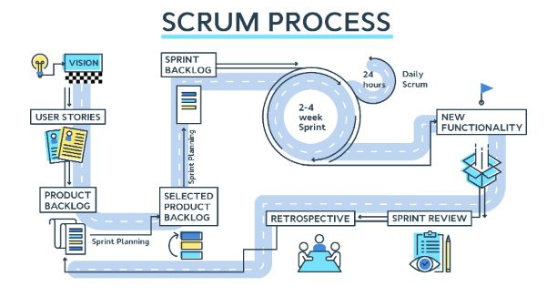
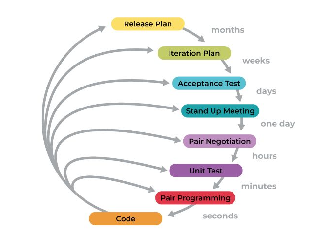

# Agile
## 4 giá trị :
1. con người và sự tương tác hơn các quy trình và công cụ
2. sản phẩm có giá trị hơn tài liệu đầy đủ
3. cộng tác với khách hàng quan trọng hơn hợp đồng
4. thích nghi với sự thay đổi hơn làm theo kế hoạch
## 12 nguyên tắc hoạt động
1. đáp ứng nhu cầu của khách hàng qua việc chuyển giao sản phẩm nhanh chóng và liên tục
2. chấp nhận thay đổi về yêu cầu, kể cả ở giai đoạn cuối của quy trình
3. chuyển giao sản phẩm thường xuyên, trong thời gian ngắn, càng ngắn càng đc ưu tiên
4. làm việc với chủ doanh nghiệp và đội ngũ phát triển phần mềm thường xuyên
5. xây dựng dự án với những cá nhân có động lực. Tạo ra môi trường và hỗ trợ họ nếu cần, và đặt niềm tin vào họ để hoàn thành công việc được giao.
6. trực tiếp nói chuyện là cách truyền đạt thông tin hiệu quả nhất
7. sản phẩm hoạt động được là thước đo chính cho tiến độ của dự án
8. phát triển bền vững và duy trì sự phát triển
9. chú ý đến chất lượng kĩ thuật và thiết kế
10. đề cao sự đơn giản 
11. các sản phẩm và thiết kế tốt nhất được tạo nên từ các nhóm tự tổ chức
12. đều đặn tự đánh giá nhóm để gia tăng sự hiệu quả của nhóm
# Scrum
Scrum là một phương pháp quản lý giúp giải quyết các vấn đề phức tạp nhưng vẫn đảm bảo được tính hiệu quả của sản phẩm. Sản phẩm được xây dựng trên một chuỗi các quy trình lặp lại gọi là Sprint.
ba artifact chính của scrum:
1. Product backlog: một danh sách có thứ tự về những gì cần làm để hoàn thiện và cải tiến sản phẩm. Người phụ trách dự án sẽ duy trì và cập nhật danh sách và xóa những hạng mục không liên quan.
3. Increment: là tổng hợp các mục tiêu đã hoàn thành cho đến vòng sprint hiện tại 
## Các giá trị:
- cam kết
- can đảm 
- tập trung
- cởi mở 
- tôn trọng
## Các vai trò trong nhóm scrum:
1. Product Owner(người phụ trách dự án): 
- đưa ra hướng dẫn về việc sẽ cung cấp tính năng nào tiếp theo
- quyết định sẽ phát hành các tính năng mới khi nào và bằng cách nào
- thu hẹp khoảng cách giữa nhu cầu của doanh nghiệp và sự hiểu biết của đội ngũ
2. Scrum master:
- quản lý các tài nguyên cần thiết cho mỗi chu kỳ Sprint
- dẫn dắt sự chuyển đổi kĩ thuật số trong đội ngũ
- tạo điều kiện đào tạo đội ngũ khi cần áp dụng công nghệ mới
- trao đổi với các nhóm bên ngoài để giải quyết các thách thức mà đội ngũ có thể đối mặt
3. đội ngũ phát triển 
- trực tiếp làm ra sản phẩm 
## Scrum events:

1. Sprint: khoảng thời gian cố định để đội ngũ developer thực hiện công việc phát triển sản phẩm
2. Sprint planning: tất cả các công việc cần hoàn thành trong vòng sprint tiếp theo sẽ được xác định trong 
3. Daily scrum: cuộc họp ngắn diễn ra mỗi ngày để kiểm tra tiến độ của sprint và lên kế hoạch tron ngày 
4. Sprint review: cuộc họp diễn ra cuối mỗi vòng sprint để kiểm tra kết quả của vòng sprint và xác định những thay đổi cần thiết cho tương lai. Kết quả của buổi họp là product backlog được cập nhật và lên kế hoạch cho vòng sprint tiếp theo.
5. Sprint retrospective: các thành viên góp ý để lên kế hoạch gồm những phương pháp tăng sự hiệu quả cho vòng sprint tiếp theo
 ## Agile estimation: 
 - kỹ thuật để dự đoán số thời gian và công sức cần thiết trong việc phát triển sản phẩm
### một số phương pháp agile estimation:
Planning poker:
- chọn một hạng much từ product backlog
- các thành viên sẽ đưa ra số điểm dựa trên độ khó của hạng mục đối với thành viên đó
- số điểm của mỗi thành viên chọn sẽ được công bố và nếu có sự bất đồng thì quy trình sẽ được lặp lại cho đến có sự thống nhất về số điểm của hạng mục
T-shirt sizing: các thành viên sẽ gán số size tương ứng với độ phức tạp của mỗi user story

## Kanban:
- là một công cụ quản lý công việc 
- phương pháp này sử dụng một bảng để sắp xếp công việc theo nhiều hạng mục dựa trên trạng thái hoàn thành của chúng , với công việc đã hoàn thành ở bên phải và các công việc chưa bắt đầu ở bên trái
## XP(Extreme programming) :
 

Nguồn tham khảo:
1. 
2. 
3. 

